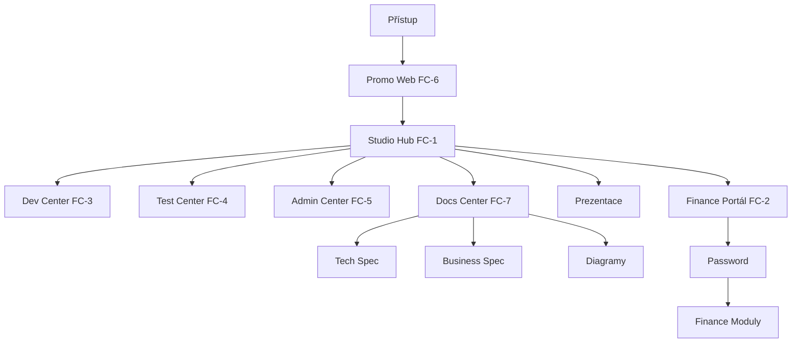

# OIL_CONTEXT.md — Kontext a výtah z diskusí per úkol

> Vytvořeno: 2026-04-17 | Aktualizovat průběžně po každé session.
> Formát: `## AIQ-NNNNN — Název` → kontext, rozhodnutí, klíčové poznámky.
> Audit záznamy: `## AUD-NNNNN — Název` → rozsah, nálezy, plán oprav.

---

## AIQ-00080 — Fix: _i18n.js _applyDOM() — přepisování PREZ_TR překladů (252 klíčů)

**Datum:** 2026-04-19 | **Status:** CLOSED | **Priorita:** HIGH
**Kontext:** David reportoval key names místo textů v celé prezentaci (nadpisy sekcí, TOC, role, dlaždice). Problém byl rozsáhlejší než se zdálo — postihoval 252 klíčů.

### Implementace (v7.20 — 2026-04-19)

**Root cause — dvojí překladový systém:**
- `PORTAL_PRESENTATION.html` má vlastní `PREZ_TR` objekt (274 klíčů, CZ+EN) + funkci `setLang()`
- `_i18n.js` má `_applyDOM()` která zpracovává VŠECHNY `[data-i18n]` elementy na stránce
- Pořadí v `setLang()`: 1) lang-cz/lang-en spans → 2) **PREZ_TR přeloží data-i18n** ✓ → 4) `I18n.setLang()` → `_applyDOM()` → **PŘEPÍŠE PREZ_TR překlad key stringem** ✗

**Fix — _i18n.js:**
```javascript
// Přidána helper funkce:
function _hasKey(key) {
    return (_T[_lang] && _T[_lang][key] !== undefined) || (_T.cs && _T.cs[key] !== undefined);
}

// V každém querySelectorAll bloku _applyDOM() přidána podmínka:
if (!_hasKey(key)) return;  // přeskočit klíče mimo _T store → zachovat PREZ_TR překlad
```

**Výsledek:** `_applyDOM()` nyní zpracovává jen klíče definované v `_i18n.js` store. Prezentační klíče (s00_*, s01_*, ..., toc_*, biz_*, atd.) jsou ponechány `PREZ_TR` systému.

**Supersedes:** AIQ-00079 (špatná oprava — přidání s18_ klíčů do _i18n.js, odstraněno)

---

## AIQ-00081 — Fix: PERSONAL_PITCH.html — setLang() obsah mizí po kliknutí CS

**Datum:** 2026-04-19 | **Status:** CLOSED | **Priorita:** MED
**Kontext:** David reportoval: po kliknutí na tlačítko CS v PERSONAL_PITCH.html zmizí obsah stránky. Druhý test: po první opravě černá obrazovka.

### Implementace (v7.20 — 2026-04-19)

**Root cause 1 — display empty string:** `setLang()` původně používala `el.style.display = ''` pro zobrazení aktivního jazyka. Empty string odstraňuje inline styl a spoléhá na CSS kaskádu — pokud CSS pravidlo říká `display:none`, prvek zůstane skrytý.

**Chybná první oprava:** Přidán IIFE, který při načtení stránky čte `hopi_lang` z localStorage a volá `setLang('en')` pokud byl uložen. Způsobilo **černou obrazovku**: user měl `'en'` v localStorage (z promo webu), IIFE skryl všechny `.lang-cz` elementy ještě před zadáním hesla → celý obsah skryt.

**Finální fix — pouze čistý setLang():**
```javascript
function setLang(lang){
  var isCz = (lang === 'cz' || lang === 'cs');
  document.querySelectorAll('.lang-cz').forEach(function(el){
    el.style.display = isCz ? 'inline' : 'none';   // explicitní hodnoty
  });
  document.querySelectorAll('.lang-en').forEach(function(el){
    el.style.display = !isCz ? 'inline' : 'none';
  });
  // ... classList, placeholder
}
```

**Klíčová rozhodnutí:**
- Žádný localStorage, žádný IIFE — stránka vždy startuje v CS (výchozí stav)
- `display:'inline'` místo `''` — všechny `.lang-cz`/`.lang-en` elementy jsou `<span>`, `inline` je vždy správné
- Funkce akceptuje `'cz'` i `'cs'` jako identifikátor CS jazyka

### Revize 3 (finální) — CSS-based language system (2026-04-19)

**Symptom 3. revize:** `display:'inline'` přístup stále způsoboval černou obrazovku — příčina nebyla identifikovatelná ze statické analýzy.

**Root cause (závěr):** JavaScript iterace přes DOM elementy je křehká — inline `style="display:none"` v HTML vs JS-nastavené inline hodnoty mohou kolidovat závisle na pořadí volání a browser cache.

**Finální fix — CSS-based:**
```css
/* V <style> bloku stránky */
body:not(.lang-en) .lang-en { display:none!important; }  /* CS mode: skryj EN */
body.lang-en .lang-cz { display:none!important; }         /* EN mode: skryj CS */
body.lang-en .lang-en { display:inline!important; }       /* EN mode: zobraz EN */
```

```javascript
/* setLang() — zjednodušeno na 4 řádky */
function setLang(lang){
  var isCz = (lang === 'cz' || lang === 'cs');
  document.body.classList.toggle('lang-en', !isCz);   // jediný přepínač
  document.getElementById('btn-cz').classList.toggle('active', isCz);
  document.getElementById('btn-en').classList.toggle('active', !isCz);
  document.getElementById('pw-input').placeholder = isCz ? 'Zadejte heslo\u2026' : 'Enter password\u2026';
}
```

**Proč to funguje:** `!important` v CSS pravidle překoná inline `style="display:none"` v HTML. Jeden toggle třídy na `body` = celý systém reaguje přes kaskádu. Žádná JS iterace, žádná kolize.

**Potvrzeno Davidem:** funguje ✓

---

## AIQ-00079 — Fix: _i18n.js — chybějící klíče s18_ — SUPERSEDED

**Datum:** 2026-04-19 | **Status:** CLOSED (superseded) | **Priorita:** HIGH
**Poznámka:** Původní oprava přidala s18_ klíče do _i18n.js — ale správná oprava je AIQ-00080 (_hasKey guard v _applyDOM). Přidané klíče odstraněny — patří jen do PREZ_TR.

---

## AIQ-00078 — Fix: _i18n.js — lang-cz vs lang-cs třída — prázdná místa v Promo Web

**Datum:** 2026-04-18 | **Status:** CLOSED | **Priorita:** HIGH
**Kontext:** David reportoval prázdná místa v Promo Web po přepnutí jazyka. Problém se projevoval jen při přepnutí do CS — v EN vše fungovalo správně.

### Implementace (v7.20 — 2026-04-18)

**Root cause:** `_applyDOM()` v `_i18n.js` buildovala CSS třídu jako `'lang-' + _lang`. Pro `_lang='cs'` vzniklo `'lang-cs'`. Ale Promo Web a PORTAL_PRESENTATION.html používají třídu `'lang-cz'` (z = Czech, ne s = CS locale). Výsledek: v CS módu všechny `.lang-cz` elementy byly skryty (`display:none`) → prázdná místa všude.

**Fix — _i18n.js řádky 724-731:**
```javascript
// PŘED (buggy):
var isTarget = el.classList.contains('lang-' + _lang);
var fallback = (_lang !== 'cs' && _lang !== 'en') && el.classList.contains('lang-cs');

// PO (fixed):
var targetClass = _lang === 'cs' ? 'lang-cz' : 'lang-' + _lang;
var isTarget = el.classList.contains(targetClass);
var fallback = (_lang !== 'cs' && _lang !== 'en') && el.classList.contains('lang-cz');
```

**Proč to trvalo tak dlouho:** `_lang` interně používá `'cs'` (ISO 639-1), ale HTML třídy v promo/prezentaci byly pojmenovány `'lang-cz'` (TLD konvence). EN fungoval správně, protože `'lang-en'` = `'lang-' + 'en'`. Chyba existovala od počátku, projevila se až při testování přepínání.

---

## AIQ-00077 — Systém testovacích úkolů — companion test tasks + testType/linkedTask schema

**Datum:** 2026-04-18 | **Status:** CLOSED | **Priorita:** HIGH
**Kontext:** David chce řídit testování a mít přehled o všem co nebylo otestováno. Odsouhlasený přístup: Možnost B (companion test tasky v OIL), pak C (FC-4 Test Center). testType = single value (jeden typ na task, pro komplexní feature víc tasků). 7 typů: functional, visual, content, integration, regression, acceptance, code-review.

### Implementace (v7.20 — 2026-04-18)

**OIL schema:**
- `testType` — jeden z 7 typů testu
- `linkedTask` — AIQ-NNNNN odkaz na testovaný development/fix task

**Companion test tasky vytvořeny (AIQ-00067..00076):**
- AIQ-00067: functional test Archive Protocol modal (→ AIQ-00065) — David
- AIQ-00068: integration test Archive Protocol end-to-end (→ AIQ-00065) — Claude
- AIQ-00069: functional test Kapacita záložka (→ AIQ-00048) — David
- AIQ-00070: visual test Kapacita záložka (→ AIQ-00048) — David
- AIQ-00071: functional test FC-7 Documentation Center (→ AIQ-00049) — David
- AIQ-00072: visual test FC-7 + Hub karta (→ AIQ-00049) — David
- AIQ-00073: integration test GitHub Pages multi-version deploy (→ AIQ-00046) — David
- AIQ-00074: functional test durationDays UI (→ AIQ-00066) — David
- AIQ-00075: functional test i18n audit Admin/Dev Center (→ AIQ-00064) — David
- AIQ-00076: functional test _i18n.js přepínání napříč FC (→ AIQ-00047) — David

**Admin Center:**
- Filtr **🧪 Testy** — zobrazí jen taskType=test úkoly přes oba streamy
- testType barevný badge v title sloupci + `→ AIQ-NNNNN` odkaz na zdrojový task
- Inline edit test tasků: pole Typ testu + Testuje AIQ
- CSS: `.oil-test-badge`, `.oil-linked-ref`

**CLAUDE.md:** Pravidlo — každý development/fix task → companion test task(y). Tabulka testType typů.

---

## AIQ-00066 — OIL schema — durationDays + createdAt/completedAt na všech úkolech

**Datum:** 2026-04-18 | **Status:** CLOSED | **Priorita:** MED
**Kontext:** David požadoval, aby každý úkol v OIL.json měl evidovány datumy zadání a splnění, a automaticky počítaný počet dní. Cíl: transparentní sledování velocity (jak dlouho trvalo splnění) + dynamické zobrazení věku otevřených úkolů.

### Implementace (v7.20 — 2026-04-18)

**Schema rozšíření:**
- `createdAt` / `completedAt` — standardizovat na `YYYY-MM-DD HH:mm`
- `durationDays` — integer pro CLOSED (calendar days completedAt - createdAt), null pro ostatní

**Batch migrace OIL.json:**
- Python skript `_add_duration_days.py` prošel 66 úkolů — 18 CLOSED dostalo computed hodnotu (0 nebo 1 den, protože projekt je mladý)
- Skript smazán po úspěšném spuštění

**Admin Center změny:**
- `_oilDaysBadge(t)` helper — CLOSED = zelená + uložená hodnota, ostatní = oranžová + dynamický výpočet od dnešního dne
- Backlog tabulka: nový sloupec "Dní" (entre Effort a Doménaa)
- Capacity tab: nová summary card "Průměrné řešení (Xd)" z CLOSED úkolů
- Capacity open backlog: nový sloupec "Věk" (živý počet dní)
- `oilCycleStatus()`: při přechodu na CLOSED automaticky vypočítá a uloží `durationDays`
- `addOILTask()`: inicializuje `durationDays: null`

**CLAUDE.md:** Doplněna dokumentace tří polí v OIL-first konvenci.

---

## AIQ-00046 — GitHub: multi-version publishing — výběr zobrazené verze

**Datum:** 2026-04-18 | **Status:** REVIEW | **Priorita:** MED
**Kontext:** GitHub Pages aktuálně hostuje vždy jen nejnovější verzi (root /). Cíl: každá archivovaná verze dostane vlastní trvalou URL (/v7.12/, /v7.13/, …), root vždy = latest.

### Odsouhlasená architektura
- DO_DEPLOY.ps1 rozšířen o krok: po nasazení do rootu zkopíruje release také do `/vX.XX/` podsložky
- `versions.json` v root repo: index všech verzí s datem a popisem změn
- Studio panel (Release & Deploy) zobrazí dropdown dostupných verzí + odkaz na každou
- Root `/` = redirect nebo symlink na nejnovější verzi

### Technické otázky k rozhodnutí
- Root = přímá kopie latest (aktuální přístup, jednoduché) nebo redirect stránka s výběrem?
- Podsložky verzovat od v7.12 (aktuální) nebo začít od příštího deploye?

### Závislosti
- Navazuje na AIQ-00045 (versions.json je sdílený datový zdroj)
- Řešit jako druhé po AIQ-00045

### Implementace (v7.18 — 2026-04-18)

**Rozhodnutí:**
- Root = branded version selector page (ne přímá kopie) — `_ghpages_root_index.html` → `index.html`
- Versioned deploy od prvního nového deploye (staré ploché soubory zůstávají pro backward compat)

**Co bylo vytvořeno:**
- `DO_DEPLOY.ps1` přepsán: každý deploy = `v{ver}/HOPI_AppIQ_WebPage/Development/` struktura (zachovává relativní cesty)
- `_i18n.js` snapshot kopírován do `v{ver}/` (pro `../../_i18n.js` z Development/)
- `versions.json` upsert — přidá nový záznam nebo aktualizuje existující; obsahuje `version, date, session, title, presentationUrl, hubUrl, pitchUrl, docsUrl, protocolUrl`
- `_ghpages_root_index.html` — HOPI AppIQ branded version selector; latest jako hero card, archivované jako seznam; dynamicky načítá `versions.json`
- `_status.json` rozšířen o `deployLatest` (přímá URL na verzi)
- Archive detection v `docs/index.html` funguje i v GitHub Pages struktuře (detekce přes `../VERSION.txt`)

---

## AIQ-00045 — Studio: záložka Verze — přehled verzí s changelogem

**Datum:** 2026-04-18 | **Status:** OPEN | **Priorita:** MED
**Kontext:** Studio panel má 3 záložky (Backlog / System Map / Release & Deploy). Přidat 4. záložku Verze — přehled archivovaných verzí s datem a changelogem, rozbalitelné per verze.

### Odsouhlasený design
- 4. tab v Studio panelu: ikona 🕐, label "Verze"
- Seznam verzí v chronologickém pořadí (newest first)
- Každá verze: číslo verze + datum + počet změn (badge)
- Rozbalení verze: klíčové změny dané session (bullet list)

### Datový zdroj — 2 možnosti
**A) `_versions.json`** — DO_ARCHIVE.ps1 při každé archivaci přidá záznam (verze, datum, změny). Strukturované, snadno čitelné v JS. **Preferováno.**
**B) Parse CHANGELOG.md** — složitější parsing, ale data už existují.

### Rozhodnutí
→ Zavést `_versions.json`. DO_ARCHIVE.ps1 na konci přidá nový záznam. David doplní popis změn buď ručně nebo skrze Studio UI.

### Závislosti
- `_versions.json` je sdílený datový zdroj pro AIQ-00046

---

## AUD-00001 — Komplexní audit: Branding · Záměr · Překlady CS/EN

**Datum:** 2026-04-18 | **Status:** OPEN | **Verze:** v7.10
**Rozsah:** PORTAL_PRESENTATION.html, PERSONAL_PITCH.html, OIL_CONTEXT.md, ARCH_MAP.md
**Nástroj:** Dedikovaný audit agent (Claude Sonnet 4.6) — ~7 000 řádků kódu, 751 bilingvních párů

### Statistika nálezů

| Závažnost | Počet | Oblasti |
|-----------|-------|---------|
| 🔴 HIGH   | 1     | Branding |
| 🟡 MED    | 3     | Branding (1), Překlady (1), Záměr (1) |
| 🟢 LOW    | 5     | Překlady (4), Záměr (1) |
| **Celkem** | **9** | |

### Oblast 1 — Branding (2 nálezy)

**AUD-00001-01 HIGH:** `PERSONAL_PITCH.html` ř. 543, 544, 565
`HOPI Technology` (mixed case) → musí být `HOPI TECHNOLOGY`
Lokace: timeline uzel "2027 · 20 let" a badge oblasti

**AUD-00001-02 MED:** `PERSONAL_PITCH.html` ř. 86
CSS `::after` footer obsahuje `Záměr Davida Gogely` — hardcoded česky v CSS, nepřeloží se při přepnutí do EN.
Opce: zkrátit na neutrální `HOPI TECHNOLOGY · © 2026` nebo `lang-cz/lang-en` CSS třídy.

### Oblast 2 — Konzistence záměru (2 nálezy)

**Pozitivní nález:** PORTAL_PRESENTATION.html má všechny plánované slidy. PERSONAL_PITCH.html má všech 7 oblastí. Filosofická konzistence: příběh David + HOPI + AppIQ = nová divize → SaaS je provázán v obou dokumentech.

**AUD-00001-05 MED:** BSL CSS knihovna (AIQ-00043) implementována v PERSONAL_PITCH.html ale chybí v PORTAL_PRESENTATION.html. Starší slidy stále inline styly.
Vazba na AIQ-00043 (OPEN).

**AUD-00001-06 LOW:** ARCH_MAP.md — chybí DOC kódy pro sekce `#s01`–`#s09`.
Vazba na AIQ-00034 (IN PROGRESS).

### Oblast 3 — Překlady CS/EN (5 nálezů)

**AUD-00001-03 MED:** `PERSONAL_PITCH.html` — password overlay (6 prvků) celý česky.
Prvky: pw-title, pw-subtitle, pw-label, placeholder, pw-btn, pw-footer.
Dopad: EN příjemce vidí českou vstupní obrazovku. Opravit: obalit každý prvek do lang-cz/lang-en.

**AUD-00001-04 LOW:** `PERSONAL_PITCH.html` ř. 1176 — JS error `'Nesprávné heslo. Zkuste znovu.'`
Oprava: podmíněný text dle aktivního jazyka.

**AUD-00001-07 LOW:** `PREZ_TR` ř. 5726 — překlep `portal` místo `portál` v CS originálu.

**AUD-00001-08 LOW:** `PREZ_TR` ř. 5737 — EN `sign-in for everything` → doporučeno `one login for all`.

**AUD-00001-09 LOW:** `PREZ_TR` ř. 5763 — EN `Deployable Organisational Model` → pro management pitch lépe `Scalable Organisational Model`.

### Plán oprav (Sprint A / B / C)

**Sprint A — rychlé (dělat ihned):**
- AUD-00001-01: 3× `HOPI Technology` → `HOPI TECHNOLOGY` v PERSONAL_PITCH.html
- AUD-00001-03: password overlay — obalit 6 prvků do lang-cz/lang-en
- AUD-00001-04: JS error text — přidat EN variantu

**Sprint B — obsahové:**
- AUD-00001-02: CSS `::after` footer — zkrátit nebo CSS lang varianty
- AUD-00001-08, 09: 2 slabé EN překlady v PREZ_TR

**Sprint C — technický dluh:**
- AUD-00001-05: BSL CSS blok do PORTAL_PRESENTATION.html (AIQ-00043)
- AUD-00001-06: ARCH_MAP DOC kódy (AIQ-00034)
- AUD-00001-07: překlep `portal` → `portál`

### Systémové rozhodnutí (2026-04-18)

> **AUD číslování:** `AUD-NNNNN` — 5 číslic, sekvenční, nezávislé na AIQ sérii.
> **Periodicita:** Velký audit min. 1× za major verzi nebo před každou klíčovou prezentací.
> **Nálezy trackované** v OIL.json `"audits"` pole + vizualizovány v UI záložce 🔍 Audity.
> **Vazba AIQ ↔ AUD:** Pokud nález vede k novému AIQ úkolu, propojit přes `linkedAIQ` pole.

---

## AIQ-00044 — Osobní pitch: Leadership · Road mapa · Hodnota · Spolupráce

**Status:** OPEN (2026-04-17) · Priorita: HIGH · Assignee: Claude
**Adresát:** GŘ skupiny HOPI + minoritní vlastník (3. nejvýše postavená osoba)
**Výstup:** Nová sada slidů — jeden dokument, tři části

### Záměr

David Gogela prezentuje sám sebe jako správnou osobu s vizí, businessovým cítěním a podnikatelským plánem. Cíl: otevřít cestu k formálnímu partnerství s majiteli a zhmotňení životního záměru.

---

### ✅ Odsouhlasená struktura (2026-04-17)

**Jeden dokument, tři části — sekvenční přesvědčování:**

```
ČÁST I   — Produkt a příležitost
           → čtenář musí být nejdřív nadšený z produktu

ČÁST II  — Leadership
           → teprve pak se prodá osoba

ČÁST III — Spolupráce a podmínky
           → nabídka přichází až jako třetí krok, když je čtenář připraven
```

Důvod sekvence: pokud vidí equity a čísla dřív než je nadšený z produktu, první reakce je "kolik to stojí" místo "to chci". Každá část stojí sama o sobě.

Adresát (GŘ + minoritní vlastník) má kontext a autoritu — citlivý obsah v jednom dokumentu je v pořádku.

---

### Obsah — 7 tematických oblastí

#### ČÁST I — Produkt a příležitost

*(Navazuje na stávající slidy PORTAL_PRESENTATION.html — může být shrnutí nebo nové slidy)*

**Oblast 1 — Hodnota diverzifikace rizika pro HOPI**
Strategická rovina: co AppIQ přináší ostatním divizím skupiny.

- **Supply Chain** — optimalizace logistických procesů, prediktivní AI plánování
- **Foods** — výrobní efektivita, sledování nákladů, AI quality control
- **Agriculture** — výnosové modely, počasí + trh predikce, cost tracking
- **Services** — standardizace procesů, reporting, zákaznické portály
- **Holding** — finanční konsolidace, Group Controlling (AppIQ Phase 0 = živý důkaz)

Klíčové sdělení: AppIQ není IT nástroj pro jednu divizi — je to **platformová infrastruktura pro celou skupinu**. Každá divize, která ho nasadí, snižuje náklady, zvyšuje efektivitu a přispívá k silnější investiční pozici HOPI jako celku.

Hodnoty k vizualizaci:
- Snížení nákladů na reporting (odhad hodin/rok per divize)
- Standardizace procesů → méně chyb, rychlejší rozhodování
- AI zapojení → automatizace opakovaných úloh
- Rozložení technologického rizika → HOPI není závislý na jednom dodavateli

**Oblast 2 — Hodnota firmy nyní a v budoucnosti**
Finanční rovina — dvě perspektivy:

*Perspektiva A — EBITDA a návratnost kapitálu:*
- **ROI** (Return on Investment): investice do AppIQ (tým, licence, infrastruktura) vs. úspory generované nasazením v jednotlivých divizích
  - Příklad: 5 divizí × průměrná úspora 500h/rok × průměrná hodinová sazba = roční ROI
- **ROCE** (Return on Capital Employed): jak efektivně vložený kapitál generuje provozní zisk
  - Vložený kapitál: M0–M36 investice do AppIQ
  - Výnos: interní úspory + budoucí SaaS revenue
- **EBITDA dopad**: AppIQ jako tech divize generuje vlastní EBITDA → zvyšuje celkovou EBITDA skupiny a tím i valuaci HOPI

*Perspektiva B — Tržní hodnota produktu:*
- **Dnešní hodnota**: PoC existuje, architektura je navržena, Finance Phase 0 funguje → sweat equity Davida + IP hodnota kódu + business know-how
  - Odhad: comparable early-stage SaaS — €200K–500K pre-seed valuace (konzervativní)
- **Budoucí hodnota po realizaci** (M36+): SaaS produkt s platícími zákazníky
  - Valuace SaaS = ARR × multiple (typicky 8–15×)
  - Příklad: 50 zákazníků × €2K/měsíc ARR = €1.2M ARR × 10× = **€12M valuace**
  - Příklad agresivní: 200 zákazníků × €3K/měsíc = €7.2M ARR × 12× = **€86M valuace**
- Klíčové sdělení: **vstoupit teď = vstoupit za pre-seed cenu, realizovat za growth valuaci**

---

#### ČÁST II — Leadership

**Oblast 3 — Proč zrovna David? Proč právě teď?**

Argumenty (vizualizovat jako karty nebo timeline):
- **Insider výhoda** — zná HOPI zevnitř: procesy, lidi, IT, finance, kultura
- **Proof of concept** — AppIQ Phase 0 existuje a funguje. Postavil ho sám, s AI, za zlomek ceny externího dodavatele
- **Dual kompetence** — rozumí businessu (controlling, finance, group management) I technologii (AI-native development) — kombinace vzácná na trhu
- **Skin in the game** — není konzultant zvenku. Je to zaměstnanec HOPI s osobním závazkem k výsledku
- **Timing** — AI transformace probíhá právě teď. Kdo nezačne v 2026, bude dohánět 5+ let a platit externím dodavatelům mnohem víc
- Vazba na AIQ-00033 (Marketing narrative — 6 ARCs osobního příběhu)

**Oblast 4 — Road mapa**

Vizuální timeline zaměřená na "David jako kapitán":
- **M0–M1**: Schválení záměru, sestavení týmu (2–3 lidé), kick-off
- **M1–M6**: SEED — Finance rollout, první výsledky, interní validace
- **M6–M12**: PILOT — rozšíření na 2–3 divize, první měřitelné úspory
- **M12–M24**: SCALE-IN — Group rollout, všechny divize, HOPI TechIQ s.r.o. formalizována
- **M24–M36**: SCALE-OUT — první externí zákazníci, komerční produkt
- **M36+**: SaaS — plně komerční platforma, vlastní revenue

**Oblast 5 — Další kroky**

Odpověď na otázku "a co se stane po tomto setkání?":
- **Týden 1**: Formální souhlas / feedback od GŘ
- **Týden 2–4**: Definice podmínek spolupráce (právní, finanční)
- **Měsíc 1**: Schválení rozpočtu M0–M6 (10–20 MD ext. + interní tým)
- **Měsíc 2**: Kick-off SEED fáze

---

#### ČÁST III — Spolupráce a podmínky

**Oblast 6 — Struktura vstupu do podnikání**

Co David nabízí / co žádá:

| Strana | Vklad | Forma |
|--------|-------|-------|
| **David** | Čas, expertise, hotový PoC, architektura, vize, budoucí příjmy (odložená odměna) | Zakladatelský podíl HOPI TechIQ s.r.o. |
| **HOPI Holding** | Brand, distribuce, interní zákazníci, rozpočet M0–M6, infrastruktura | Investorský podíl, strategický partner |

Možné formy vstupu (k diskuzi s právníkem):
- Kapitálová účast v HOPI TechIQ s.r.o. (David 51%, HOPI 49% nebo jiný poměr)
- Smlouva o spolupráci + profit share
- Interní startup s opcemi (ESOP)

**Oblast 7 — Hodnota vlastního vkladu Davida**

Jak správně ocenit a nabídnout vlastní zdroje jako spoluúčast:
- **Sweat equity**: čas strávený na vývoji PoC (odhad: 200–400h × tržní sazba senior architekta €150/h = €30K–60K)
- **IP hodnota**: kód, architektura, know-how — co by stálo externě? (odhad: €100K–200K)
- **Budoucí závazek**: David se zavazuje k X letům vedení projektu → odložená odměna místo tržní mzdy = dodatečný vklad
- Klíčové sdělení: David nevstupuje s prázdnýma rukama — vstupuje s hotovým produktem, know-how a osobním závazkem

---

### Závislosti

| AIQ | Popis | Vztah |
|-----|-------|-------|
| AIQ-00033 | Marketing narrative — 6 ARCs | Základ pro Oblast 3 (Leadership) |
| AIQ-00036 | Tým & Start — ESOP struktura | Vstup do Části III |
| AIQ-00043 | CSS komponentová knihovna | Technický základ pro stavbu slidů |
| AIQ-00020 | Draft mail CEO/CFO | Načasování odeslání |
| AIQ-00038 | Projektor ladění | Před fyzickým pitchem |

### Klíčová rozhodnutí (2026-04-17)

> **Struktura**: Jeden dokument, tři části — odsouhlaseno ✅
> **Adresát**: GŘ skupiny HOPI + minoritní vlastník — citlivý obsah v jednom dokumentu je OK ✅
> **Sekvence**: Produkt → Leadership → Podmínky — odsouhlaseno ✅
> **Finanční dimenze**: EBITDA/ROI/ROCE + tržní valuace SaaS — přidat do Části III ✅
> **Diverzifikace rizika**: hodnota pro všechny divize HOPI — přidat do Části I ✅

---

## AIQ-00043 — CSS komponentová knihovna pro nové slidy

**Status:** OPEN (2026-04-17) · Priorita: MED · Assignee: Claude
**Výstup:** CSS třídy v PORTAL_PRESENTATION.html pro responsive-first stavbu nových slidů

### Kontext

Stávající biz-scale slidy mají ~90% inline stylů → nelze škálovat CSS breakpointy (viz AIQ-00037). Nové slidy mohou být od začátku postaveny jinak — na CSS třídách s breakpointy.

### Třídy k definování

| Třída | Nahrazuje inline | Breakpointy |
|-------|-----------------|-------------|
| `.bsl-label` | `font-size:10px;letter-spacing:2px;color:rgba(...)` | height 768, width 900, 1920+ |
| `.bsl-eyebrow` | alias `.bsp-eyebrow` — rozšířit | existující |
| `.bsl-title` | alias `.bsp-title` — rozšířit | existující |
| `.bsl-grid-2col` | `display:grid;grid-template-columns:1fr 1fr` | → 1fr na ≤768px |
| `.bsl-grid-3col` | `display:grid;grid-template-columns:1fr 1fr 1fr` | → 1fr na ≤900px |
| `.bsl-card` | `padding:20px;border-radius:12px;border:1px solid` | padding škáluje |
| `.bsl-insight` | alias `.scale-insight` — rozšířit | existující |
| `.bsl-phase-row` | grid fázových karet | → stack na ≤768px |
| `.bsl-value-big` | `font-size:48px;font-weight:900` | clamp() |
| `.bsl-tag` | badge/tag prvky | font-size škáluje |

### Klíčové rozhodnutí (2026-04-17)

> Implementovat před prvním novým slidem. Uložit jako CSS blok `/* ══ BSL KOMPONENTY ══ */` v PORTAL_PRESENTATION.html.

---

## AIQ-00042 — Formalizovat archivační proceduru

**Status:** OPEN (2026-04-17) · Priorita: HIGH · Assignee: Claude
**Výstup:** AUTO_ARCHIVE.bat v2 + kompletní checklist + ověřená procedura

### Proč vznikl

Při archivaci session v7.9 se ukázalo, že stávající AUTO_ARCHIVE.bat a manuální kroky nejsou dostatečně systematické — archiv neobsahoval vždy vše potřebné (chyběla aplikace, .md soubory, nekonzistentní pojmenování složek).

### Co aktuálně chybí / je problematické

| Problém | Popis |
|---------|-------|
| Pojmenování archivů | Míchají se `session_TIMESTAMP` a `v7.x-WebPage_TIMESTAMP` — není konzistentní |
| Chybějící META soubory | `PORTAL_ARCHITECTURE.md` a `CLAUDE.md` nejsou archivovány nikde |
| Chybějící BRIEFING.md | Není v AUTO_ARCHIVE.bat — kopíruje se jen ručně |
| Žádná verifikace | Bat neověřuje, zda klíčové soubory skutečně existují před kopírováním |
| Nové soubory bez aktualizace batu | `RESPONSIVE_DATA.js` přidán v7.9, bat o něm neví (xcopy to řeší, ale explicitní checklist chybí) |
| `pause` na konci | Blokuje automatizované spouštění |

### Navrhovaný kompletní checklist (Claude navrhne implementaci)

**WEB stream — musí být v každém archivu:**
- `index.html`
- `PORTAL_PRESENTATION.html`
- `BRAND_CONCEPTS.html`
- `_ver.js`
- `ARCH_MAP_DATA.js`
- `RESPONSIVE_DATA.js`
- `PLATFORM_VISION.md`
- `_audio/` (složka)
- `assets/` (složka)

**APP stream — musí být v každém archivu:**
- `index.html`

**META snapshot (`_SESSION_START/`) — musí obsahovat:**
- `BRIEFING.md` ← nyní chybí v batu
- `OIL.json`
- `OIL_CONTEXT.md`
- `ARCH_MAP.md`
- `CHANGELOG.md`
- `PORTAL_ARCHITECTURE.md` ← nyní chybí v batu
- `CLAUDE.md` ← nyní chybí v batu

**Pojmenování archivů:**
- Aktuálně: `session_20260417_2300` — neobsahuje verzi
- Návrh: `v7.9_20260417_2300` — okamžitě jasné jaká verze

**Verifikační krok:**
- Po dokončení zkontrolovat přítomnost klíčových souborů
- Vypsat počet souborů v každém archivu
- Upozornit pokud něco chybí

### Klíčové rozhodnutí (2026-04-17)

> David: "urgent jako další krok" — řešit jako první bod příští session, před přidáváním nového obsahu.
> Claude navrhne novou verzi AUTO_ARCHIVE.bat v2 a checklist k odsouhlasení.

---

## AIQ-00041 — Promo web: mobilní zobrazení optimalizace

**Status:** OPEN (2026-04-17) · Priorita: LOW · Stream: WEB
**Výstup:** Optimalizovaný promo web pro telefony (360–768px)

### Kontext

Promo web je primárně navržen pro desktop/laptop. Na mobilním telefonu technicky funguje, ale je informačně bohatý — uživatel musí hodně scrollovat. Identifikováno při responsivním review v7.8.

### Konkrétní žluté oblasti

| Oblast | Šířka | Symptom |
|--------|-------|---------|
| Tablet/velký telefon | 481–768px | Gridy → 1 sloupec, CTA přes šířku — funkční, ale hodně obsahu na malé obrazovce |
| Malý telefon | ≤480px | Arch/OIL tlačítka v navu schována, HOPI stamp animace pryč, hero min 26px |
| Micro telefon | ≤360px | Neotestováno — potenciál overflow nebo překryv prvků |

### Návrhy optimalizace (k diskuzi)

1. **Sticky bottom nav** — pro mobil přidat spodní navigační lištu (Home / Prezentace / Portál) místo top nav tlačítek
2. **Hero text zkrátit** — na mobilu hero title a slogan mají zkrácené varianty (data-mobile atribut?)
3. **Pillars section** — na mobilu možná zobrazit pouze ikonu + název, ne celý popis
4. **Otestovat na reálných rozlišeních** — 360px (Galaxy S), 390px (iPhone 14), 430px (iPhone 15 Plus)

### Klíčové rozhodnutí (2026-04-17)

> Promo web posílá David managementu — pravděpodobně notebook. Mobilní verze LOW priorita, řešit až po hlavních contentu a prezentaci.

---

## AIQ-00040 — Finance portál: tablet 768–1024px optimalizace

**Status:** OPEN (2026-04-17) · Priorita: LOW · Stream: APP
**Výstup:** Použitelný portál na tabletu v landscape mode

### Kontext

Finance portál je interní pracovní nástroj — primárně desktop. Červená oblast na 768–1024px identifikována při responsivním review v7.8. Na tabletu (iPad landscape, Windows tablet) je portál viditelně nepohodlný.

### Konkrétní červené problémy

| Oblast | Symptom | Technická příčina |
|--------|---------|-------------------|
| Topbar wrappuje | Druhý řádek přeteče do 2 řádků | `flex-wrap:wrap` při ≤1024px + mnoho prvků |
| `height:calc(100vh - 160px)` | Výška `.tbl-wrap` a `.sb` je spočítána staticky — při taller topbaru obsah přeteče | Hardcoded konstanta |
| Sidebar 150px | Příliš úzký pro `.sb-title`, statistiky, task rows | `width:150px` na ≤900px |
| Datetime schován | `#tb-datetime` hidden na ≤1024px — uživatel nevidí čas | Záměrné ale viditelné |

### Návrhy implementace (k diskuzi)

1. **Dynamický topbar height** — změřit topbar výšku JS a nastavit CSS proměnnou `--topbar-h`, použít v `calc(100vh - var(--topbar-h))`
2. **Collapsible sidebar** — na ≤1024px sidebar schovat za ikonovou lištu (hamburger / chevron)
3. **Breakpoint 900px → 1024px** — posunout "full collapse" sidebar breakpoint výše
4. **Prioritní test**: otevřít portál v DevTools na 900×800 a 1024×768 a zmapovat reálné přetečení

### Klíčové rozhodnutí (2026-04-17)

> Portál = interní desktop tool. Tablet je okrajový případ. Implementovat po stabilizaci funkcí Phase 0. Koordinovat s případnou mobilní verzí (mob-kpi je výchozí mobilní UI).

---

## AIQ-00039 — Prezentace: responsivita HD 1366×768 + tablet + mobil

**Status:** OPEN (2026-04-17) · Priorita: MED · Stream: WEB
**Výstup:** Prezentace bez vizuálních problémů na HD notebooku a tabletu

### Kontext

Nejkritičtější responsivní problém v celém projektu. HD notebook (1366×768) je stále velmi rozšířený v korporátním prostředí — HOPI má pravděpodobně desítky takových zařízení. Prezentace se odesílá managementu na neznámá zařízení.

### Konkrétní červené a žluté problémy

| Oblast | Rozlišení | Status | Symptom |
|--------|-----------|--------|---------|
| HD notebook | 1366×768 | 🔴 | Dvojitý zásah: šířka ≤1366px (padding 36px, bsp-title 26px) + výška ≤768px (padding-top 60px, bsp-title 24px). Výsledek: velmi komprimované slidy |
| Tablet (iPad) | ≤900px | 🟡 | Gridy → 1 sloupec, Back/PDF skryty, `.sp-value` hidden — čitelné ale ochuzenné |
| Mobil | ≤600px | 🔴 | `min-height:auto` = slidy nejsou fullscreen, scrollují, cover je kompaktní — obsah není navržen pro takto malou obrazovku |

### Testovací postup pro HD 1366×768

1. Otevřít prezentaci v Chrome DevTools
2. Nastavit viewport: 1366×768 (nebo 1366×697 po odečtu Windows taskbaru)
3. Projít každý slide — zkontrolovat:
   - Přetékají elementy přes `min-height:100vh`?
   - Je `bsp-title` 24px čitelný?
   - Jsou scale-phases viditelné bez scrollování?
4. Prioritně zkontrolovat: SLD-0F (finanční tabulka), SLD-0T (market hub diagram), SLD-0S (team cards)

### Návrhy oprav

1. **Height 768px breakpoint pro bsp-title** — přidat `@media(max-height:768px){ .bsp-title{font-size:22px} }` (aktuálně je tam, zkontrolovat zda nestačí)
2. **SLD-0F finanční tabulka** — komplexní inline grid, možné přetečení na 1366px — ověřit
3. **SLD-0T market diagram** — hub diagram, ověřit zda se vejde
4. **Přidat `overflow:hidden` na `.biz-scale-page`** — zabránit nechtěnému přetečení

### Závislosti

- AIQ-00038 — projektor ladění (koordinovat: HD notebook a projektor mají podobné problémy)
- AIQ-00037 — inline refactoring (kompletní fix vyžaduje refactoring, ale rychlý fix je možný i bez něj)

### Klíčové rozhodnutí (2026-04-17)

> Identifikováno při responsivním přehledu v7.8. MED priorita — řešit před pitchem nebo sdílením prezentace s managementem na neznámých zařízeních.

---

## AIQ-00038 — Prezentace: ladění pro plátno/projektor

**Status:** OPEN (2026-04-17) · Priorita: MED
**Výstup:** Doladěná PORTAL_PRESENTATION.html pro projekci před majiteli skupiny HOPI

### Kontext

Jakmile se přiblíží termín pitche majiteli skupiny HOPI, bude potřeba projít prezentaci speciálně pro projektor/plátno. Prohlížeč na notebooku ≠ obraz na projektoru — jiný kontrast, jiná vzdálenost, jiný světelný podmínky.

### Co konkrétně řešit

1. **Kontrast a čitelnost** — tmavé pozadí + bílé texty jsou obecně dobré pro projektory; ověřit zda světlejší části (dokumentační sekce s bílým pozadím) nejsou na projektoru příliš oslnivé
2. **Velikosti fontů pro vzdálenou projekci** — titulky min 60px, tělo min 16px viditelné z 5–8 metrů
3. **Animace** — otestovat zda scroll-reveal animace a canvas efekty vypadají dobře na projektoru nebo zda je lepší je vypnout (přidat `?mode=static` toggle?)
4. **Poměr stran** — standardní projektor 16:9 (1920×1080); nastavit DevTools na 1920×1080 a ověřit každý slide
5. **PDF export** — záložní varianta pokud projektor nefunguje s webem; otestovat tlačítko PDF

### Klíčové rozhodnutí (2026-04-17)

> David: "jakmile se přiblíží termín prezentace majiteli, tak musíme doladit plátno"
> Pitch termín zatím neznámý — otevřít úkol jako aktivní jakmile David obdrží potvrzení data.

### Závislosti

- AIQ-00020 — CEO/CFO mail → pitch termín
- AIQ-00033 — Marketing narrative → obsah musí být uzavřen před laděním pro plátno

---

## AIQ-00037 — Refactoring: inline styly → CSS třídy

**Status:** OPEN (2026-04-17) · Priorita: LOW
**Výstup:** Plně responzivní biz-scale slidy škálovatelné od 320px po 3440px+

### Technický kontext

**Problém:** Biz-scale slidy v PORTAL_PRESENTATION.html používají z ~90 % inline styly (`style="font-size:10px"`, `style="display:grid;grid-template-columns:1fr 140px 1fr"`). CSS třídy (media queries) nemohou tyto hodnoty přepsat bez `!important` a attribute selectoru `[style*="..."]`, což je křehké.

**Aktuální stav:** CSS-class prvky se škálují správně:
- `bsp-title`, `bsp-sub`, `bsp-eyebrow` — mají clamp() hodnoty pro 1920px+ a 3200px+
- Padding slidů — škáluje se
- Cover, TOC, `.page` dokumentační sekce — škálují se

**Co neškaluje:** Inline obsah uvnitř biz-scale slidů:
- Labely 8–10px (dekorativní popisky jako "Platforma", "Stream 1", timestamps)
- Inline grid-template-columns (fixní proporce)
- Inline padding/gap uvnitř karet

**Proč LOW priorita:** Management, který dostane odkaz na prezentaci, pravděpodobně nemá ultrawide monitor. Refactoring je kosmetický pro edge case.

### Rozsah refactoringu (pro příští implementaci)

| Slide | Odhadovaný počet inline definic |
|-------|---------------------------------|
| #s-moment | ~10 |
| #s-proposal | ~8 |
| #s-financial | ~20 (komplexní tabulka) |
| #s-hopi6 | ~12 |
| #s-strategy | ~10 |
| #s-market | ~15 (hub diagram) |
| #s-team | ~14 (fázové karty) |
| #s-brand, #s-partners | ~8 každý |
| vision-page, schema-page, devdeploy-page | ~10 každá |

**Přístup:** Pro každou inline hodnotu vytvořit CSS třídu + přidat ji do media queries. Nebo použít CSS custom properties (variables) s hodnotami per breakpoint.

### Klíčové rozhodnutí (2026-04-17)

> David: "tuto změnu budu chtít, ale naplánuj jako nízkou prioritu"
> Implementovat v klidnější fázi, ne před pitch termínem.

---

## AIQ-00036 — Slide: Tým a konfigurace pro start

**Status:** OPEN (2026-04-17) · Priorita: HIGH
**Výstup:** Nový biz-scale slide `SLD-TEAM` v PORTAL_PRESENTATION.html

### Klíčová rozhodnutí (2026-04-17)

> **Rychlý start, školíme interně.** Senior věci = externí partneři (ARTIN, INTECS). Interní nábor v HOPI — atraktivní projekt, kdo se chce přihlásit. Postupný náběh dle objemu, kapacity, peněz a zdrojů.

### Záměr a kontext

David chce slide, který ukáže co je potřeba pro rozjezd AppIQ — jak pro interní nasazení, tak pro přípravu externího scale-out. Důraz na konkrétnost: lidé, nástroje, licence, prostor.

### Struktura týmu (zadání od Davida)

**David Gogela** = hlava týmu, architekt platformy, business owner produktu

**Tým 3 lidí pro start** (hledat/definovat profily):
- Pravděpodobné role: Full-stack developer, AI/Prompt engineer, UX/Product designer
- Každý musí být schopen AppIQ samostatně rozvíjet pod Davidovým vedením
- Každý dostane nejlepší Claude AI konfiguraci + plnou palbu kreditu

### Claude developer konfigurace — zjistit a navrhnout

K diskuzi a ověření (aktuální stav k 2026-04-17):
- **Claude MAX** — nejlepší předplatné pro vývojáře (5x více výkonu, Claude Code, Projects)
- **Claude Code** — CLI nástroj pro přímou práci s kódem v terminálu
- **Anthropic API** — přímý API přístup pro budování aplikací (klíče, rate limity, tiers)
- **Model:** claude-opus-4-6 pro nejnáročnější úkoly, claude-sonnet-4-6 pro denní práci
- Orientační cena: Claude MAX ~$100/měsíc/osobu + API kredity dle spotřeby
- Pro tým 4 (David + 3): ~$400-500/měsíc pro AI nástroje

### Škálování týmu po fázích — dle objemu, kapacity, zdrojů

| Fáze | Popis | Tým | Zdroj lidí | Financování | Horizont |
|------|-------|-----|-----------|-------------|----------|
| **SEED** | Rozjezd, proof of concept | David + 2–3 | Interní nábor HOPI (dobrovolníci) + 1 junior ext. | HOPI rozpočet | M0–M6 |
| **PILOT** | Finance rollout, první výsledky | David + 4–5 | +1–2 interní, senior věci = ARTIN/INTECS externně | HOPI + první úspory | M6–M12 |
| **SCALE-IN** | HOPI Group, více divizí | David + 6–8 | Cílený nábor, první dedikovaní AppIQ lidé | Interní ROI krytí nákladů | M12–M24 |
| **SCALE-OUT** | Externalizace, první platící zákazníci | David + 10–15 | Mix interní/externí, první komerční tým | Revenue ze zákazníků | M24–M36 |
| **SaaS** | Plný komerční produkt | 20+ | Plná firma HOPI TechIQ s.r.o. | SaaS revenue | M36+ |

**Klíčový princip:** V každé fázi tým nepřekročí to, co je financováno výsledky té fáze. Žádný burn bez pokrytí.

### Upřesnění od Davida (2026-04-17)

**M0–M6 rozpočet:**
- Interní mzdový rozpočet: zatím nedefinován
- Subdodávky / externí konzultace: **10–20 MD** — budget zatím neschválen, ale realistický
- Partneři (ARTIN, INTECS): zapojit na konzultace M0–M6, pokud se osvědčí → dalších 10–20 MD v dalších fázích

**Equity / profit sharing:**
- **ANO** — David otevřen sdílení pro sebe i pro tým
- Moderní přístup, zvyšuje atraktivitu projektu
- Forma: ESOP nebo profit share (upřesnit v právní fázi, HOPI TechIQ s.r.o.)
- Pro slide: zmínit jako součást nabídky interním kandidátům

**Role a profily:**
- Zatím bez konkrétního inzerátu
- Role abstraktní — definovat v dalším kole (slide ukáže typy rolí, ne konkrétní JD)

**Interní nábor HOPI:**
- Cílit na lidi v HOPI kteří chtějí být součástí tech projektu
- Atraktivní: nová technologie, AI, možnost růstu, potenciální podíl

### Vazby v prezentaci
- Provázat s `SLD-0F` (Finanční rozvaha — náklady na tým)
- Provázat s `DOC-08` (Fázový plán & Milníky)
- Zvážit umístění: za `SLD-0F` nebo jako součást `SLD-0C` (6. divize)

---

## AIQ-00035 — Slide: Tržní strategie — modulární škálování, Business vs. Retail

**Status:** OPEN (2026-04-17) · Priorita: HIGH
**Výstup:** Nový biz-scale slide `SLD-MARKET` v PORTAL_PRESENTATION.html

### Záměr a kontext

David chce slide o tržní strategii při externím scale-out: jak modulárně budovat AppIQ tak, aby:
1. Existovalo **aktivní jádro** (core platform) — vždy funkční, vždy prodejné
2. Kolem jádra se přidávají moduly/aplikace — platforma roste, ale nikdy není "rozbitá"
3. Produkt je kdykoliv nabídnutelný zákazníkovi bez ohledu na to, v jaké fázi vývoje jsme

### Klíčová rozhodnutí (2026-04-17)

> **Retail stream = od začátku, paralelně s Business.** David: "Obrovský potenciál na planetě — musíme to začít rozmýšlet od začátku." Nejde o výhled — jde o součást základní strategie.

### Dva paralelní streamy (zadání od Davida)

**Stream 1 — Business (firemní aplikace)**
Příklady k rozpracování:
- Finance & Controlling (HOPI AppIQ Phase 0 — již existuje)
- HR & People Management (docházka, hodnocení, onboarding)
- Operations & Logistics (přepravy, sklady, KPI dashboard)
- Procurement (schvalovací workflow, dodavatelé)
- Legal & Compliance (smlouvy, GDPR, reporty)
- Executive Dashboard (C-level přehled skupiny)

**Stream 2 — Retail / Personal (domácí & osobní aplikace)**
Příklady k rozpracování:
- Rodinné finance (budget, výdaje, spoření, cíle)
- Osobní plánování (úkoly, projekty, habity, cíle)
- Smart Home asistent (zařízení, energie, spotřeba)
- Health & Wellness tracker (pohyb, spánek, strava)
- Vzdělávání & rozvoj (kurzy, knihy, progres)
- Rodinný organizér (kalendář, nákupy, události)

### Vizuální koncept (návrh)

Možnosti k diskuzi:
- **Hexagonal grid** — jádro uprostřed, moduly jako přiléhající hexagony (rozrůstá se)
- **Orbit model** — jádro = planeta, moduly = oběžné dráhy (Business orbit + Retail orbit)
- **Dělená osa** — levá polovina Business, pravá Retail, jádro uprostřed (most)

### Klíčová zpráva pro slide

> *"Stavíme jednou, nasazujeme všude — stejné jádro, nekonečné možnosti."*
> Každá fáze vývoje = prodejitelný produkt. Žádný "work in progress" z pohledu zákazníka.

### Vazby v prezentaci
- Provázat s `SLD-0E` (Strategický pohled — diverzifikace rizika)
- Provázat s `DOC-12` (Architektonická roadmap — Bloky 4–7)
- Provázat s `DOC-13` (Výhled — Skalování mimo HOPI)
- Zvážit umístění: za `SLD-0E` nebo jako samostatný slide před/za `SLD-0C`

---

## AIQ-00034 — Architekturní mapa: kódy a vazby všech objektů

**Status:** IN PROGRESS (2026-04-17)
**Výstup:** `ARCH_MAP.md` v root projektu

### Záměr a kontext

David požadoval zmapování architektury celého projektu — WEB stream (promo web), PREZ stream (prezentace), APP stream (aplikace). Cíl: každý objekt (screen, slide, sekce, modul) dostane krátký kód, aby se dalo odkazovat jednoduše místo opisování dlouhých názvů souborů.

### Navržený systém kódování

| Prefix | Co označuje | Příklad |
|--------|-------------|---------|
| `SCR-xx` | Overlay screeny v prezentaci | `SCR-01` = Intro screen |
| `IDX-xx` | Sekce promo webu (index.html) | `IDX-01` = Hero |
| `SLD-xx` | Biz-scale slidy prezentace | `SLD-0W` = s-moment |
| `DOC-xx` | Doc sekce prezentace (s00–s25) | `DOC-00` = s00 Executive summary |
| `MOD-xx` | Overlay modály v prezentaci | `MOD-01` = Brand modal |
| `APP-xx` | Moduly Finance portálu | `APP-01` = Kalendář |

### Vazby mezi objekty — klíčové

- `IDX` → `SLD/DOC` (via href PORTAL_PRESENTATION.html)
- `IDX` → `APP` (via href HOPI_AppIQ/Release/index.html)
- `IDX` → `BRAND_CONCEPTS.html` (link Brand Concepts)
- `SCR-01` → `SCR-02` (closeIntroScreen → story)
- `SCR-02` → `SCR-03` (closeStoryScreen → teaser)
- `SCR-03` → prezentace (closeTeaserOverlay)
- `MOD-01` → `BRAND_CONCEPTS.html` (iframe)
- Navigace v prezentaci: TOC linky, prev/next tlačítka

### Poznámky k implementaci
- Kódy jsou VIRTUÁLNÍ — nepřidávají se do HTML jako ID, jsou jen pro referenci v komunikaci David↔Claude a v dokumentaci
- `ARCH_MAP.md` je živý dokument — aktualizovat při přidání nových objektů
- V OIL_CONTEXT.md a BRIEFING.md používat kódy ve vazbách na slidy/screeny

---

## AIQ-00030 — Pre-slide: Globální kontext AI (slide 0W)

**Status:** CLOSED (2026-04-17)
**Slide:** `#s-moment` (TOC 0W) — absolutně první slide za cover stránkou

### Záměr a kontext
David požadoval úvodní slide, který před celým záměrem nastaví globální kontext:
- AI je game changer stejné magnitude jako internet v 90. letech — ale 5× rychlejší adopce
- Urgence: "Kdo chvíli stál, stojí opodál" — okno 2024–2027 se otevírá nyní
- Technologie nezná hranice — stejný produkt funguje v Praze i Singapuru
- Příležitost pro HOPI: transformace celé skupiny + vstup na globální trh
- David se nabízí jako leader — nápad → záměr → funkční prototyp → plán

### Klíčové designové rozhodnutí
- Tón: dramatický, ale faktický — ne panika, ale urgence
- Vizuální struktura: Internet 90s vs. AI 2020s srovnávací grid (levá/pravá strana)
- Citát: české přísloví "Kdo chvíli stál, stojí opodál" jako urgency hook
- Closing: osobní nabídka Davida jako leadra — přechod na #s-proposal
- Background: tmavší gradient (odlišení od ostatních biz-scale-page)

### Slide pořadí (celá úvodní sekvence)
```
Cover → #s-moment (0W) → #s-proposal (★) → #s-financial (0F) → TOC → zbytek
```

---

## AIQ-00032 — Slide #s-partners: Strategická partnerství ARTIN · INTECS · Anthropic

**Status:** CLOSED (2026-04-17)
**Slide:** `#s-partners` (TOC 0P) — vložen za #s-strategy, před #s-build

### Záměr a kontext

David označil strategická partnerství jako klíčový bod dlouhodobého záměru a podmínku business úspěchu AppIQ. Tři partneři tvoří ekosystém pro cestu od HOPI Group k celosvětovému trhu.

### ARTIN — Artificial Intelligence

**Status:** AKTIVNÍ PILOT — PROBÍHÁ NYNÍ 🟢
**Role:** Přináší umělou inteligenci do různých business oblastí a reálných aplikací — AI intelligence/logic layer
**Příspěvek na pilotních projektech:**
- **AI FINCO PBI Designer** — AI logika pro generování Power BI reportů; NLP → report struktura
- **AI FINCO PBI Analyser** — AI vrstva pro interpretaci dat, business kontext, anomálie
**Proč ARTIN:** AI v podnikových procesech v praxi — nejen teorie, ale reálně nasazená inteligence
**Zájem:** Eminentní zájem o dlouhodobou spolupráci s HOPI

### INTECS — Intelligent Technologies

**Status:** AKTIVNÍ PILOT — PROBÍHÁ NYNÍ 🟢 *(opraveno 2026-04-17: původně zapsáno jako "Jednání", ale INTECS se aktivně podílí na obou projektech)*
**Role:** Partner pro Microsoft řešení a platformu MS Power BI — MS/Power BI platform layer
**Zaměření:** Hluboká znalost Power BI Embedded, licencování, RLS architektury, MS ekosystém
**Příspěvek na pilotních projektech:**
- **AI FINCO PBI Designer** — Power BI Embedded, workspace API, RLS, dataset management
- **AI FINCO PBI Analyser** — Power BI datový model, DAX optimalizace, report distribuce
**Proč INTECS:** Power BI v produkci — licencování, škálování, enterprise nasazení
**Zájem:** Dlouhodobé partnerství s HOPI je pro INTECS strategická priorita

### Komplementarita ARTIN + INTECS

ARTIN a INTECS nejsou konkurenti — jsou komplementární partneři:
- **ARTIN** = AI intelligence layer (umělá inteligence, NLP, business logika)
- **INTECS** = MS Power BI platform layer (infrastruktura, embed, licencování)
- Dohromady dodávají AI-powered BI řešení na Microsoft infrastruktuře

### Anthropic / Claude AI

**Status:** STRATEGICKÝ CÍL · LONG-SHOT AMBICE 🔵
**Dnes:** Claude Agent = core AI vrstva AppIQ — tvorba aplikací, analýzy, dokumentace, architekt platformy. David + Claude budují AppIQ společně od základu.
**Strategická ambice:** Oslovit Anthropic s nabídkou formálního partnerství.
- AppIQ = **flagship showcase AI-native enterprise platformy s globálním dosahem**
- Anthropic hledá enterprise reference cases pro Claude — AppIQ (validovaný na 500+ uživatelích skupiny) je přesně to, co by je mohlo zaujmout
- "Kdo se bojí, nesmí do lesa" — odvážná ambice, ale logická

**Klíčové zdůvodnění (David, 2026-04-17):**
Tři partnerství tvoří ideální ekosystém:
- **ARTIN** = AI intelligence layer (aktivní pilot, reálné nasazení AI do business procesů)
- **INTECS** = MS Power BI platform layer (aktivní pilot, Power BI expertise v produkci)
- **Anthropic** = globální AI lídr (nejlepší AI backbone, mezinárodní dosah a reference)

Kombinace těchto tří spojenectví je klíčovým faktorem business úspěchu na CEE i globálním trhu.

---

## AIQ-00031 — Prezentace v7.1: Cash-flow, EUR/CZK toggle, trh B2B/B2C, loga, Anthropic

**Status:** CLOSED (2026-04-17)
**Slidy:** `#s-financial` (přepracován), `#s-strategy` (rozšířen), `#s-proposal` (logo), `#s-hopi6` (logo)

### #s-financial — nová struktura (Cash-flow po fázích)

Přechod od statické investiční tabulky na cash-flow pohled s EUR/CZK toggle:

| Fáze | Období | Popis | Investice | EBITDA |
|------|--------|-------|-----------|--------|
| Fáze 1 | M0–M24 | Interní pilot + skupinový rollout | ~€400K / ~10M Kč | záporné (pre-revenue) |
| Fáze 2A | M24–M36 | Příprava vstupu na trh | ~€400K / ~10M Kč | záporné (investiční) |
| Fáze 2B | M36+ | Komerční launch + škálování | — | Y1: −€0.15M, Y2: BEP, Y3–Y5: zisk |

**EUR/CZK toggle:** primárně EUR (1 EUR = 25 Kč). Implementace: `.curr-eur-val` / `.curr-czk-val` třídy, JS funkce `toggleFinCurr()`, tlačítko v pravém horním rohu slidu. Defaultní stav: EUR zobrazeno, CZK skryto.

**Klíčová čísla (EUR):**
- Celková investice M0–M36: ~€800K
- BEP: Rok 2 (M48–M60)
- Kumulativní zisk 5 let: ~€4.8M
- Valuace rok 5 (5× ARR): ~€19M

### #s-strategy — rozšíření: Cílový trh a filozofie produktu

David zadal (2026-04-17) klíčové filozofické aspekty:

**B2B trh (4 tiery):**
- SMB: rodinné firmy, menší holdingy · 10–200 uživ. · CEE
- Mid-market: skupiny 200–1000 uživ. · více zemí · multi-entity finance
- Enterprise: korporace 1000+ uživ. · white-label SaaS · globální ops
- Globální hráči: Fortune 500 · PE portfolia · největší světové skupiny

**B2C trh:**
- Retailová klientela · aplikace pro domácí použití · osobní produktivita
- Rodinné finance · domácí AI asistent

**Mobile-first strategie:**
- Telefon jako primární platforma (office agenda se přesouvá na mobil — doma i v businessu)
- AppIQ cílí na všechna zařízení, primárně smartphone

**Platforma-first filozofie (KLÍČOVÝ ASPEKT):**
> Vlastní AppIQ aplikace (Finance, Operations, HR…) jsou *sekundárním benefitem*. Primárním cílem je vybudovat **kompaktní platformu pro rychlou tvorbu aplikací všeho druhu za pomoci AI** — aby to vůbec mohlo vznikat.

Toto je zásadní přeformulování — AppIQ není "jen" enterprise portal, ale **platforma pro AI-nativní tvorbu aplikací** s vlastními aplikacemi jako proof-of-concept.

**Strategické partnerství — Anthropic / Claude AI:**
- Claude Agent = klíčový development partner (již dnes)
- Ambice: formálně oslovit Anthropic s nabídkou partnerství
- Zdůvodnění: "Kdo se bojí, nesmí do lesa" — AppIQ může být ukázkovým use-casem AI-native enterprise platformy celosvětového dosahu
- Toto je long-shot strategický cíl, ale fundamentálně správný směr

### Loga — inline SVG (bez externích závislostí)

**HOPI TECH (HT monogram):**
- Zelený gradient (#1A6040 → #0A3820)
- HT text, font-weight 900, bílý
- Umístění: divize 6 box v #s-hopi6
- Rozměr: 36×36px, border-radius 8

**HOPI AppIQ (Diamond IQ mark):**
- Orange → green gradient (#E8750A → #1A6040)
- Diamond (polygon) shape s "IQ" textem uvnitř
- Umístění: #s-proposal (52×52px), #s-strategy closing box (32×32px)
- Různé `id` pro linearGradient: `iq-bg` a `iq-bg2` (aby se nepřekrývaly)

---

## AIQ-00028 — Slide #s-proposal: Podnikatelský záměr Davida Gogely

**Status:** CLOSED (2026-04-17)
**Slide:** `#s-proposal` (TOC ★) — hned za #s-moment, před TOC

### Záměr a kontext
David chce jasně rámovat celou prezentaci jako svůj osobní podnikatelský záměr:
- Tón: sebevědomě, ale pokorně — "přináším záměr, o rozhodnutí žádám vás"
- Investor angle: vstupuje osobně jako investor (kůže na talíři), protože tomu věří
- 5 pilířů: Silná myšlenka + Vize + Funkční prototyp + Plán + Strategické partnerství (Claude AI)
- Claude AI / Anthropic explicitně jmenováno jako strategické partnerství
- 3 konkrétní žádosti od majitelů (souhlas, vznik divize, mandát vést)

### Klíčová citace (opening callout)
> "Přináším záměr podložený funkčním produktem, reálnými výsledky a přesvědčením, za které jsem ochoten ručit i osobně — jako investor. O rozhodnutí žádám vás jako majitele. O mandát vést ji — žádám jako člověk, který ji postavil."

---

## AIQ-00029 — Slide #s-financial: Finanční rozvaha záměru (slide 0F)

**Status:** CLOSED (2026-04-17)
**Slide:** `#s-financial` (TOC 0F) — za #s-proposal, před TOC

### Finanční model — předpoklady
- **Cena:** 90 tis. CZK / zákazník / měsíc (avg, Enterprise SaaS pro holding skupiny)
- **Investice M0–M36:** ~20M CZK celkem (3M + 7M + 10M po fázích)
- **David osobně:** 2M CZK seed investice

### 5letá projekce (od M36 komerčního launche)
| Rok | Zákazníci | Tržby | EBITDA | Zisk po dani |
|-----|-----------|-------|--------|-------------|
| 1 (M36–M48) | 3 | 3.2M CZK | −3.8M | −3.8M |
| 2 (M48–M60) | 10 | 10.8M CZK | ~BEP | −0.2M |
| 3 (M60–M72) | 25 | 27M CZK | +13M | +10M |
| 4 (M72–M84) | 50 | 54M CZK | +36M | +29M |
| 5 (M84–M96) | 90 | 97M CZK | +74M | +60M |

**Summary:** ~20M CZK investice · BEP Rok 2 · ~120M CZK kumulativní zisk 5 let · ~485M CZK valuace rok 5 (5× ARR)
Čísla jsou konzervativní projekce k diskusi — záměrně.

---

## AIQ-00019 — Slide s-hopi6: AppIQ jako 6. divize HOPI

**Status:** CLOSED (2026-04-17)
**Slide:** `#s-hopi6` v PORTAL_PRESENTATION.html

### Vývoj struktury
- Původně navrženy 3 etapy → David rozšířil na 6 → pak na 7 etap (split etapy 2 na dvě).
- Finální počet etap: **7**.

### 7 etap — finální struktura

| # | Název | Uživatelé | Trvání (+M) | Σ od startu | Poznámka |
|---|-------|-----------|-------------|-------------|----------|
| 1 | Pilot FI-CO | ~35 | +2M | M2 | Group Controlling, probíhá |
| 2 | FINANCE — Accounting & Taxes / Controlling / Treasury | ~50 | +3M | M5 | Interní Finance HOPI Holding |
| 3 | FINANCE / LEGAL / PURCHASING | ~75 | +2M | M7 | Rozšíření mimo core Finance |
| 4 | Go-live — HOPI Holding | ~200 | +5M | M12 | Celá mateřská společnost |
| 5 | Roll-out — HOPI Group (dceřiné společnosti) | 500+ | +12M | **M24** | **MILESTONE 1** — interní rollout skupiny (~2 roky) |
| 6 | Spin-off — HOPI TechIQ s.r.o. | — | +12M | **M24** | **SOUBĚŽNĚ s fází 5** — startuje M12, končí M24 |
| 7 | Komerční SaaS — globální trh | ∞ | +12M | **M36** | Prep od M18; launch po M24; **MILESTONE 2** (~3 roky) |

**Klíčové rozhodnutí o souběžnosti (David, 2026-04-17):**
- Fáze 5+6 probíhají **paralelně** (M12–M24) — fáze 6 je právní/korporitní, nezávisí na dokončení fáze 5
- Fáze 7 technická příprava startuje od M18 souběžně s fázemi 5+6
- Výsledek: MILESTONE 2 = M36 (~3 roky) místo M54 — úspora ~18 měsíců
- **Celková délka (sekvenční): M12 → M36 pro comerciální launch = ~3 roky od startu projektu**

**Globální trh** (ne pouze CEE) — David upřesnil 2026-04-17. Fáze 7 = global, CEE jako první trh.

### OIL badge systém (implementováno 2026-04-17)
Slidy prezentace obsahují malý oranžový badge `AIQ-NNNNN` v sekci-labelu nebo eyebrow oblasti.
Badge je klikatelný pro výběr textu (user-select:all). Slouží k navigaci: slide → OIL task → OIL_CONTEXT.md.

| Slide | Badge | OIL task |
|-------|-------|----------|
| #s00c | AIQ-00014 | Platform Architecture — dva streamy |
| #s-hopi6 | AIQ-00019 | AppIQ jako 6. divize HOPI (tento kontext) |
| #s25 | AIQ-00015 | AppIQ Studio — TOC + stub |
| #s-strategy (0E) | AIQ-00027 | Strategický slide — diverzifikace rizika, globální trh |

### Klíčové strategické poznámky (od Davida, 2026-04-17)

**Fáze 1–4 — HOLDING-DRIVEN:**
- Funkce jsou nasazovány průřezově tam, kde má mateřská společnost interakci s dceřinými společnostmi.
- Tlačeno z pozice holdingu — ne z pozice jednotlivých divisí.
- **Klíčová poznámka:** Má obrovský vliv na efektivitu celého holdingu jako mateřské společnosti z pohledu řízení divize skupiny.

**Fáze 5 — DCERY:**
- Roll-out do interních organizací dceřiných společností skupiny HOPI.
- Nejdelší fáze — 500+ uživatelů, ~30 společností, 8 zemí, 9 jazyků.

### Název firmy — spin-off (etapa 6)
- Finální volba: **HOPI TechIQ s.r.o.**
- Zamítnuté alternativy: AppIQ s.r.o., HOPI Digital s.r.o., Orbiq s.r.o., Nexora s.r.o., IntelliCore s.r.o.

### Klíčový argument (slide)
> Jednou z cest, jak budovat technologicky profilovanou skupinu HOPI — vedle technologií nasazovaných v odvětvích jako Foods nebo Supply Chain — bylo koupit start-up nebo firmu s produktem, který by se dal dále rozvíjet. AppIQ je lepší alternativa: produkt vzniká přímo na provozu skupiny, okamžitě se validuje, technologické IP zůstává 100 % v HOPI a výsledkem je vlastní tech divize s komerčním potenciálem — bez akvizičního rizika a za zlomek ceny.

---

## AIQ-00014 — Slide s00c: Platform Architecture (dva streamy)

**Status:** CLOSED (2026-04-17)
**Slide:** `#s00c` v PORTAL_PRESENTATION.html

### Kontext
- Vizualizuje dva streamy: WEB STREAM (AppIQ Studio) a APP STREAM (Runtime aplikace).
- Zobrazuje expanzní cestu: Finance → Operations → Purchasing → HR → SaaS.
- Obsahuje odkaz na GitHub Pages live URL.

---

## AIQ-00026 — GitHub Pages deployment

**Status:** CLOSED (2026-04-17)
**URL:** `https://h-gr-fico.github.io/appiq/`

### Kontext
- `_deploy/` složka — self-contained copy prezentace pro sdílení jako single URL.
- Logo PNG muselo být zkopírováno do `_deploy/app/` (externí závislost mimo HTML).
- GitHub web UI neumí spolehlivě nahrát podsložky drag&drop — nutné vytvořit `app/index.html` přes "Create new file" s typem cestu `app/index.html`.
- SharePoint hosting byl zamítnut jako nevyhovující pro single-URL sdílení.

---

## AIQ-00018 — Ambient music (Web Audio API)

**Status:** CLOSED (2026-04-17)

### Kontext
- Procedurální A-minor chord pad přes Web Audio API (7 hlasů: 55, 110, 130.8, 165, 196, 220, 261.6 Hz).
- LFO modulace, delay/reverb chain, fade in/out.
- **Auto-start na první interakci** (click/scroll/keydown) — browser policy neumožňuje autoplay bez interakce.
- Opt-out: localStorage key `appiq_music_pref = '0'` zabrání auto-startu.
- Tlačítko v navigaci s animovanými vlnkami.

---

## AIQ-00027 — Strategický slide: AppIQ v rozvoji skupiny HOPI

**Status:** CLOSED (2026-04-17)
**Slide:** `#s-strategy` (TOC 0D, navazuje na `#s-hopi6`)

### Čtyři pilíře strategického slidu (zadal David, 2026-04-17)

**1. Jak AppIQ zapadá do rozvoje skupiny HOPI**
- Průřezová platforma — propojuje všechny divize na jednotný technologický základ.
- Není product jedné divize — je to infrastruktura celé skupiny.
- Analogie: HOPI má logistiku jako průřezovou kompetenci → AppIQ je technologická průřezová kompetence.

**2. Diverzifikace rizika skupiny**
- HOPI funguje v odvětvích s cyklickými riziky (zemědělství, potraviny, logistika).
- AppIQ přidává technologický byznys s jiným rizikovým profilem — SaaS, škálovatelný, nízké marginální náklady.
- Technologická platforma jako nový zdroj hodnoty — vedle odvětvových byznysů.

**3. Propojení všech divizí na moderní AI technologie**
- Jednotná platforma místo sila — Finance, Operations, Purchasing, HR, Management.
- AI asistence cross-company — jeden model nasazovaný napříč divizemi.
- Sdílená data, sdílené reporty, sdílená inteligence.

**4. Globální tržní potenciál**
- Produkt validovaný na skutečném provozu velké skupiny (HOPI Group — 8 zemí, 30+ spol.).
- CEE jako první trh, ale produkt je globálně škálovatelný.
- White-label SaaS: každá holding skupina může dostat vlastní nasazení.
- Nejde o lokální niche — jde o globální adresovatelný trh (Enterprise SaaS pro holdingové skupiny).

### Jak přesvědčit majitele — klíčové argumenty (David, 2026-04-17)

**Kontext:** Majitel (vlastník skupiny HOPI) musí rozhodnout o HOPI TECHNOLOGY divizi. Toto je kritické rozhodnutí — bez souhlasu majitele se nelze pohnout do fáze 5+.

**Argument 1 — Diversifikace rizika skupiny:**
> "HOPI působí v odvětvích s cyklickými riziky (zemědělství, potraviny, logistika). HOPI TECHNOLOGY přidává byznys s odlišným rizikovým profilem — SaaS ekonomika, nízké marginální náklady, škálovatelný výnos. Nesnižuje to stávající byznys, přidává nový pilíř."

**Argument 2 — In-house místo akvizice:**
> "Alternativou bylo koupit tech firmu nebo startup s produktem. Cena: 50M–500M+ Kč + akvizční prémie + integrační náklady. AppIQ vznikl zevnitř na provozu skupiny. IP je 100 % HOPI. Náklady: zlomek akvizice. Riziko: nulové oproti akvizici."

**Argument 3 — Důkaz funguje, ne teorie:**
> "Fáze 1–4 nejsou pitch deck. Jsou to reálné výsledky: Holding live, X uživatelů, X procesů zautomatizováno. To je nejsilnější argument — ne co plánujeme, ale co jsme postavili."

**Argument 4 — Timing — momentum:**
> "Technologie se mění rychle. Okno pro budování AI-native enterprise platformy je otevřené teď. Za 3 roky bude plné konkurentů s desítkami milionů dolarů financování. Dnes máme náskok: validace na reálném provozu velké skupiny — to nikdo z CEE nemá."

**Argument 5 — 6. pilíř skupiny, ne exit:**
> "HOPI TECHNOLOGY zůstává součástí skupiny. Není to exit ani prodej. Je to nový byznys stream — stejně jako FOODS nebo SERVICES — s tím rozdílem, že jeho produkt (AppIQ) propojuje a zesiluje všechny ostatní pilíře skupiny."

### Struktury slidu AIQ-00027
1. Titulek: "HOPI TECHNOLOGY — proč teď a proč zevnitř"
2. Grid 5+1 (stávající divize + TECHNOLOGY) — přebrat z #s-hopi6
3. 4 argumenty pro majitele (boxy/callouts)
4. Timeline: fáze 1-4 = proof, fáze 5-7 = scale
5. Závěrečný callout: "AppIQ je nosný produkt HOPI TechIQ s.r.o. — první produkt nové divize TECHNOLOGY"

### Vazby na ostatní slidy
- Navazuje na: `#s-hopi6` (AIQ-00019) — 7-etapový záměr + timeline
- Navazuje na: `#s00c` (AIQ-00014) — architektura platformy
- Slide badge: `AIQ-00027`
- Viz také: OIL_MAP.md sekce 4 (vazby úkolů)

---

## AIQ-00013 — PORTAL_ARCHITECTURE.md BLOK 8

**Status:** CLOSED (2026-04-17)

### Kontext
- BLOK 8 = AppIQ Studio architektura (6 Functional Centers: FC-1 Hub, FC-2 Runtime, FC-3 Dev, FC-4 Test, FC-5 Admin, FC-6 Promo+Docs).
- Dva streamy APP/WEB dokumentovány.
- GitHub Pages hosting v BLOK 8.7.
- Verze PORTAL_ARCHITECTURE.md povýšena 0.1 → 0.2.

---

## Cluster DOC-A — FC-7 Documentation Center (shell)

---

## AIQ-00049 — FC-7 Documentation Center: shell (docs/index.html)

**Datum:** 2026-04-18 | **Status:** REVIEW | **Priorita:** HIGH | **Assignee:** Claude
**taskType:** development | **effort:** S (30 min–2 h) | **estimatedTime:** 60 min | **actualTime:** 45 min

### Záměr a kontext

David požadoval nové Functional Center FC-7 Documentation Center — samostatnou stránku `docs/index.html` v AppIQ Studiu. Jde o předpoklad (prerekvizitu) pro všechny dokumentační úkoly (AIQ-00050–00063). FC-7 musí být funkční jako prázdný shell s navigací před tím, než se začnou plnit obsahem.

### Umístění v architektuře

| FC | Cesta | Popis |
|----|-------|-------|
| FC-1 | `Development/index.html` | Studio Hub |
| FC-2 | `HOPI_AppIQ/Development/index.html` | Runtime |
| FC-3 | `Development/dev/index.html` | Dev Center |
| FC-4 | `Development/test/index.html` | Test Center |
| FC-5 | `Development/admin/index.html` | Admin Center |
| FC-6 | `Development/promo/index.html` | Promo Web |
| **FC-7** | **`Development/docs/index.html`** | **Documentation Center** ← nový |

### Odsouhlasená struktura FC-7 — 3 záložky

| Tab | ID | Obsah |
|-----|-----|-------|
| 📋 Tech Spec | `#pane-tech` | Technical Specification (TS-1 až TS-6) |
| 📊 Business Spec | `#pane-biz` | Business Specification (BS-1 až BS-4) |
| 📐 Diagramy | `#pane-diag` | Graphical Documentation (GD-1 až GD-4) |

### Technická rozhodnutí

- Stejný vizuální styl jako ostatní FC (tmavé pozadí, zelená akcentní barva `#1A6040`)
- Nav odkaz z Studio Hubu (FC-1) přidat jako novou kartu `📚 Docs`
- `_i18n.js` integrace: `data-i18n` markup, CZ/EN lang-switch v nav
- Čistý HTML/JS, žádné build tooly — konzistentní s ostatními FC
- Mermaid.js CDN skript pro tab Diagramy (lazy load jen při aktivaci tabu)

### Závislosti

- Musí být hotové před: AIQ-00050–00063 (všechny dokumentační sekce)
- Navazuje na: FC-1 Hub (přidat nav kartu), `_i18n.js` (přidat klíče pro doc centrum)
- ARCH_MAP.md: přidat FC-7 a záložky jako nové objekty

### Implementace (v7.17 — 2026-04-18)

**Co bylo vytvořeno:**
- `docs/index.html` — plně funkční FC-7 shell (~950 řádků)
- `DOCS_CONFIG` JS objekt jako single source of truth (fcs, domains, phases, stack, integrations, roles, localStorage, oilSchema — 20 polí)
- 3 záložky: Tech Spec (TS-1..TS-6), Business Spec (BS-1..BS-4), Diagramy (GD-1..GD-4)
- Live data: fetch `OIL.json` (stats TS-3 a BS-1), `I18n.coverage()` pro i18n pokrytí, `PREZ_VERSION` v nav
- Lazy Mermaid.js — načítá se až při otevření záložky Diagramy
- Archive mode: detekce přes `../VERSION.txt`, fallback OIL.json přes `../OIL.json`, release notes z `../CHANGELOG.md`
- Archivní panel v TS-1 (verze, datum, session ID, CHANGELOG excerpt se syntax coloring)
- FC-7 karta přidána do Studio Hub — barva `#26c6da`, chip ACTIVE
- `_i18n.js`: 2 nové klíče `card.docs.name` + `card.docs.desc` (CS + EN)

**Klíčové technické rozhodnutí:**
- `DOCS_CONFIG._version` čte `PREZ_VERSION` z `_ver.js` při init → verze baked-in při archivaci
- `_oilSource` global: `'live' | 'archive' | 'cache' | null` → indikátor zdroje dat v TS-3
- `I18n.langs()` (ne `allLangs()` — neexistuje) pro výčet jazyků

---

## Cluster DOC-B — Technical Specification (TS-1 až TS-6)

### Kontext clusteru

Cílová skupina: **IT tým** — interní IT HOPI + potenciální integrační partneři (ARTIN, INTECS). Obsah musí být přesný, kompletní a strukturovaný pro technické čtení. Popis stávajícího stavu (Phase 0) s výhledem na integraci (Phase 1+).

Dokumentace nemá build tooly — čistý HTML/JS, inline styling konzistentní s projektem. Zdrojem pravdy jsou: `PORTAL_ARCHITECTURE.md`, `ARCH_MAP.md`, `_ver.js`, aktuální kód souborů.

### Rozsah Technical Spec

| Sekce | Kód | Obsah |
|-------|-----|-------|
| TS-1 | Platform Overview | Co je AppIQ, dva streamy, FC architektura, Phase 0 scope |
| TS-2 | Technology Stack | HTML5/CSS3/JS (vanilla), Web Audio, `_i18n.js`, `_ver.js`, Mermaid |
| TS-3 | Data Layer | JSON schémata (OIL.json), localStorage klíče, datové toky |
| TS-4 | Integration Points | SAP, BNS, SharePoint, Power BI (ARTIN/INTECS), Auth model |
| TS-5 | Deployment Guide | GitHub Pages, AUTO_ARCHIVE.bat, DO_DEPLOY.ps1, struktura složek |
| TS-6 | Security + Extension | Phase 0 no-auth model, Phase 1 auth plán, jak přidat modul |

---

## AIQ-00050 — TS-1: Platform Overview

**Datum:** 2026-04-18 | **Status:** OPEN | **Priorita:** MED | **Assignee:** Claude
**taskType:** docs | **effort:** M (2–4 h) | **estimatedTime:** 180 min

### Obsah sekce

1. **Co je HOPI AppIQ** — definice, účel, cílová skupina (HOPI Group → SaaS)
2. **Dva streamy** — APP (Finance portal SPA) vs. WEB (AppIQ Studio)
3. **FC architektura** — tabulka FC-1 až FC-7 s cestami, popisy, statusy
4. **Phase 0 scope** — co je hotové, co je planned, co je out-of-scope
5. **Verzování** — `_ver.js`, PREZ_VERSION, konvence v7.xx
6. **Komunikační architektura** — jak FC spolu komunikují (localStorage, shared JS)

### Klíčová rozhodnutí

> Pure JS, žádné frameworky — záměrné pro přenositelnost a jednoduchost.
> Phase 0 = no external dependencies beyond CDN Mermaid — vše funguje offline (OneDrive).
> Versionování je PREZ_VERSION (prezentační) + APP-VERSION — odlišné pro dva streamy.

---

## AIQ-00051 — TS-2: Technology Stack

**Datum:** 2026-04-18 | **Status:** OPEN | **Priorita:** MED | **Assignee:** Claude
**taskType:** docs | **effort:** S (30 min–2 h) | **estimatedTime:** 90 min

### Obsah sekce

1. **Core technologie** — HTML5, CSS3, Vanilla JS (ES6+), žádné build tooly
2. **Klíčové soubory** — `_i18n.js` (i18n), `_ver.js` (verzování), `RESPONSIVE_DATA.js` (responsivita)
3. **Mermaid.js** — CDN, verze, použití pro diagramy v FC-7
4. **Web Audio API** — ambient music v prezentaci
5. **Storage** — localStorage klíče (tabulka: klíč, typ, účel, scope)
6. **Canvas API** — particle efekty v prezentaci
7. **Vývojové prostředí** — VS Code + Claude Code CLI, OneDrive sync

### localStorage klíče (dokumentovat)

| Klíč | Typ | Účel | Scope |
|------|-----|------|-------|
| `hopi_lang` | string (cs/en) | Aktivní jazyk | Všechny FC |
| `appiq_music_pref` | string (0/1) | Hudba on/off | Prezentace |
| `gc_lang_v1` | string (cz/en/...) | Jazyk Finance portálu | APP stream |

---

## AIQ-00052 — TS-3: Data Layer

**Datum:** 2026-04-18 | **Status:** OPEN | **Priorita:** MED | **Assignee:** Claude
**taskType:** docs | **effort:** M (2–4 h) | **estimatedTime:** 150 min

### Obsah sekce

1. **OIL.json schéma** — kompletní pole, typy, enumy (status, priority, taskType, effort, domain)
2. **_status.json** — schéma stavového souboru (verze, datum, stav, poznámky)
3. **Datové toky** — kdo čte/píše jaký soubor (diagram nebo tabulka)
4. **Fetch pattern** — jak Admin Center načítá OIL.json, error handling
5. **Rozšíření schématu** — jak správně přidat nové pole do OIL.json (konvence null defaulty)
6. **Budoucí datová vrstva** — Phase 1 plán (API backend, DB)

### OIL.json klíčová pole (dokumentovat)

| Pole | Typ | Enum hodnoty | Povinné |
|------|-----|-------------|---------|
| `id` | string | AIQ-NNNNN | ✅ |
| `title` | string | — | ✅ |
| `status` | string | OPEN, IN PROGRESS, REVIEW, CLOSED, CANCELLED | ✅ |
| `priority` | string | HIGH, MED, LOW | ✅ |
| `taskType` | string | development, fix, content, design, review, approval, test, release, archive, research, docs | ✅ od v7.15 |
| `effort` | string | XS, S, M, L, XL | ✅ od v7.15 |
| `estimatedTime` | number (min) | — | ✅ od v7.15 |
| `actualTime` | number (min) \| null | — | ✅ od v7.15 |
| `assignee` | string | Claude, David Gogela | ✅ |
| `domain` | string | Studio, Finance, Platform, ... | ✅ |

---

## AIQ-00053 — TS-4: Integration Points

**Datum:** 2026-04-18 | **Status:** OPEN | **Priorita:** MED | **Assignee:** Claude
**taskType:** docs | **effort:** M (2–4 h) | **estimatedTime:** 150 min

### Obsah sekce

Nejdůležitější sekce pro IT tým před první integrací. Popis aktuálního stavu (Phase 0 = žádné živé integrace) a plánu pro Phase 1+.

1. **SAP** — data potřebná pro Finance modul (GL, cost centers, reporting), přístup (API/BAPI/OData), kontext HOPI SAP instance
2. **BNS (Business Navigator System)** — reporting systém HOPI, datové výstupy, možný import/export
3. **SharePoint** — sdílení dokumentů, možná autentizace přes MS identity
4. **Power BI** — ARTIN + INTECS piloty (AI FINCO PBI Designer + Analyser), Power BI Embedded, RLS
5. **Autentizace** — Phase 0: password overlay (local), Phase 1 plán: SSO / MS Entra ID / HOPI AD
6. **API konvence** — návrh REST struktury pro Phase 1 backend

### Klíčové rozhodnutí

> Phase 0 záměrně bez živých integrací — vše mockované nebo ručně zadané. Cíl Phase 0 = UI/UX validace, ne datová integrace. Integrace řeší Phase 1.
> Dokumentace Phase 0 stavu je vstupem pro RFP/specifikaci pro ARTIN a INTECS.

### Závislosti

- Koordinovat s AIQ-00032 (ARTIN/INTECS partnerství — kontext integrací)
- Tato sekce je podkladem pro AI FINCO PBI pilot diskuse

---

## AIQ-00054 — TS-5: Deployment Guide

**Datum:** 2026-04-18 | **Status:** OPEN | **Priorita:** MED | **Assignee:** Claude
**taskType:** docs | **effort:** M (2–4 h) | **estimatedTime:** 180 min

### Obsah sekce

1. **Vývojové prostředí** — složka OneDrive, VS Code, Claude Code CLI, živý náhled (Live Server nebo přímé otevření)
2. **Struktura složek** — kompletní strom projektu s popisem každé klíčové složky/souboru
3. **Verzovací konvence** — PREZ_VERSION, session verze (v7.xx), jak aktualizovat `_ver.js`
4. **AUTO_ARCHIVE.bat** — postup archivace, kam archivovat, co archivovat
5. **GitHub Pages deployment** — DO_DEPLOY.ps1, `h-gr-fico.github.io/appiq/`, ruční kroky
6. **Nová verze — checklist** — co udělat při vydání nové verze (OIL, CHANGELOG, BRIEFING, archiv)

### Klíčová rozhodnutí

> Deployment je záměrně manuální (bat/ps1 skripty) — žádné CI/CD pipeline v Phase 0.
> GitHub Pages = public hosting prezentace; Finance portál se **nesnasazuje** na GitHub Pages (interní nástroj).

---

## AIQ-00055 — TS-6: Security & Extension Guide

**Datum:** 2026-04-18 | **Status:** OPEN | **Priorita:** MED | **Assignee:** Claude
**taskType:** docs | **effort:** M (2–4 h) | **estimatedTime:** 150 min

### Obsah sekce

1. **Phase 0 security model** — password overlay (lokální hash), bez server-side auth, omezení a rizika
2. **Phase 1 auth plán** — MS Entra ID / SSO, session management, role-based access
3. **Jak přidat nový modul Finance portálu** — krok po kroku (HTML sekce, nav link, JS init, i18n klíče)
4. **Jak přidat nové Functional Center** — template pro nový FC (kopie struktury FC-3/FC-4)
5. **Jak rozšířit OIL.json schéma** — konvence (null defaulty, backward compatibility)
6. **i18n — jak přidat překlad** — odkaz na záložku Jazyky v Admin Center + postup přidání jazyka do `_i18n.js`

### Klíčové rozhodnutí

> Security v Phase 0 je vědomý kompromis — dokument to musí jasně říct, ne skrýt.
> Extension guide je klíčový pro onboarding nových členů týmu (cílový čtenář: nový developer v SEED fázi).

---

## Cluster DOC-C — Business Specification (BS-1 až BS-4)

### Kontext clusteru

Cílová skupina: **vedení projektu, stakeholdeři, management HOPI** — ne technici. Obsah je orientovaný na hodnotu, business procesy a rozhodnutí, ne na implementační detaily. Stylem bližší executive summary než technické dokumentaci.

Zdrojem pro obsah jsou: `PORTAL_PRESENTATION.html`, `PERSONAL_PITCH.html`, `OIL_CONTEXT.md`, diskuse v session.

### Rozsah Business Spec

| Sekce | Kód | Obsah |
|-------|-----|-------|
| BS-1 | Executive Summary | Co je AppIQ, status, business value, roadmap 1 strana |
| BS-2 | Module Catalog | Přehled všech modulů + aplikací (Phase 0 + planned) |
| BS-3 | Deployment Phases | 7 etap (Pilot → SaaS), milníky, timeline, odpovědnosti |
| BS-4 | User Roles & KPIs | Typy uživatelů, přístupová práva, měřitelné výsledky |

---

## AIQ-00056 — BS-1: Executive Summary

**Datum:** 2026-04-18 | **Status:** OPEN | **Priorita:** MED | **Assignee:** Claude
**taskType:** docs | **effort:** S (30 min–2 h) | **estimatedTime:** 90 min

### Obsah sekce

1. **Co je HOPI AppIQ** — 3–4 věty, bez technického žargonu
2. **Aktuální stav** — Phase 0 live, co funguje, kdo používá
3. **Business value** — klíčové přínosy (úspory, standardizace, AI, škálování)
4. **Roadmap** — 3 řádky: interní pilot → spin-off → SaaS
5. **Klíčová čísla** — investice, BEP, valuace (přebrat z `#s-financial`)
6. **Kontakt** — David Gogela, role, e-mail

### Zdroje obsahu

- `PERSONAL_PITCH.html` → Část I Oblast 1 (hodnota), Oblast 2 (valuace)
- `OIL_CONTEXT.md` → AIQ-00019 (7 etap), AIQ-00027 (5 argumentů pro majitele)
- `#s-financial` → cash-flow tabulka, klíčová čísla

---

## AIQ-00057 — BS-2: Module Catalog

**Datum:** 2026-04-18 | **Status:** OPEN | **Priorita:** MED | **Assignee:** Claude
**taskType:** docs | **effort:** S (30 min–2 h) | **estimatedTime:** 90 min

### Obsah sekce

Přehled všech modulů a aplikací platformy — co existuje (Phase 0), co je plánováno.

| Doména | Modul | Status | Popis |
|--------|-------|--------|-------|
| Finance | Calendar | Phase 0 ✅ | Finanční kalendář |
| Finance | Tracking | Phase 0 ✅ | Tracking kontrolingu |
| Finance | OrgChart | Phase 0 ✅ | Organizační struktura |
| Finance | Reporting | Phase 0 ✅ | Přehledy a reporty |
| Finance | FX | Phase 0 ✅ | Kurzy měn |
| Finance | SAP | Planned | SAP integrace |
| Finance | BNS | Planned | BNS integrace |
| Finance | SharePoint | Planned | Document store |
| Studio | Hub | Live ✅ | Dashboard center |
| Studio | AdminCenter | Live ✅ | OIL + Deploy + Kapacita + Jazyky |
| Studio | DevCenter | Live ✅ | Arch Map, Responsivita |
| Studio | TestCenter | Live ✅ | QA checklisty |
| Studio | PromoWeb | Live ✅ | Marketing web |
| Studio | DocsCenter | Planned | Dokumentace (FC-7) |
| Platform | HelpSystem | Phase 0 ✅ | 9 jazykový help |
| Platform | ReleaseManager | Phase 0 ✅ | Release správa |
| Operations | — | Planned Phase 1 | Logistika, sklady |
| Purchasing | — | Planned Phase 1 | Schvalovací workflow |

---

## AIQ-00058 — BS-3: Deployment Phases

**Datum:** 2026-04-18 | **Status:** OPEN | **Priorita:** MED | **Assignee:** Claude
**taskType:** docs | **effort:** S (30 min–2 h) | **estimatedTime:** 60 min

### Obsah sekce

Přehled 7 etap nasazení — vizuálně přehledný, orientovaný na business rozhodovatelé.

1. **7-etapová tabulka** — přebrat z `OIL_CONTEXT.md AIQ-00019` (viz výše v tomto souboru)
2. **Milníky a odpovědnosti** — kdo co schvaluje, kdo dodává
3. **Financování per fáze** — orientační náklady, zdroj financování
4. **Závislosti** — co musí nastat před každou fází
5. **Rizika** — top 3 rizika per etapa, mitigace

### Klíčový zdroj

- `OIL_CONTEXT.md` → AIQ-00019 (7 etap detailně)
- `#s-financial` → cash-flow per fáze
- `PERSONAL_PITCH.html` → Část II Oblast 4 (Road mapa)

---

## AIQ-00059 — BS-4: User Roles & KPIs

**Datum:** 2026-04-18 | **Status:** OPEN | **Priorita:** MED | **Assignee:** Claude
**taskType:** docs | **effort:** S (30 min–2 h) | **estimatedTime:** 60 min

### Obsah sekce

1. **Typy uživatelů** — Group Controlling / Finance Manager / Divisional Controller / IT Admin / Executive
2. **Přístupová práva** (plánovaná Phase 1 role-based)
3. **Měřitelné KPIs** — co AppIQ zlepší, jak to změřit
4. **User journey** — jak konkrétní uživatel pracuje s platformou (1 příklad)

### Klíčové KPIs k dokumentaci

| Oblast | KPI | Baseline | Cíl |
|--------|-----|---------|-----|
| Reporting | Čas na sestavení měsíčního reportu | X h | −60% |
| Procesy | Počet manuálních kroků v odsouhlasení | X | −80% |
| Přístupnost | Čas na získání dat z SAP/BNS | X h | real-time |
| Compliance | Audit trail pro GDPR | manuální | automatický |

---

## Cluster DOC-D — Graphical Documentation (GD-1 až GD-4)

### Kontext clusteru

Grafická dokumentace musí sloužit **dvěma skupinám současně**:
- **Vedení projektu** — vysokoúrovňový pohled, co platforma dělá a jak roste
- **Technici** — detailní pohled na architekturu, datové toky, integrace

Technická implementace: **Mermaid.js** pro flowcharty a diagramy toků (textové definice = versionovatelné), **SVG/HTML** pro architekturní schéma (větší grafická kontrola). Vše inline v HTML stránce, žádné obrázky jako soubory.

### Rozsah Graphical Docs

| Diagram | Kód | Typ | Publikum |
|---------|-----|-----|---------|
| Architecture Schema | GD-1 | SVG/HTML | Management + Tech |
| Navigation Flow | GD-2 | Mermaid flowchart | Tech |
| Business Process Diagrams | GD-3 | Mermaid sequence/flowchart | Management + Tech |
| Technical Data Flow | GD-4 | Mermaid flowchart | Tech |

---

## AIQ-00060 — GD-1: Architecture Schema (schéma platformy)

**Datum:** 2026-04-18 | **Status:** OPEN | **Priorita:** MED | **Assignee:** Claude
**taskType:** design | **effort:** M (2–4 h) | **estimatedTime:** 180 min

### Záměr

Vizuální schéma celé platformy — statický přehled co existuje a jak je to propojeno. Primárně pro management (první pohled musí okamžitě říct "co to je"), ale dostatečně detailní pro techniky.

### Navrhovaný vizuální koncept

Tříúrovňový diagram (vrstvený):
```
┌─────────────────────────────────────────────────────┐
│  UŽIVATELÉ  ← Group Controlling / Finance / Execs   │
├─────────────────────────────────────────────────────┤
│  APPIQ STUDIO  ←  FC-1 Hub  │ FC-3..FC-7 Centers    │
├──────────────────────────────────────────────────────┤
│  APLIKACE  ← Finance Portal │ Operations │ Purchasing │
├──────────────────────────────────────────────────────┤
│  PLATFORM  ← i18n │ Auth │ OIL │ Release │ Brand     │
├──────────────────────────────────────────────────────┤
│  INTEGRACE  ← SAP │ BNS │ SharePoint │ Power BI      │
└──────────────────────────────────────────────────────┘
```

### Technická implementace

- SVG nebo HTML/CSS grid s barevným kódováním per vrstvu
- Zelená = Studio, oranžová = Aplikace, modrá = Platform, šedá = Integrace
- Interaktivní: klik na FC otevře tooltip s popisem (popover nebo title)
- Dvě varianty: Management (3 vrstvy, bez detailů) + Tech (5 vrstev, s detaily) — přepínač

### Klíčové rozhodnutí

> Schéma musí být pochopitelné bez dalšího vysvětlení — "self-explaining diagram".
> Barevné kódování konzistentní s AppIQ Studio UI (zelená = brand color).

---

## AIQ-00061 — GD-2: Navigation Flow (flow platformy)

**Datum:** 2026-04-18 | **Status:** OPEN | **Priorita:** MED | **Assignee:** Claude
**taskType:** design | **effort:** S (30 min–2 h) | **estimatedTime:** 90 min

### Záměr

Diagram navigačního toku — jak uživatel prochází systémem od vstupu po akci. Primárně pro techniky (onboarding, testování), ale srozumitelný pro každého.

### Navrhovaný scope

```
Vstup (URL / odkaz) → Promo Web (FC-6)
                     ↓
               Studio Hub (FC-1)
              /    |    |    |    \
           FC-3  FC-4  FC-5  FC-7  Prezentace
                              ↓
                         FC-7 Docs
                        [Tech|Biz|Diag]
                     ↓
           Finance Portál (FC-2 / APP stream)
                [Login → Moduly]
```

### Implementace (Mermaid)



---

## AIQ-00062 — GD-3: Business Process Diagrams (procesy platformy)

**Datum:** 2026-04-18 | **Status:** OPEN | **Priorita:** MED | **Assignee:** Claude
**taskType:** design | **effort:** M (2–4 h) | **estimatedTime:** 150 min

### Záměr

Diagramy klíčových business procesů — jak uživatel vykonává práci v AppIQ. Slouží managementu pro pochopení hodnoty a technikům pro testování a integraci.

### Procesy k diagramování

1. **Finance reporting flow** — uživatel sestaví měsíční report: přihlásit → Tracking → Reporting → export
2. **OIL workflow** — David/Claude zadají úkol → IN PROGRESS → REVIEW → CLOSED (aktuální životní cyklus)
3. **Release process** — nová verze: vývoj → archivace → deploy → CHANGELOG update
4. **Onboarding uživatele** — nový uživatel dostane přístup, nastaví jazyk, projde Help System

### Dual-audience strategie

- **Management verze:** Sequence diagram — kdo co dělá, kdy, jaký výsledek
- **Tech verze:** Flowchart — detailní kroky, podmínky, error stavy

### Implementace

Mermaid.js sequence diagramy + flowcharty. Každý proces = samostatná sekce v tabu Diagramy s přepínačem Management/Tech view.

---

## AIQ-00063 — GD-4: Technical Data Flow (technický datový tok)

**Datum:** 2026-04-18 | **Status:** OPEN | **Priorita:** MED | **Assignee:** Claude
**taskType:** design | **effort:** M (2–4 h) | **estimatedTime:** 150 min

### Záměr

Diagram datových toků — jak data proudí systémem. Klíčový dokument pro IT tým před integrací (SAP, BNS, Power BI). Odpovídá na: "Kde data vznikají? Kde se ukládají? Kdo je čte?"

### Datové toky k dokumentaci

1. **OIL.json flow** — Claude edituje → fetch v Admin Center → render v UI → uložení zpět
2. **i18n flow** — `_i18n.js` → `hopi_lang` localStorage → všechny FC render
3. **Verzovací flow** — `_ver.js` → Studio Hub + Admin Center header
4. **Finance data flow (Phase 0)** — ručně zadaná data → localStorage/sessionStorage → moduly
5. **Budoucí integrace flow (Phase 1)** — SAP API → backend → Finance Portal (plán)

### Mermaid implementace

Flowchart s jasně odlišenými vrstvami:
- `[Zdroj dat]` — zelené hranatý box
- `(Zpracování)` — oranžový kulatý box
- `[(Úložiště)]` — modrý válec
- `{UI/Render}` — šedý kosočtverec

---

## Cluster RELEASE-A — Archive Protocol + Deployment Pipeline

---

## AIQ-00065 — Archive Protocol: výsledkový modal + ARCHIVE_PROTOCOL.json

**Datum:** 2026-04-18 | **Status:** REVIEW | **Priorita:** HIGH | **Assignee:** Claude
**taskType:** development | **effort:** M (2–4 h) | **estimatedTime:** 180 min | **actualTime:** 95 min

### Záměr a kontext

David požadoval, aby při každé archivaci bylo vygenerováno a zobrazeno:
1. Soupis archivovaných souborů a komponent s počtem
2. Porovnání s předchozí verzí (co přibylo, co ubylo, proč)
3. Status archivace (OK / WARN)
4. Protokol uložený k archivované verzi — zobrazitelný na GitHub Pages

Cíl: **ověřit kompletnost archivace** — každý archiv musí být provozuschopný ve správném stavu.

### Odsouhlasená architektura

**Datový soubor:** `ARCHIVE_PROTOCOL.json`
- Generován v `DO_ARCHIVE.ps1` po VERIFY kroku
- Uložen do `Archive/{session}/ARCHIVE_PROTOCOL.json` (lokální archiv)
- Uložen do `Release/ARCHIVE_PROTOCOL.json` → přes `DO_DEPLOY.ps1` na GitHub Pages
- Struktura: `schemaVersion, status, version, session, timestamp, stats, verify, diff, changelog`

**Admin Center:** Po archivaci se automaticky otevře modal s protokolem — status badge, statistiky, verify checklist, diff pills, CHANGELOG excerpt

**GitHub Pages version selector:** Tlačítko 📋 u každé verze → modal se stejnou strukturou

### Implementace (v7.19 — 2026-04-18)

**`DO_ARCHIVE.ps1` — nová sekce [PROTOCOL]:**
- `Get-ChildItem -Recurse -File` → `totalFiles`, `totalSizeKb`, `byType` (html/js/json/md/mp3/…)
- Verify checklist: každý soubor z `$webChecks` → `{ file, ok: true/false }`
- Diff: `Sort-Object LastWriteTime -Descending` → předchozí archiv; porovnání map `rel → size`; výsledek: `added/removed/changed`
- CHANGELOG excerpt: regex `(?s)(## v{ver}[^\n]*\n.+?)(?=\n## |\n---|\z)` → max 3 000 znaků
- Status: `OK` pokud `$fail -eq 0`, jinak `WARN`
- Zápis: `[System.IO.File]::WriteAllText()` → `Archive/{stamp}/ARCHIVE_PROTOCOL.json` + `Release/ARCHIVE_PROTOCOL.json`

**`admin/index.html` — Archive Protocol Modal:**
- Po `archiveAt` detekci v polling: `loadArchiveProtocol(s.archiveWeb)`
- Fetch: `../../Archive/{stamp}/ARCHIVE_PROTOCOL.json`
- Render: status badge (zelená/oranžová/červená), statistické chipy, verify checklist (✓/✗), diff pills (3 barvy), CHANGELOG `<pre>`
- Klik mimo modal = zavřít

**`_ghpages_root_index.html`:**
- 📋 tlačítko v latest-card i v history listu
- `openProtocolModal(url, version)` → fetch `protocolUrl` z `versions.json` → stejný render

**`DO_DEPLOY.ps1` + `versions.json`:**
- Přidáno pole `protocolUrl: "v{ver}/HOPI_AppIQ_WebPage/Development/ARCHIVE_PROTOCOL.json"`

### Technické detaily

- Diff algoritmus: porovnání soubor → velikost (ne hash) — dostačující pro completeness check
- Předchozí archiv: `Sort-Object LastWriteTime -Descending | Select-Object -First 1` (po vyloučení aktuálního)
- Omezení diff zobrazení: max 12 pills + "+N dalších" badge
- `byType` kategorie: html, js, css, json, md, mp3, png, jpg, svg, ico, txt, ps1, bat → ostatní jako `other`


---

## AIQ-00083 — Version selector: brand + legacy + CS/EN + hero CTA + changes modal

**Status:** CLOSED · Effort: M · 2026-04-19 · Claude

### Kontext
GitHub Pages version selector (`_ghpages_root_index.html`) byl vylepšen v sérii iterací v session 2026-04-19. Původní stav: generická stránka s chybným logem, chybějící historií verzí, bez přepínání jazyků.

### Co bylo uděláno
1. **Brand fix** — `.logo-bar` 3px #007d32, `HOPI <span class="app">App</span><span class="iq">IQ</span>` (shodné s Hub)
2. **v7.12 legacy entry** — přidán do `versions.json` jako archivní záznam (nemá versioned složku, odkazuje na root-level soubory)
3. **CS/EN přepínač** — `I18n.setLang()` + `.lang-btn[data-lang]`, `vs.*` klíče v `_i18n.js`
4. **Hero CTA tlačítko** — z `mainUrl`/`mainLabel` v `versions.json`; v7.20 → Studio Hub, v7.12 → Prezentace
5. **Inline changes summary** — `changes[]` array v `versions.json`, render jako `.ver-summary-item` bullet body
6. **Detailní změny modal** — `openChangesModal(version)`, `_changesData` registry, reuse `.gprot-modal` vzoru
7. **i18n klíče** — `vs.btn.open`, `vs.btn.changes`, `vs.changes.title` v CS+EN

### Klíčová rozhodnutí
- `_changesData` jako globální JS registry (plněný při render()) — modal nepotřebuje další fetch
- `mainUrl`/`mainLabel` jsou pole v `versions.json` — DO_DEPLOY.ps1 je přidá automaticky od v7.21
- v7.12 legacy: nemá vlastní versioned složku (deploy byl před multi-version strukturou)

---

## AIQ-00084 — Admin Center Release tab: _status.js fix (Development + Release + GitHub Pages)

**Status:** CLOSED · Effort: S · 2026-04-19 · Claude

### Kontext
Release záložka v Admin Center zobrazovala jen pomlčky. Příčina: `loadStudioStatus()` používal `fetch('../../../_status.json')` — fetch je blokován na `file://` protokolu (lokální spuštění). Data se nenačetla vůbec.

### Řešení: _status.js soubor
Stejný vzor jako `_ver.js` — soubor generovaný skripty, načítaný jako `<script>` tag (funguje na file://).

**`_status.js`** (nový, CO_PROJECT root):
```js
window._STUDIO_STATUS = { version, archiveAt, archiveWeb, archiveApp, deployAt, deployCommit, ... };
```

**`admin/index.html`:**
- `<script src="../../../_status.js">` před `_i18n.js`
- `loadStudioStatus()` — okamžitě renderuje z `window._STUDIO_STATUS`, fetch slouží jen jako refresh na http

**DO_ARCHIVE.ps1** — generuje `_status.js` po zápisu `_status.json` (`ConvertTo-Json -Compress`)

**DO_DEPLOY.ps1 — krok [8b]** (nový, před git add/commit):
- Čte existující `_status.json` (archivní data)
- Sestaví `$snapStatus` (deployCommit = '' — hash ještě není znám)
- Zapíše `$REPO_DIR\$VER_FOLDER\_status.js` — dostane se do commitu → GitHub Pages

### Proč před commitem (krok 8b, ne 10)
Krok 10 přichází PO git push — příliš pozdě pro zahrnutí do commitu. Krok 8b je před `git add -A`.

### Pokrytí
| Prostředí | Soubor | Cesta |
|---|---|---|
| Development (file://) | `$ROOT\_status.js` | `../../../_status.js` ✓ |
| Release (file://) | `$ROOT\_status.js` | `../../../_status.js` ✓ |
| GitHub Pages | `v7.20\_status.js` (v repo) | `../../../_status.js` ✓ |

---

## AIQ-00085 — HOPIQ chatbot: Claude API integrace (Fáze 1)

**Status:** IN PROGRESS · Effort: M · 2026-04-19 · Claude + David Gogela

### Kontext a motivace

Session 2026-04-19. David Gogela inicioval integraci Clauda jako nativní součásti HOPI AppIQ ze dvou důvodů:
1. **Prezentační** — live AI demo pro pitch Group CEO a Group CFO; chatbot musí fungovat z živého odkazu (GitHub Pages), ne jen lokálně
2. **Efektivnostní** — dlouhodobé AI funkce v portálu (reporting summaries, anomálie, asistent pro uživatele)

David zastupuje HOPI organizaci — veškerá rozhodnutí o infrastruktuře a externích službách jsou rozhodnutí organizace, ne jednotlivce.

### Průzkum architektury — rozhodovací log

**Požadavek:** chatbot dostupný z živého GitHub Pages odkazu (ne jen lokálně).

**Hodnocené možnosti:**

| Varianta | Popis | Důvod zamítnutí / přijetí |
|---|---|---|
| Přímé volání Anthropic API z browseru | API klíč v JS kódu | ❌ bezpečnostní riziko, CORS blokován |
| Lokální Node.js proxy (localhost:3001) | proxy běží na Davidově PC | ❌ nefunguje pro vzdálené prohlížeče (CEO/CFO) |
| Azure Functions | HOPI má Azure, serverless | ⚠ možné dlouhodobě, ale složitější setup |
| **Cloudflare Workers** | free tier, deploy 5 min, CORS OK | ✅ **ZVOLENO** |

**Důvod volby Cloudflare Workers:**
- Free tier: 100 000 requestů/den — pro demo i pilotní provoz dostačující
- Deploy: 5 minut bez nutnosti serveru nebo kreditu
- API klíč jako environment secret — nikdy nevystaven v kódu
- Funguje jako HTTPS endpoint — GitHub Pages může volat bez CORS problémů
- Nevyžaduje Azure konfiguraci (rychlejší pro Fázi 1)

### Platební model — rozhodnutí

**Claude Code** (David má) a **Anthropic API** jsou oddělené produkty s oddělenou fakturací.

- Claude Code = předplatné (vývojový nástroj)
- Anthropic API = pay-as-you-go (pro vlastní aplikace)

Model pro HOPIQ chatbot: **claude-haiku-4-5-20251001**
- Input: $0.80 / 1M tokenů
- Output: $4.00 / 1M tokenů
- Jedna zpráva ≈ 500–1000 tokenů → náklady v jednotkách centů
- Doporučený počáteční kredit: $10 (vydrží měsíce pro demo + pilotní provoz)

Rozhodnutí: David zakoupí API kredit na console.anthropic.com pod firemní identitou (dgogela@hopiholding.eu).

### Implementační plán — dva bloky

**Blok A (David, ~20 min):**
1. console.anthropic.com → onboarding → API kredit ($10) → vygenerovat API klíč
2. cloudflare.com → Create account → Workers & Pages → Create Worker → vložit kód → přidat `ANTHROPIC_API_KEY` secret → Deploy → získat Worker URL

**Blok B (Claude, ~120 min):**
1. Cloudflare Worker kód (CORS proxy, Anthropic API volání, HOPI system prompt)
2. `_hopiq.js` — floating button widget, chat panel, fetch → Worker URL, render odpovědí
3. `_hopiq.css` — dark theme konzistentní s AppIQ
4. Integrace do všech stránek AppIQ:
   - `HOPI_AppIQ_WebPage/Development/index.html` (Hub)
   - `PORTAL_PRESENTATION.html`
   - `PERSONAL_PITCH.html`
   - `admin/index.html`
   - `docs/index.html`
5. Archivace (DO_ARCHIVE.ps1) + Deploy (DO_DEPLOY.ps1) na GitHub Pages

### System prompt — záměr

Claude bude v kontextu HOPI AppIQ znát:
- Co je HOPI Holding a jeho divisional struktura
- Co je AppIQ — AI-powered Enterprise Application Platform
- Jaké jsou cíle platformy (Finance pilot → spin-off → SaaS)
- Jak navigovat AppIQ Studio (Hub, Prezentace, Docs, Admin)
- Kdo je uživatel (interní HOPI nebo investor/partner)

### Blokátory a závislosti

- AIQ-00085-B blokován AIQ-00085-A (potřebuje Worker URL)
- AIQ-00085-T1 blokován dokončením AIQ-00085-B

### Fáze 2 — plánováno po pilotu

- Azure Functions jako produkční proxy (HOPI Azure stack)
- Sonnet 4.6 pro komplexní analytické dotazy
- Kontext: OIL.json, reporting data, stav portálu → AI ví co se děje v reálném čase
- Features: shrnutí reportů, detekce anomálií, AI asistent pro Finance uživatele

---

## AIQ-00085-A — Blok A: Anthropic API klíč + Cloudflare Worker setup

**Status:** CLOSED · Effort: XS (skutečně ~45 min) · 2026-04-19 · David Gogela

### Průběh setup krok po kroku

**Anthropic API klíč:**
1. David přistoupil na console.anthropic.com pod firemním účtem
2. Cloudflare vyžadoval onboarding dotazník — David ho vyplnil (kategorie: Build and scale apps globally)
3. Zjištěno: Anthropic API a Claude Code jsou oddělené produkty s oddělenou fakturací
4. David má firemní účet → platba řešena přes firemní identitu (dgogela@hopiholding.eu)
5. API klíč vygenerován pod názvem `david-onboarding-api-key` (název je jen label, nemá vliv na funkci)
6. Klíč formát: `sk-ant-api03-...` (~100 znaků), zobrazen jen jednou při vytvoření

**Cloudflare Worker:**
1. Cloudflare účet vytvořen zdarma na cloudflare.com
2. Firemní název workspace: `hopi-appiq` (Cloudflare vyžaduje lowercase)
3. Worker URL: `https://hopi-appiq.dgogela.workers.dev`
4. Worker typ: Hello World → nasazen přes Cloudflare dashboard

**Problémy a řešení při setup:**
| Problém | Příčina | Řešení |
|---|---|---|
| Editor nešel editovat před deployem | Cloudflare UI Hello World flow — editor je read-only před první deployi | Kliknout Deploy s výchozím kódem, pak editovat |
| HTTP 403 po deployi | Očekávané — Hello World Worker vrací 403 na GET bez správného kódu | Ignorovat, pokračovat s editací kódu |
| Conflict `Variable name already in use` | Secret byl přidán dvakrát při opakovaném pokusu | Edit existujícího secretu místo vytváření nového |
| Cloudflare UI complexity | Nastavení Variables/Secrets není intuitivní pro nového uživatele | Settings → Variables and Secrets → tužka (edit) → Save and deploy |

### Výsledný stav

- **Worker URL:** `https://hopi-appiq.dgogela.workers.dev`
- **Secret:** `ANTHROPIC_API_KEY` = `sk-ant-...` (nastaven a nasazen)
- **Worker kód:** proxy na Anthropic API (haiku-4-5-20251001), CORS headers
- **Blok B:** odblokován — Claude může implementovat widget

### Poznámka pro organizaci

Cloudflare Worker setup byl časově náročnější než odhadovaných 20 minut (skutečně ~45 min) kvůli neintuitivnímu UI. Pro budoucí onboarding nových členů týmu doporučujeme připravit step-by-step screenshot návod.

---

## AIQ-00085-B — Blok B: _hopiq.js widget + deploy

**Status:** CLOSED · Effort: M (skutečně ~90 min) · 2026-04-19 · Claude

### Implementace

**`_hopiq.js`** — floating chat widget (CO_PROJECT root, sdíleno všemi stránkami):
- IIFE (Immediately Invoked Function Expression) — bez globálního namespace pollution
- `PROXY_URL = 'https://hopi-appiq.dgogela.workers.dev'`
- `MODEL = 'claude-haiku-4-5-20251001'`
- Dynamická detekce cesty k `_hopiq.css` podle hloubky stránky (depth počítáno z `window.location.pathname`)
- Floating button: zelený kruh (#007d32), ikona chat bubliny, badge "AI"
- Chat panel: dark theme (#161b22), HOPIQ brand s zelenou tečkou, scroll, typing animace
- `_messages[]` array — udržuje konverzační historii pro kontext
- Fetch na Cloudflare Worker → `{ messages, system }` → Anthropic API
- Enter odešle zprávu, Shift+Enter = nový řádek
- Auto-resize textarea (max 90px)

**`_hopiq.css`** — styly widgetu konzistentní s AppIQ dark theme

**Integrace do stránek** (cesty k `_hopiq.js`):
| Stránka | Cesta |
|---|---|
| Hub (Development/index.html) | `../../../_hopiq.js` → `v7.20/_hopiq.js` |
| PORTAL_PRESENTATION.html | `../../_hopiq.js` → `v7.20/_hopiq.js` |
| PERSONAL_PITCH.html | `../../_hopiq.js` → `v7.20/_hopiq.js` |
| admin/index.html | `../../../../_hopiq.js` → root `_hopiq.js` |
| docs/index.html | `../../../_hopiq.js` → `v7.20/_hopiq.js` |

**GitHub Pages deploy** — commit `5a6ed61`:
- `_hopiq.js` + `_hopiq.css` → repo root (pro admin cestu)
- `v7.20/_hopiq.js` + `v7.20/_hopiq.css` → versioned folder
- Všech 5 HTML souborů aktualizováno v `v7.20/HOPI_AppIQ_WebPage/Development/`

### První live test

David otestoval dotaz: *"vyhledej mi dokumentaci k poslední archivaci"*

**Výsledek:** Widget funguje — odpověď přišla přes Cloudflare Worker. Obsah odpovědi byl generický (neznal specifika AppIQ archivační procedury).

**Identifikovaný gap:** Systémový prompt obsahuje obecný kontext HOPI/AppIQ, ale nezná:
- Archivační procedura: `DO_ARCHIVE.ps1`, `ARCHIVE_PROTOCOL.json`, Admin Center → Release záložka
- OIL task tracker: formát AIQ-NNNNN, statusy, OIL.json struktura
- Documentation Center: TS-1..6, BS-1..4, GD-1..4 sekce
- Verze a changelog: aktuální v7.20, co bylo změněno

→ Vytvořen AIQ-00086 pro rozšíření systémového promptu.

---

## AIQ-00086 — HOPIQ chatbot: rozšíření systémového promptu

**Status:** OPEN · Effort: S · 2026-04-19 · Claude

### Kontext

Identifikováno z prvního live testu (viz AIQ-00085-B). HOPIQ chatbot funguje technicky, ale odpovídá genericky na AppIQ-specifické dotazy. Systémový prompt v `_hopiq.js` (konstanta `SYSTEM_PROMPT`) potřebuje rozšíření.

### Co přidat do systémového promptu

1. **Archivace** — DO_ARCHIVE.ps1 generuje archiv do `HOPI_AppIQ_WebPage/Archive/{stamp}/`, výsledek v `ARCHIVE_PROTOCOL.json`, Admin Center → Release záložka → tlačítko 📋 Protokol
2. **Deploy** — DO_DEPLOY.ps1 publikuje na GitHub Pages `https://h-gr-fico.github.io/appiq/`, version selector na root URL
3. **OIL task tracker** — formát AIQ-NNNNN, soubor `OIL.json`, statusy OPEN→IN PROGRESS→REVIEW→CLOSED
4. **AppIQ Studio navigace** — Hub je rozcestník, záložky: Dev Center, Test Center, Admin Center, Promo Web, Documentation Center
5. **Admin Center záložky** — OIL Backlog, Release & Deploy, Jazyky, Kapacita
6. **Aktuální verze** — v7.20, datum 2026-04-19, changelog přístupný v `CHANGELOG.md`

---

## AIQ-00086 — HOPIQ systémový prompt: rozšíření o AppIQ znalosti

**Status:** CLOSED · Effort: S (30 min) · 2026-04-19 · Claude

### Kontext

Po prvním live testu (David: "vyhledej mi dokumentaci k poslední archivaci") HOPIQ odpověděl genericky — neznal specifika AppIQ archivace, Admin Center záložek ani navigaci. Identifikovaný gap vedl k okamžitému vytvoření AIQ-00086.

### Co bylo přidáno do SYSTEM_PROMPT (8 sekcí)

1. **Organizace** — HOPI Holding divize, David Gogela role, strategický záměr (pilot → spin-off → SaaS), argument "budujeme IT firmu zevnitř"
2. **Platforma** — WEB stream vs. APP stream, 3 fáze architektury (Phase 0 Portal → Phase 1 Data → Phase 2 AI Agents)
3. **Navigace AppIQ Studio** — Hub, Dev Center, Test Center, Admin Center, Promo, Documentation Center, Prezentace, Personal Pitch
4. **Admin Center záložky** — OIL Backlog (AIQ-NNNNN), Release & Deploy (Archivovat/Publikovat), Jazyky, Kapacita
5. **Archivační procedura** — DO_ARCHIVE.ps1, výstup do Archive/{stamp}/, ARCHIVE_PROTOCOL.json, Admin Center → Protokol
6. **Deploy** — DO_DEPLOY.ps1, GitHub Pages https://h-gr-fico.github.io/appiq/, versions.json, 1–2 min na refresh
7. **OIL task tracker** — formát AIQ-NNNNN, statusy OPEN→CLOSED, taskType, effort, assignee
8. **Aktuální verze + Dokumentace** — v7.20 (2026-04-19), Documentation Center TS/BS/GD sekce, klíčové soubory

### Výsledek

Commit 84d753c. HOPIQ nyní odpovídá konkrétně na dotazy o AppIQ platformě, navigaci, procedurách a stavu.

---

## AIQ-00087 — Training Centre: nové Functional Center pro AI specialisty

**Status:** OPEN · Effort: M · 2026-04-19 · Claude

### Kontext a záměr

Session 2026-04-19. David Gogela inicioval vznik Training Centre jako strategického rozšíření AppIQ Studio. Záměr: budovat specializované AI asistenty (specialisty) pro konkrétní byznys úlohy, nejen generický chatbot. HOPIQ widget = generální asistent, Training Centre = speciální týmy.

### Strategická motivace

- HOPIQ obecný chatbot: navigace, odpovědi o platformě, obecná podpora
- AI specialisté: hluboká odbornost v konkrétní doméně (Power BI, Finance, Data)
- Každý specialista = jiný systémový prompt, jiný "charakter", jiná odbornost
- Dlouhodobý záměr: rozšiřovat tým specialistů podle potřeb HOPI Group (HR, Logistics, Operations...)

### Architektura — rozhodnutí pending

**Varianta A:** Sdílený `_hopiq.js` widget s přepínáním systémového promptu (context switch)
- Výhoda: jeden widget, méně kódu
- Nevýhoda: složitější state management, uživatel musí vybrat specialistu

**Varianta B:** Samostatné instance per specialista (každý má vlastní chat panel na Training Centre stránce)
- Výhoda: paralelní konverzace s různými specialisty, čistší UX
- Nevýhoda: více DOM elementů

→ Doporučení: Varianta B pro Training Centre (každý specialista = vlastní karta s vlastním chatem)

### Závislosti

AIQ-00088, AIQ-00089, AIQ-00090 definují obsah systémových promptů specialistů.
Hub (index.html) bude potřebovat novou kartu FC-8 Training Centre.
ARCH_MAP.md bude potřebovat aktualizaci.

---

## AIQ-00088 — AI Specialist: AI PBI Designer

**Status:** OPEN · Effort: S · 2026-04-19 · Claude

### Záměr

Specialista pro návrh Power BI reportů a datových modelů. Cílový uživatel: David Gogela a budoucí Finance uživatelé HOPI Group.

### Scope systémového promptu

- Star schema design, relationships, grain definition
- DAX: measures vs. calculated columns, iterator funkce, time intelligence
- Vizuály: který visual pro jaký use case (tabulka vs. matrix vs. bar chart vs. card)
- HOPI specifika: SAP BNS jako zdroj, měny CZK/EUR/HUF/PLN, Group Controlling KPIs
- Report layout best practices pro management audience

### Datový kontext (David dodá)

- Struktura SAP BNS dat pro HOPI Group
- Klíčové KPIs (co sleduje Group Controlling)
- Specifika FX reportingu (CZK base, multi-currency)

---

## AIQ-00089 — AI Specialist: AI PBI Analyser

**Status:** OPEN · Effort: S · 2026-04-19 · Claude

### Záměr

Specialista pro interpretaci a analýzu Power BI výsledků. Transformuje surová čísla na analytické závěry.

### Scope systémového promptu

- Variance analysis: plán vs. skutečnost, MoM, YoY, rolling
- Anomálie: identifikace outlierů, neočekávaných změn
- FX dopad: jak kurzové pohyby ovlivňují výsledky v EUR vs. CZK
- Sezónnost: HOPI business cykly (Agriculture, Foods, Supply Chain)
- Doporučení: co prošetřit, co reportovat vedení

### Strategická hodnota

Tento specialista je mostem mezi AppIQ Finance portálem (data) a management reportingem. V Phase 1 (Data Integration) může přijímat data přímo z portálu jako kontext pro analýzu.

---

## AIQ-00090 — AI Specialist: AI Data Story Teller

**Status:** OPEN · Effort: S · 2026-04-19 · Claude

### Záměr

Strategicky nejcennější specialista pro pitch fázi. Transformuje finanční data a výsledky do narativního příběhu pro Group CEO a Group CFO.

### Scope systémového promptu

- Executive summary framework: Situation → Complication → Resolution (SCR)
- Klíčové otázky: Co se stalo? Proč? Co to znamená pro firmu? Co uděláme?
- Formát komentářů: stručné, bez žargonu, action-oriented
- HOPI leadership kontext: Group CEO a Group CFO — jejich priority a rozhodovací styl
- Překlad: technické výsledky → business implikace

### Proč nejcennější

CEO/CFO nebudou číst reporty — budou se ptát AI Data Story Tellera: "Jak jsme skončili Q1?" a dostanou narrative odpověď s doporučením. To je přesně AppIQ hodnotová propozice.

---

## AIQ-00091 — AI Specialist: AI Document Reader

**Status:** OPEN · Effort: S · 2026-04-19 · Claude

### Záměr

Specialista pro práci s dokumenty — umožňuje uživateli vložit text dokumentu do chatu a klást otázky nad jeho obsahem. Nejpraktičtější specialista pro každodenní práci ve Finance a Holding.

### Scope systémového promptu

- Extrakce strukturovaných dat z nestrukturovaného textu (smlouvy, faktury, reporty)
- Shrnutí dlouhých dokumentů do executive summary
- Porovnání dvou dokumentů (co se změnilo, co přibylo, co chybí)
- Identifikace rizik, závazků, termínů, smluvních podmínek
- Odpovědi na konkrétní otázky: "Jaká je výpovědní lhůta?", "Jaká je celková hodnota kontraktu?"

### HOPI dokumentový kontext

- Typy dokumentů: dodavatelské smlouvy, rámcové smlouvy, interní směrnice, Board materiály, reporty pro HOPI Group management
- Finance dokumenty: rozpočtové zprávy, audit reporty, SAP výstupy, BNS reporty
- Compliance: GDPR, interní kontrolní systém HOPI

### Fáze 2

Integrace File API (Anthropic supports file upload) — uživatel nahraje PDF přímo do chatu bez nutnosti kopírovat text.

### Strategická hodnota

Okamžitě použitelný pro Davida a jeho tým — denní práce s dokumenty je jeden z největších time sinks ve Finance. Demonstruje ROI AppIQ konkrétně a měřitelně.
