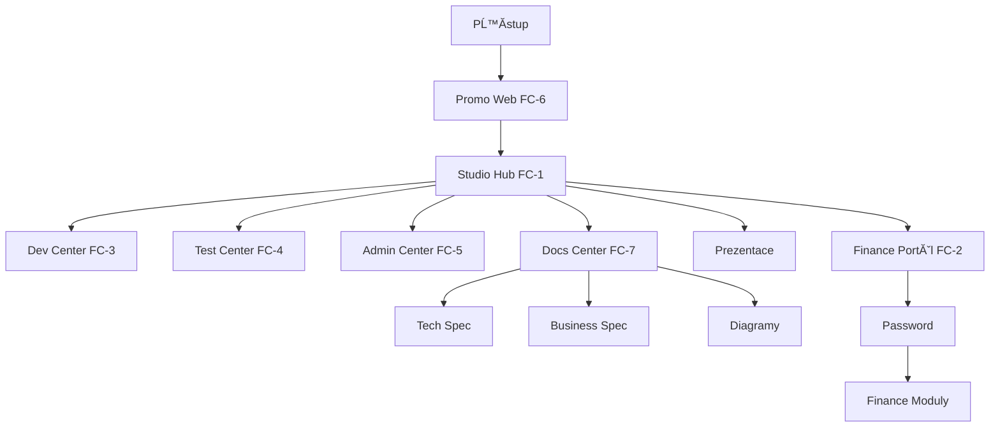

# OIL_CONTEXT.md — Kontext a výtah z diskusí per úkol

---

## AIQ-00360 — MANAGEMENT_COCKPIT.html: bilinguální labely + story strip CSS fix (2026-04-23)

**Datum:** 2026-04-23 | **Status:** CLOSED | **Assignee:** Claude | **Completed:** 2026-04-23

### Oprava 1 — Bilingvní labely (DISC-260423-003)
`"SEKCE / SECTIONS"` a `"COCKPIT STORY / PŘÍBĚH COCKPITU"` — obě hodnoty měly lomítko s oběma jazyky natvrdo v HTML. Opraveno: přidány ID (`sections-heading`, `cockpit-story-label`), text nastavuje `renderSections()` dle aktivního jazyka.

### Oprava 2 — Story strip CSS visibility
Text story stripu nebyl viditelný:
- `.story-strip-label`: `font-size: 9px; color: var(--muted)` → `11px; var(--text)`
- `.story-arrow`: `color: var(--border)` = `#1a2a4a` na tmavém bg = neviditelné → `var(--muted)`
- `.story-step`: `font-size` 12→13px, padding zvětšen
- `.story-step .sn`: `opacity: 0.65` → `0.85`
- Pill backgrounds: `0.12` → `0.18`, borders: `0.22` → `0.40`

---

## AIQ-00359 — Cockpit sub-stránky: translation audit (hardcoded CZ → bilinguální) (2026-04-22)

**Datum:** 2026-04-22 | **Status:** CLOSED | **Assignee:** Claude | **Completed:** 2026-04-23

### Kontext
Všechny cockpit sub-stránky (19 souborů) měly hardcoded CZ texty v page-title, section headers, button labels, placeholder textech a status labelech. Shell topbar byl přeložen přes `_shell.js`, ale obsah stránek nikoliv.

### Implementation notes
Použitý pattern per stránka:
1. `Shell.init({ section: {cs:'...', en:'...'} })` — bilingual section name v topbaru
2. IIFE po Shell.init pro statický HTML: `if (Shell.getLang() !== 'en') return; /* querySelector patches */`
3. JS-rendered content: `Shell.getLang() === 'en' ? 'EN text' : 'CZ text'` ternary přímo ve template literals
4. Data-driven objects (decisions, business-model): const s language-conditional objekty

### Pokryté soubory (20 souborů, ne 19)
`launch-plan, motivation, team, kpi, timeline, overview, methodology, financial, decisions, capacity, budget-track, documentation, sources, business-architecture, business-model, meeting-room, org-coordination, oil-board, boil-board, task-control`

### Bug fix nalezený při auditu
`task-control.html` četl localStorage klíč `appiq_lang` místo `hopi_lang` → language switch tam vůbec nefungoval. Opraveno v rámci tohoto úkolu.

### Vazba
Prerekvizita AIQ-00354 (i18n refactor) — po refactoru bude translation vrstva nahrazena JSON klíči.

---

## AIQ-00358 — Oprava chybné cesty _shell.js: org-coordination + meeting-room (2026-04-22)

**Datum:** 2026-04-22 | **Status:** REVIEW | **Assignee:** Claude

### Root cause
`org-coordination.html` a `meeting-room.html` měly `<script src="../_shell.js">` místo `<script src="_shell.js">`. Cesta `../` hledala soubor v `Development/` kde neexistuje — `Shell` byl `undefined`, `Shell.init()` vyhodilo ReferenceError, topbar se nevykreslil, hudba nehrála.

### Proč ostatní stránky fungovaly
Všechny ostatní sub-stránky používají `_shell.js` (bez `../`). Tyto dvě stránky byly pravděpodobně vytvořeny/editovány v okamžiku kdy byla `_shell.js` testována v Development/ nebo šlo o překlep.

### Oprava
- `org-coordination.html`: `src="../_shell.js"` → `src="_shell.js"`, sectionNum `19` → `13` (po reorderingu)
- `meeting-room.html`: `src="../_shell.js"` → `src="_shell.js"`
- Music path `../cockpit-music.mp3` správně ponecháno (soubor je v `Development/`)

---

## AIQ-00357 — BOIL Board: fetch BOIL.json + zobrazení BIZ úkolů (2026-04-22)

**Datum:** 2026-04-22 | **Status:** OPEN | **Assignee:** Claude

### Záměr
`boil-board.html` (sekce 12 — BIZ Task Board) nyní zobrazuje placeholder. Implementovat live data z BOIL.json analogicky k OIL boardu (AIQ-00356).

### Implementační plán
1. `fetch('../BOIL.json')` → parsovat BIZ-NNNNN úkoly
2. Tabulka/karty s: id, title, status, priority, domain, assignee, createdAt
3. Filtry: status, priority, domain, taskType
4. Stats panel: celkem, open, in-progress, review, closed
5. Expandovatelný detail s BKONTEXT záznamy (fetch('../BKONTEXT.md') → parse per BIZ)

---

## AIQ-00356 — OIL Board: fetch OIL.json + zobrazení AIQ úkolů (2026-04-22)

**Datum:** 2026-04-22 | **Status:** OPEN | **Assignee:** Claude

### Záměr
`oil-board.html` (sekce 11 — TECH Task Board) nyní zobrazuje placeholder. Implementovat live data z OIL.json.

### Implementační plán
1. `fetch('../OIL.json')` → parsovat `tasks[]` array
2. Tabulka/karty: id (AIQ-NNNNN), title, status, priority, taskType, effort, assignee, createdAt
3. Filtry: status, priority, taskType, effort, domain, modul
4. Stats panel: celkem, open, in-progress, review, closed, dnes uzavřeno
5. Expandovatelný detail s context z OIL_CONTEXT.md (fetch('../OIL_CONTEXT.md') → parse per AIQ ID)
6. Rychlý export: "Dnes uzavřeno" → pro release notes

---

## AIQ-00354 — Cockpit i18n refactor: překlady z inline JS → _translations/*.json (2026-04-22)

**Datum:** 2026-04-22 | **Status:** OPEN | **Assignee:** Claude

### Kontext
Aktuální pattern `{cs: 'Motivační prostor', en: 'Motivation Chamber'}` inline v SECTIONS array nešká luje. Pro každý nový jazyk = 140+ editací přímo v HTML. David identifikoval problém při přidávání překladů sekcí (AIQ-00353).

### Navržené řešení
```
cockpit/_translations/
  cs.json    ← { "section.01.name": "Motivační prostor", "section.01.desc": "...", ... }
  en.json    ← { "section.01.name": "Motivation Chamber", ... }
  de.json    ← přidání nového jazyka = jen tento soubor
```
SECTIONS array bude referovat klíče: `name: 'section.01.name'`  
`_shell.js` dostane lightweight `t(key)` funkci která načte správný JSON a přeloží.

### Přidání jazyka po refactoru
1. Vytvořit `cockpit/_translations/xx.json`
2. Přidat `xx` do lang switcher options
3. Hotovo — nula změn v HTML nebo JS logice

### BLOCKER
Implementovat **před přidáním 3. jazyka** do cockpitu. Dokud jsou jen cs/en, tech debt je únosný.

---

## AIQ-00352 — Cockpit Story strip nad sekcemi (2026-04-22)

**Datum:** 2026-04-22 | **Status:** REVIEW | **Assignee:** Claude

### Implementation notes
- Přidán `.story-strip` div do `MANAGEMENT_COCKPIT.html` — umístění: mezi `sections-header` a `sections-grid`.
- 12 barevných pills seskupuje 20 sekcí do logických kroků: `01 Proč → 02 Kdy → 03–04 Jak → 05 Kde jsme → 06 Čísla → 07–08 Peníze → 09 Milníky → 10–12 Práce → 13–15 Koordinace → 16–17 Tým → 18–19 Metodika → 20 Dokumenty`
- Barvy: violet=strategické (Proč, Kde jsme, Koordinace, Metodika), blue=časové/operativní (Kdy, Čísla, Milníky, Tým), amber=akční (Jak, Práce), green=finanční/výstupní (Peníze, Dokumenty)
- Strip je horizontálně scrollovatelný na mobile (`overflow-x: auto`)
- Label: `COCKPIT STORY / PŘÍBĚH COCKPITU` v mono muted, 9px

---

## AIQ-00351 — Cockpit sekce: Launch Plan přesunut na pozici 02 (2026-04-22)

**Datum:** 2026-04-22 | **Status:** REVIEW | **Assignee:** Claude

### Implementation notes
- SECTIONS array: Launch Plan přesunut z `num:'05'` na `num:'02'`. Přečíslování: Business Model 02→03, Architecture 03→04, Overview 04→05.
- Finální sekvence úvodu cockpitu: **Motivation(01) → Launch Plan/Countdown(02) → Business Model(03) → Architecture(04) → Executive Overview(05)**
- Odůvodnění: ranní briefing pattern = proč (motivace) → kdy (countdown, urgence) → jak (obchodní model) → kde jsme (aktuální stav). Countdown dlaždice s živými daty (Dnů do B2C/B2B) posiluje denní motivaci hned za úvodní sekcí.

---

## AIQ-00350 — Cockpit UI v2: překlad dlaždic, serif mot-quote, Decision Log reorder (2026-04-22)

**Datum:** 2026-04-22 | **Status:** REVIEW | **Assignee:** Claude

### Implementation notes
- **Překlad hardcoded řetězců:** `renderSections()` v MANAGEMENT_COCKPIT.html — `'SEKCE'` → `lang === 'cs' ? 'SEKCE' : 'SECTION'`, `'Otevřít →'` → `lang === 'cs' ? 'Otevřít →' : 'Open →'`. Ostatní strings (sec-name, sec-desc, kpi-lbl) byly již přeloženy správně.
- **Serif font v mot-quote:** `motivation.html` `.mot-quote` nemělo explicitní `font-family`. Přidáno `font-family: var(--c-font-sans)` — bez inheritance chain, garantovaně sans-serif.
- **Decision Log reorder:** SECTIONS array — Decision Log přesunut z num:'19' na num:'15' (za Meeting Room 14). Nové pořadí: OIL(11)→BOIL(12)→Org(13)→Meeting(14)→Decision Log(15)→Capacity(16)→Team(17)→Sources(18)→Methodology(19)→Documentation(20). Logická sekvence: Tasks → Coordination → Decisions.

---

## AIQ-00349 — Cockpit hudba: currentTime persistence + autoplay fallback (2026-04-22)

**Datum:** 2026-04-22 | **Status:** REVIEW | **Assignee:** Claude

### Implementation notes
- **Problém:** každá cockpit stránka vytváří nový `<audio>` element → přehrávání startuje od 0:00 při každé navigaci.
- **Fix — sessionStorage:** `MUSIC_TIME_KEY = 'hopi_audio_time'`. Při opuštění stránky (`beforeunload`) se ukládá `audio.currentTime`. Při načtení nové stránky se v `canplay` event obnoví pozice. Fallback pro cached audio: `readyState >= 3 && savedTime > 0`.
- **Autoplay fix:** `audio.play()` rejection → `document.addEventListener('click', ..., { once: true })` spustí hudbu při první interakci uživatele. Browser policy vyžaduje user gesture; auth button click v novém tabu nestačí při prvním načtení.
- **Soubory:** `cockpit/_shell.js` (sub-pages) + `MANAGEMENT_COCKPIT.html` `initMusic()` (hlavní cockpit). Obě implementace konzistentní.
- **sessionStorage scope:** přetrvá v rámci tabu, resetuje se při zavření prohlížeče/tabu.

---

## AIQ-00347 — Cockpit UI fix: font, tile velikost, přesun sekcí (2026-04-22)

**Datum:** 2026-04-22 | **Status:** REVIEW | **Assignee:** Claude

### Implementation notes
- **Příčina "patkového" písma:** `--c-font-mono: 'Courier New'` — Courier New má serif patky. Používá se v `_cockpit.css` a MANAGEMENT_COCKPIT.html pro KPI hodnoty, labely, tagy.
- **Fix — jedno místo = všechny stránky:** `_cockpit.css` `--c-font-mono` → `'Consolas', 'Cascadia Code', system-ui, sans-serif`. Consolas je sans-serif monospace (žádné patky). Stejná změna v MANAGEMENT_COCKPIT.html `--mono`.
- **Tile velikosti:** `sec-num` 10→12px, `sec-name` 16→18px, `sec-icon` 28→30px, `sec-desc` 12→13px
- **Přesun sekcí 19+20:** Org & Coordination → sekce 13, Meeting Room → sekce 14. Ostatní posunuto: stará 13→15, 14→16, 15→17, 16→18, 17→19, 18→20. Logika: Tasks(10) → OIL(11) → BOIL(12) → Org(13) → Meeting(14) = přirozená sekvence koordinace.
- **AIQ-00348** zaregistrován pro budoucí logické seskupení sekcí do skupin

### Test task
- AIQ-00347-T1 — David vizuálně ověří: žádné Courier New, tile labely čitelné, pořadí sekcí správné

---

## AIQ-00345 — Archive Verify List: Kompletní pokrytí cockpit souborů (2026-04-22)

**Datum:** 2026-04-22 | **Status:** CLOSED | **Assignee:** Claude

### Kontext
David požádal o kontrolu archivačních skriptů před deployem. Odhalena kritická mezera: `DO_ARCHIVE.ps1` verify list měl pouze 6 cockpit souborů z 25 skutečně existujících. Chybějící soubory by prošly archivací (xcopy kopíruje vše), ale VERIFY krok by je nezachytil jako chybějící.

### Implementation notes
- **DO_ARCHIVE.ps1** — `$webChecks` doplněno o 19 HTML souborů + `cockpit\business-model.json` + `cockpit\discussion-log.json`
- **AUTO_ARCHIVE.bat** — existence checks doplněny pro totéž (23 souborů celkem místo 4)
- **CLAUDE.md** — nové pravidlo "Aktualizační pravidla — Archive verify list": každý nový soubor v projektu = povinná aktualizace obou skriptů
- Nová CLAUDE.md rule je souřadná s existujícím ARCH_MAP.md pravidlem
- DISC-260422-030

---

## AIQ-00344 — Deploy Integrity Rule: Pravidlo 6 (2026-04-22)

**Datum:** 2026-04-22 | **Status:** CLOSED | **Assignee:** Claude

### Implementation notes
- Davidova instrukce: "deploy musí být vždy funkční" — formalizovat jako pravidlo před deployem
- Přidáno jako **Pravidlo 6** do sekce "Deployment bezpečnostní pravidla" v CLAUDE.md
- Checklist 6 bodů: HTML otevřitelnost, JS bez chyb, JSON validita, navigace, golden path nové featury, CHANGELOG datum
- Závazné pořadí uzávěru session: integrity check → deploy → archiv
- DISC-260422-029

---

## AIQ-00343 — discussion-log.json: Externalizace dat (Data Layer oddělena od UI) (2026-04-22)

**Datum:** 2026-04-22 | **Status:** REVIEW | **Assignee:** Claude | **Linked:** AIQ-00341

### Kontext
David položil otázku škálovatelnosti: "nedoběhne nás velikost databáze, technické možnosti souboru? poběží to do nekonečna?" Analýza ukázala, že embedded DECISIONS[] pole v HTML je architektonický anti-pattern s konkrétními limity (500 záznamů = degradace editoru, 2000+ = 3MB soubor, neúnosná údržba).

### Implementation notes
- **Problém:** `const DECISIONS = [...]` bylo embedded přímo v `cockpit/org-coordination.html` (cca 180 řádků, 41 záznamů) — mísení dat s UI, anti-pattern
- **Řešení:** Nový soubor `cockpit/discussion-log.json` = pure data (44 záznamů, compact JSON formát, 1 záznam = 1 řádek)
- **org-coordination.html změny:**
  - `const DECISIONS = [...]` nahrazen `let DECISIONS = [];`
  - Init sekce nahrazena `fetch('discussion-log.json')` s loading state (spinner) + error handling (srozumitelná hláška pro file:// protokol)
  - `getAllEntries()` funguje bez změny — merguje pendingEntries + DECISIONS
  - `generateDiscId()` funguje bez změny — počítá prefix v getAllEntries()
- **Webserver požadavek:** fetch() API nefunguje přes `file://` protokol — nutný webserver (VS Code Live Server, GitHub Pages). Error state zobrazí srozumitelnou hlášku.
- **Migrace v9.x:** Změna `fetch('discussion-log.json')` → `fetch('/api/v1/disc-log')` = 1 řádek kódu, zbytek se nemění
- **Škálovatelnost:** JSON soubor do 5000 záznamů = cca 1.5MB, přijatelné. Nad 5000 = API endpoint. Jasná exit strategie.
- **DISC-260422-021** — rozhodnutí zaznamenáno v discussion-log.json

### Test task
- **AIQ-00343-T1** — Integration test: David ověří fetch loading, JSON rendering, statistiky, filtry, entry form ID generování s externími daty, error state

---

## AIQ-00342 — Discussion Log Entry Form + Participant Identity (2026-04-22)

**Datum:** 2026-04-22 | **Status:** REVIEW | **Assignee:** David Gogela | **Linked:** AIQ-00341

### Implementation notes

**Trigger:** David upozornil, že schéma sice definuje `participants`, ale chybí UI kde se účastníci mohou sami identifikovat a přidat záznam.

**Dodáno:**

**1. org-coordination.html — "➕ Přidat záznam" modal**
- Nové tlačítko v toolbaru (fialový okraj, viditelný)
- Modal overlay (klik mimo = zavřít, ESC friendly)
- **Participant selector** — 7 čipů: DG · AI · ARTIN · INTECS · HOPI-MGMT · HOPI-IT · ANTHROPIC
  - Multi-select (více účastníků = společná diskuse)
  - První vybraný = facilitátor (označen ★)
  - Minimálně 1 musí být vybran (guard)
  - Default: DG předvybrán
- **Type selector** — 6 barevných čipů (DECISION violet / ACTION amber / RISK red / INSIGHT blue / QUESTION yellow / NOTE gray)
- Doména + Priorita (dropdowns)
- **Output selector** — 6 čipů s barvami per audience (INVESTOR amber / ANTHROPIC violet / CEO_BRIEF blue / HOPI_MGMT green / INTERNAL gray / PUBLIC yellow)
- Textarea pro text, input pro "kde" reference, input pro assignee (viditelný jen pro ACTION)
- **Po odeslání:** automatický DISC-YYMMDD-NNN ID, uložení do localStorage (`disc_pending_entries`)

**Pending section:**
- Zobrazí se nad logem jakmile jsou čekající záznamy
- Každý záznam: ID + typ + doména + účastníci + text + tlačítko smazat
- "📋 Export MD pro sync" → stáhne `.md` soubor s formátovanými bloky pro append do DISCUSSION_LOG.md
- "🗑 Smazat vše" s potvrzením

**Pending záznamy v log view:**
- Pending entries se mergují s DECISIONS[] (pending = první)
- Zobrazují se v separátní session skupině "Live Entry (čeká na sync)"
- Stats bar a session count jsou dynamické (počítají z merged datasetu)

**2. meeting-room.html — "Kdo píše?" selector**
- Persistent selector nad vstupním polem Discussion Board
- Chips: DG · AI · ARTIN · INTECS · HOPI-MGMT · Jiný (single-select, aktivní = orange)
- Každý thread/reply ukládá `author` a `avatar` z vybraného účastníka
- Platí globálně — jednou vybrat, platí pro všechna vlákna i odpovědi v session
- Avatar badge v threadu odpovídá autorovi

**REVIEW body:** Formulář vizuálně OK? Participant chips přehledné? Export MD formát správný pro DISCUSSION_LOG.md?

---

## AIQ-00341 — DISCUSSION_LOG v2 schema + Total Audit Log pravidlo (2026-04-22)

**Datum:** 2026-04-22 | **Status:** REVIEW | **Assignee:** David Gogela | **Linked:** AIQ-00338

### Implementation notes

**Trigger:** David (2026-04-22): "žádná diskuse nezůstane nezapsaná, chceme se vrátit ke všemu, musí existovat totální audit log + identifikaci osoby, agenta, účastníků diskuse"

**Dodáno v tomto tasku:**

**1. DISCUSSION_LOG.md v2.0** (přepsáno z v1.1)
- Nový formát: block per záznam (ne tabulka) — umožňuje 10+ polí bez ořezu
- ID konvence: `DISC-YYMMDD-NNN` (datové + sekvenční)
- Nová povinná pole: `type`, `domain`, `priority`, `status`, `participants`, `output`
- Retroaktivní záznamy označeny `[~RETRO]`, přibližné časy `~HH:MM`
- 40 záznamů z 7 sessions (2026-04-18 → 2026-04-22)
- Metodická sekce: jak přidávat záznamy, konvence, linking

**2. CLAUDE.md — sekce "DISCUSSION LOG — Totální audit log"**
- Umístění: PŘED sekcí BRAINSTORMING CAPTURE
- Obsah: ID konvence, tabulka povinných polí, kódy účastníků (DG/AI/HOPI-MGMT/HOPI-IT/ARTIN/INTECS/ANTHROPIC), typová taxonomie (6 typů), output tagy (6), preset filtrové dotazy (8), linking pravidla (DECISION+BUSINESS → BKONTEXT, ACTION → OIL.json), trigger pravidla (logovat PŘED dalším krokem, check na začátku/konci session)

**3. org-coordination.html v2.0** (přepsáno z v1.1)
- DECISIONS[] array = 40 záznamů s plným schema v2.0
- 6 filtrů: search, type, domain, priority, status, output, session
- 11 preset reportů: Investor Report, Anthropic Pitch, CEO Brief, Open Decisions, Critical Only, Architecture Decisions, Business Decisions, Team Decisions, Open Actions, Process Decisions, Recent Session
- Badge systém: type (violet/amber/red/blue/green/gray), priority (red/amber/blue/gray), status (green/yellow/gray/blue), output tagy (amber/violet/blue/green/gray/yellow)
- Export: JSON (filtred) + Markdown (filtered, formátovaný pro sdílení)
- Participant codes zobrazeny v kartě

**Schéma záznamu v2.0:**
```
id: DISC-YYMMDD-NNN
datum / čas (~HH:MM) / [~RETRO]
type: DECISION | ACTION | INSIGHT | RISK | QUESTION | NOTE
domain: PRODUCT | ARCHITECTURE | BUSINESS | PROCESS | BRAND | DEPLOY | STRATEGY | TEAM
priority: CRITICAL | HIGH | MEDIUM | LOW
status: CONFIRMED | OPEN | SUPERSEDED | DONE | CANCELLED
participants: [DG, AI, ...]
output: [INVESTOR, ANTHROPIC, CEO_BRIEF, HOPI_MGMT, INTERNAL, PUBLIC]
assignee: (pro ACTION typ)
text: hlavní text záznamu
kde: [BIZ-XXXXX, AIQ-XXXXX, ...]
superseded_by: DISC-YYMMDD-NNN (pokud status=SUPERSEDED)
```

**REVIEW body:** 40 záznamů — chybí rozhodnutí? Preset reporty jsou správně nakonfigurovány? Export funguje?

---

## AIQ-00340 — Meeting Room: Sekce 20 cockpitu (2026-04-22)

**Datum:** 2026-04-22 | **Status:** REVIEW | **Assignee:** David Gogela | **Linked:** AIQ-00309

### Implementation notes

**Dodáno:** `cockpit/meeting-room.html`

**Panel 1 — Digital Flipchart:**
- Sticky notes ve 5 barvách (žlutá/zelená/modrá/fialová/červená)
- Přidávání/mazání notes, editace textu v místě
- localStorage persistance — notes přežijí reload
- Export JSON (soubor se stáhne)
- Clear board s potvrzením

**Panel 2 — Discussion Board:**
- Vytváření threadů (textarea + button)
- Odpovědi na thready (Enter = odeslat)
- Hlasování 👍 per thread (toggle)
- localStorage persistance
- HTML escape pro bezpečné zobrazení

**Architektura:** Tab switcher (Flipchart/Discussion Board), Shell.init pattern, `.cockpit-page` CSS.
**Datový zdroj:** localStorage (offline-first, žádný backend v Phase 1).

**REVIEW body:** UX odpovídá záměru? Chybí funkce? Sticky notes velikost OK?

---

## AIQ-00339 — Organization & Coordination: Sekce 19 cockpitu (2026-04-22)

**Datum:** 2026-04-22 | **Status:** REVIEW | **Assignee:** David Gogela | **Linked:** AIQ-00309

### Implementation notes

**Dodáno:** `cockpit/org-coordination.html`

**Sekce 1 — Discussion Log viewer:**
- 40 rozhodnutí z 7 sessions (2026-04-18 → 2026-04-22)
- Zpětně doplněno z JSONL transkriptu + BKONTEXT + session znalosti
- Stats bar: celkem rozhodnutí / sessions / dní záznamu / dnes přidáno
- Filtrace: search (text) + select (session)
- Session bloky s collapse/expand
- Per-rozhodnutí: číslo + text (tučné klíčové slovo) + "kde zachyceno" tagy

**Sekce 2 — Odpovědnosti & Kontakty:**
- David Gogela: Product Owner, schvalování, HOPI relations, investor
- Claude: Development, architecture, OIL, deployment, session briefing
- ARTIN s.r.o.: Technology Partner P2 (backend, SAP)
- INTECS: Technology Partner P2 (IT infra, security, SharePoint)

**Architektura:** Embedded JS array (DECISIONS[]), render funkce, filterLog(), Shell.init pattern.
**Budoucí napojení:** Fetch z GitHub API (`DISCUSSION_LOG.md`) — zatím embedded pro rychlost.

**REVIEW body:** Chybí nějaké rozhodnutí? Odpovědnosti správné? Kontakty úplné?

---

## AIQ-00338 — DISCUSSION_LOG.md: Živý záznam rozhodnutí (2026-04-22)

**Datum:** 2026-04-22 | **Status:** REVIEW | **Assignee:** David Gogela | **Linked:** —

### Implementation notes

**Dodáno:** `DISCUSSION_LOG.md` (root projektu)

**Trigger:** Context komprese 2026-04-22 způsobila ztrátu celého ranního brainstormingu. Ochrana: BRAINSTORM_LOG.md (CLAUDE.md protokol). Tento soubor = second layer ochrany pro strategická rozhodnutí.

**Obsah:** 40 rozhodnutí, 7 sessions (2026-04-18 → 2026-04-22). Zpětné doplnění z:
- JSONL transkript audit (agent prošel 599 řádků, 25 rozhodnutí)
- BKONTEXT.md záznamy (BIZ-00122, 00124, 00125, 00126, 00127)
- Session knowledge (CLAUDE.md, OIL.json, session summary)

**Formát:** `## Session YYYY-MM-DD — Label` → tabulka `# | Čas | Rozhodnutí | Kde zachyceno`

**Pravidlo:** Appendovat pouze, nikdy přepisovat. Ukládat do `_SESSION_START/DISCUSSION_LOG.md` při archivaci.

**REVIEW body:** Chybí rozhodnutí z předchozích sessions? Formát vyhovuje?

---

## AIQ-00337 — Business Architecture: Sekce 03 cockpitu (2026-04-22)

**Datum:** 2026-04-22 | **Status:** REVIEW | **Assignee:** David Gogela | **Linked:** AIQ-00309

### Implementation notes

**Dodáno:** `cockpit/business-architecture.html`

**Obsah:** 9D produktový model (9 karet), fázový plán Phase 1→3, 5-vrstvá tech architektura (Visual→Data→Workflow→Integration→AI), 5 zákonů platformy, tržní diferenciace (6 karet), 5 klíčových architektonických dokumentů s AIQ linky.

**Narativní pozice:** Sekce 03 = "PROČ TO FUNGUJE" — zasazuje Business Sales Model (sekce 02) do kontextu platformové strategie. Zodpovídá otázku: proč je architektura jiná než u konkurence a proč škáluje.

**REVIEW body:** Obsah správný? Chybí nějaká diferenciace? Dokumenty aktuální?

---

## AIQ-00336 — Business Sales Model: Technická dokumentace obchodního modelu (2026-04-22)

**Datum:** 2026-04-22 | **Status:** REVIEW | **Assignee:** David Gogela | **Linked:** BIZ-00124

### Implementation notes (2026-04-22)

**Dodáno:**
- `cockpit/business-model.json` — single source of truth, plně modulární schema
- `cockpit/business-model.html` — live UI: scénář switcher + ARR grid + exit valuace + segment tabulky + HOPI transfer pricing + cost assumptions
- `MANAGEMENT_COCKPIT.html` — přidána sekce 17 do SECTIONS[]
- `cockpit/motivation.html` — doplněna valuační sekce s live přepínačem scénářů z business-model.json

**Architektura:**
- 4 scénáře: Conservative 8% / Middle 10% / Ambitious 15% / Dream 22% (freemium konverze)
- Exit paths: Acquisition 12× / PE Buyout 6× / IPO 25× / HOPI Group 10× (baseline)
- Segmenty: HOME B2C (3), Enterprise B2B (3), Cockpit B2B (3), Cockpit HOME (2), HOPI Internal (5)
- Transfer pricing: OECD cost-plus, €9.99 × 28% × 1.05 = €2.94 → €3.00/user
- DB-ready: přidání segmentu = nový JSON objekt, swap → _data.js only

**REVIEW body pro Davida:**
1. Ověřit čísla segmentů (ceny OK?)
2. Počty uživatelů HOPI divisí jsou placeholder (30/25/20/15/10) — doplnit reálná čísla
3. Dream scénář Y1/Y2 ARR jsou null — doplnit po diskusi s majiteli HOPI
4. GitHub API write (AIQ-00319) zatím není live — čísla jsou read-only z JSON

### Účel sekce

Interaktivní revenue simulátor — single source of truth pro všechna finanční čísla platformy. Editovatelná pole → okamžitý přepočet → persistence přes GitHub API.

### Soubory

```
cockpit/business-model.html     ← UI sekce
cockpit/business-model.json     ← datový soubor (GitHub API read/write)
```

### business-model.json — kompletní schéma

```json
{
  "version": "1.0",
  "lastUpdated": "2026-04-22",

  "cost_assumptions": {
    "gross_margin_pct": 72,
    "api_cost_per_session_eur": 0.10,
    "avg_sessions_per_user_monthly": 30,
    "payment_processing_pct": 2.9,
    "hosting_per_user_eur": 0.20
  },

  "segments": [
    {
      "id": "b2c-individual",
      "group": "B2C_HOME",
      "name": { "cs": "Jednotlivec", "en": "Individual" },
      "unit": "user",
      "billing_period": "monthly",
      "pricing_model": "flat",
      "price": 9.99,
      "currency": "EUR",
      "active": true
    },
    {
      "id": "b2c-couple",
      "group": "B2C_HOME",
      "name": { "cs": "Pár", "en": "Couple" },
      "unit": "user",
      "billing_period": "monthly",
      "pricing_model": "flat",
      "price": 14.99,
      "currency": "EUR",
      "active": true
    },
    {
      "id": "b2c-family",
      "group": "B2C_HOME",
      "name": { "cs": "Rodina", "en": "Family" },
      "unit": "user",
      "billing_period": "monthly",
      "pricing_model": "flat",
      "price": 19.99,
      "currency": "EUR",
      "active": true
    },
    {
      "id": "b2c-freemium",
      "group": "B2C_HOME",
      "name": { "cs": "Freemium", "en": "Freemium" },
      "unit": "user",
      "billing_period": "monthly",
      "pricing_model": "freemium",
      "price": 0,
      "currency": "EUR",
      "freemium_conversion_rate": 0.10,
      "freemium_target_segment": "b2c-individual",
      "active": true
    },
    {
      "id": "b2b-startup",
      "group": "B2B_ENT",
      "name": { "cs": "Startup", "en": "Startup" },
      "unit": "company",
      "billing_period": "monthly",
      "pricing_model": "flat",
      "price": 49,
      "currency": "EUR",
      "active": true
    },
    {
      "id": "b2b-business",
      "group": "B2B_ENT",
      "name": { "cs": "Business", "en": "Business" },
      "unit": "company",
      "billing_period": "monthly",
      "pricing_model": "flat",
      "price": 149,
      "currency": "EUR",
      "active": true
    },
    {
      "id": "b2b-enterprise",
      "group": "B2B_ENT",
      "name": { "cs": "Enterprise", "en": "Enterprise" },
      "unit": "company",
      "billing_period": "monthly",
      "pricing_model": "flat",
      "price": 499,
      "currency": "EUR",
      "active": true
    },
    {
      "id": "hopi-supply-chain",
      "group": "HOPI_INTERNAL",
      "name": { "cs": "Supply Chain", "en": "Supply Chain" },
      "unit": "user",
      "billing_period": "monthly",
      "pricing_model": "flat",
      "price": 3.00,
      "currency": "EUR",
      "transfer_pricing": true,
      "tp_method": "cost_plus",
      "tp_markup_pct": 5,
      "active": true
    }
  ],

  "scenarios": [
    {
      "id": "conservative",
      "name": "Conservative",
      "freemium_conversion_override": 0.08,
      "projections": [
        { "segment_id": "b2c-individual", "year": 2027, "units": 200 },
        { "segment_id": "b2c-individual", "year": 2028, "units": 800 },
        { "segment_id": "b2c-individual", "year": 2029, "units": 2000 },
        { "segment_id": "b2c-freemium",   "year": 2027, "units": 2500 }
      ]
    },
    {
      "id": "middle",
      "name": "Middle",
      "freemium_conversion_override": 0.10,
      "projections": [
        { "segment_id": "b2c-individual", "year": 2027, "units": 500 },
        { "segment_id": "b2c-individual", "year": 2028, "units": 2000 },
        { "segment_id": "b2c-individual", "year": 2029, "units": 5000 }
      ]
    },
    {
      "id": "ambitious",
      "name": "Ambitious",
      "freemium_conversion_override": 0.15,
      "projections": [
        { "segment_id": "b2c-individual", "year": 2027, "units": 1200 },
        { "segment_id": "b2c-individual", "year": 2028, "units": 5000 },
        { "segment_id": "b2c-individual", "year": 2029, "units": 15000 }
      ]
    },
    {
      "id": "dream",
      "name": "Dream ✨",
      "freemium_conversion_override": 0.22,
      "projections": []
    }
  ],

  "internal_billing": [
    { "entity_id": "hopi-supply-chain", "segment_id": "hopi-supply-chain", "users": 30 },
    { "entity_id": "hopi-foods",        "segment_id": "hopi-supply-chain", "users": 25 },
    { "entity_id": "hopi-agriculture",  "segment_id": "hopi-supply-chain", "users": 20 },
    { "entity_id": "hopi-services",     "segment_id": "hopi-supply-chain", "users": 15 },
    { "entity_id": "hopi-holding",      "segment_id": "hopi-supply-chain", "users": 10 }
  ]
}
```

### Klíčové výpočty — formule

**Měsíční revenue per segment:**
```
monthly_revenue = units × segment.price
```

**ARR per segment:**
```
arr = monthly_revenue × 12
```

**Freemium → placení uživatelé:**
```
paying_users = freemium_units × freemium_conversion_rate
converted_arr = paying_users × target_segment.price × 12
```

**Transfer pricing (HOPI Internal):**
```
reference_price = 9.99  (nejnižší arm's length tržní cena = b2c-individual)
full_costs = reference_price × (1 − gross_margin_pct / 100)
           = 9.99 × 0.28 = €2.80
transfer_price = full_costs × (1 + tp_markup_pct / 100)
               = 2.80 × 1.05 = €2.94 → €3.00
```

**Interní měsíční faktura per divize:**
```
monthly_invoice = users × transfer_price
               = např. Supply Chain: 30 × €3.00 = €90/měsíc
```

**Celkový ARR scénáře:**
```
total_arr = Σ(arr per segment) + converted_arr(freemium) + Σ(monthly_invoice × 12)(internal)
```

**Valuace dle exit cesty:**
```
acquisition_val = total_arr × 12    (12× ARR multiple)
pe_buyout_val   = total_arr × 6     (6× ARR multiple)
ipo_val         = total_arr × 25    (25× ARR multiple)
hopi_group_val  = total_arr × 10    (přidaná hodnota k HOPI Group €500M)
```

### Pole — technický slovník

| Pole | Typ | Popis |
|------|-----|-------|
| `segment.id` | string | Unikátní ID segmentu (slug) |
| `segment.group` | string | Skupina: B2C_HOME / B2B_ENT / HOPI_INTERNAL |
| `segment.unit` | string | Fakturační jednotka: user / company / family / seat |
| `segment.pricing_model` | string | flat / per_unit / tiered / usage_based / freemium |
| `segment.price` | number | Cena v EUR/měsíc |
| `segment.freemium_conversion_rate` | number | 0.0–1.0, jen pro freemium segmenty |
| `segment.transfer_pricing` | bool | true = HOPI internal, podléhá TP pravidlům |
| `scenario.freemium_conversion_override` | number | Přepíše globální rate pro daný scénář |
| `projection.units` | number | Počet platících unit v daném roce |
| `cost_assumptions.gross_margin_pct` | number | Hrubá marže v %, základ pro TP výpočet |
| `internal_billing.users` | number | Počet uživatelů dané divize |

### Rozšiřitelnost — jak přidat nový segment

```json
// Přidání nového B2B segmentu (bez změny kódu):
{
  "id": "b2b-government",
  "group": "B2B_PUBLIC",
  "name": { "cs": "Veřejný sektor", "en": "Government" },
  "unit": "department",
  "billing_period": "annual",
  "pricing_model": "flat",
  "price": 2999,
  "currency": "EUR",
  "active": true
}
```

### Feeds — co tato sekce napájí

| Sekce | Co čte | Pole |
|-------|--------|------|
| Motivation Chamber (01) | Valuace per scénář | total_arr × exit_multiple |
| Executive Overview (02) | Live ARR widget | current_year total_arr |
| Budget Track (05) | ROI výpočet | cumulative investment vs. arr |
| Financial Cockpit (06) | Revenue forecast | monthly_revenue per segment |

---

## AIQ-00323 až AIQ-00335 — Cockpit FULL BUILD + Anthropic Case (2026-04-22)

**Datum:** 2026-04-22 | **Status:** OPEN → IN PROGRESS | **Assignee:** Claude | **Cíl session:** Plně oživit Management Cockpit + dokončit Anthropic outreach balíček

### Strategický záměr — proč dnes

David Gogela rozhodl maximalizovat dnešní session: postavit všech 12 chybějících cockpit sekcí a finalizovat Anthropic Case. Management Cockpit musí být funkční jako celek — připravený na prezentaci funkčnosti (investor demo, Anthropic outreach, HOPI Group pilot).

### Skupiny tasků a přístup

**Vlna 1 — AIQ-00323 až AIQ-00329 (statická data + OIL.json fetch)**
Sekce 07 · 09 · 10 · 11 · 12 · 14 · 15 — bez externích integrací. Data buď z OIL.json/BOIL.json (fetch) nebo statické JSON soubory. Nejrychlejší na build, nejvyšší okamžitá hodnota pro demo.

**Vlna 2 — AIQ-00330, AIQ-00331 (+ GitHub API kontext)**
Sekce 04 KPI Strip a 01 Motivation Chamber — potřebují git commit count přes GitHub API (public endpoint, bez auth). Stavějí na AIQ-00319 základech.

**Vlna 3 — AIQ-00332, AIQ-00333, AIQ-00334 (+ JSON data soubory)**
Sekce 05 Budget Track, 06 Financial Cockpit, 13 Sources — každá dostane vlastní JSON seed soubor (budget-data.json, financial-data.json, sources-data.json). **Architektonické rozhodnutí (2026-04-22):** Phase 1 = manuální JSON zadaný Davidem, Phase 2 = SAP swap výhradně přes `_data.js`. Frontend se nemění.

**Anthropic — AIQ-00335**
Finalizace kompletního outreach balíčku: ANTHROPIC_2PAGER.html (schválení + screenshoty od Davida), cover email draft. Cíl: jeden odkaz + email = kompletní případ pro Anthropic Developer Relations.

### JSON soubory — schéma (závazné pro DB swap)

```json
// budget-data.json
{ "phases": [{ "id": "phase0", "title": "Phase 0", "investment": 0, "value": 0, "status": "active" }],
  "monthly": [{ "month": "2026-02", "ai_credits": 0, "hw": 0, "sw": 0, "hours": 0 }] }

// financial-data.json
{ "monthly_cost": [...], "cash_pipeline": { "target": 200000, "current": 0 }, "roi": { "invested": 0, "value": 0 } }

// sources-data.json
{ "categories": [{ "id": "human", "title": "Lidská práce", "phase1": "...", "phase2": "..." }] }

// decisions.json
{ "decisions": [{ "id": "DEC-001", "date": "2026-04-20", "title": "...", "who": "David Gogela", "impact": "HIGH", "linkedTask": "AIQ-NNNNN" }] }

// milestones.json
{ "milestones": [{ "id": "m1", "title": "Phase 0 Start", "date": "2026-02-01", "status": "done", "linkedPhase": 0 }] }
```

### Všechny sekce — Shell pattern (závazný pro každou stránku)

```html
<!-- Každá cockpit sub-stránka musí mít: -->
<script src="../_shell.js"></script>   <!-- topbar Zpět na Cockpit, auth check -->
<script src="../_hopiq.js"></script>   <!-- HOPIQ widget (po AIQ-00320) -->
<!-- Init: Shell.init({ sectionId: 'XX', sectionTitle: '...' }) -->
```

### Dnešní pořadí buildu (optimalizováno pro rychlost)

```
1. cockpit/oil-board.html      (AIQ-00324) ← nejvyšší demo hodnota
2. cockpit/boil-board.html     (AIQ-00325)
3. cockpit/capacity.html       (AIQ-00326)
4. cockpit/timeline.html       (AIQ-00323) ← milestones.json
5. cockpit/decisions.html      (AIQ-00329) ← decisions.json
6. cockpit/team.html           (AIQ-00327)
7. cockpit/methodology.html    (AIQ-00328)
8. cockpit/kpi.html            (AIQ-00330)
9. cockpit/motivation.html     (AIQ-00331)
10. cockpit/budget-track.html  (AIQ-00332) ← budget-data.json
11. cockpit/financial.html     (AIQ-00333) ← financial-data.json
12. cockpit/sources.html       (AIQ-00334) ← sources-data.json
13. Anthropic Case             (AIQ-00335)
```

---

## AIQ-00319 až AIQ-00322 — Cockpit Assistant: GitHub API + Widget + Standalone + Action Catalog (2026-04-22)

**Datum:** 2026-04-22 | **Status:** OPEN | **Assignee:** Claude | **Linked:** AIQ-00318

### Proč tato skupina úkolů vznikla — kontext pro organizaci

David Gogela rozhodl nasadit HOPIQ agenta na Management Cockpit a přidat plnou read/write integraci přes GitHub API. Toto je **architektonické rozhodnutí s dopadem na celou platformu** — nejen widget na stránce, ale první implementace živého datového mostu mezi AI agentem a zdrojovými soubory projektu.

**Klíčová architektonická rozhodnutí (závazná):**

1. **GitHub Pages = statický hosting, zápis NENÍ možný nativně** — jedinou cestou bez backendu je GitHub REST API. Toto je vědomé rozhodnutí: přijatelné pro interní nástroj za heslovým zámkem, v Phase 2 (v9.x) nahradí REST API backend.

2. **GitHub Personal Access Token v localStorage** — po odemčení cockpitu (heslo HOPI2026) uloží agent PAT token do localStorage. Security model: token je za dvěma vrstvami (GitHub autentikace + cockpit heslo). Pro interní nástroj přijatelné, pro veřejný SaaS NE.

3. **Action-dispatch pattern** — agent nevrací volný text, vrací strukturovaný JSON `{action: "createTask", params: {...}}`. Frontend JS dispatch tuto akci provede. Toto odděluje AI rozhodování od provedení = čistá architektura, testovatelné, rozšiřitelné.

4. **Per-section system prompt** — každá cockpit sekce má vlastní AI kontext (Finance sekce ≠ Launch Plan ≠ Task Control). Kontext předává `_shell.js` při inicializaci agenta.

5. **Widget + Standalone kombinace** — Widget = rychlé dotazy přímo na sekci. Standalone (`cockpit/assistant.html`) = hlubší práce (denní briefing, review tasků, vytváření tasků). Obě implementace sdílí stejnou _hopiq.js instanci s různým módem.

### Implementační pořadí (závazné)

```
AIQ-00319  GitHub API Data Layer     ← PRVNÍ — prerekvizita pro vše
    ↓
AIQ-00320  Widget na sub-stránky     ← read-only lze bez 319
    ↓
AIQ-00322  Action Catalog            ← logika co agent dělá
    ↓
AIQ-00321  Standalone stránka        ← UI pro plnou práci
```

### GitHub API — technický detail pro IT

```javascript
// Čtení souboru
GET https://api.github.com/repos/h-gr-fico/appiq/contents/OIL.json
Headers: { Authorization: 'token <PAT>' }
→ response.content = base64 → atob() → JSON.parse()

// Zápis souboru (update)
PUT https://api.github.com/repos/h-gr-fico/appiq/contents/OIL.json
Body: {
  message: "Cockpit Agent: createTask AIQ-00XXX",
  content: btoa(JSON.stringify(updatedOIL)),  // base64
  sha: <SHA z předchozího GET>  // povinné pro update
}
```

SHA conflict: pokud někdo jiný zapsal soubor mezi GET a PUT → 409 error → re-fetch SHA → retry.

### 8 akcí agenta — katalog

| Akce | Co dělá | Read/Write |
|------|---------|-----------|
| `listOpenTasks` | Filtr OIL/BOIL dle assignee/domain/status | Read |
| `createTask` | Nový AIQ záznam, auto-ID, zápis do OIL.json | Write |
| `updateTaskStatus` | Změní status+timestamps | Write |
| `getDailyBriefing` | OPEN HIGH + REVIEW queue + capacity split | Read |
| `navigateToSection` | Přesměruje na cockpit sekci | UI |
| `explainMetric` | Vysvětlí KPI v kontextu sekce | Read |
| `summarizeSection` | Shrne stav sekce (počty, trendy) | Read |
| `getReviewQueue` | Tasky čekající na Davidovo schválení | Read |

### Kde to vede — Phase 2+

Tato implementace (GitHub API) je **záměrně dočasná**. V Phase 2 (v9.x) přijde REST API backend — swap bude POUZE v `_data.js`. Frontend, agentní logika, action catalog = beze změny. Toto je Backend Readiness princip platformy v praxi.

---

## AIQ-00317 — COCKPIT: Vizuální fix — název, kontrast, sans-serif, _shell.js (2026-04-22)

**Datum:** 2026-04-22 | **Status:** CLOSED | **Assignee:** Claude | **Linked:** AIQ-00314 | **actualTime:** 30 min

### Co bylo opraveno

**MANAGEMENT_COCKPIT.html:**
- Název "MNG COCKPIT" → "MANAGEMENT COCKPIT" na 3 místech: auth overlay h2, topnav-logo div, hero h1
- `--muted: #6b7280` → `--muted: #94a3b8` v `:root` (světlejší, čitelnější)
- Hardcoded `color:#6b7280; font-family:monospace` na auth overlay subtitlu → `color:#94a3b8; font-family:'Segoe UI',...`
- Přidána CSS proměnná `--sans: 'Segoe UI', system-ui, sans-serif`
- 13 CSS pravidel přepnuto z `var(--mono)` na `var(--sans)`: hero-label, hero-sub, hero-kpi-lbl, phase-step, sections-header h2, sec-num, sec-kpi-lbl, sec-open-btn, sec-tag, b2c-countdown-label, b2c-launch-sublabel, .b2c-ms, footer, b2c-plan-link

**cockpit/overview.html, launch-plan.html, task-control.html:**
- Readability block rozšířen: `--c-font-mono: 'Segoe UI', system-ui, sans-serif` → přepíše všechny mono labely na sans-serif

**Integrační oprava (_shell.js):**
- Všem 3 novým sub-stránkám chyběl `<script src="_shell.js"></script>`
- Shell.init() byl voláno s guard `if (typeof Shell !== 'undefined')` → tiše selhávalo
- Opraveno: přidán tag před hlavní `<script>` blok v každé stránce
- Po opravě: topbar "← Zpět na Cockpit", section title, music/lang tlačítka fungují

### Klíčové poznámky
- CSS variable mismatch: MANAGEMENT_COCKPIT.html používá `--muted` (bez `c-`), cockpit sub-stránky `--c-muted` — proto readability fix v sub-stránkách neovlivnil hlavní stránku; každá stránka opravena samostatně
- Tato oprava je součástí session pokračování po context window compression

---

## AIQ-00316 — COCKPIT sekce 07: Task Control Center (2026-04-22)

**Datum:** 2026-04-22 | **Status:** IN PROGRESS | **Assignee:** Claude | **Linked:** BIZ-00123

### Co se implementuje

Nová cockpit sekce `cockpit/task-control.html` na pozici 07. Unified OIL+BOIL dashboard se 3 záložkami.

### Architektura

```
cockpit/task-control.html
  ├── Data loading: fetch('../../../OIL.json') + fetch('../../../BOIL.json')
  ├── Tab 1: Priority Board
  │     ├── Kanban grid: S1 | S2 | S3 | S4
  │     ├── Karta: ID badge + název + assignee icon + status badge
  │     └── Filtr: ALL | AIQ | BIZ | REVIEW
  ├── Tab 2: Linked View
  │     ├── BIZ task jako accordion row (expandable)
  │     ├── Pod ním: AIQ tasky kde linkedTask === BIZ-ID
  │     └── Context snippet: note pole (první 200 znaků)
  └── Tab 3: Capacity Split
        ├── Claude vs. David: count + estimatedTime suma
        ├── REVIEW list: tasky se status === 'REVIEW'
        └── Domain breakdown: group by domain field
```

### Data model — co se čte

Z `OIL.json`: pole `tasks[]` — filtr na status !== 'CLOSED' pro aktivní view
Z `BOIL.json`: pole `tasks[]` — filtr na status !== 'CLOSED'
Severity: field `severity` (S1-KRITICKÝ / S2-ZÁVAŽNÝ / S3-STŘEDNÍ / S4-NÍZKÝ)
Linked: field `linkedTask` — string s ID (BIZ-NNNNN nebo AIQ-NNNNN)

### Klíčové implementační poznámky

- Soubor používá Shell pattern stejný jako ostatní cockpit sekce (auth přes parent)
- Relativní cesta k JSON: `../../OIL.json` z `cockpit/` složky
- Filtr REVIEW = status === 'REVIEW' (čeká na Davidovo schválení)
- Tab 2 Linked View: iteruje BOIL tasks, pro každý hledá v OIL tasks kde task.linkedTask === biz.id

---

## AIQ-00315 — COCKPIT sekce 02: Executive Overview Dashboard (2026-04-22)

**Datum:** 2026-04-22 | **Status:** IN PROGRESS | **Assignee:** Claude | **Linked:** BIZ-00123

### Co se implementuje

Nová cockpit sekce `cockpit/overview.html` na pozici 02. Ranní briefing — 5 widgetových bloků.

### Layout

```
cockpit/overview.html
  ├── Blok 1: Business Health   [Investice | Pipeline | Měsíční cost | Valuace cíl]
  ├── Blok 2: Project Pulse     [Open AIQ | Open BIZ | Closed/týden | REVIEW čeká]
  ├── Blok 3: Execution         [Claude % | David % | Milestones hotovo | Dnů do B2C]
  ├── Blok 4: Strategic         [Open rozhodnutí | Partneři status | Fáze nyní]
  └── Blok 5: Launch Countdown  [Dnů do 01.01.2027 | Founding Members target]
```

### Data loading

- Project Pulse (bloky 2, 3): počítá dynamicky z OIL.json + BOIL.json (fetch)
- Launch Countdown: JS Date diff od 2027-01-01
- Business Health, Strategic: placeholder hodnoty s `--` dokud nejsou propojeny live sekce
- Každý widget má `→ sekce XX` link na plnou cockpit sekci

### Poznámky

- Hodnoty z finančních sekcí (03, 04) zatím placeholder — sekce nejsou data-connected
- Project Pulse počítá LIVE z JSON souborů (stejná logika jako OIL Board sekce 06+07)
- Widget design: číslo (velké) + label + trend indicator (→, ↑, ↓) + odkaz

---

## AIQ-00314 — COCKPIT: Přečíslování SECTIONS + insert 2 nových sekcí (2026-04-22)

**Datum:** 2026-04-22 | **Status:** IN PROGRESS | **Assignee:** Claude | **Linked:** AIQ-00315

### Co se implementuje

Aktualizace `SECTIONS` pole v `MANAGEMENT_COCKPIT.html`:
- Insert `overview.html` jako sekce num:'02' (posun starých 02-06 → 03-07)
- Insert `task-control.html` jako sekce num:'07' (posun starých 07-14 → 08-16)
- Výsledek: 16 sekcí (bylo 14)

### Mapování před → po

| Původní # | Název | Nové # |
|-----------|-------|--------|
| 01 | Motivation Chamber | 01 (beze změny) |
| — | **Executive Overview Dashboard** | **02 (NOVÁ)** |
| 02 | Executive KPI Strip | 03 |
| 03 | Budget Track | 04 |
| 04 | Financial Cockpit | 05 |
| 05 | Milestone Timeline | 06 |
| — | **Task Control Center** | **07 (NOVÁ)** |
| 06 | OIL Task Board | 08 |
| 07 | BOIL Task Board | 09 |
| 08 | Capacity & Responsibility | 10 |
| 09 | Project Team | 11 |
| 10 | Sources | 12 |
| 11 | Methodology | 13 |
| 12 | Decision Log | 14 |
| 13 | Documentation & Links | 15 |
| 14 | B2C Launch Plan · Countdown | 16 |

---

## AIQ-00313 — Compliance corrections: 9 editů ve 4 souborech (2026-04-22)

**Datum:** 2026-04-22 | **Status:** CLOSED | **Assignee:** Claude | **Linked:** BIZ-00121 + BIZ-00122

### Co bylo uděláno

Komplexní audit a oprava všech nepřesných tvrzení na platformě — 2 skupiny:
- **Skupina A:** Anthropic ToS compliance — 4 edity
- **Skupina B:** PoC vs. Production accuracy — 5 editů

Business kontext a zdůvodnění: viz **BIZ-00122** v BKONTEXT.md.

---

### Skupina A — Anthropic ToS (4 edity)

**A1 — PERSONAL_PITCH.html, CZ verze (~ř.693)**
```
PŘED: "Oslovit a formalizovat ARTIN · INTECS · Anthropic — aktivní piloty jsou již v chodu."
PO:   "Oslovit a formalizovat ARTIN · INTECS — aktivní piloty jsou v chodu. Anthropic — zahájit strategic partnership outreach (deck připraven)."
```

**A2 — PERSONAL_PITCH.html, EN verze (~ř.694)**
```
PŘED: "Reach out and formalize ARTIN · INTECS · Anthropic — active pilots already underway."
PO:   "Reach out and formalize ARTIN · INTECS — active pilots underway. Anthropic — initiate strategic partnership outreach (deck ready)."
```

**A3 — INVESTOR_BRIEF.html, og:description meta tag (ř.8)**
```
PŘED: "... Anthropic partnership."
PO:   "... Powered by Claude API."
```
KRITICKÉ: og:description = LinkedIn/Slack preview text — viditelný bez kliknutí na dokument.

**A4 — INVESTOR_BRIEF.html, Anthropic area sekce (~ř.530-532)**
```
PŘED: area-title  "Anthropic — HOPI AI Lab"
      badge CZ    "Aktivní"
      badge EN    "Active"
      area-desc   "Formální AI Lab ve spolupráci s Anthropic"
PO:   area-title  "Anthropic — Strategický AI Partner (outreach)"
      badge CZ    "V přípravě"
      badge EN    "In Progress"
      area-desc   "Cíl: referenční zákazník Claude API pro CEE"
```

---

### Skupina B — PoC Accuracy (5 editů)

**B1 — PERSONAL_PITCH.html, Finance Phase row (~ř.472-473)**
```
PŘED CZ: "Finance Phase 0 — v provozu, reální uživatelé, reálná data skupiny"
PŘED EN: "Finance Phase 0 — live, real users, real group data"
PO CZ:   "Finance Phase 0 — funkční PoC, nasazen live, interní pilot: David Gogela"
PO EN:   "Finance Phase 0 — functional PoC, deployed live, internal pilot: David Gogela"
```

**B2 — INVESTOR_BRIEF.html, users sekce (~ř.636-637)**
```
PŘED CZ: "Reální uživatelé: David, CEO, CFO HOPI Group"
PŘED EN: "Real users: David, CEO, CFO HOPI Group"
PO CZ:   "Interní pilot: David Gogela (builder, první uživatel). CEO a CFO platformu zhodnotili."
PO EN:   "Internal pilot: David Gogela (builder, first user). CEO and CFO evaluated the platform."
```

**B3 — CEO_BRIEF.html, HOPI AI Lab claim (~ř.1000-1005)**
```
PŘED CZ: "HOPI AI Lab = CEE implementační laboratoř Anthropicu"
PŘED EN: "HOPI AI Lab = CEE implementation lab for Anthropic"
PO CZ:   "Cíl: stát se referenčním zákazníkem Claude API pro CEE. HOPI AppIQ = živý důkaz enterprise + HOME B2C nasazení."
PO EN:   "Goal: become reference customer for Claude API in CEE. HOPI AppIQ = live proof of enterprise + HOME B2C deployment."
```

**B4 — CEO_BRIEF.html, nasazení claim + badge (~ř.533 + 568-572)**
```
PŘED CZ: "Živé nasazení v HOPI Group dnes"
PŘED EN: "Live deployment in HOPI Group today"
PŘED badge: "PRODUKCE"
PŘED text: "Reálný uživatel. Reálná data. Reálné procesy."
PO CZ:   "Funkční PoC, nasazen live — HOPI Group = první deployment target."
PO EN:   "Functional PoC, deployed live — HOPI Group = first deployment target."
PO badge: "PoC · PILOT"
PO text: "Reálný builder. Reálná platforma. Reálné use cases."
```

**B5 — ANTHROPIC_2PAGER.html, dva product claim texty (~ř.459 + 730)**
```
PŘED ř.459: "live in production, running inside a real €0.5B Central European holding company.
            Not a demo. Not a prototype. A product."
PO ř.459:  "fully functional and deployed, built for a real €0.5B Central European holding company.
            Not a static deck. Not a mockup. A working platform."

PŘED ř.730: "live in production inside a real company"
PO ř.730:  "a working platform deployed and accessible today, built inside a real company
            for real enterprise use cases"
```

---

### Technické poznámky

- Všechny edity provedeny přes Edit tool (old_string → new_string) — přesná shoda textu ověřena Readem před každým editem
- CZ+EN konzistence: každá oprava aktualizovala obě jazykové varianty (`span.lang-cz` + `span.lang-en`) ve stejném nebo navazujícím editu
- PORTAL_PRESENTATION.html: 2 lokace (~ř.1799, 2752-2753) obsahují stará tvrzení — flagováno S3-STŘEDNÍ, deferred do příští session

---

## AIQ-00311 — Multi-Agent Architecture: provider-agnostic abstraction layer (2026-04-22)

**Datum:** 2026-04-22 | **Status:** OPEN | **Assignee:** Claude | **Linked:** BIZ-00120

### Kontext

Strategický požadavek BIZ-00120: AppIQ nesmí být závislé na jediném AI poskytovateli. Technické řešení = abstrakční vrstva `_agent.js` nad Claude / Azure OpenAI / Gemini / ChatGPT. Výběr modelu = config, ne kód.

### Navrhovaná architektura

```
_config.js
  AppIQ.config.ai.provider = 'anthropic' | 'azure' | 'gemini' | 'openai'
  AppIQ.config.ai.model = 'claude-sonnet-4-6' | 'gpt-4o' | 'gemini-1.5-pro'

_agent.js  ← nový modul (partner _hopiq.js)
  AgentService.complete(prompt, options) → unified interface
  AgentService.providers = { anthropic, azure, google, openai }

_hopiq.js (chatbot widget)
  PŘED: fetch('https://api.anthropic.com/...') ← direktní, locked-in
  PO:   AgentService.complete(prompt, {context}) ← abstrakce, provider-agnostic
```

Provider swap = změna `AppIQ.config.ai.provider` v `_config.js`. Nula změn v `_hopiq.js`, HTML, nebo jiných modulech.

### Model selection logika

| Task type | Doporučený model | Důvod |
|-----------|-----------------|-------|
| Complex reasoning (arch, strategy) | Claude Opus 4.7 | Nejlepší na složité analýzy |
| Standard chat, HOPIQ | Claude Sonnet 4.6 | Poměr cena/výkon |
| Quick, repetitivní responses | Claude Haiku 4.5 | Rychlost, minimum cost |
| Enterprise MS-ecosystem klient | Azure OpenAI GPT-4o | MS compliance, GDPR EU |
| Multimodal (scan faktury, obrázky) | Gemini 1.5 Pro | Silnější multimodal |

### Doporučení pro v8.x (aktuální verze)

1. **Postavit `_agent.js` abstrakci TEĎ** — i když budeme používat jen Claude
2. **NE user-facing provider choice** v v8.x (příliš brzy, quality variance matice)
3. **Claude = default** pro vše; Azure OpenAI = enterprise opt-in (MS klienti)
4. **Nikdy API klíče v frontend kódu** → vždy přes backend proxy (Cloudflare Worker)
5. **Benchmark před každým novým providerem** — quality, latency, cost per 1M tokens

### Security poznámka

API klíče musí zůstat na backend (Cloudflare Worker / server). Frontend nikdy nedostane raw API klíč. `_agent.js` komunikuje s vlastním backendem, ne přímo s providerem.

### Status

OPEN / research fáze. Před implementací: BIZ-00120 musí potvrdit provider prioritu. Pak AIQ-00311 přejde do IN PROGRESS a Claude navrhne konkrétní implementaci.

---

## AIQ-00305 — ANTHROPIC_ONEPAGER: platform screenshots sekce (2026-04-22)

**Datum:** 2026-04-22 | **Status:** CLOSED | **Assignee:** Claude | **Linked:** AIQ-00302

### Co bylo uděláno
- Přidána sekce "The platform — live & deployed" do ANTHROPIC_ONEPAGER.html
- 3 `.sc-frame` karty s browser chrome (traffic lights, URL bar): Finance Portal (LIVE) · Management Cockpit (NEW) · Investor Brief (LIVE)
- Každý frame: ikona, label, status badge (LIVE/NEW), přímý `open →` odkaz
- Reálné screenshoty nebyly k dispozici — záměrný vizuální placeholder (vypadá jako browser window)
- Hotfix s reálnými obrazovkami: `sc-body { background-image: url(...) }` kdykoliv

---

## AIQ-00310 — COCKPIT: Documentation sekce — živý seznam linků (2026-04-22)

**Datum:** 2026-04-22 | **Status:** CLOSED | **Assignee:** Claude | **Linked:** AIQ-00309

### Co bylo uděláno
- Vytvořen `cockpit/documentation.html` — centrální správce URL celé platformy
- Klíčová hodnota: konstanta `BASE_VER = 'v7.24'` — všechny URL generovány automaticky z ní; při deployi nové verze = 1 změna → všechny linky správné
- 4 kategorie linků: Marketing & Investor (7 stránek), AppIQ Studio (7 stránek), Finance Portal APP (1), Management Cockpit v8.0 (15 sub-stránek)
- Status badges: LIVE (GitHub Pages) / DEV (lokálně, čeká na deploy) / PLÁNOVÁNO
- Copy-to-clipboard per link + filter (ALL/LIVE/DEV/PLANNED/🔒) + full-text search
- CZ/EN přes Shell.getLang()
- Karta sekce 15 přidána do MANAGEMENT_COCKPIT.html SECTIONS pole

### Klíčové rozhodnutí
- BASE_VER jako single source of truth pro URL management — David nemusí pamatovat verze
- Stránka sama sebe zobrazuje jako DEV (není ještě na GitHub Pages)
- Cockpit sub-stránky zobrazeny jako PLANNED s budoucí GitHub URL pro v7.25

---

## AIQ-00309 — MANAGEMENT_COCKPIT build (2026-04-22, CLOSED)

**Datum:** 2026-04-22 | **Status:** CLOSED | **Assignee:** Claude | **Linked:** BIZ-00116
**actualTime:** 420 min | **completedAt:** 2026-04-22 18:30 | **durationDays:** 0

### Implementace — všechny soubory

**Infrastruktura:**
- `cockpit-og.svg` — airplane cockpit SVG image (1200×630px)
- `cockpit/_shell.js` — sdílený shell modul (auth, lang, music, topbar+ribbon inject)
- `cockpit/_cockpit.css` — kompletní design system (~280 řádků, CSS vars)
- `cockpit/_template.html` — šablona pro nové sekce
- `MANAGEMENT_COCKPIT.html` — hub s auth overlay (HOPI2026), 14 karet, live OIL+BOIL data, B2C countdown banner

**14 sekcí (cockpit/ složka):**
1. `motivation.html` — Motivation Chamber: hero quote, 6 big-num karet, Phase→Exit mapa, TAM/SAM/SOM, 6 motto karet
2. `kpi.html` — Executive KPI Strip: 8 live KPI karet, Chart.js donut + bar (effort distribuce), Claude/David split bar
3. `budget-track.html` — Budget Track: ROI hero (200–500×), 6 milestone karet, dual-axis chart (cost vs value), cash injection pipeline tabulka
4. `financial.html` — Financial Cockpit: Phase 1/2/3 tab switcher, cost breakdown per phase, runway bar, burn rate + revenue vs náklady chart
5. `timeline.html` — B2C Launch Timeline: countdown hero (dnů do 01.01.2027), 7 milestones (done/now/next/future), phase sub-grid, budget karty
6. `oil-board.html` — OIL Task Board: live fetch(../OIL.json), Chart.js donut, expand/collapse detail, sort + filter + search
7. `boil-board.html` — BOIL Task Board: live fetch(../BOIL.json), stream filter pills, amber accent, expand detail
8. `capacity.html` — Capacity & Responsibility: Claude/David split (live z OIL), bottleneck REVIEW tasks, RACI tabulka, stacked bar chart
9. `team.html` — Project Team: person cards, stakeholders grid, target partneři (Anthropic/AWS/MS), 3-phase hiring plan s CZK saláry
10. `sources.html` — Sources & Resources: budget přehled tabulka, human work bars, AI zdroje karty, SW&Tech, HW, marketing kanály
11. `methodology.html` — Methodology: model selection guide (Opus/Sonnet/Haiku), budget decision matrix, OIL-first workflow (5 kroků), architekturní principy, deployment pravidla, TOTAL AGILE
12. `decisions.html` — Decision Log: 12 ADR seeded inline, filtrovatelné po kategorii + search, expandovatelné detail (kontext/rozhodnutí/důsledky/linked task)
13. `documentation.html` — Documentation & Links: BASE_VER konstanta, 4 kategorie URL, copy-to-clipboard, filter + search (AIQ-00310)
14. `timeline.html` (section 14 karta) — B2C Launch Plan shortcut: oddělená karta s B2C countdown KPI

### Klíčová rozhodnutí
- Option B architektura: hub + subpages — udržovatelné, paralelní vývoj sekcí
- BASE_VER = single source of truth pro všechna URL v documentation.html
- Decision Log seeded inline (bez DECISIONS.json) — 12 ADR pokrývá klíčová rozhodnutí projektu
- Duplicitní sekce 13 (stará "Motivation" ghost entry) odstraněna → 14 čistých sekcí

---

## AIQ-00308 — Claude model selection guide: Opus / Sonnet / Haiku (2026-04-22)

**Datum:** 2026-04-22 | **Status:** OPEN | **Assignee:** Claude | **Linked:** BIZ-00116 (Management Cockpit — Methodology sekce)

### Kontext
David požaduje jasná pravidla, kdy použít který Claude model — pro úsporu budgetu a maximální efektivitu. Výstup bude součástí Methodology sekce Management Cockpitu. Poznámka: David říká "Octopus 4.7" — správně je to **Opus 4.7** (claude-opus-4-7).

### Přehled modelů (2026-04-22)

| Model | ID | Pozice | Cena (přibližně) |
|-------|-----|--------|-----------------|
| **Claude Opus 4.7** | `claude-opus-4-7` | Nejsilnější | ~$15/M input, $75/M output |
| **Claude Sonnet 4.6** | `claude-sonnet-4-6` | Vyvážený ← **aktuálně používáme** | ~$3/M input, $15/M output |
| **Claude Haiku 4.5** | `claude-haiku-4-5-20251001` | Rychlý, levný | ~$0.25/M input, $1.25/M output |

### Kdy použít který model

#### Opus 4.7 — "Velký mozek" (použít výjimečně)
Nasadit jen tehdy, kdy výsledek přímo ovlivňuje klíčové rozhodnutí nebo veřejný výstup:
- Tvorba investor dokumentů (Business Case, Vision, Cockpit)
- Komplexní architektonická rozhodnutí (nová platforma, nový modul)
- Strategický brainstorming (nová oblast, nový trh)
- Ladění složitých bugů po 2+ neúspěšných pokusech se Sonnetem
- Příprava textů pro Anthropic / investory (první draft)
- Multi-step reasoning: finanční model, P&L, ROI výpočty

**Pravidlo:** Opus = když kvalita výstupu přímo stojí peníze nebo reputaci.

#### Sonnet 4.6 — "Denní kůň" (default pro veškerou práci)
Pro 90 % všech sessionů v Claude Code:
- HTML / CSS / JS vývoj (nové sekce, stránky, komponenty)
- OIL.json + BOIL.json management
- BKONTEXT / OIL_CONTEXT zápisy
- Debugging a opravy
- Refaktoring kódu
- Contennt tvorba (texty, překlady)
- Session startup a briefing

**Pravidlo:** Sonnet = default. Přecházej na Opus jen pro výjimečné úkoly.

#### Haiku 4.5 — "Rychlý asistent" (pro runtime a opakované úkoly)
- HOPIQ chatbot odpovědi (runtime v produktu — každý token stojí peníze při škálování)
- Jednoduchá klasifikace a extrakce dat
- Rychlé překlady krátkých textů
- Automatizované tagy a kategorizace dokumentů
- Jednoduché validace vstupu

**Pravidlo:** Haiku = production runtime kde jde o náklady na uživatele. Pro Claude Code sessions nedoporučeno — úspora je malá, ztráta kvality velká.

### Fast Mode (Claude Code funkce)
- Fast mode = Opus 4.6 s rychlejším výstupem (není downgrade na slabší model)
- Zapnout příkazem `/fast` v Claude Code
- Kdy použít: rychlé iterace v Opus-grade quality (editace textu, krátké tasky)
- Kdy nepoužívat: dlouhé, složité tasky (fast mode může zkrátit reasoning)

### Praktická doporučení pro Davida

| Situace | Model | Poznámka |
|---------|-------|---------|
| Běžná vývojová session | Sonnet 4.6 | Default |
| Píšeme investor dokument | Opus 4.7 | Zahájit session s Opus |
| Strategické rozhodnutí | Opus 4.7 | Stojí za to |
| HOPIQ chatbot v produktu | Haiku 4.5 | Runtime náklady |
| Debugging (2+ pokusů) | Opus 4.7 | Upgrade Sonnet → Opus |
| Krátký fix / hotfix | Sonnet 4.6 | Opus zbytečný |
| Brainstorming (velký) | Opus 4.7 | Kvalita reasoning |
| OIL/BOIL zápisy | Sonnet 4.6 | Nepotřebujeme Opus |

### Cenový dopad (odhad)
Typická session (30 min, střední složitost):
- Sonnet: ~$0.10–0.30
- Opus: ~$0.50–1.50
- Haiku: ~$0.01–0.05

Při 20 sessions/měsíc: Sonnet ~$4–6/měsíc vs Opus ~$20–30/měsíc.
**Závěr:** Výchozí Sonnet + Opus jen pro klíčové sessiony = 60–70 % úspora při stejné kvalitě pro 90 % práce.

### Další doporučení pro snížení nákladů
1. **Prompt caching** — dlouhé system prompty (CLAUDE.md) se cachují → druhé načtení je 90% levnější
2. **Context komprese** — Claude Code automaticky komprimuje, ale čím kratší session, tím levnější
3. **Batch API** — pro hromadné zpracování dat mimo session (netýká se Claude Code přímo)
4. **1 session = 1 téma** — nevracet se ke starým tématům v téže session

---

## AIQ-00307 — ANTHROPIC_ONEPAGER_v2.html: alternativní design odmítnut (2026-04-22)

**Datum:** 2026-04-22 | **Status:** CLOSED | **Assignee:** Claude

**Implementation notes:** Na Davidovu žádost vytvořen alternativní design `ANTHROPIC_ONEPAGER_v2.html` — dramaticky odlišný od v1. Vivid orange gradient hero band (`#CC4A00 → #E8750A → #F59E0B → #CC785C`), bílý text na barevném pozadí, 4-column stats bar (8 weeks / ~$1k / v7.25 / 2027), barevné VS sloupce, kompaktnější layout bez scrollu. **Rozhodnutí:** David vybral v1 (branding prezentace). Důvod: v1 obsahuje správný branding. V2 soubor zachován v `Development/` jako design reference pro budoucí iterace.

---

## AIQ-00306 — v7.25 Deploy na GitHub Pages (OPEN — zítra)

**Datum:** 2026-04-22 | **Status:** OPEN | **Assignee:** Claude

**Kontext:** Deploy v7.25 odložen na 2026-04-23 ráno. Důvod: David dodá reálné screenshoty z platformy, které budou přidány do ANTHROPIC_ONEPAGER.html (AIQ-00305) před deployem — čistší jedna verze v7.25 namísto dvou za sebou. Bloker: (1) AIQ-00305 screenshoty, (2) CHANGELOG Layer 1 schválení Davidem. Files k deploy: INVESTOR_BRIEF.html, ANTHROPIC_ONEPAGER.html, CEO_BRIEF.html, INVESTOR_ENTRY.html, _i18n.js (root), _ver.js (bump na v7.25).

---

## AIQ-00305 — ANTHROPIC_ONEPAGER.html: platform screenshots sekce (OPEN — zítra)

**Datum:** 2026-04-22 | **Status:** OPEN | **Assignee:** Claude

**Kontext:** David přinese reálné screenshoty z platformy zítra ráno (2026-04-23). Přidat pod stávající kartu `screenshots-strip` blok — 3–4 thumbnaily klíčových obrazovek (Finance portal dashboard, HOPIQ chatbot, Investor Brief přehled). Implementace: `` tagy nebo base64 embedded. Blocker pro AIQ-00306 deploy v7.25.

---

## AIQ-00304 — _i18n.js: ?lang=en URL parametr (2026-04-22)

**Datum:** 2026-04-22 | **Status:** REVIEW | **Assignee:** Claude

**Implementation notes:** `_i18n.js` init() rozšířen o čtení `URLSearchParams('lang')`. Priorita: URL parametr > localStorage > default 'cs'. Pokud URL obsahuje `?lang=en` (nebo jiný platný kód), jazyk se nastaví a uloží do localStorage — platí pro celou session. Standardní průchod platformou beze změny. Klíčový use-case: sdílený odkaz `INVESTOR_BRIEF.html?lang=en` pro Anthropic kontakty → vždy otevře anglicky bez ohledu na předchozí stav prohlížeče. Nasazeno v7.25.

---

## AIQ-00303 — HOPIQ chatbot: přidán na všechny platform stránky (2026-04-22)

**Datum:** 2026-04-22 | **Status:** REVIEW | **Assignee:** Claude

**Implementation notes:** Ověřeno grep — PERSONAL_PITCH.html a PORTAL_PRESENTATION.html měly chatbot již dříve. Přidán `<script src=”../../_hopiq.js”></script>` do: CEO_BRIEF.html, INVESTOR_ENTRY.html, INVESTOR_BRIEF.html. Do ANTHROPIC_ONEPAGER.html přidán při vytvoření souboru. Všechny stránky platformy teď mají živý HOPIQ chatbot — investor/CEO uvidí funkční AI demo při prvním otevření. Nasazeno v7.25.

---

## AIQ-00302 — ANTHROPIC_ONEPAGER.html: standalone propagační one-pager (2026-04-22)

**Datum:** 2026-04-22 | **Status:** REVIEW | **Assignee:** Claude

**Implementation notes:** Nový soubor `HOPI_AppIQ_WebPage/Development/ANTHROPIC_ONEPAGER.html`. Standalone tmavý one-pager pro přímý Anthropic outreach (příloha k LinkedIn DM). EN only. Struktura: (1) P6 logo lockup — “HOPI TechIQ presents AppIQ · AI by Claude · Anthropic”. (2) Hook headline: “1 person. 1 AI. 8 weeks. Live.” (3) Produkt popis + use case chips (Finance, HR, Operations, HOME B2C). (4) Kompaktní David vs Goliáš tabulka — Anthropic vs AppIQ klíčová fakta. (5) Traction grid — v7.25, 109 commits, 8 zemí, B2C 2027. (6) P3 partnership lockup pod punchline “You build the engine. We build the car. And we're driving.” (7) Footer s URL `INVESTOR_BRIEF.html?lang=en` + heslem `HOPI2026`. HOPIQ chatbot přidán. Strategický záměr: BIZ-00104 / BIZ-00105.

---

## AIQ-00301 — Anthropic Journey: David vs Goliáš + 3-fázová narace (INVESTOR_BRIEF.html)

**Datum:** 2026-04-22 | **Status:** REVIEW | **Assignee:** Claude

**Implementation notes:** Přidány 2 nové sekce do INVESTOR_BRIEF.html. (1) `s-david-goliash` — faktické srovnání Anthropic ($61,5 mld valuace, $7,3 mld kapitál, 1 500+ zaměstnanců, 4 roky, globální) × HOPI Group (€0,5 mld, 30+ let, 5 divisí, 8 zemí CEE, #1 FBN CZ/SK) × AppIQ (8 týdnů, ~$1k API, 1+AI, v7.24 live). Mobile-responsive pomocí CSS tříd `dg-grid`/`dg-divider`/`dg-line` + media query ≤600px stacking. Punchline: “Oni dělají motor. My stavíme auto. A jedeme.” (2) `s-journey` — 4-fázová Anthropic Journey: Fáze 0 (zítra, 55 min: Startup Program přihláška + LinkedIn build in public + přímý kontakt, výstup $25k–$100k kreditů + vstup do Anthropic CRM), Fáze 1 (2026: API zákazník, living proof), Fáze 2 (2026–2027: B2C launch, CEE referenční zákazník), Fáze 3 (2027+: joint GTM, co-development, white-label). Závěrečný citát: “Nezajímá nás rychlý handshake. Zajímá nás být partnerem, který si to zaslouží.” Scope poznámka: obsah vložen do INVESTOR_BRIEF.html (CEO ho brzy čte); standalone stránka vznikne při BIZ-00103 refaktoru. Nasazeno v7.24. Strategický záměr: BIZ-00104.

---

## AIQ-00017, AIQ-00021, AIQ-00022, AIQ-00023 — Prezentace v7 Final Release (2026-04-16)

**Datum:** 2026-04-16 | **Status:** CLOSED | **Assignee:** Claude / David

- **AIQ-00017:** Přidána grafika a animace do prezentace pro emocionální dopad — parallax efekty, animované přechody mezi slidy, ikonografika.
- **AIQ-00021:** Final Review záměru prezentace vs. architektonický rámec — potvrzeno že prezentace odpovídá architektonické vizi platformy, žádné odchylky.
- **AIQ-00022:** Final Release v7 — prezentace vydána jako verze 7.0, nasazena na GitHub Pages.
- **AIQ-00023:** SharePoint odkaz na Release prezentaci připraven pro CEO/CFO mail — David zajistil distribuci vedení HOPI.

---

## AIQ-00082 — Release v7.20 — archivace + GitHub Pages deploy (2026-04-19)

**Datum:** 2026-04-19 | **Status:** CLOSED | **Assignee:** David Gogela

První multi-version deploy — zavedení versioned složkové struktury `v7.20/` na GitHub Pages. Od tohoto bodu každá verze existuje jako samostatná složka, starší verze zůstávají dostupné. Milestone: přechod z single-version na rolling release model.

---

## AIQ-00113 — Business Strategy setup — BOIL.json + BKONTEXT.md (2026-04-19)

**Datum:** 2026-04-19 | **Status:** CLOSED | **Assignee:** Claude

Zaveden druhý task tracker pro business stream. BOIL.json (Business Open Issue List) + BKONTEXT.md (business kontext) vytvořeny jako paralelní systém k OIL.json. Přidány 3 business streamy: B2B Enterprise, B2C SaaS Home, HOPI Internal Pilot. Rename B2C SaaS Home potvrzen jako primární Phase 1 cíl.

---

## AIQ-00115 — Fix: Základní písmo prezentací 18px (2026-04-19)

**Datum:** 2026-04-19 | **Status:** CLOSED | **Assignee:** Claude

PORTAL_PRESENTATION.html + PERSONAL_PITCH.html — zvýšena základní velikost písma na 18px (bylo 16px). Husté slidy reviewovány a rozvolněny pro lepší čitelnost. Dopad: NB-M a menší zařízení.

---

## AIQ-00122 — Fix: OG image chybí na versioned stránkách (2026-04-20)

**Datum:** 2026-04-20 | **Status:** CLOSED | **Assignee:** Claude

OG (Open Graph) meta tagy ukazovaly na absolutní cestu která nefungovala v versioned složkách. Opraveno na relativní cesty. Dotčeno: PORTAL_PRESENTATION.html, Hub index.html, PERSONAL_PITCH.html.

---

## AIQ-00129 — Fix: FIN portál mobile — vývojová verze nenasazena (2026-04-19)

**Datum:** 2026-04-19 | **Status:** CLOSED | **Assignee:** Claude

Finance portál (index.html v HOPI_AppIQ/) — mobile choice layout nebyl zkopírován do `C:\repos\appiq\v7.21\app\`. Opraveno manuálním nasazením vývojové verze do repo složky.

---

## AIQ-00130 — Fix: PORTAL_PRESENTATION dd-step dlaždice na mobilu (2026-04-20)

**Datum:** 2026-04-20 | **Status:** CLOSED | **Assignee:** Claude

Discovery-Delivery step dlaždice se na mobilech (PH-S, PH-M) protahovaly do 1-sloupcového layoutu místo 2-sloupcového. Přidán `@media (max-width: 768px)` override na konec CSS. Pravidlo: @media bloky vždy na konec souboru.

---

## AIQ-00131, AIQ-00132 — Hudba: toggle fix + perzistence napříč Studio centry (2026-04-20)

**Datum:** 2026-04-20 | **Status:** CLOSED | **Assignee:** Claude

- **AIQ-00131:** Oprava toggle logiky — button state se neaktualizoval při pause/play. Přidáno uložení pozice přehrávání do localStorage, přenos pozice na Studio Hub.
- **AIQ-00132:** Hudba přesunuta do `_hopiq.js` — sdílená architektura pro všechna Studio centra (Hub, DevCenter, TestCenter, AdminCenter). Princip: jeden soubor, jedna instance, sdílený stav.

---

## AIQ-00133 — Fix: Maintenance Mode chybný error handling (2026-04-20)

**Datum:** 2026-04-20 | **Status:** CLOSED | **Assignee:** Claude

GitHub API volání pro versions.json selhávalo s neočekávanou chybou místo graceful fallback. Přidána token validace při uložení + správný error handling. Maintenance mode přepnut na `false` v versions.json.

---

## AIQ-00141 — Fix: HOPIQ panel z-index na PORTAL_PRESENTATION (2026-04-19)

**Datum:** 2026-04-19 | **Status:** CLOSED | **Assignee:** Claude

HOPIQ chatbot floating widget byl překrytý slideshow overlay na PORTAL_PRESENTATION.html. Opraveno zvýšením z-index HOPIQ panelu nad overlay vrstvu.

---

## AIQ-00142 — Fix: Hudba na version selectoru — kompletní oprava toggle (2026-04-19)

**Datum:** 2026-04-19 | **Status:** CLOSED | **Assignee:** Claude

Version selector měl vlastní instanci audio přehrávače, která kolidovala s globální instancí v _hopiq.js. Refaktorováno: selector deleguje na globální music controller. Toggle button state synchronizován s audio.paused stavem.

---

## AIQ-00143 — Fix: Vypnout Maintenance Mode (2026-04-19)

**Datum:** 2026-04-19 | **Status:** CLOSED | **Assignee:** Claude

`versions.json` — `maintenance: true` přepnuto na `false` po dokončení release. Aplikace znovu dostupná pro uživatele.

---

## AIQ-00144 — Fix: AUTO_ARCHIVE + BOIL.json + BKONTEXT.md (2026-04-19)

**Datum:** 2026-04-19 | **Status:** CLOSED | **Assignee:** Claude

DO_ARCHIVE.ps1 a AUTO_ARCHIVE.bat neobsahovaly BOIL.json a BKONTEXT.md v META sekci. Přidány copy příkazy pro oba soubory. Bez této opravy by business data nebyla archivována při každém session snapshotu.

---

## AIQ-00146 až AIQ-00156 — CEO_BRIEF.html kompletní tvorba (2026-04-20)

**Datum:** 2026-04-20 | **Status:** CLOSED | **Assignee:** Claude

Nový standalone strategický dokument CEO_BRIEF.html — kompletní business pitch pro CEO/CFO HOPI.

| Task | Co bylo uděláno |
|------|----------------|
| AIQ-00146 | Nová stránka CEO_BRIEF.html — dark glassmorphism, branding HOPI AppIQ, business vision highlights |
| AIQ-00147 | Ambient music (story_personal.mp3) — stejná architektura jako PERSONAL_PITCH |
| AIQ-00148 | Password overlay — heslo HOPI2026, sdílené s PERSONAL_PITCH |
| AIQ-00149 | Bilingvní CS/EN — kompletní překlady, stejný i18n systém jako PERSONAL_PITCH |
| AIQ-00150 | Sekce "David & Claude: Business Accelerator" — AI synergie narativ, citát, produktivita |
| AIQ-00151 | PERSONAL_PITCH.html — přidán odkaz na CEO_BRIEF (přechodné propojení před BIZ_HUB) |
| AIQ-00152 | Fix: hudba nehrála po odemčení — `checkPw()` nevolal `ceoMusicStart()` |
| AIQ-00153 | Update partner karty — Artin + Intecs, přesný text z webů + pilot note |
| AIQ-00154 | Version selector — hudba spuštěna po kliknutí na bombu (Gladiátor theme) |
| AIQ-00155 | Nový slide MIND-SET REVOLUTION — "Tradiční řízení skončilo, nový řád začíná" |
| AIQ-00156 | Version selector split: `index.html` (welcome+bomba) → `selector.html` (verze+hudba) |

Výsledek: CEO_BRIEF.html = kompletní, nasazeno v7.20+, heslo HOPI2026.

---

## AIQ-00154 — Hudba po bombu kliknutí

*(Zahrnuty v batch AIQ-00146–00156 výše.)*

---

## AIQ-00176 — HOPI TechIQ logo design — 3 barevné koncepty (2026-04-20)

**Datum:** 2026-04-20 | **Status:** CLOSED | **Assignee:** Claude

Navrženy 3 varianty loga HOPI TechIQ:
- Varianta A: HOPI bílé + Tech modré + IQ zelené
- Varianta B: HOPI bílé + Tech violet #A855F7 + IQ zelené ← **David schválil**
- Varianta C: monochromatická

Výsledek: TechIQ brand color = Violet #A855F7. HOPI=bílá, IQ=zelená, Tech=fialová. Závazná volba pro všechny budoucí materiály.

---

## AIQ-00233 — CEO_BRIEF: nový slide "Proč jinak?" (2026-04-21)

**Datum:** 2026-04-21 | **Status:** REVIEW | **Assignee:** Claude

Nová sekce CEO_BRIEF.html: "Proč jinak? Nový řád věcí + definice týmu." Positioning platformy jako průlom oproti tradičnímu SW vývoji. Definice týmu David+Claude jako Business Accelerator model. Čeká na David UAT.

---

## AIQ-00234 — CEO_BRIEF + INVESTOR_BRIEF: nav/logo/music/content fixes (2026-04-21)

**Datum:** 2026-04-21 | **Status:** REVIEW | **Assignee:** Claude

Batch oprav pro oba dokumenty:
- Nav loga aktualizována na vector SVG verze
- Hero brand statement — silnější opening statement
- Music button odstraněno z nav (přesunuto do floating controls)
- INVESTOR_BRIEF: detail expansion sekcí (rozšíření obsahu na klíčových místech)

Čeká na David UAT.

---

## AIQ-00235 — CEO_BRIEF: stats update + milestone promo badge (2026-04-21)

**Datum:** 2026-04-21 | **Status:** CLOSED | **Assignee:** Claude

Aktualizace statistik v CEO_BRIEF.html na dnešní data (2026-04-21): počty tasků, verze, datum. Přidán milestone promo badge na začátek stránky pro vizuální impact při prvním pohledu.

---

## AIQ-00280 — Kompletní auditní a archivační proces — nulová mezera v know-how

**Datum:** 2026-04-21 | **Status:** REVIEW | **Assignee:** Claude | **Priorita:** HIGH

### Záměr
David explicitně zadal: nesmí existovat nepokrytá mezera v know-how mezi Davidem a Claudem. Vše — každé rozhodnutí, každá implementace, každý brainstorming — musí být dohledatelné bez nutnosti dovysvětlování.

### Rozsah úkolu (5 částí)
1. **Doplnit OIL_CONTEXT.md** — záznamy pro AIQ-00231 až AIQ-00279 (dnešní session + Strategic Recon G+H)
2. **Doplnit BKONTEXT.md** — záznamy pro BIZ-00030 až BIZ-00100 (skupinové záznamy pro OPEN batche)
3. **Audit checklist** — standardizovaný checklist pro konec každé session (integrita kontextů)
4. **Ověřit AUTO_ARCHIVE.bat** — zda pokrývá BKONTEXT.md a BRAINSTORM_LOG.md v META sekci
5. **Finální integrity run** — po dokončení ověřit nulové mezery

### Příčina vzniku
Context compression způsobila ztrátu synchronizace kontextů. OIL_CONTEXT zaostával za OIL.json, protože kontext byl svázán s “koncem session” místo s momentem uzavření tasku. Opraven v CLAUDE.md 2026-04-21 — OIL_CONTEXT/BKONTEXT jsou nyní povinné ihned při CLOSED/REVIEW.

### Co bylo uděláno
1. **OIL_CONTEXT doplněn** — 32 CLOSED/REVIEW tasků (AIQ-00017, 00021–00023, 00082, 00113, 00115, 00122, 00129–00133, 00141–00144, 00146–00156, 00176, 00233–00235). Výsledek: 0 CLOSED/REVIEW bez kontextu.
2. **BKONTEXT doplněn** — BIZ-00042 (REVIEW) + 4 skupinové záznamy pro OPEN batche (BIZ-00005–00023, BIZ-00030–00056, BIZ-00042, BIZ-00057–00100). Výsledek: 0 REVIEW bez kontextu.
3. **CLAUDE.md aktualizován** — OIL_CONTEXT + BKONTEXT jsou povinné kroky ihned při CLOSED/REVIEW, zakotveno ve 3 místech (OIL-first, STOP pravidlo, Konec session checklist).
4. **AUTO_ARCHIVE.bat opraven** — BOIL_CONTEXT.md (neexistující název) → BKONTEXT.md + přidána kontrola BRAINSTORM_LOG.md.
5. **Paměť uložena** — `feedback_context_mandatory.md` + MEMORY.md index.

### Zbývající (acceptable gaps)
- 57 OPEN tasků v BKONTEXT bez individuálního záznamu — pokryty skupinovými záznamy, práce nezačala. Per pravidlo: batch OPEN = skupinový záznam.

### Výsledek integrity check
```
OIL_CONTEXT CLOSED/REVIEW bez kontextu: 0 ✅
BKONTEXT REVIEW bez kontextu:           0 ✅
AUTO_ARCHIVE BKONTEXT.md:               OK ✅
AUTO_ARCHIVE BRAINSTORM_LOG.md:         OK ✅
```

---

## AIQ-00236 — CEO_BRIEF + INVESTOR_BRIEF brand vector loga + úklid music systému

**Datum:** 2026-04-21 | **Status:** REVIEW

### Co bylo uděláno
- Nav logo: nahrazeno text-SVG → LF3 brand vector (viewBox 2000x318) v OBOU souborech. “by” → “presents”.
- Hero logo: nahrazeno diamant SVG → LF2 brand vector (viewBox 1260x240.6796, height=68) v OBOU souborech.
- Music system: odstraněn celý IIFE + CSS z CEO_BRIEF.html i INVESTOR_BRIEF.html.
- Nav-tag “Důvěrný dokument”: odstraněn z nav-right v obou souborech.
- Evidence table CEO_BRIEF: ~$900 → ~$1k, 91 → 109 (git commits total).

---

## AIQ-00237 — CEO_BRIEF teaser “Co je nového dnes”

**Datum:** 2026-04-21 | **Status:** REVIEW

### Záměr
Výrazný teaser na začátku CEO_BRIEF s dnešním datem, nové slidy, změny oproti předchozí verzi. Vizuálně dominantní, CEO/majitel ho vidí hned po otevření dokumentu. Propojit s AIQ-00239 (auto-update script bude generovat obsah teaseru).

### Implementace (2026-04-21)
Daily Teaser banner přidán na začátek CEO_BRIEF.html před HERO sekci. Gradient background s oranžovo-zelenou barvou (#E8750A / #1DB954). Obsahuje: DAILY BRIEF badge s dnešním datem, headline s novinkami, 3-sloupcový grid (NOVÁ SEKCE / BRAND UPDATE / STATISTIKY). Datum: 2026-04-21. Deployováno v v7.22. David čeká na UAT.

---

## AIQ-00238 — TOTAL AGILE Management slide

**Datum:** 2026-04-21 | **Status:** REVIEW

### Záměr Davida
David Gogela chce prezentovat přístup **TOTAL AGILE Management** jako doporučení pro vedení HOPI Group:
- “Traditional LEADERSHIP is already GONE” — silný statement
- Měníme metodiku managementu za pochodu
- Revoluce v myšlení a přístupu k práci — celá skupina HOPI
- Doporučení: AGILE na všech úrovních organizace

### Umístění
Nová sekce `#s-total-agile` v CEO_BRIEF po sekci “Proč to teď dělat jinak?” a před BUSINESS NARRATIVE.

### Implementace (2026-04-21)
Sekce obsahuje: (1) eyebrow “David Gogela doporučuje · Nová metodika řízení”, (2) headline “Traditional Leadership [červený přeškrtnutý text] is already GONE.”, (3) subtext “Připravte se — měníme organizaci na VŠECH ÚROVNÍCH. Toto je revoluce v myšlení.”, (4) TOTAL AGILE statement banner, (5) flip tabulka (5 řádků): Info / Rozhodování / Cíle / AI role / Transparentnost — Old Way vs. TOTAL AGILE way, (6) 3 recommendation cards: Denní cadence / AI copilot pro každého / Radikální transparentnost dat, (7) citát Davida: “To, co jsme dnes postavili za 8 týdnů, staré vedení by plánilo 2 roky.” Deployováno v v7.22. David čeká na UAT.

---

## AIQ-00240 — Deploy v7.22

**Datum:** 2026-04-21 | **Status:** CLOSED

Development → Release → DO_DEPLOY.ps1 → GitHub Pages. Zahrnuto: AIQ-00236, 237, 238 (brand loga, teaser, TOTAL AGILE). Pak další deploye pro AIQ-00241–246. Celkem 4 deploye v session. Poslední commit: investor-og.svg + INVESTOR_ENTRY.html + INVESTOR_BRIEF OG meta.

---

## AIQ-00246 — INVESTOR_ENTRY.html + OG image

**Datum:** 2026-04-21 | **Status:** REVIEW

### Co bylo uděláno
Vytvořeny 2 nové soubory:
1. **`INVESTOR_ENTRY.html`** — veřejná teaser stránka (bez hesla). Obsahuje: OG preview image jako hero, HOPI AppIQ brand, stats (8 týdnů / ~$1k / 109 commits / LIVE / Phase 1), tags (LIVE / Anthropic partnership / CEE WorldWide), Anthropic teaser chip, CTA "Otevřít Investor Brief →" s heslo upozorněním.
2. **`investor-og.svg`** (1200×630) — statický SVG banner pro social sharing (Teams, email, WhatsApp, LinkedIn). Obsahuje: HOPI AppIQ logo, "Investment Readiness", klíčové stats, Anthropic brand teaser, "powered by Claude · Anthropic" badge.

OG meta tagy aktualizovány v INVESTOR_BRIEF.html (přidány og:image, og:image:width/height, twitter:image).

Link: h-gr-fico.github.io/appiq/v7.22/HOPI_AppIQ_WebPage/Development/INVESTOR_ENTRY.html

---

## AIQ-00243 — INVESTOR_BRIEF Anthropic sekce rozšíření: parallely, Davidův citát, kontakty, roadmap

**Datum:** 2026-04-21 | **Status:** REVIEW

### Co bylo uděláno
Sekce `#s-anthropic` rozšířena o dvě nové subsekce:

**⑤ Proč si myslím, že by to mohlo fungovat** — 8 paralel HOPI vs. Anthropic:
- "V čele obou firem stojí rodina" (HOPI = rodinná firma; Anthropic = sourozenci Dario+Daniela Amodei — opraveno: Anthropic není tradiční rodinná firma, ale oba top lídři jsou skuteční sourozenci)
- Technology DNA
- Obě usilují o globální trh a ještě ho nemají
- Safety-first mentalita (HOPI = food safety; Anthropic = Constitutional AI)
- Long-term thinking (HOPI = generační firma; Anthropic = mission "long-term benefit of humanity")
- Privátní vlastnictví = svoboda rozhodování
- Underdog vs. velcí hráči (HOPI vs. logistické korporace; Anthropic vs. OpenAI/Google)
- Autentický zakladatelský příběh (HOPI TechIQ zevnitř skupiny; Anthropic = tým z OpenAI odešel kvůli hodnotám)

Davidův citát: "Když jsem si blíže prostudoval Anthropic, uvědomil jsem se, že hledáme partnera — a ne dodavatele..."

**⑥ Jak rozvinout partnerství** — 3 klíčové kontakty (Daniela Amodei, Dario Amodei, Steve Corfield) + 4-krokový partnership roadmap:
1. Claude Partner Network registrace (partnerportal.anthropic.com) — zdarma, odpověď do 5 dní
2. LinkedIn přímý kontakt Daniela Amodei / Steve Corfield
3. Discovery call → BIZ-00049 pitch
4. Smlouva + pricing + osobní setkání Q3 2026

---

## AIQ-00244 — INVESTOR_BRIEF sekce 'Prezentace HOPI Group + záměr'

**Datum:** 2026-04-21 | **Status:** REVIEW

### Co bylo uděláno
Nová sekce `#s-hopi-vision` přidána před Anthropic sekci. Obsahuje:
- HOPI Group stats grid: 30+ let, 5 divizí, 5 zemí CEE, #1 FBN CZ/SK
- Division chips: Supply Chain, Foods, Agriculture, Services, Holding
- 3-krokový journey: TEĎKA (interní pilot) → 2027 (komerční SaaS) → 2028+ (globální trh)
- Brand vision lockup: HOPI AppIQ · by · HOPI TECHNOLOGY · powered by · AI Claude by Anthropic

---

## AIQ-00245 — INVESTOR_BRIEF HOPI & ANTHROPIC Together PROMO sekce

**Datum:** 2026-04-21 | **Status:** REVIEW

### Co bylo uděláno
Nová sekce `#s-together` s PROMO designem. Davidovo motto:
*"Zatím jednáme lokálně, ale myslíme globálně... Nyní je čas to změnit. Pojďme společně do toho!"*

Obsahuje: hero PROMO banner s Davidovým citátem, HOPI & Anthropic Together lockup, 7 shared vision chips (V čele rodina / Technology DNA / Globální ambice / Safety first / Long-term thinking / Underdog spirit / Privátní · svobodní · odvážní), dvě side-by-side quote cards (HOPI říká / Anthropic říká), "Timing je dokonalý" banner.

Deployováno v7.22 — 2026-04-21. David čeká na UAT.

---

## AIQ-00239 — CEO Brief daily send systém

**Datum:** 2026-04-21 | **Status:** OPEN

### Záměr
TOTAL AGILE princip: CEO Brief se posílá KAŽDÝ DEN. Vedení HOPI Group vidí progress pořád aktuálně.

### Komponenty
1. **Auto-stats script** (CEO_BRIEF_UPDATE.ps1): načte git log, OIL.json counts, spočítá delta oproti předchozímu dni, vygeneruje obsah teaseru.
2. **History button**: tlačítko v CEO_BRIEF → modal s timeline verzí (denně/týdně/měsíčně/ročně).
3. **CLAUDE.md pravidlo**: přidáno — CEO Brief se archivuje a odesílá každý den. ✅

### Track record
History modal = auditovatelný track record pro CEO a majitele — “kam jsme šli, kde jsme teď, kam půjdeme”.

---

## AIQ-00241 — INVESTOR_BRIEF sekce “Proč Anthropic?”

**Datum:** 2026-04-21 | **Status:** REVIEW

### Záměr
Investor Brief rozšířen o strategickou sekci představující Anthropic jako klíčového AI partnera HOPI Group a AppIQ platformy. Cíl: přesvědčit majitele a investory o hodnotě tohoto partnerství.

### Implementace (2026-04-21)
Nová sekce `#s-anthropic` vložena před CTA (po sekci 90-Day Plan). Obsahuje:
- **① Kdo je Anthropic** — 4-sloupcový grid: Company / Funding ($7.7B) / Product (Claude) / CEE presence
- **② Co HOPI od Anthropic očekává** — 4 karty (fialová #A855F7): Claude API páteř / Totální AI integrace HOPI / Technická+licenční podpora / Vstřícná cenová politika
- **③ Co HOPI nabízí Anthropic** — 8 karet (terra cotta #CC785C): Enterprise laboratoř / FBN leadership / CEE footprint / AppIQ WorldWide / Úzká spolupráce osobně / Zpětná vazba pro modely / Product journey / Enterprise integrace SAP+Monday+MS365 + chip bar s HOPI oblastmi
- **④ TOTAL Strategic Partnership** — win-win tabulka + brand lockup LF4 (cíl)
- Closing quote: “Anthropic nám dá nejlepší AI na světě. My jim dáme nejlepší enterprise laboratoř v CEE.”
- Barva Anthropic: #CC785C (terra cotta proxy, dle brand) / Barva HOPI TechIQ: #A855F7

Deployováno v v7.22. David čeká na UAT. Propojeno s BIZ-00048–54 (BOIL business tasks).

---

## AIQ-00242 — BRAND_CONCEPTS LF4 logo (HOPI AppIQ powered by Claude by Anthropic)

**Datum:** 2026-04-21 | **Status:** REVIEW

### Záměr
Vytvořit nové brand logo LF4 = LF3 + “powered by” + “Claude by Anthropic”. Toto je cílové logo pro případ, že partnerství s Anthropic bude dojednáno.

### Implementace (2026-04-21)
LF4 přidán do BRAND_CONCEPTS.html v sekci “Finální výběr” jako samostatná karta s `grid-column:1/-1` (přes celou šířku), border-color `rgba(204,120,92,.4)`.

SVG viewBox=”0 0 3200 318” height=”46”. Kompozice:
- Vlevo: LF3 kompletní (green bar + HOPI paths + AppIQ text + “presents” + HOPI TECHNOLOGY group)
- Střed: “powered by” connector (x=2120, fill=rgba(255,255,255,0.25), italic)
- Vpravo translate(2250,0): “Claude” (fill=#CC785C, font-size=200, font-weight=700) + “by” italic + “Anthropic” (fill=rgba(255,255,255,0.72), font-size=150, font-weight=300, letter-spacing=8) + terra cotta closing bar

Status badge: “CÍL · čeká na odsouhlasení partnerství”

---

> Vytvořeno: 2026-04-17 | Aktualizovat průběžně po každé session.
> Formát: `## AIQ-NNNNN — Název` → kontext, rozhodnutí, klíčové poznámky.
> Audit záznamy: `## AUD-NNNNN — Název` → rozsah, nálezy, plán oprav.

---

## AIQ-00160 až AIQ-00175 — HOPI TechIQ Platform Architecture (v8.0 milestone)

**Datum:** 2026-04-20 | **Status:** OPEN (všechny)

### Architektonické rozhodnutí

Session 2026-04-20: David schválil kompletní architektonický refaktor platformy. Nová hierarchie:

```
HOPI TECHNOLOGY Hub (divize — budoucí, BIZ-00030)
└── HOPI TechIQ Hub (root landing, AIQ-00161) — OPEN
    ├── TECH HUB (AIQ-00162) — Studio, Finance App
    │   └── selector.html → Studio v8.xx
    └── BIZ HUB (AIQ-00163 + AIQ-00164) — Strategic docs
        └── BIZ_HUB.html → Personal Pitch, CEO Brief...
```

### Klíčová rozhodnutí

| Bod | RozhodnutĂ­ |
|-----|------------|
| Root landing | Open, bez hesla |
| Bomba | Root = žádná; TECH HUB = stávající bomba; BIZ HUB = nová bomba (za heslem) |
| BIZ heslo | HOPI2026 → biz_unlocked localStorage |
| Verzování | Stream-tagged: TECH = v8.xx, BIZ = b1.x, HQ = r1.x, FULL = milestony |
| Deploy | DO_DEPLOY.ps1 -hub TECH/BIZ/HQ/FULL |
| Archiv před změnami | AIQ-00160 CRITICAL — bez deploy, live v7.22 zůstane funkční |

### Dependency chain

`AIQ-00160 → AIQ-00161 → AIQ-00162 + AIQ-00163 → AIQ-00164 → AIQ-00165 → AIQ-00166`
`AIQ-00163 → AIQ-00167 (shared auth)`
`AIQ-00161..167 → AIQ-00168 (docs update)`

### ProÄŤ teÄŹ

David čeká na souhlas CEO a majitelů (WhatsApp odesláno 2026-04-20). Deploy nové architektury až po souhlasu. Archiv v7.22 (AIQ-00160) jako záchranná síť.

---

## AIQ-00125 — Fix: HOPIQ agent chybí v Studio centrech

**Datum:** 2026-04-19 | **Status:** REVIEW

Root cause: `admin/index.html` měl cestu `../../../../_hopiq.js` (4 úrovně nahoru) místo správných `../../../_hopiq.js` (3 úrovně k CO_PROJECT root). Soubory `dev/`, `test/`, `promo/` neměly `_hopiq.js` vůbec. Reference ve `docs/index.html` (`../../../`) byla správně — použita jako vzor. Opraveno.

---

## AIQ-00126 — Feature: FIN portál mobile — přepínač zobrazení

**Datum:** 2026-04-19 | **Status:** REVIEW

### Problém
`mkInit()` spustila mobilní KPI view při každém reloadu — žádná paměť preference. Tlačítko "Plná verze" fungovalo jen pro aktuální session.

### Implementace
- **`#mob-view-choice`** — nový full-screen modal (CSS + HTML) zobrazený při první návštěvě na mobilu
  - Tlačítko "📱 Mobilní přehled" → `mkChooseMobile()` → uloží `appiq_portal_view='mobile'`
  - Tlačítko "🖥 Plný portál" → `mkChooseFull()` → uloží `appiq_portal_view='full'`
- **`mkInit()`** — přepracován: čte localStorage, aplikuje preferenci bez dotazu; bez preference → zobrazí modal
- **`mkShowFull()`** — přidán `localStorage.setItem('appiq_portal_view','full')`
- **`mkResetViewChoice()`** — nová funkce, odstraní klíč a zavolá `mkInit()` (zobrazí modal znovu)
- **Tlačítko ⚙** ve footer mob-kpi — volá `mkResetViewChoice()` pro změnu preference kdykoli

---

## AIQ-00127 — Fix: Admin Center mobile tab bar overflow

**Datum:** 2026-04-19 | **Status:** REVIEW

5 tabů (`.ac-tab` s `white-space:nowrap`) přetékalo horizontálně na mobilu. Oprava: `@media (max-width:600px)` blok přidán na konec CSS — `.ac-tabs{overflow-x:auto;-webkit-overflow-scrolling:touch}` + `.ac-tab{padding:8px 10px; font-size:11px}`.

---

## AIQ-00124 — Fix: browser auto-translate rozbíjí stránky po přepnutí na EN

**Datum:** 2026-04-19 | **Status:** REVIEW | **Nahlásil:** David Gogela

### Problém

Po přepnutí na EN se stránka nesmyslně "přeložila" prohlížečem — texty nebyly naše překlady, ale automatický strojový překlad browseru.

### Root cause

`_i18n.js` Ĺ™.789: `document.documentElement.lang = _lang;`

Tato řádka při `setLang('en')` změní `<html lang="cs">` na `<html lang="en">`. Browser (Chrome/Safari s auto-translate) pak vidí: *stránka se hlásí jako anglická, ale obsahuje český text* → spustí automatický překlad. Naše bilingvní texty se smíchají s browser překladem → chaos.

### Proč dříve nefungovalo / nyní funguje

Pravděpodobně byl auto-translate v browseru nově aktivován, nebo byl `lang` atribut dříve staticky "cs" (nezměněn). Nyní `I18n.setLang()` aktivně mění `lang` atribut → spouští trigger pro browser auto-translate.

### Oprava (Claude, 2026-04-19)

Všechny 3 hlavní stránky:
- `<html lang="cs" translate="no">` — zakáže browser auto-translate (W3C standard)
- `<meta name="google" content="notranslate">` — zakáže Google Translate

Naše stránky mají vlastní CS/EN systém, browser překlad je kontraproduktivní.

---

## AIQ-00123 — Fix: "presents" bilingvizace (teaser SCR-03)

**Datum:** 2026-04-19 | **Status:** REVIEW | **Nahlásil:** David Gogela

### Problém

David nahlásil 4 vizuální chyby na PORTAL_PRESENTATION mobile:
1. Jazyk tlaÄŤĂ­tko "ÄŚR" mĂ­sto "CZ"
2. Story screen přetéká
3. Špatné texty: "zjevil Claude", "týdenní práce"
4. Teaser: místo "presents" zobrazuje "dárky"

### Root cause analýza (po kontrole zdrojového kódu)

| Chyba | Zdroj | Příčina | Oprava |
|-------|-------|---------|--------|
| "ČR" | ř.1513: `CZ` — správně | Browser cache | Force-refresh |
| Story texty | ř.1355: "Až se objevil Claude." ✓, ř.1365: "Týdny intenzivní práce." ✓ | Browser cache | Force-refresh |
| "dárky" | ř.1413: `<div class="t-presents-sep">presents</div>` — bez data-i18n | Browser auto-translate překládá EN "presents" jako "dárky" (gifts) | **Přidat data-i18n** |
| Story overflow | hotfix5 (AIQ-00116) již v source — ř.769 justify-content:flex-start!important | Není v zdroji, čeká na deploy | Deploy + test |

### Oprava provedena (Claude, 2026-04-19)

- `PORTAL_PRESENTATION.html` ř.1413: přidán `data-i18n="scr03.presents"`, fallback text změněn na `"představuje"`
- `_i18n.js`: přidán klíč `scr03.presents` — CS: `"představuje"`, EN: `"presents"`

### Proč "dárky" a ne "presents"

_i18n.js zpracovává POUZE elementy s `[data-i18n]` atributem. Hardcoded text "presents" bez atributu není systémem překládán. Mobilní Chrome nebo Safari s povoleným auto-překladem identifikoval anglické slovo "presents" a přeložil ho jako české podstatné jméno "dárky" (= gifts/presents). Správné české sloveso je "představuje" (= introduces/presents).

### Zbývá

- David ověří CS/EN přepínání na teaser screenu (test AIQ-00123T)
- Po deployi v7.22 ověřit story overflow (AIQ-00116 hotfix5)

---

## AIQ-00117 + AIQ-00118 — Device Preview & Visual QA

**Datum:** 2026-04-20 | **Status:** OPEN | **Iniciováno:** AIQ-00116 (mobile CSS fix)

### Problém

Série CSS oprav pro mobilní zobrazení (AIQ-00116) odhalila systémový problém: vizuální změny nelze ověřit před pushnutím na GitHub Pages. Každá oprava vyžadovala několik iterací (hotfix1–4) protože chyby byly viditelné až na živém webu. Navíc GitHub Pages kešuje obsah, takže uživatelé mohou vidět starou verzi ještě hodiny po deployi.

Sekundární jev: text "Až se objevil Claude" se na Davidově telefonu zobrazoval jako "A Claude se zjevil" — zdrojový kód je správný, příčina je stará mezipaměť prohlížeče (force-refresh = zavřít záložku a znovu otevřít).

### Navrhované řešení — dvě vrstvy

**Vrstva 1 — Workflow (AIQ-00117, research):**
- Definovat kdy a jak testovat vizuální změny před deployem
- Nové pole v OIL.json: `deviceImpact: ["mobile","tablet","desktop","all"]` pro CSS/design úkoly
- Pravidlo: úkoly s `deviceImpact` obsahujícím "mobile" vyžadují vizuální kontrolu v DevTools před pushnutím

**Vrstva 2 — Studio nástroj (AIQ-00118, development):**
- Nová sekce v DevCenter: **Device Preview**
- Tři iframe panely vedle sebe: mobil (390px), tablet (768px), desktop (1366px)
- Technicky: `<iframe src="..." style="transform:scale(X); transform-origin:top left; width:Ypx; height:Zpx;">` v kontejneru správné velikosti
- Breakpoint checker: zobrazĂ­ aktivnĂ­ `@media` pravidla pro kaĹľdĂ˝ viewport
- Visual change tracker: seznam posledních commitů s CSS změnami + ovlivněné soubory

### Technická realizovatelnost

Iframe preview přes CSS scale je standardní technika (používá Figma, Webflow, Chrome DevTools). Funguje pouze pro same-origin obsah (lokální soubory nebo stejná doména) — na GitHub Pages bude fungovat protože vše je na stejné doméně.

### RozhodnutĂ­ z diskuse
- Umístění: tab v DevCenter (ne nový FC — DevCenter je správné místo pro vývojářské nástroje)
- Nejdříve AIQ-00117 (research + design spec, ~90 min), pak AIQ-00118 (implementace, ~360 min)
- Pořadí: nízká priorita vůči jiným OPEN úkolům, ale HIGH pro prevenci dalších regresí

---

## AIQ-00106..00112 — Strategie AI Agents v AppIQ Studiu

**Datum:** 2026-04-19 | **Status:** Strategie CLOSED, implementace OPEN | **Priorita:** HIGH
**Kontext:** David chce do AppIQ Studia přidat 5 specializovaných AI agentů + UI sekci pro jejich správu. Zatím žádný kód — pouze strategie, tréninkové plány a plán nasazení.

---

### 5 agentů — přehled

| ID | Agent | Role | Složitost | Effort | Pořadí nasazení |
|----|-------|------|-----------|--------|-----------------|
| AIQ-00111 | AI AppIQ Helper | Uživatelský asistent (FAQ, navigace, portál) | LOW | S | 1. |
| AIQ-00112 | AI AppIQ DocWriter | DokumentaÄŤnĂ­ asistent (spec, changelog, CS/EN) | MED | M | 2. |
| AIQ-00110 | AI AppIQ Admin | Administrátorský asistent (OIL, deploy, release) | MED | M | 3. |
| AIQ-00109 | AI AppIQ Tester | TestovacĂ­ asistent (testcases, OIL testy, UAT) | MED | M | 4. |
| AIQ-00108 | AI AppIQ Developer | Vývojový asistent (kód, architektura, celý projekt) | HIGH | L | 5. |

---

### Definice agentĹŻ

#### AI AppIQ Helper (AIQ-00111) — nasadit jako 1.
**Role:** Asistent pro běžné uživatele Finance portálu a AppIQ Studia.
**Co umĂ­:**
- Odpovídá na FAQ o Finance portálu (Calendar, Tracking, OrgChart, FX, SAP…)
- Pomáhá s navigací — "kde najdu …?"
- Vysvětluje funkce portálu laikovi
- Troubleshooting základních problémů
**Knowledge base:** FAQ Finance portálu, navigační mapa, HOPIQ integrace, základní popis modulů
**Tón:** Přátelský, srozumitelný, bez technického žargonu
**Kdy nasadit:** Týden 1-2 (nejjednodušší)

---

#### AI AppIQ DocWriter (AIQ-00112) — nasadit jako 2.
**Role:** Asistent pro psanĂ­ dokumentace platformy AppIQ.
**Co umĂ­:**
- Píše technické specifikace (ve formátu TS-x ze sekce docs/)
- Píše business specifikace (ve formátu BS-x)
- Generuje changelog záznamy (ve formátu CHANGELOG.md)
- Píše OIL_CONTEXT záznamy pro nové AIQ úkoly
- Překládá dokumentaci CS ↔ EN v AppIQ stylu
- DodrĹľuje ARCH_MAP kĂłdy a naming conventions
**Knowledge base:** ARCH_MAP.md, PORTAL_ARCHITECTURE.md, OIL_CONTEXT.md formáty, CHANGELOG.md vzor, branding guidelines CS/EN
**Tón:** Profesionální, strukturovaný, přesný
**Kdy nasadit:** Týden 2

---

#### AI AppIQ Admin (AIQ-00110) — nasadit jako 3.
**Role:** Asistent pro správce platformy.
**Co umĂ­:**
- Pomáhá s OIL management (vytváření, aktualizace AIQ záznamů)
- Provází release procesem (DO_ARCHIVE, DO_DEPLOY, versions.json)
- Pomáhá s Maintenance Mode (GitHub API toggle)
- Radí při práci s Admin Center
- Odpovídá na otázky o kapacitách a backlogu
**Knowledge base:** OIL schema, Admin Center dokumentace, deployment workflow, GitHub API flow, CLAUDE.md konvence
**Tón:** Přesný, step-by-step, orientovaný na akci
**Kdy nasadit:** Týden 2-3

---

#### AI AppIQ Tester (AIQ-00109) — nasadit jako 4.
**Role:** Asistent pro testování platformy.
**Co umĂ­:**
- Generuje testovací případy pro nové funkce (functional, visual, integration, acceptance)
- Pomáhá s tvorbou companion test tasků v OIL
- Analyzuje výsledky testů, navrhuje opravy
- Vytváří regresní testovací plány po změnách
- Kontroluje testovací pokrytí dle OIL schématu
**Knowledge base:** OIL testovací schema (testType), acceptance kritéria AppIQ, deployment checklist, known issues
**TĂłn:** SystematickĂ˝, detailnĂ­, checklistovĂ˝
**Kdy nasadit:** Týden 3

---

#### AI AppIQ Developer (AIQ-00108) — nasadit jako 5. (nejkomplexnější)
**Role:** Hlavní vývojový asistent AppIQ platformy.
**Co umĂ­:**
- Generuje HTML/CSS/JS kĂłd v AppIQ stylu a konvencĂ­ch
- Navrhuje architekturu nových funkcí (BLOK 0-8 framework)
- Provádí code review dle AppIQ standardů
- Pomáhá s debugging a root cause analysis
- Naviguje v kódové základně — ví kde co je
- Dodržuje OIL-first konvenci (vytváří AIQ záznamy)
- Zná deployment pipeline (DO_DEPLOY, DO_ARCHIVE, git commit flow)
**Knowledge base:** Celá architektura (PORTAL_ARCHITECTURE.md, ARCH_MAP.md), kódové konvence HTML/CSS/JS AppIQ, OIL schema, deployment workflow, CLAUDE.md pravidla, klíčové soubory projektu
**Tón:** Technický, přesný, orientovaný na implementaci
**Kdy nasadit:** Týden 4-5

---

### Tréninkový plán — univerzální template (per agent)

| Fáze | Název | Délka | Výstup |
|------|-------|-------|--------|
| 1 | Identita a persona | 0.5 dne | Jméno, role, tón, omezení, avatar ikona |
| 2 | Knowledge base | 1 den | Sada dokumentů / kontextů vložených do systémového promptu |
| 3 | Systémový prompt v0 | 0.5 dne | První verze — Claude píše, David schvaluje strukturu |
| 4 | Testovací scénáře | 0.5 dne | 15-20 otázek + očekávané odpovědi per agent |
| 5 | Testování + iterace | 1-2 dny | Claude testuje → upravuje prompt → David testuje |
| 6 | UAT David | 1 den | David finálně schválí agenta |
| 7 | Deployment | 0.5 dne | Integrace do Studio AI Agents sekce, go live |
| **Celkem** | | **5–6 dní per agent** | |

---

### Pořadí a timeline nasazení

```
Týden 1    : AIQ-00107 — Studio UI sekce AI Agents (paralelně s tréninkem)
Týden 1–2  : AIQ-00111 — AI AppIQ Helper (trénink + nasazení)
Týden 2    : AIQ-00112 — AI AppIQ DocWriter (trénink + nasazení)
Týden 2–3  : AIQ-00110 — AI AppIQ Admin (trénink + nasazení)
Týden 3    : AIQ-00109 — AI AppIQ Tester (trénink + nasazení)
Týden 4–5  : AIQ-00108 — AI AppIQ Developer (trénink + nasazení)

Celkem:    5–6 týdnů pro všech 5 agentů
```

**Zdůvodnění pořadí:**
1. Helper — nejkratší knowledge base, nejrychlejší výsledek, nejnižší riziko
2. Docwriter — střední složitost, okamžitá hodnota (pomáhá Claudovi psát dokumentaci)
3. Admin — pomáhá Davidovi při každodenní správě OIL + releasu
4. Tester — snižuje manuální práci při testování
5. Developer — nejrozsáhlejší knowledge base, nejvyšší hodnota ale i nejvyšší příprava

---

### Studio UI — AI Agents sekce (AIQ-00107)

**Umístění:** Nová stránka v AppIQ Studiu (samostatný soubor `agents/index.html` nebo záložka v Hub)
**Design:**
- Grid karet agentĹŻ (5 karet)
- Každá karta obsahuje:
  - Avatar ikona (jedinečná per agent)
  - Jméno agenta
  - Krátký popis role (1 věta)
  - Status badge: `🔵 Plánován` | `🟠 V tréninku` | `🟣 V testu` | `⏳ Čeká na nasazení` | `✅ Aktivní`
  - Progress bar (fáze 1–7)
  - Tlačítko "Otevřít" (aktivní jen pro status Aktivní)
- Filtr: Všichni / Aktivní / V tréninku / Plánováni
- Detail modal / side panel: tréninkový plán s milníky, datum nasazení, odkaz na AIQ záznam

**Inicializační stav všech 5 agentů při spuštění sekce:** `🔵 Plánován`
**Po zahájení tréninku:** status se mění dle AIQ záznamu

---

### RozhodnutĂ­ (David, 2026-04-19)

- Žádný kód zatím — jen strategie a OIL záznamy
- Pořadí nasazení: Helper → Docwriter → Admin → Tester → Developer
- Studio UI sekce jako samostatná stránka (`agents/index.html`)
- Každý agent = samostatný AIQ úkol (AIQ-00108..00112) + companion test task při zahájení
- Agent lifecycle: Plánován → V tréninku → V testu → Čeká na nasazení → Aktivní

---

## AIQ-00080 — Fix: _i18n.js _applyDOM() — přepisování PREZ_TR překladů (252 klíčů)

**Datum:** 2026-04-19 | **Status:** CLOSED | **Priorita:** HIGH
**Kontext:** David reportoval key names místo textů v celé prezentaci (nadpisy sekcí, TOC, role, dlaždice). Problém byl rozsáhlejší než se zdálo — postihoval 252 klíčů.

### Implementace (v7.20 — 2026-04-19)

**Root cause — dvojí překladový systém:**
- `PORTAL_PRESENTATION.html` má vlastní `PREZ_TR` objekt (274 klíčů, CZ+EN) + funkci `setLang()`
- `_i18n.js` má `_applyDOM()` která zpracovává VŠECHNY `[data-i18n]` elementy na stránce
- Pořadí v `setLang()`: 1) lang-cz/lang-en spans → 2) **PREZ_TR přeloží data-i18n** ✓ → 4) `I18n.setLang()` → `_applyDOM()` → **PŘEPÍŠE PREZ_TR překlad key stringem** ✗

**Fix — _i18n.js:**
```javascript
// Přidána helper funkce:
function _hasKey(key) {
    return (_T[_lang] && _T[_lang][key] !== undefined) || (_T.cs && _T.cs[key] !== undefined);
}

// V každém querySelectorAll bloku _applyDOM() přidána podmínka:
if (!_hasKey(key)) return;  // přeskočit klíče mimo _T store → zachovat PREZ_TR překlad
```

**Výsledek:** `_applyDOM()` nyní zpracovává jen klíče definované v `_i18n.js` store. Prezentační klíče (s00_*, s01_*, ..., toc_*, biz_*, atd.) jsou ponechány `PREZ_TR` systému.

**Supersedes:** AIQ-00079 (špatná oprava — přidání s18_ klíčů do _i18n.js, odstraněno)

---

## AIQ-00081 — Fix: PERSONAL_PITCH.html — setLang() obsah mizí po kliknutí CS

**Datum:** 2026-04-19 | **Status:** CLOSED | **Priorita:** MED
**Kontext:** David reportoval: po kliknutí na tlačítko CS v PERSONAL_PITCH.html zmizí obsah stránky. Druhý test: po první opravě černá obrazovka.

### Implementace (v7.20 — 2026-04-19)

**Root cause 1 — display empty string:** `setLang()` původně používala `el.style.display = ''` pro zobrazení aktivního jazyka. Empty string odstraňuje inline styl a spoléhá na CSS kaskádu — pokud CSS pravidlo říká `display:none`, prvek zůstane skrytý.

**Chybná první oprava:** Přidán IIFE, který při načtení stránky čte `hopi_lang` z localStorage a volá `setLang('en')` pokud byl uložen. Způsobilo **černou obrazovku**: user měl `'en'` v localStorage (z promo webu), IIFE skryl všechny `.lang-cz` elementy ještě před zadáním hesla → celý obsah skryt.

**Finální fix — pouze čistý setLang():**
```javascript
function setLang(lang){
  var isCz = (lang === 'cz' || lang === 'cs');
  document.querySelectorAll('.lang-cz').forEach(function(el){
    el.style.display = isCz ? 'inline' : 'none';   // explicitnĂ­ hodnoty
  });
  document.querySelectorAll('.lang-en').forEach(function(el){
    el.style.display = !isCz ? 'inline' : 'none';
  });
  // ... classList, placeholder
}
```

**Klíčová rozhodnutí:**
- Žádný localStorage, žádný IIFE — stránka vždy startuje v CS (výchozí stav)
- `display:'inline'` místo `''` — všechny `.lang-cz`/`.lang-en` elementy jsou `<span>`, `inline` je vždy správné
- Funkce akceptuje `'cz'` i `'cs'` jako identifikátor CS jazyka

### Revize 3 (finální) — CSS-based language system (2026-04-19)

**Symptom 3. revize:** `display:'inline'` přístup stále způsoboval černou obrazovku — příčina nebyla identifikovatelná ze statické analýzy.

**Root cause (závěr):** JavaScript iterace přes DOM elementy je křehká — inline `style="display:none"` v HTML vs JS-nastavené inline hodnoty mohou kolidovat závisle na pořadí volání a browser cache.

**Finální fix — CSS-based:**
```css
/* V <style> bloku stránky */
body:not(.lang-en) .lang-en { display:none!important; }  /* CS mode: skryj EN */
body.lang-en .lang-cz { display:none!important; }         /* EN mode: skryj CS */
body.lang-en .lang-en { display:inline!important; }       /* EN mode: zobraz EN */
```

```javascript
/* setLang() — zjednodušeno na 4 řádky */
function setLang(lang){
  var isCz = (lang === 'cz' || lang === 'cs');
  document.body.classList.toggle('lang-en', !isCz);   // jediný přepínač
  document.getElementById('btn-cz').classList.toggle('active', isCz);
  document.getElementById('btn-en').classList.toggle('active', !isCz);
  document.getElementById('pw-input').placeholder = isCz ? 'Zadejte heslo\u2026' : 'Enter password\u2026';
}
```

**Proč to funguje:** `!important` v CSS pravidle překoná inline `style="display:none"` v HTML. Jeden toggle třídy na `body` = celý systém reaguje přes kaskádu. Žádná JS iterace, žádná kolize.

**Potvrzeno Davidem:** funguje âś“

---

## AIQ-00079 — Fix: _i18n.js — chybějící klíče s18_ — SUPERSEDED

**Datum:** 2026-04-19 | **Status:** CLOSED (superseded) | **Priorita:** HIGH
**Poznámka:** Původní oprava přidala s18_ klíče do _i18n.js — ale správná oprava je AIQ-00080 (_hasKey guard v _applyDOM). Přidané klíče odstraněny — patří jen do PREZ_TR.

---

## AIQ-00078 — Fix: _i18n.js — lang-cz vs lang-cs třída — prázdná místa v Promo Web

**Datum:** 2026-04-18 | **Status:** CLOSED | **Priorita:** HIGH
**Kontext:** David reportoval prázdná místa v Promo Web po přepnutí jazyka. Problém se projevoval jen při přepnutí do CS — v EN vše fungovalo správně.

### Implementace (v7.20 — 2026-04-18)

**Root cause:** `_applyDOM()` v `_i18n.js` buildovala CSS třídu jako `'lang-' + _lang`. Pro `_lang='cs'` vzniklo `'lang-cs'`. Ale Promo Web a PORTAL_PRESENTATION.html používají třídu `'lang-cz'` (z = Czech, ne s = CS locale). Výsledek: v CS módu všechny `.lang-cz` elementy byly skryty (`display:none`) → prázdná místa všude.

**Fix — _i18n.js řádky 724-731:**
```javascript
// PŘED (buggy):
var isTarget = el.classList.contains('lang-' + _lang);
var fallback = (_lang !== 'cs' && _lang !== 'en') && el.classList.contains('lang-cs');

// PO (fixed):
var targetClass = _lang === 'cs' ? 'lang-cz' : 'lang-' + _lang;
var isTarget = el.classList.contains(targetClass);
var fallback = (_lang !== 'cs' && _lang !== 'en') && el.classList.contains('lang-cz');
```

**Proč to trvalo tak dlouho:** `_lang` interně používá `'cs'` (ISO 639-1), ale HTML třídy v promo/prezentaci byly pojmenovány `'lang-cz'` (TLD konvence). EN fungoval správně, protože `'lang-en'` = `'lang-' + 'en'`. Chyba existovala od počátku, projevila se až při testování přepínání.

---

## AIQ-00077 — Systém testovacích úkolů — companion test tasks + testType/linkedTask schema

**Datum:** 2026-04-18 | **Status:** CLOSED | **Priorita:** HIGH
**Kontext:** David chce řídit testování a mít přehled o všem co nebylo otestováno. Odsouhlasený přístup: Možnost B (companion test tasky v OIL), pak C (FC-4 Test Center). testType = single value (jeden typ na task, pro komplexní feature víc tasků). 7 typů: functional, visual, content, integration, regression, acceptance, code-review.

### Implementace (v7.20 — 2026-04-18)

**OIL schema:**
- `testType` — jeden z 7 typů testu
- `linkedTask` — AIQ-NNNNN odkaz na testovaný development/fix task

**Companion test tasky vytvořeny (AIQ-00067..00076):**
- AIQ-00067: functional test Archive Protocol modal (→ AIQ-00065) — David
- AIQ-00068: integration test Archive Protocol end-to-end (→ AIQ-00065) — Claude
- AIQ-00069: functional test Kapacita záložka (→ AIQ-00048) — David
- AIQ-00070: visual test Kapacita záložka (→ AIQ-00048) — David
- AIQ-00071: functional test FC-7 Documentation Center (→ AIQ-00049) — David
- AIQ-00072: visual test FC-7 + Hub karta (→ AIQ-00049) — David
- AIQ-00073: integration test GitHub Pages multi-version deploy (→ AIQ-00046) — David
- AIQ-00074: functional test durationDays UI (→ AIQ-00066) — David
- AIQ-00075: functional test i18n audit Admin/Dev Center (→ AIQ-00064) — David
- AIQ-00076: functional test _i18n.js přepínání napříč FC (→ AIQ-00047) — David

**Admin Center:**
- Filtr **🧪 Testy** — zobrazí jen taskType=test úkoly přes oba streamy
- testType barevný badge v title sloupci + `→ AIQ-NNNNN` odkaz na zdrojový task
- Inline edit test taskĹŻ: pole Typ testu + Testuje AIQ
- CSS: `.oil-test-badge`, `.oil-linked-ref`

**CLAUDE.md:** Pravidlo — každý development/fix task → companion test task(y). Tabulka testType typů.

---

## AIQ-00066 — OIL schema — durationDays + createdAt/completedAt na všech úkolech

**Datum:** 2026-04-18 | **Status:** CLOSED | **Priorita:** MED
**Kontext:** David požadoval, aby každý úkol v OIL.json měl evidovány datumy zadání a splnění, a automaticky počítaný počet dní. Cíl: transparentní sledování velocity (jak dlouho trvalo splnění) + dynamické zobrazení věku otevřených úkolů.

### Implementace (v7.20 — 2026-04-18)

**Schema rozšíření:**
- `createdAt` / `completedAt` — standardizovat na `YYYY-MM-DD HH:mm`
- `durationDays` — integer pro CLOSED (calendar days completedAt - createdAt), null pro ostatní

**Batch migrace OIL.json:**
- Python skript `_add_duration_days.py` prošel 66 úkolů — 18 CLOSED dostalo computed hodnotu (0 nebo 1 den, protože projekt je mladý)
- Skript smazán po úspěšném spuštění

**Admin Center změny:**
- `_oilDaysBadge(t)` helper — CLOSED = zelená + uložená hodnota, ostatní = oranžová + dynamický výpočet od dnešního dne
- Backlog tabulka: nový sloupec "Dní" (entre Effort a Doménaa)
- Capacity tab: nová summary card "Průměrné řešení (Xd)" z CLOSED úkolů
- Capacity open backlog: nový sloupec "Věk" (živý počet dní)
- `oilCycleStatus()`: při přechodu na CLOSED automaticky vypočítá a uloží `durationDays`
- `addOILTask()`: inicializuje `durationDays: null`

**CLAUDE.md:** Doplněna dokumentace tří polí v OIL-first konvenci.

---

## AIQ-00046 — GitHub: multi-version publishing — výběr zobrazené verze

**Datum:** 2026-04-18 | **Status:** REVIEW | **Priorita:** MED
**Kontext:** GitHub Pages aktuálně hostuje vždy jen nejnovější verzi (root /). Cíl: každá archivovaná verze dostane vlastní trvalou URL (/v7.12/, /v7.13/, …), root vždy = latest.

### Odsouhlasená architektura
- DO_DEPLOY.ps1 rozšířen o krok: po nasazení do rootu zkopíruje release také do `/vX.XX/` podsložky
- `versions.json` v root repo: index všech verzí s datem a popisem změn
- Studio panel (Release & Deploy) zobrazí dropdown dostupných verzí + odkaz na každou
- Root `/` = redirect nebo symlink na nejnovější verzi

### Technické otázky k rozhodnutí
- Root = přímá kopie latest (aktuální přístup, jednoduché) nebo redirect stránka s výběrem?
- Podsložky verzovat od v7.12 (aktuální) nebo začít od příštího deploye?

### Závislosti
- Navazuje na AIQ-00045 (versions.json je sdĂ­lenĂ˝ datovĂ˝ zdroj)
- Řešit jako druhé po AIQ-00045

### Implementace (v7.18 — 2026-04-18)

**RozhodnutĂ­:**
- Root = branded version selector page (ne přímá kopie) — `_ghpages_root_index.html` → `index.html`
- Versioned deploy od prvního nového deploye (staré ploché soubory zůstávají pro backward compat)

**Co bylo vytvořeno:**
- `DO_DEPLOY.ps1` přepsán: každý deploy = `v{ver}/HOPI_AppIQ_WebPage/Development/` struktura (zachovává relativní cesty)
- `_i18n.js` snapshot kopírován do `v{ver}/` (pro `../../_i18n.js` z Development/)
- `versions.json` upsert — přidá nový záznam nebo aktualizuje existující; obsahuje `version, date, session, title, presentationUrl, hubUrl, pitchUrl, docsUrl, protocolUrl`
- `_ghpages_root_index.html` — HOPI AppIQ branded version selector; latest jako hero card, archivované jako seznam; dynamicky načítá `versions.json`
- `_status.json` rozšířen o `deployLatest` (přímá URL na verzi)
- Archive detection v `docs/index.html` funguje i v GitHub Pages struktuře (detekce přes `../VERSION.txt`)

---

## AIQ-00045 — Studio: záložka Verze — přehled verzí s changelogem

**Datum:** 2026-04-18 | **Status:** OPEN | **Priorita:** MED
**Kontext:** Studio panel má 3 záložky (Backlog / System Map / Release & Deploy). Přidat 4. záložku Verze — přehled archivovaných verzí s datem a changelogem, rozbalitelné per verze.

### OdsouhlasenĂ˝ design
- 4. tab v Studio panelu: ikona 🕐, label "Verze"
- Seznam verzí v chronologickém pořadí (newest first)
- Každá verze: číslo verze + datum + počet změn (badge)
- Rozbalení verze: klíčové změny dané session (bullet list)

### Datový zdroj — 2 možnosti
**A) `_versions.json`** — DO_ARCHIVE.ps1 při každé archivaci přidá záznam (verze, datum, změny). Strukturované, snadno čitelné v JS. **Preferováno.**
**B) Parse CHANGELOG.md** — složitější parsing, ale data už existují.

### RozhodnutĂ­
→ Zavést `_versions.json`. DO_ARCHIVE.ps1 na konci přidá nový záznam. David doplní popis změn buď ručně nebo skrze Studio UI.

### Závislosti
- `_versions.json` je sdĂ­lenĂ˝ datovĂ˝ zdroj pro AIQ-00046

---

## AUD-00001 — Komplexní audit: Branding · Záměr · Překlady CS/EN

**Datum:** 2026-04-18 | **Status:** OPEN | **Verze:** v7.10
**Rozsah:** PORTAL_PRESENTATION.html, PERSONAL_PITCH.html, OIL_CONTEXT.md, ARCH_MAP.md
**Nástroj:** Dedikovaný audit agent (Claude Sonnet 4.6) — ~7 000 řádků kódu, 751 bilingvních párů

### Statistika nálezů

| Závažnost | Počet | Oblasti |
|-----------|-------|---------|
| đź”´ HIGH   | 1     | Branding |
| 🟡 MED    | 3     | Branding (1), Překlady (1), Záměr (1) |
| 🟢 LOW    | 5     | Překlady (4), Záměr (1) |
| **Celkem** | **9** | |

### Oblast 1 — Branding (2 nálezy)

**AUD-00001-01 HIGH:** `PERSONAL_PITCH.html` Ĺ™. 543, 544, 565
`HOPI Technology` (mixed case) → musí být `HOPI TECHNOLOGY`
Lokace: timeline uzel "2027 · 20 let" a badge oblasti

**AUD-00001-02 MED:** `PERSONAL_PITCH.html` Ĺ™. 86
CSS `::after` footer obsahuje `Záměr Davida Gogely` — hardcoded česky v CSS, nepřeloží se při přepnutí do EN.
Opce: zkrátit na neutrální `HOPI TECHNOLOGY · © 2026` nebo `lang-cz/lang-en` CSS třídy.

### Oblast 2 — Konzistence záměru (2 nálezy)

**Pozitivní nález:** PORTAL_PRESENTATION.html má všechny plánované slidy. PERSONAL_PITCH.html má všech 7 oblastí. Filosofická konzistence: příběh David + HOPI + AppIQ = nová divize → SaaS je provázán v obou dokumentech.

**AUD-00001-05 MED:** BSL CSS knihovna (AIQ-00043) implementována v PERSONAL_PITCH.html ale chybí v PORTAL_PRESENTATION.html. Starší slidy stále inline styly.
Vazba na AIQ-00043 (OPEN).

**AUD-00001-06 LOW:** ARCH_MAP.md — chybí DOC kódy pro sekce `#s01`–`#s09`.
Vazba na AIQ-00034 (IN PROGRESS).

### Oblast 3 — Překlady CS/EN (5 nálezů)

**AUD-00001-03 MED:** `PERSONAL_PITCH.html` — password overlay (6 prvků) celý česky.
Prvky: pw-title, pw-subtitle, pw-label, placeholder, pw-btn, pw-footer.
Dopad: EN příjemce vidí českou vstupní obrazovku. Opravit: obalit každý prvek do lang-cz/lang-en.

**AUD-00001-04 LOW:** `PERSONAL_PITCH.html` ř. 1176 — JS error `'Nesprávné heslo. Zkuste znovu.'`
Oprava: podmíněný text dle aktivního jazyka.

**AUD-00001-07 LOW:** `PREZ_TR` ř. 5726 — překlep `portal` místo `portál` v CS originálu.

**AUD-00001-08 LOW:** `PREZ_TR` ř. 5737 — EN `sign-in for everything` → doporučeno `one login for all`.

**AUD-00001-09 LOW:** `PREZ_TR` ř. 5763 — EN `Deployable Organisational Model` → pro management pitch lépe `Scalable Organisational Model`.

### Plán oprav (Sprint A / B / C)

**Sprint A — rychlé (dělat ihned):**
- AUD-00001-01: 3× `HOPI Technology` → `HOPI TECHNOLOGY` v PERSONAL_PITCH.html
- AUD-00001-03: password overlay — obalit 6 prvků do lang-cz/lang-en
- AUD-00001-04: JS error text — přidat EN variantu

**Sprint B — obsahové:**
- AUD-00001-02: CSS `::after` footer — zkrátit nebo CSS lang varianty
- AUD-00001-08, 09: 2 slabé EN překlady v PREZ_TR

**Sprint C — technický dluh:**
- AUD-00001-05: BSL CSS blok do PORTAL_PRESENTATION.html (AIQ-00043)
- AUD-00001-06: ARCH_MAP DOC kĂłdy (AIQ-00034)
- AUD-00001-07: překlep `portal` → `portál`

### Systémové rozhodnutí (2026-04-18)

> **AUD číslování:** `AUD-NNNNN` — 5 číslic, sekvenční, nezávislé na AIQ sérii.
> **Periodicita:** Velký audit min. 1× za major verzi nebo před každou klíčovou prezentací.
> **Nálezy trackované** v OIL.json `"audits"` pole + vizualizovány v UI záložce 🔍 Audity.
> **Vazba AIQ ↔ AUD:** Pokud nález vede k novému AIQ úkolu, propojit přes `linkedAIQ` pole.

---

## AIQ-00044 — Osobní pitch: Leadership · Road mapa · Hodnota · Spolupráce

**Status:** OPEN (2026-04-17) · Priorita: HIGH · Assignee: Claude
**Adresát:** GŘ skupiny HOPI + minoritní vlastník (3. nejvýše postavená osoba)
**Výstup:** Nová sada slidů — jeden dokument, tři části

### Záměr

David Gogela prezentuje sám sebe jako správnou osobu s vizí, businessovým cítěním a podnikatelským plánem. Cíl: otevřít cestu k formálnímu partnerství s majiteli a zhmotňení životního záměru.

---

### ✅ Odsouhlasená struktura (2026-04-17)

**Jeden dokument, tři části — sekvenční přesvědčování:**

```
ČÁST I   — Produkt a příležitost
           → čtenář musí být nejdřív nadšený z produktu

ČÁST II  — Leadership
           → teprve pak se prodá osoba

ČÁST III — Spolupráce a podmínky
           → nabídka přichází až jako třetí krok, když je čtenář připraven
```

Důvod sekvence: pokud vidí equity a čísla dřív než je nadšený z produktu, první reakce je "kolik to stojí" místo "to chci". Každá část stojí sama o sobě.

Adresát (GŘ + minoritní vlastník) má kontext a autoritu — citlivý obsah v jednom dokumentu je v pořádku.

---

### Obsah — 7 tematických oblastí

#### ČÁST I — Produkt a příležitost

*(Navazuje na stávající slidy PORTAL_PRESENTATION.html — může být shrnutí nebo nové slidy)*

**Oblast 1 — Hodnota diverzifikace rizika pro HOPI**
Strategická rovina: co AppIQ přináší ostatním divizím skupiny.

- **Supply Chain** — optimalizace logistických procesů, prediktivní AI plánování
- **Foods** — výrobní efektivita, sledování nákladů, AI quality control
- **Agriculture** — výnosové modely, počasí + trh predikce, cost tracking
- **Services** — standardizace procesů, reporting, zákaznické portály
- **Holding** — finanční konsolidace, Group Controlling (AppIQ Phase 0 = živý důkaz)

Klíčové sdělení: AppIQ není IT nástroj pro jednu divizi — je to **platformová infrastruktura pro celou skupinu**. Každá divize, která ho nasadí, snižuje náklady, zvyšuje efektivitu a přispívá k silnější investiční pozici HOPI jako celku.

Hodnoty k vizualizaci:
- Snížení nákladů na reporting (odhad hodin/rok per divize)
- Standardizace procesů → méně chyb, rychlejší rozhodování
- AI zapojení → automatizace opakovaných úloh
- Rozložení technologického rizika → HOPI není závislý na jednom dodavateli

**Oblast 2 — Hodnota firmy nyní a v budoucnosti**
Finanční rovina — dvě perspektivy:

*Perspektiva A — EBITDA a návratnost kapitálu:*
- **ROI** (Return on Investment): investice do AppIQ (tým, licence, infrastruktura) vs. úspory generované nasazením v jednotlivých divizích
  - Příklad: 5 divizí × průměrná úspora 500h/rok × průměrná hodinová sazba = roční ROI
- **ROCE** (Return on Capital Employed): jak efektivně vložený kapitál generuje provozní zisk
  - Vložený kapitál: M0–M36 investice do AppIQ
  - Výnos: interní úspory + budoucí SaaS revenue
- **EBITDA dopad**: AppIQ jako tech divize generuje vlastní EBITDA → zvyšuje celkovou EBITDA skupiny a tím i valuaci HOPI

*Perspektiva B — Tržní hodnota produktu:*
- **Dnešní hodnota**: PoC existuje, architektura je navržena, Finance Phase 0 funguje → sweat equity Davida + IP hodnota kódu + business know-how
  - Odhad: comparable early-stage SaaS — €200K–500K pre-seed valuace (konzervativní)
- **Budoucí hodnota po realizaci** (M36+): SaaS produkt s platícími zákazníky
  - Valuace SaaS = ARR × multiple (typicky 8–15×)
  - Příklad: 50 zákazníků × €2K/měsíc ARR = €1.2M ARR × 10× = **€12M valuace**
  - Příklad agresivní: 200 zákazníků × €3K/měsíc = €7.2M ARR × 12× = **€86M valuace**
- Klíčové sdělení: **vstoupit teď = vstoupit za pre-seed cenu, realizovat za growth valuaci**

---

#### ČÁST II — Leadership

**Oblast 3 — Proč zrovna David? Proč právě teď?**

Argumenty (vizualizovat jako karty nebo timeline):
- **Insider výhoda** — zná HOPI zevnitř: procesy, lidi, IT, finance, kultura
- **Proof of concept** — AppIQ Phase 0 existuje a funguje. Postavil ho sám, s AI, za zlomek ceny externího dodavatele
- **Dual kompetence** — rozumí businessu (controlling, finance, group management) I technologii (AI-native development) — kombinace vzácná na trhu
- **Skin in the game** — není konzultant zvenku. Je to zaměstnanec HOPI s osobním závazkem k výsledku
- **Timing** — AI transformace probíhá právě teď. Kdo nezačne v 2026, bude dohánět 5+ let a platit externím dodavatelům mnohem víc
- Vazba na AIQ-00033 (Marketing narrative — 6 ARCs osobního příběhu)

**Oblast 4 — Road mapa**

Vizuální timeline zaměřená na "David jako kapitán":
- **M0–M1**: Schválení záměru, sestavení týmu (2–3 lidé), kick-off
- **M1–M6**: SEED — Finance rollout, první výsledky, interní validace
- **M6–M12**: PILOT — rozšíření na 2–3 divize, první měřitelné úspory
- **M12–M24**: SCALE-IN — Group rollout, všechny divize, HOPI TechIQ s.r.o. formalizována
- **M24–M36**: SCALE-OUT — první externí zákazníci, komerční produkt
- **M36+**: SaaS — plně komerční platforma, vlastní revenue

**Oblast 5 — Další kroky**

Odpověď na otázku "a co se stane po tomto setkání?":
- **Týden 1**: Formální souhlas / feedback od GŘ
- **Týden 2–4**: Definice podmínek spolupráce (právní, finanční)
- **Měsíc 1**: Schválení rozpočtu M0–M6 (10–20 MD ext. + interní tým)
- **Měsíc 2**: Kick-off SEED fáze

---

#### ČÁST III — Spolupráce a podmínky

**Oblast 6 — Struktura vstupu do podnikání**

Co David nabízí / co žádá:

| Strana | Vklad | Forma |
|--------|-------|-------|
| **David** | Čas, expertise, hotový PoC, architektura, vize, budoucí příjmy (odložená odměna) | Zakladatelský podíl HOPI TechIQ s.r.o. |
| **HOPI Holding** | Brand, distribuce, interní zákazníci, rozpočet M0–M6, infrastruktura | Investorský podíl, strategický partner |

Možné formy vstupu (k diskuzi s právníkem):
- Kapitálová účast v HOPI TechIQ s.r.o. (David 51%, HOPI 49% nebo jiný poměr)
- Smlouva o spolupráci + profit share
- InternĂ­ startup s opcemi (ESOP)

**Oblast 7 — Hodnota vlastního vkladu Davida**

Jak správně ocenit a nabídnout vlastní zdroje jako spoluúčast:
- **Sweat equity**: čas strávený na vývoji PoC (odhad: 200–400h × tržní sazba senior architekta €150/h = €30K–60K)
- **IP hodnota**: kód, architektura, know-how — co by stálo externě? (odhad: €100K–200K)
- **Budoucí závazek**: David se zavazuje k X letům vedení projektu → odložená odměna místo tržní mzdy = dodatečný vklad
- Klíčové sdělení: David nevstupuje s prázdnýma rukama — vstupuje s hotovým produktem, know-how a osobním závazkem

---

### Závislosti

| AIQ | Popis | Vztah |
|-----|-------|-------|
| AIQ-00033 | Marketing narrative — 6 ARCs | Základ pro Oblast 3 (Leadership) |
| AIQ-00036 | Tým & Start — ESOP struktura | Vstup do Části III |
| AIQ-00043 | CSS komponentová knihovna | Technický základ pro stavbu slidů |
| AIQ-00020 | Draft mail CEO/CFO | Načasování odeslání |
| AIQ-00038 | Projektor ladění | Před fyzickým pitchem |

### Klíčová rozhodnutí (2026-04-17)

> **Struktura**: Jeden dokument, tři části — odsouhlaseno ✅
> **Adresát**: GŘ skupiny HOPI + minoritní vlastník — citlivý obsah v jednom dokumentu je OK ✅
> **Sekvence**: Produkt → Leadership → Podmínky — odsouhlaseno ✅
> **Finanční dimenze**: EBITDA/ROI/ROCE + tržní valuace SaaS — přidat do Části III ✅
> **Diverzifikace rizika**: hodnota pro všechny divize HOPI — přidat do Části I ✅

---

## AIQ-00043 — CSS komponentová knihovna pro nové slidy

**Status:** OPEN (2026-04-17) · Priorita: MED · Assignee: Claude
**Výstup:** CSS třídy v PORTAL_PRESENTATION.html pro responsive-first stavbu nových slidů

### Kontext

Stávající biz-scale slidy mají ~90% inline stylů → nelze škálovat CSS breakpointy (viz AIQ-00037). Nové slidy mohou být od začátku postaveny jinak — na CSS třídách s breakpointy.

### Třídy k definování

| Třída | Nahrazuje inline | Breakpointy |
|-------|-----------------|-------------|
| `.bsl-label` | `font-size:10px;letter-spacing:2px;color:rgba(...)` | height 768, width 900, 1920+ |
| `.bsl-eyebrow` | alias `.bsp-eyebrow` — rozšířit | existující |
| `.bsl-title` | alias `.bsp-title` — rozšířit | existující |
| `.bsl-grid-2col` | `display:grid;grid-template-columns:1fr 1fr` | → 1fr na ≤768px |
| `.bsl-grid-3col` | `display:grid;grid-template-columns:1fr 1fr 1fr` | → 1fr na ≤900px |
| `.bsl-card` | `padding:20px;border-radius:12px;border:1px solid` | padding škáluje |
| `.bsl-insight` | alias `.scale-insight` — rozšířit | existující |
| `.bsl-phase-row` | grid fázových karet | → stack na ≤768px |
| `.bsl-value-big` | `font-size:48px;font-weight:900` | clamp() |
| `.bsl-tag` | badge/tag prvky | font-size škáluje |

### Klíčové rozhodnutí (2026-04-17)

> Implementovat před prvním novým slidem. Uložit jako CSS blok `/* ══ BSL KOMPONENTY ══ */` v PORTAL_PRESENTATION.html.

---

## AIQ-00042 — Formalizovat archivační proceduru

**Status:** OPEN (2026-04-17) · Priorita: HIGH · Assignee: Claude
**Výstup:** AUTO_ARCHIVE.bat v2 + kompletní checklist + ověřená procedura

### ProÄŤ vznikl

Při archivaci session v7.9 se ukázalo, že stávající AUTO_ARCHIVE.bat a manuální kroky nejsou dostatečně systematické — archiv neobsahoval vždy vše potřebné (chyběla aplikace, .md soubory, nekonzistentní pojmenování složek).

### Co aktuálně chybí / je problematické

| Problém | Popis |
|---------|-------|
| Pojmenování archivů | Míchají se `session_TIMESTAMP` a `v7.x-WebPage_TIMESTAMP` — není konzistentní |
| Chybějící META soubory | `PORTAL_ARCHITECTURE.md` a `CLAUDE.md` nejsou archivovány nikde |
| Chybějící BRIEFING.md | Není v AUTO_ARCHIVE.bat — kopíruje se jen ručně |
| Žádná verifikace | Bat neověřuje, zda klíčové soubory skutečně existují před kopírováním |
| Nové soubory bez aktualizace batu | `RESPONSIVE_DATA.js` přidán v7.9, bat o něm neví (xcopy to řeší, ale explicitní checklist chybí) |
| `pause` na konci | Blokuje automatizované spouštění |

### NavrhovanĂ˝ kompletnĂ­ checklist (Claude navrhne implementaci)

**WEB stream — musí být v každém archivu:**
- `index.html`
- `PORTAL_PRESENTATION.html`
- `BRAND_CONCEPTS.html`
- `_ver.js`
- `ARCH_MAP_DATA.js`
- `RESPONSIVE_DATA.js`
- `PLATFORM_VISION.md`
- `_audio/` (sloĹľka)
- `assets/` (sloĹľka)

**APP stream — musí být v každém archivu:**
- `index.html`

**META snapshot (`_SESSION_START/`) — musí obsahovat:**
- `BRIEFING.md` ← nyní chybí v batu
- `OIL.json`
- `OIL_CONTEXT.md`
- `ARCH_MAP.md`
- `CHANGELOG.md`
- `PORTAL_ARCHITECTURE.md` ← nyní chybí v batu
- `CLAUDE.md` ← nyní chybí v batu

**Pojmenování archivů:**
- Aktuálně: `session_20260417_2300` — neobsahuje verzi
- Návrh: `v7.9_20260417_2300` — okamžitě jasné jaká verze

**VerifikaÄŤnĂ­ krok:**
- Po dokončení zkontrolovat přítomnost klíčových souborů
- Vypsat počet souborů v každém archivu
- Upozornit pokud něco chybí

### Klíčové rozhodnutí (2026-04-17)

> David: "urgent jako další krok" — řešit jako první bod příští session, před přidáváním nového obsahu.
> Claude navrhne novou verzi AUTO_ARCHIVE.bat v2 a checklist k odsouhlasenĂ­.

---

## AIQ-00041 — Promo web: mobilní zobrazení optimalizace

**Status:** OPEN (2026-04-17) · Priorita: LOW · Stream: WEB
**Výstup:** Optimalizovaný promo web pro telefony (360–768px)

### Kontext

Promo web je primárně navržen pro desktop/laptop. Na mobilním telefonu technicky funguje, ale je informačně bohatý — uživatel musí hodně scrollovat. Identifikováno při responsivním review v7.8.

### Konkrétní žluté oblasti

| Oblast | Šířka | Symptom |
|--------|-------|---------|
| Tablet/velký telefon | 481–768px | Gridy → 1 sloupec, CTA přes šířku — funkční, ale hodně obsahu na malé obrazovce |
| Malý telefon | ≤480px | Arch/OIL tlačítka v navu schována, HOPI stamp animace pryč, hero min 26px |
| Micro telefon | ≤360px | Neotestováno — potenciál overflow nebo překryv prvků |

### Návrhy optimalizace (k diskuzi)

1. **Sticky bottom nav** — pro mobil přidat spodní navigační lištu (Home / Prezentace / Portál) místo top nav tlačítek
2. **Hero text zkrátit** — na mobilu hero title a slogan mají zkrácené varianty (data-mobile atribut?)
3. **Pillars section** — na mobilu možná zobrazit pouze ikonu + název, ne celý popis
4. **Otestovat na reálných rozlišeních** — 360px (Galaxy S), 390px (iPhone 14), 430px (iPhone 15 Plus)

### Klíčové rozhodnutí (2026-04-17)

> Promo web posílá David managementu — pravděpodobně notebook. Mobilní verze LOW priorita, řešit až po hlavních contentu a prezentaci.

---

## AIQ-00040 — Finance portál: tablet 768–1024px optimalizace

**Status:** OPEN (2026-04-17) · Priorita: LOW · Stream: APP
**Výstup:** Použitelný portál na tabletu v landscape mode

### Kontext

Finance portál je interní pracovní nástroj — primárně desktop. Červená oblast na 768–1024px identifikována při responsivním review v7.8. Na tabletu (iPad landscape, Windows tablet) je portál viditelně nepohodlný.

### Konkrétní červené problémy

| Oblast | Symptom | Technická příčina |
|--------|---------|-------------------|
| Topbar wrappuje | Druhý řádek přeteče do 2 řádků | `flex-wrap:wrap` při ≤1024px + mnoho prvků |
| `height:calc(100vh - 160px)` | Výška `.tbl-wrap` a `.sb` je spočítána staticky — při taller topbaru obsah přeteče | Hardcoded konstanta |
| Sidebar 150px | Příliš úzký pro `.sb-title`, statistiky, task rows | `width:150px` na ≤900px |
| Datetime schován | `#tb-datetime` hidden na ≤1024px — uživatel nevidí čas | Záměrné ale viditelné |

### Návrhy implementace (k diskuzi)

1. **Dynamický topbar height** — změřit topbar výšku JS a nastavit CSS proměnnou `--topbar-h`, použít v `calc(100vh - var(--topbar-h))`
2. **Collapsible sidebar** — na ≤1024px sidebar schovat za ikonovou lištu (hamburger / chevron)
3. **Breakpoint 900px → 1024px** — posunout "full collapse" sidebar breakpoint výše
4. **Prioritní test**: otevřít portál v DevTools na 900×800 a 1024×768 a zmapovat reálné přetečení

### Klíčové rozhodnutí (2026-04-17)

> Portál = interní desktop tool. Tablet je okrajový případ. Implementovat po stabilizaci funkcí Phase 0. Koordinovat s případnou mobilní verzí (mob-kpi je výchozí mobilní UI).

---

## AIQ-00039 — Prezentace: responsivita HD 1366×768 + tablet + mobil

**Status:** OPEN (2026-04-17) · Priorita: MED · Stream: WEB
**Výstup:** Prezentace bez vizuálních problémů na HD notebooku a tabletu

### Kontext

Nejkritičtější responsivní problém v celém projektu. HD notebook (1366×768) je stále velmi rozšířený v korporátním prostředí — HOPI má pravděpodobně desítky takových zařízení. Prezentace se odesílá managementu na neznámá zařízení.

### Konkrétní červené a žluté problémy

| Oblast | Rozlišení | Status | Symptom |
|--------|-----------|--------|---------|
| HD notebook | 1366×768 | 🔴 | Dvojitý zásah: šířka ≤1366px (padding 36px, bsp-title 26px) + výška ≤768px (padding-top 60px, bsp-title 24px). Výsledek: velmi komprimované slidy |
| Tablet (iPad) | ≤900px | 🟡 | Gridy → 1 sloupec, Back/PDF skryty, `.sp-value` hidden — čitelné ale ochuzenné |
| Mobil | ≤600px | 🔴 | `min-height:auto` = slidy nejsou fullscreen, scrollují, cover je kompaktní — obsah není navržen pro takto malou obrazovku |

### TestovacĂ­ postup pro HD 1366Ă—768

1. Otevřít prezentaci v Chrome DevTools
2. Nastavit viewport: 1366Ă—768 (nebo 1366Ă—697 po odeÄŤtu Windows taskbaru)
3. Projít každý slide — zkontrolovat:
   - Přetékají elementy přes `min-height:100vh`?
   - Je `bsp-title` 24px ÄŤitelnĂ˝?
   - Jsou scale-phases viditelné bez scrollování?
4. PrioritnÄ› zkontrolovat: SLD-0F (finanÄŤnĂ­ tabulka), SLD-0T (market hub diagram), SLD-0S (team cards)

### Návrhy oprav

1. **Height 768px breakpoint pro bsp-title** — přidat `@media(max-height:768px){ .bsp-title{font-size:22px} }` (aktuálně je tam, zkontrolovat zda nestačí)
2. **SLD-0F finanční tabulka** — komplexní inline grid, možné přetečení na 1366px — ověřit
3. **SLD-0T market diagram** — hub diagram, ověřit zda se vejde
4. **Přidat `overflow:hidden` na `.biz-scale-page`** — zabránit nechtěnému přetečení

### Závislosti

- AIQ-00038 — projektor ladění (koordinovat: HD notebook a projektor mají podobné problémy)
- AIQ-00037 — inline refactoring (kompletní fix vyžaduje refactoring, ale rychlý fix je možný i bez něj)

### Klíčové rozhodnutí (2026-04-17)

> Identifikováno při responsivním přehledu v7.8. MED priorita — řešit před pitchem nebo sdílením prezentace s managementem na neznámých zařízeních.

---

## AIQ-00038 — Prezentace: ladění pro plátno/projektor

**Status:** OPEN (2026-04-17) · Priorita: MED
**Výstup:** Doladěná PORTAL_PRESENTATION.html pro projekci před majiteli skupiny HOPI

### Kontext

Jakmile se přiblíží termín pitche majiteli skupiny HOPI, bude potřeba projít prezentaci speciálně pro projektor/plátno. Prohlížeč na notebooku ≠ obraz na projektoru — jiný kontrast, jiná vzdálenost, jiný světelný podmínky.

### Co konkrétně řešit

1. **Kontrast a čitelnost** — tmavé pozadí + bílé texty jsou obecně dobré pro projektory; ověřit zda světlejší části (dokumentační sekce s bílým pozadím) nejsou na projektoru příliš oslnivé
2. **Velikosti fontů pro vzdálenou projekci** — titulky min 60px, tělo min 16px viditelné z 5–8 metrů
3. **Animace** — otestovat zda scroll-reveal animace a canvas efekty vypadají dobře na projektoru nebo zda je lepší je vypnout (přidat `?mode=static` toggle?)
4. **Poměr stran** — standardní projektor 16:9 (1920×1080); nastavit DevTools na 1920×1080 a ověřit každý slide
5. **PDF export** — záložní varianta pokud projektor nefunguje s webem; otestovat tlačítko PDF

### Klíčové rozhodnutí (2026-04-17)

> David: "jakmile se přiblíží termín prezentace majiteli, tak musíme doladit plátno"
> Pitch termín zatím neznámý — otevřít úkol jako aktivní jakmile David obdrží potvrzení data.

### Závislosti

- AIQ-00020 — CEO/CFO mail → pitch termín
- AIQ-00033 — Marketing narrative → obsah musí být uzavřen před laděním pro plátno

---

## AIQ-00037 — Refactoring: inline styly → CSS třídy

**Status:** OPEN (2026-04-17) · Priorita: LOW
**Výstup:** Plně responzivní biz-scale slidy škálovatelné od 320px po 3440px+

### TechnickĂ˝ kontext

**Problém:** Biz-scale slidy v PORTAL_PRESENTATION.html používají z ~90 % inline styly (`style="font-size:10px"`, `style="display:grid;grid-template-columns:1fr 140px 1fr"`). CSS třídy (media queries) nemohou tyto hodnoty přepsat bez `!important` a attribute selectoru `[style*="..."]`, což je křehké.

**Aktuální stav:** CSS-class prvky se škálují správně:
- `bsp-title`, `bsp-sub`, `bsp-eyebrow` — mají clamp() hodnoty pro 1920px+ a 3200px+
- Padding slidů — škáluje se
- Cover, TOC, `.page` dokumentační sekce — škálují se

**Co neškaluje:** Inline obsah uvnitř biz-scale slidů:
- Labely 8–10px (dekorativní popisky jako "Platforma", "Stream 1", timestamps)
- Inline grid-template-columns (fixnĂ­ proporce)
- Inline padding/gap uvnitĹ™ karet

**Proč LOW priorita:** Management, který dostane odkaz na prezentaci, pravděpodobně nemá ultrawide monitor. Refactoring je kosmetický pro edge case.

### Rozsah refactoringu (pro příští implementaci)

| Slide | OdhadovanĂ˝ poÄŤet inline definic |
|-------|---------------------------------|
| #s-moment | ~10 |
| #s-proposal | ~8 |
| #s-financial | ~20 (komplexnĂ­ tabulka) |
| #s-hopi6 | ~12 |
| #s-strategy | ~10 |
| #s-market | ~15 (hub diagram) |
| #s-team | ~14 (fázové karty) |
| #s-brand, #s-partners | ~8 kaĹľdĂ˝ |
| vision-page, schema-page, devdeploy-page | ~10 každá |

**Přístup:** Pro každou inline hodnotu vytvořit CSS třídu + přidat ji do media queries. Nebo použít CSS custom properties (variables) s hodnotami per breakpoint.

### Klíčové rozhodnutí (2026-04-17)

> David: "tuto změnu budu chtít, ale naplánuj jako nízkou prioritu"
> Implementovat v klidnější fázi, ne před pitch termínem.

---

## AIQ-00036 — Slide: Tým a konfigurace pro start

**Status:** OPEN (2026-04-17) · Priorita: HIGH
**Výstup:** Nový biz-scale slide `SLD-TEAM` v PORTAL_PRESENTATION.html

### Klíčová rozhodnutí (2026-04-17)

> **Rychlý start, školíme interně.** Senior věci = externí partneři (ARTIN, INTECS). Interní nábor v HOPI — atraktivní projekt, kdo se chce přihlásit. Postupný náběh dle objemu, kapacity, peněz a zdrojů.

### Záměr a kontext

David chce slide, který ukáže co je potřeba pro rozjezd AppIQ — jak pro interní nasazení, tak pro přípravu externího scale-out. Důraz na konkrétnost: lidé, nástroje, licence, prostor.

### Struktura týmu (zadání od Davida)

**David Gogela** = hlava týmu, architekt platformy, business owner produktu

**Tým 3 lidí pro start** (hledat/definovat profily):
- Pravděpodobné role: Full-stack developer, AI/Prompt engineer, UX/Product designer
- Každý musí být schopen AppIQ samostatně rozvíjet pod Davidovým vedením
- Každý dostane nejlepší Claude AI konfiguraci + plnou palbu kreditu

### Claude developer konfigurace — zjistit a navrhnout

K diskuzi a ověření (aktuální stav k 2026-04-17):
- **Claude MAX** — nejlepší předplatné pro vývojáře (5x více výkonu, Claude Code, Projects)
- **Claude Code** — CLI nástroj pro přímou práci s kódem v terminálu
- **Anthropic API** — přímý API přístup pro budování aplikací (klíče, rate limity, tiers)
- **Model:** claude-opus-4-6 pro nejnáročnější úkoly, claude-sonnet-4-6 pro denní práci
- Orientační cena: Claude MAX ~$100/měsíc/osobu + API kredity dle spotřeby
- Pro tým 4 (David + 3): ~$400-500/měsíc pro AI nástroje

### Škálování týmu po fázích — dle objemu, kapacity, zdrojů

| Fáze | Popis | Tým | Zdroj lidí | Financování | Horizont |
|------|-------|-----|-----------|-------------|----------|
| **SEED** | Rozjezd, proof of concept | David + 2–3 | Interní nábor HOPI (dobrovolníci) + 1 junior ext. | HOPI rozpočet | M0–M6 |
| **PILOT** | Finance rollout, první výsledky | David + 4–5 | +1–2 interní, senior věci = ARTIN/INTECS externně | HOPI + první úspory | M6–M12 |
| **SCALE-IN** | HOPI Group, více divizí | David + 6–8 | Cílený nábor, první dedikovaní AppIQ lidé | Interní ROI krytí nákladů | M12–M24 |
| **SCALE-OUT** | Externalizace, první platící zákazníci | David + 10–15 | Mix interní/externí, první komerční tým | Revenue ze zákazníků | M24–M36 |
| **SaaS** | Plný komerční produkt | 20+ | Plná firma HOPI TechIQ s.r.o. | SaaS revenue | M36+ |

**Klíčový princip:** V každé fázi tým nepřekročí to, co je financováno výsledky té fáze. Žádný burn bez pokrytí.

### Upřesnění od Davida (2026-04-17)

**M0–M6 rozpočet:**
- Interní mzdový rozpočet: zatím nedefinován
- Subdodávky / externí konzultace: **10–20 MD** — budget zatím neschválen, ale realistický
- Partneři (ARTIN, INTECS): zapojit na konzultace M0–M6, pokud se osvědčí → dalších 10–20 MD v dalších fázích

**Equity / profit sharing:**
- **ANO** — David otevřen sdílení pro sebe i pro tým
- Moderní přístup, zvyšuje atraktivitu projektu
- Forma: ESOP nebo profit share (upřesnit v právní fázi, HOPI TechIQ s.r.o.)
- Pro slide: zmínit jako součást nabídky interním kandidátům

**Role a profily:**
- Zatím bez konkrétního inzerátu
- Role abstraktní — definovat v dalším kole (slide ukáže typy rolí, ne konkrétní JD)

**Interní nábor HOPI:**
- Cílit na lidi v HOPI kteří chtějí být součástí tech projektu
- Atraktivní: nová technologie, AI, možnost růstu, potenciální podíl

### Vazby v prezentaci
- Provázat s `SLD-0F` (Finanční rozvaha — náklady na tým)
- Provázat s `DOC-08` (Fázový plán & Milníky)
- Zvážit umístění: za `SLD-0F` nebo jako součást `SLD-0C` (6. divize)

---

## AIQ-00035 — Slide: Tržní strategie — modulární škálování, Business vs. Retail

**Status:** OPEN (2026-04-17) · Priorita: HIGH
**Výstup:** Nový biz-scale slide `SLD-MARKET` v PORTAL_PRESENTATION.html

### Záměr a kontext

David chce slide o tržní strategii při externím scale-out: jak modulárně budovat AppIQ tak, aby:
1. Existovalo **aktivní jádro** (core platform) — vždy funkční, vždy prodejné
2. Kolem jádra se přidávají moduly/aplikace — platforma roste, ale nikdy není "rozbitá"
3. Produkt je kdykoliv nabídnutelný zákazníkovi bez ohledu na to, v jaké fázi vývoje jsme

### Klíčová rozhodnutí (2026-04-17)

> **Retail stream = od začátku, paralelně s Business.** David: "Obrovský potenciál na planetě — musíme to začít rozmýšlet od začátku." Nejde o výhled — jde o součást základní strategie.

### Dva paralelní streamy (zadání od Davida)

**Stream 1 — Business (firemní aplikace)**
Příklady k rozpracování:
- Finance & Controlling (HOPI AppIQ Phase 0 — již existuje)
- HR & People Management (docházka, hodnocení, onboarding)
- Operations & Logistics (přepravy, sklady, KPI dashboard)
- Procurement (schvalovací workflow, dodavatelé)
- Legal & Compliance (smlouvy, GDPR, reporty)
- Executive Dashboard (C-level přehled skupiny)

**Stream 2 — Retail / Personal (domácí & osobní aplikace)**
Příklady k rozpracování:
- Rodinné finance (budget, výdaje, spoření, cíle)
- Osobní plánování (úkoly, projekty, habity, cíle)
- Smart Home asistent (zařízení, energie, spotřeba)
- Health & Wellness tracker (pohyb, spánek, strava)
- Vzdělávání & rozvoj (kurzy, knihy, progres)
- Rodinný organizér (kalendář, nákupy, události)

### Vizuální koncept (návrh)

MoĹľnosti k diskuzi:
- **Hexagonal grid** — jádro uprostřed, moduly jako přiléhající hexagony (rozrůstá se)
- **Orbit model** — jádro = planeta, moduly = oběžné dráhy (Business orbit + Retail orbit)
- **Dělená osa** — levá polovina Business, pravá Retail, jádro uprostřed (most)

### Klíčová zpráva pro slide

> *"Stavíme jednou, nasazujeme všude — stejné jádro, nekonečné možnosti."*
> Každá fáze vývoje = prodejitelný produkt. Žádný "work in progress" z pohledu zákazníka.

### Vazby v prezentaci
- Provázat s `SLD-0E` (Strategický pohled — diverzifikace rizika)
- Provázat s `DOC-12` (Architektonická roadmap — Bloky 4–7)
- Provázat s `DOC-13` (Výhled — Skalování mimo HOPI)
- Zvážit umístění: za `SLD-0E` nebo jako samostatný slide před/za `SLD-0C`

---

## AIQ-00034 — Architekturní mapa: kódy a vazby všech objektů

**Status:** IN PROGRESS (2026-04-17)
**Výstup:** `ARCH_MAP.md` v root projektu

### Záměr a kontext

David požadoval zmapování architektury celého projektu — WEB stream (promo web), PREZ stream (prezentace), APP stream (aplikace). Cíl: každý objekt (screen, slide, sekce, modul) dostane krátký kód, aby se dalo odkazovat jednoduše místo opisování dlouhých názvů souborů.

### Navržený systém kódování

| Prefix | Co označuje | Příklad |
|--------|-------------|---------|
| `SCR-xx` | Overlay screeny v prezentaci | `SCR-01` = Intro screen |
| `IDX-xx` | Sekce promo webu (index.html) | `IDX-01` = Hero |
| `SLD-xx` | Biz-scale slidy prezentace | `SLD-0W` = s-moment |
| `DOC-xx` | Doc sekce prezentace (s00–s25) | `DOC-00` = s00 Executive summary |
| `MOD-xx` | Overlay modály v prezentaci | `MOD-01` = Brand modal |
| `APP-xx` | Moduly Finance portálu | `APP-01` = Kalendář |

### Vazby mezi objekty — klíčové

- `IDX` → `SLD/DOC` (via href PORTAL_PRESENTATION.html)
- `IDX` → `APP` (via href HOPI_AppIQ/Release/index.html)
- `IDX` → `BRAND_CONCEPTS.html` (link Brand Concepts)
- `SCR-01` → `SCR-02` (closeIntroScreen → story)
- `SCR-02` → `SCR-03` (closeStoryScreen → teaser)
- `SCR-03` → prezentace (closeTeaserOverlay)
- `MOD-01` → `BRAND_CONCEPTS.html` (iframe)
- Navigace v prezentaci: TOC linky, prev/next tlaÄŤĂ­tka

### Poznámky k implementaci
- Kódy jsou VIRTUÁLNÍ — nepřidávají se do HTML jako ID, jsou jen pro referenci v komunikaci David↔Claude a v dokumentaci
- `ARCH_MAP.md` je živý dokument — aktualizovat při přidání nových objektů
- V OIL_CONTEXT.md a BRIEFING.md používat kódy ve vazbách na slidy/screeny

---

## AIQ-00030 — Pre-slide: Globální kontext AI (slide 0W)

**Status:** CLOSED (2026-04-17)
**Slide:** `#s-moment` (TOC 0W) — absolutně první slide za cover stránkou

### Záměr a kontext
David požadoval úvodní slide, který před celým záměrem nastaví globální kontext:
- AI je game changer stejné magnitude jako internet v 90. letech — ale 5× rychlejší adopce
- Urgence: "Kdo chvíli stál, stojí opodál" — okno 2024–2027 se otevírá nyní
- Technologie nezná hranice — stejný produkt funguje v Praze i Singapuru
- Příležitost pro HOPI: transformace celé skupiny + vstup na globální trh
- David se nabízí jako leader — nápad → záměr → funkční prototyp → plán

### Klíčové designové rozhodnutí
- Tón: dramatický, ale faktický — ne panika, ale urgence
- Vizuální struktura: Internet 90s vs. AI 2020s srovnávací grid (levá/pravá strana)
- Citát: české přísloví "Kdo chvíli stál, stojí opodál" jako urgency hook
- Closing: osobní nabídka Davida jako leadra — přechod na #s-proposal
- Background: tmavší gradient (odlišení od ostatních biz-scale-page)

### Slide pořadí (celá úvodní sekvence)
```
Cover → #s-moment (0W) → #s-proposal (★) → #s-financial (0F) → TOC → zbytek
```

---

## AIQ-00032 — Slide #s-partners: Strategická partnerství ARTIN · INTECS · Anthropic

**Status:** CLOSED (2026-04-17)
**Slide:** `#s-partners` (TOC 0P) — vložen za #s-strategy, před #s-build

### Záměr a kontext

David označil strategická partnerství jako klíčový bod dlouhodobého záměru a podmínku business úspěchu AppIQ. Tři partneři tvoří ekosystém pro cestu od HOPI Group k celosvětovému trhu.

### ARTIN — Artificial Intelligence

**Status:** AKTIVNÍ PILOT — PROBÍHÁ NYNÍ 🟢
**Role:** Přináší umělou inteligenci do různých business oblastí a reálných aplikací — AI intelligence/logic layer
**Příspěvek na pilotních projektech:**
- **AI FINCO PBI Designer** — AI logika pro generování Power BI reportů; NLP → report struktura
- **AI FINCO PBI Analyser** — AI vrstva pro interpretaci dat, business kontext, anomálie
**Proč ARTIN:** AI v podnikových procesech v praxi — nejen teorie, ale reálně nasazená inteligence
**Zájem:** Eminentní zájem o dlouhodobou spolupráci s HOPI

### INTECS — Intelligent Technologies

**Status:** AKTIVNÍ PILOT — PROBÍHÁ NYNÍ 🟢 *(opraveno 2026-04-17: původně zapsáno jako "Jednání", ale INTECS se aktivně podílí na obou projektech)*
**Role:** Partner pro Microsoft řešení a platformu MS Power BI — MS/Power BI platform layer
**Zaměření:** Hluboká znalost Power BI Embedded, licencování, RLS architektury, MS ekosystém
**Příspěvek na pilotních projektech:**
- **AI FINCO PBI Designer** — Power BI Embedded, workspace API, RLS, dataset management
- **AI FINCO PBI Analyser** — Power BI datový model, DAX optimalizace, report distribuce
**Proč INTECS:** Power BI v produkci — licencování, škálování, enterprise nasazení
**Zájem:** Dlouhodobé partnerství s HOPI je pro INTECS strategická priorita

### Komplementarita ARTIN + INTECS

ARTIN a INTECS nejsou konkurenti — jsou komplementární partneři:
- **ARTIN** = AI intelligence layer (umělá inteligence, NLP, business logika)
- **INTECS** = MS Power BI platform layer (infrastruktura, embed, licencování)
- Dohromady dodávají AI-powered BI řešení na Microsoft infrastruktuře

### Anthropic / Claude AI

**Status:** STRATEGICKÝ CÍL · LONG-SHOT AMBICE 🔵
**Dnes:** Claude Agent = core AI vrstva AppIQ — tvorba aplikací, analýzy, dokumentace, architekt platformy. David + Claude budují AppIQ společně od základu.
**Strategická ambice:** Oslovit Anthropic s nabídkou formálního partnerství.
- AppIQ = **flagship showcase AI-native enterprise platformy s globálním dosahem**
- Anthropic hledá enterprise reference cases pro Claude — AppIQ (validovaný na 500+ uživatelích skupiny) je přesně to, co by je mohlo zaujmout
- "Kdo se bojí, nesmí do lesa" — odvážná ambice, ale logická

**Klíčové zdůvodnění (David, 2026-04-17):**
Tři partnerství tvoří ideální ekosystém:
- **ARTIN** = AI intelligence layer (aktivní pilot, reálné nasazení AI do business procesů)
- **INTECS** = MS Power BI platform layer (aktivnĂ­ pilot, Power BI expertise v produkci)
- **Anthropic** = globální AI lídr (nejlepší AI backbone, mezinárodní dosah a reference)

Kombinace těchto tří spojenectví je klíčovým faktorem business úspěchu na CEE i globálním trhu.

---

## AIQ-00031 — Prezentace v7.1: Cash-flow, EUR/CZK toggle, trh B2B/B2C, loga, Anthropic

**Status:** CLOSED (2026-04-17)
**Slidy:** `#s-financial` (přepracován), `#s-strategy` (rozšířen), `#s-proposal` (logo), `#s-hopi6` (logo)

### #s-financial — nová struktura (Cash-flow po fázích)

Přechod od statické investiční tabulky na cash-flow pohled s EUR/CZK toggle:

| Fáze | Období | Popis | Investice | EBITDA |
|------|--------|-------|-----------|--------|
| Fáze 1 | M0–M24 | Interní pilot + skupinový rollout | ~€400K / ~10M Kč | záporné (pre-revenue) |
| Fáze 2A | M24–M36 | Příprava vstupu na trh | ~€400K / ~10M Kč | záporné (investiční) |
| Fáze 2B | M36+ | Komerční launch + škálování | — | Y1: −€0.15M, Y2: BEP, Y3–Y5: zisk |

**EUR/CZK toggle:** primárně EUR (1 EUR = 25 Kč). Implementace: `.curr-eur-val` / `.curr-czk-val` třídy, JS funkce `toggleFinCurr()`, tlačítko v pravém horním rohu slidu. Defaultní stav: EUR zobrazeno, CZK skryto.

**Klíčová čísla (EUR):**
- Celková investice M0–M36: ~€800K
- BEP: Rok 2 (M48–M60)
- Kumulativní zisk 5 let: ~€4.8M
- Valuace rok 5 (5× ARR): ~€19M

### #s-strategy — rozšíření: Cílový trh a filozofie produktu

David zadal (2026-04-17) klíčové filozofické aspekty:

**B2B trh (4 tiery):**
- SMB: rodinné firmy, menší holdingy · 10–200 uživ. · CEE
- Mid-market: skupiny 200–1000 uživ. · více zemí · multi-entity finance
- Enterprise: korporace 1000+ uživ. · white-label SaaS · globální ops
- Globální hráči: Fortune 500 · PE portfolia · největší světové skupiny

**B2C trh:**
- Retailová klientela · aplikace pro domácí použití · osobní produktivita
- Rodinné finance · domácí AI asistent

**Mobile-first strategie:**
- Telefon jako primární platforma (office agenda se přesouvá na mobil — doma i v businessu)
- AppIQ cílí na všechna zařízení, primárně smartphone

**Platforma-first filozofie (KLĂŤÄŚOVĂť ASPEKT):**
> Vlastní AppIQ aplikace (Finance, Operations, HR…) jsou *sekundárním benefitem*. Primárním cílem je vybudovat **kompaktní platformu pro rychlou tvorbu aplikací všeho druhu za pomoci AI** — aby to vůbec mohlo vznikat.

Toto je zásadní přeformulování — AppIQ není "jen" enterprise portal, ale **platforma pro AI-nativní tvorbu aplikací** s vlastními aplikacemi jako proof-of-concept.

**Strategické partnerství — Anthropic / Claude AI:**
- Claude Agent = klĂ­ÄŤovĂ˝ development partner (jiĹľ dnes)
- Ambice: formálně oslovit Anthropic s nabídkou partnerství
- Zdůvodnění: "Kdo se bojí, nesmí do lesa" — AppIQ může být ukázkovým use-casem AI-native enterprise platformy celosvětového dosahu
- Toto je long-shot strategický cíl, ale fundamentálně správný směr

### Loga — inline SVG (bez externích závislostí)

**HOPI TECH (HT monogram):**
- Zelený gradient (#1A6040 → #0A3820)
- HT text, font-weight 900, bĂ­lĂ˝
- Umístění: divize 6 box v #s-hopi6
- Rozměr: 36×36px, border-radius 8

**HOPI AppIQ (Diamond IQ mark):**
- Orange → green gradient (#E8750A → #1A6040)
- Diamond (polygon) shape s "IQ" textem uvnitĹ™
- Umístění: #s-proposal (52×52px), #s-strategy closing box (32×32px)
- Různé `id` pro linearGradient: `iq-bg` a `iq-bg2` (aby se nepřekrývaly)

---

## AIQ-00028 — Slide #s-proposal: Podnikatelský záměr Davida Gogely

**Status:** CLOSED (2026-04-17)
**Slide:** `#s-proposal` (TOC ★) — hned za #s-moment, před TOC

### Záměr a kontext
David chce jasně rámovat celou prezentaci jako svůj osobní podnikatelský záměr:
- Tón: sebevědomě, ale pokorně — "přináším záměr, o rozhodnutí žádám vás"
- Investor angle: vstupuje osobně jako investor (kůže na talíři), protože tomu věří
- 5 pilířů: Silná myšlenka + Vize + Funkční prototyp + Plán + Strategické partnerství (Claude AI)
- Claude AI / Anthropic explicitně jmenováno jako strategické partnerství
- 3 konkrétní žádosti od majitelů (souhlas, vznik divize, mandát vést)

### Klíčová citace (opening callout)
> "Přináším záměr podložený funkčním produktem, reálnými výsledky a přesvědčením, za které jsem ochoten ručit i osobně — jako investor. O rozhodnutí žádám vás jako majitele. O mandát vést ji — žádám jako člověk, který ji postavil."

---

## AIQ-00029 — Slide #s-financial: Finanční rozvaha záměru (slide 0F)

**Status:** CLOSED (2026-04-17)
**Slide:** `#s-financial` (TOC 0F) — za #s-proposal, před TOC

### Finanční model — předpoklady
- **Cena:** 90 tis. CZK / zákazník / měsíc (avg, Enterprise SaaS pro holding skupiny)
- **Investice M0–M36:** ~20M CZK celkem (3M + 7M + 10M po fázích)
- **David osobnÄ›:** 2M CZK seed investice

### 5letá projekce (od M36 komerčního launche)
| Rok | Zákazníci | Tržby | EBITDA | Zisk po dani |
|-----|-----------|-------|--------|-------------|
| 1 (M36–M48) | 3 | 3.2M CZK | −3.8M | −3.8M |
| 2 (M48–M60) | 10 | 10.8M CZK | ~BEP | −0.2M |
| 3 (M60–M72) | 25 | 27M CZK | +13M | +10M |
| 4 (M72–M84) | 50 | 54M CZK | +36M | +29M |
| 5 (M84–M96) | 90 | 97M CZK | +74M | +60M |

**Summary:** ~20M CZK investice · BEP Rok 2 · ~120M CZK kumulativní zisk 5 let · ~485M CZK valuace rok 5 (5× ARR)
Čísla jsou konzervativní projekce k diskusi — záměrně.

---

## AIQ-00019 — Slide s-hopi6: AppIQ jako 6. divize HOPI

**Status:** CLOSED (2026-04-17)
**Slide:** `#s-hopi6` v PORTAL_PRESENTATION.html

### Vývoj struktury
- Původně navrženy 3 etapy → David rozšířil na 6 → pak na 7 etap (split etapy 2 na dvě).
- Finální počet etap: **7**.

### 7 etap — finální struktura

| # | Název | Uživatelé | Trvání (+M) | Σ od startu | Poznámka |
|---|-------|-----------|-------------|-------------|----------|
| 1 | Pilot FI-CO | ~35 | +2M | M2 | Group Controlling, probíhá |
| 2 | FINANCE — Accounting & Taxes / Controlling / Treasury | ~50 | +3M | M5 | Interní Finance HOPI Holding |
| 3 | FINANCE / LEGAL / PURCHASING | ~75 | +2M | M7 | Rozšíření mimo core Finance |
| 4 | Go-live — HOPI Holding | ~200 | +5M | M12 | Celá mateřská společnost |
| 5 | Roll-out — HOPI Group (dceřiné společnosti) | 500+ | +12M | **M24** | **MILESTONE 1** — interní rollout skupiny (~2 roky) |
| 6 | Spin-off — HOPI TechIQ s.r.o. | — | +12M | **M24** | **SOUBĚŽNĚ s fází 5** — startuje M12, končí M24 |
| 7 | Komerční SaaS — globální trh | ∞ | +12M | **M36** | Prep od M18; launch po M24; **MILESTONE 2** (~3 roky) |

**Klíčové rozhodnutí o souběžnosti (David, 2026-04-17):**
- Fáze 5+6 probíhají **paralelně** (M12–M24) — fáze 6 je právní/korporitní, nezávisí na dokončení fáze 5
- Fáze 7 technická příprava startuje od M18 souběžně s fázemi 5+6
- Výsledek: MILESTONE 2 = M36 (~3 roky) místo M54 — úspora ~18 měsíců
- **Celková délka (sekvenční): M12 → M36 pro comerciální launch = ~3 roky od startu projektu**

**Globální trh** (ne pouze CEE) — David upřesnil 2026-04-17. Fáze 7 = global, CEE jako první trh.

### OIL badge systém (implementováno 2026-04-17)
Slidy prezentace obsahujĂ­ malĂ˝ oranĹľovĂ˝ badge `AIQ-NNNNN` v sekci-labelu nebo eyebrow oblasti.
Badge je klikatelný pro výběr textu (user-select:all). Slouží k navigaci: slide → OIL task → OIL_CONTEXT.md.

| Slide | Badge | OIL task |
|-------|-------|----------|
| #s00c | AIQ-00014 | Platform Architecture — dva streamy |
| #s-hopi6 | AIQ-00019 | AppIQ jako 6. divize HOPI (tento kontext) |
| #s25 | AIQ-00015 | AppIQ Studio — TOC + stub |
| #s-strategy (0E) | AIQ-00027 | Strategický slide — diverzifikace rizika, globální trh |

### Klíčové strategické poznámky (od Davida, 2026-04-17)

**Fáze 1–4 — HOLDING-DRIVEN:**
- Funkce jsou nasazovány průřezově tam, kde má mateřská společnost interakci s dceřinými společnostmi.
- Tlačeno z pozice holdingu — ne z pozice jednotlivých divisí.
- **Klíčová poznámka:** Má obrovský vliv na efektivitu celého holdingu jako mateřské společnosti z pohledu řízení divize skupiny.

**Fáze 5 — DCERY:**
- Roll-out do interních organizací dceřiných společností skupiny HOPI.
- Nejdelší fáze — 500+ uživatelů, ~30 společností, 8 zemí, 9 jazyků.

### Název firmy — spin-off (etapa 6)
- Finální volba: **HOPI TechIQ s.r.o.**
- Zamítnuté alternativy: AppIQ s.r.o., HOPI Digital s.r.o., Orbiq s.r.o., Nexora s.r.o., IntelliCore s.r.o.

### KlĂ­ÄŤovĂ˝ argument (slide)
> Jednou z cest, jak budovat technologicky profilovanou skupinu HOPI — vedle technologií nasazovaných v odvětvích jako Foods nebo Supply Chain — bylo koupit start-up nebo firmu s produktem, který by se dal dále rozvíjet. AppIQ je lepší alternativa: produkt vzniká přímo na provozu skupiny, okamžitě se validuje, technologické IP zůstává 100 % v HOPI a výsledkem je vlastní tech divize s komerčním potenciálem — bez akvizičního rizika a za zlomek ceny.

---

## AIQ-00014 — Slide s00c: Platform Architecture (dva streamy)

**Status:** CLOSED (2026-04-17)
**Slide:** `#s00c` v PORTAL_PRESENTATION.html

### Kontext
- Vizualizuje dva streamy: WEB STREAM (AppIQ Studio) a APP STREAM (Runtime aplikace).
- Zobrazuje expanzní cestu: Finance → Operations → Purchasing → HR → SaaS.
- Obsahuje odkaz na GitHub Pages live URL.

---

## AIQ-00026 — GitHub Pages deployment

**Status:** CLOSED (2026-04-17)
**URL:** `https://h-gr-fico.github.io/appiq/`

### Kontext
- `_deploy/` složka — self-contained copy prezentace pro sdílení jako single URL.
- Logo PNG muselo být zkopírováno do `_deploy/app/` (externí závislost mimo HTML).
- GitHub web UI neumí spolehlivě nahrát podsložky drag&drop — nutné vytvořit `app/index.html` přes "Create new file" s typem cestu `app/index.html`.
- SharePoint hosting byl zamĂ­tnut jako nevyhovujĂ­cĂ­ pro single-URL sdĂ­lenĂ­.

---

## AIQ-00018 — Ambient music (Web Audio API)

**Status:** CLOSED (2026-04-17)

### Kontext
- Procedurální A-minor chord pad přes Web Audio API (7 hlasů: 55, 110, 130.8, 165, 196, 220, 261.6 Hz).
- LFO modulace, delay/reverb chain, fade in/out.
- **Auto-start na první interakci** (click/scroll/keydown) — browser policy neumožňuje autoplay bez interakce.
- Opt-out: localStorage key `appiq_music_pref = '0'` zabrání auto-startu.
- Tlačítko v navigaci s animovanými vlnkami.

---

## AIQ-00027 — Strategický slide: AppIQ v rozvoji skupiny HOPI

**Status:** CLOSED (2026-04-17)
**Slide:** `#s-strategy` (TOC 0D, navazuje na `#s-hopi6`)

### Čtyři pilíře strategického slidu (zadal David, 2026-04-17)

**1. Jak AppIQ zapadá do rozvoje skupiny HOPI**
- Průřezová platforma — propojuje všechny divize na jednotný technologický základ.
- Není product jedné divize — je to infrastruktura celé skupiny.
- Analogie: HOPI má logistiku jako průřezovou kompetenci → AppIQ je technologická průřezová kompetence.

**2. Diverzifikace rizika skupiny**
- HOPI funguje v odvětvích s cyklickými riziky (zemědělství, potraviny, logistika).
- AppIQ přidává technologický byznys s jiným rizikovým profilem — SaaS, škálovatelný, nízké marginální náklady.
- Technologická platforma jako nový zdroj hodnoty — vedle odvětvových byznysů.

**3. Propojení všech divizí na moderní AI technologie**
- Jednotná platforma místo sila — Finance, Operations, Purchasing, HR, Management.
- AI asistence cross-company — jeden model nasazovaný napříč divizemi.
- Sdílená data, sdílené reporty, sdílená inteligence.

**4. Globální tržní potenciál**
- Produkt validovaný na skutečném provozu velké skupiny (HOPI Group — 8 zemí, 30+ spol.).
- CEE jako první trh, ale produkt je globálně škálovatelný.
- White-label SaaS: každá holding skupina může dostat vlastní nasazení.
- Nejde o lokální niche — jde o globální adresovatelný trh (Enterprise SaaS pro holdingové skupiny).

### Jak přesvědčit majitele — klíčové argumenty (David, 2026-04-17)

**Kontext:** Majitel (vlastník skupiny HOPI) musí rozhodnout o HOPI TECHNOLOGY divizi. Toto je kritické rozhodnutí — bez souhlasu majitele se nelze pohnout do fáze 5+.

**Argument 1 — Diversifikace rizika skupiny:**
> "HOPI působí v odvětvích s cyklickými riziky (zemědělství, potraviny, logistika). HOPI TECHNOLOGY přidává byznys s odlišným rizikovým profilem — SaaS ekonomika, nízké marginální náklady, škálovatelný výnos. Nesnižuje to stávající byznys, přidává nový pilíř."

**Argument 2 — In-house místo akvizice:**
> "Alternativou bylo koupit tech firmu nebo startup s produktem. Cena: 50M–500M+ Kč + akvizční prémie + integrační náklady. AppIQ vznikl zevnitř na provozu skupiny. IP je 100 % HOPI. Náklady: zlomek akvizice. Riziko: nulové oproti akvizici."

**Argument 3 — Důkaz funguje, ne teorie:**
> "Fáze 1–4 nejsou pitch deck. Jsou to reálné výsledky: Holding live, X uživatelů, X procesů zautomatizováno. To je nejsilnější argument — ne co plánujeme, ale co jsme postavili."

**Argument 4 — Timing — momentum:**
> "Technologie se mění rychle. Okno pro budování AI-native enterprise platformy je otevřené teď. Za 3 roky bude plné konkurentů s desítkami milionů dolarů financování. Dnes máme náskok: validace na reálném provozu velké skupiny — to nikdo z CEE nemá."

**Argument 5 — 6. pilíř skupiny, ne exit:**
> "HOPI TECHNOLOGY zůstává součástí skupiny. Není to exit ani prodej. Je to nový byznys stream — stejně jako FOODS nebo SERVICES — s tím rozdílem, že jeho produkt (AppIQ) propojuje a zesiluje všechny ostatní pilíře skupiny."

### Struktury slidu AIQ-00027
1. Titulek: "HOPI TECHNOLOGY — proč teď a proč zevnitř"
2. Grid 5+1 (stávající divize + TECHNOLOGY) — přebrat z #s-hopi6
3. 4 argumenty pro majitele (boxy/callouts)
4. Timeline: fáze 1-4 = proof, fáze 5-7 = scale
5. Závěrečný callout: "AppIQ je nosný produkt HOPI TechIQ s.r.o. — první produkt nové divize TECHNOLOGY"

### Vazby na ostatnĂ­ slidy
- Navazuje na: `#s-hopi6` (AIQ-00019) — 7-etapový záměr + timeline
- Navazuje na: `#s00c` (AIQ-00014) — architektura platformy
- Slide badge: `AIQ-00027`
- Viz také: OIL_MAP.md sekce 4 (vazby úkolů)

---

## AIQ-00013 — PORTAL_ARCHITECTURE.md BLOK 8

**Status:** CLOSED (2026-04-17)

### Kontext
- BLOK 8 = AppIQ Studio architektura (6 Functional Centers: FC-1 Hub, FC-2 Runtime, FC-3 Dev, FC-4 Test, FC-5 Admin, FC-6 Promo+Docs).
- Dva streamy APP/WEB dokumentovány.
- GitHub Pages hosting v BLOK 8.7.
- Verze PORTAL_ARCHITECTURE.md povýšena 0.1 → 0.2.

---

## Cluster DOC-A — FC-7 Documentation Center (shell)

---

## AIQ-00049 — FC-7 Documentation Center: shell (docs/index.html)

**Datum:** 2026-04-18 | **Status:** REVIEW | **Priorita:** HIGH | **Assignee:** Claude
**taskType:** development | **effort:** S (30 min–2 h) | **estimatedTime:** 60 min | **actualTime:** 45 min

### Záměr a kontext

David požadoval nové Functional Center FC-7 Documentation Center — samostatnou stránku `docs/index.html` v AppIQ Studiu. Jde o předpoklad (prerekvizitu) pro všechny dokumentační úkoly (AIQ-00050–00063). FC-7 musí být funkční jako prázdný shell s navigací před tím, než se začnou plnit obsahem.

### Umístění v architektuře

| FC | Cesta | Popis |
|----|-------|-------|
| FC-1 | `Development/index.html` | Studio Hub |
| FC-2 | `HOPI_AppIQ/Development/index.html` | Runtime |
| FC-3 | `Development/dev/index.html` | Dev Center |
| FC-4 | `Development/test/index.html` | Test Center |
| FC-5 | `Development/admin/index.html` | Admin Center |
| FC-6 | `Development/promo/index.html` | Promo Web |
| **FC-7** | **`Development/docs/index.html`** | **Documentation Center** ← nový |

### Odsouhlasená struktura FC-7 — 3 záložky

| Tab | ID | Obsah |
|-----|-----|-------|
| đź“‹ Tech Spec | `#pane-tech` | Technical Specification (TS-1 aĹľ TS-6) |
| đź“Š Business Spec | `#pane-biz` | Business Specification (BS-1 aĹľ BS-4) |
| 📐 Diagramy | `#pane-diag` | Graphical Documentation (GD-1 až GD-4) |

### Technická rozhodnutí

- Stejný vizuální styl jako ostatní FC (tmavé pozadí, zelená akcentní barva `#1A6040`)
- Nav odkaz z Studio Hubu (FC-1) přidat jako novou kartu `📚 Docs`
- `_i18n.js` integrace: `data-i18n` markup, CZ/EN lang-switch v nav
- Čistý HTML/JS, žádné build tooly — konzistentní s ostatními FC
- Mermaid.js CDN skript pro tab Diagramy (lazy load jen při aktivaci tabu)

### Závislosti

- Musí být hotové před: AIQ-00050–00063 (všechny dokumentační sekce)
- Navazuje na: FC-1 Hub (přidat nav kartu), `_i18n.js` (přidat klíče pro doc centrum)
- ARCH_MAP.md: přidat FC-7 a záložky jako nové objekty

### Implementace (v7.17 — 2026-04-18)

**Co bylo vytvořeno:**
- `docs/index.html` — plně funkční FC-7 shell (~950 řádků)
- `DOCS_CONFIG` JS objekt jako single source of truth (fcs, domains, phases, stack, integrations, roles, localStorage, oilSchema — 20 polí)
- 3 záložky: Tech Spec (TS-1..TS-6), Business Spec (BS-1..BS-4), Diagramy (GD-1..GD-4)
- Live data: fetch `OIL.json` (stats TS-3 a BS-1), `I18n.coverage()` pro i18n pokrytĂ­, `PREZ_VERSION` v nav
- Lazy Mermaid.js — načítá se až při otevření záložky Diagramy
- Archive mode: detekce přes `../VERSION.txt`, fallback OIL.json přes `../OIL.json`, release notes z `../CHANGELOG.md`
- ArchivnĂ­ panel v TS-1 (verze, datum, session ID, CHANGELOG excerpt se syntax coloring)
- FC-7 karta přidána do Studio Hub — barva `#26c6da`, chip ACTIVE
- `_i18n.js`: 2 nové klíče `card.docs.name` + `card.docs.desc` (CS + EN)

**Klíčové technické rozhodnutí:**
- `DOCS_CONFIG._version` čte `PREZ_VERSION` z `_ver.js` při init → verze baked-in při archivaci
- `_oilSource` global: `'live' | 'archive' | 'cache' | null` → indikátor zdroje dat v TS-3
- `I18n.langs()` (ne `allLangs()` — neexistuje) pro výčet jazyků

---

## Cluster DOC-B — Technical Specification (TS-1 až TS-6)

### Kontext clusteru

Cílová skupina: **IT tým** — interní IT HOPI + potenciální integrační partneři (ARTIN, INTECS). Obsah musí být přesný, kompletní a strukturovaný pro technické čtení. Popis stávajícího stavu (Phase 0) s výhledem na integraci (Phase 1+).

Dokumentace nemá build tooly — čistý HTML/JS, inline styling konzistentní s projektem. Zdrojem pravdy jsou: `PORTAL_ARCHITECTURE.md`, `ARCH_MAP.md`, `_ver.js`, aktuální kód souborů.

### Rozsah Technical Spec

| Sekce | KĂłd | Obsah |
|-------|-----|-------|
| TS-1 | Platform Overview | Co je AppIQ, dva streamy, FC architektura, Phase 0 scope |
| TS-2 | Technology Stack | HTML5/CSS3/JS (vanilla), Web Audio, `_i18n.js`, `_ver.js`, Mermaid |
| TS-3 | Data Layer | JSON schémata (OIL.json), localStorage klíče, datové toky |
| TS-4 | Integration Points | SAP, BNS, SharePoint, Power BI (ARTIN/INTECS), Auth model |
| TS-5 | Deployment Guide | GitHub Pages, AUTO_ARCHIVE.bat, DO_DEPLOY.ps1, struktura sloĹľek |
| TS-6 | Security + Extension | Phase 0 no-auth model, Phase 1 auth plán, jak přidat modul |

---

## AIQ-00050 — TS-1: Platform Overview

**Datum:** 2026-04-18 | **Status:** OPEN | **Priorita:** MED | **Assignee:** Claude
**taskType:** docs | **effort:** M (2–4 h) | **estimatedTime:** 180 min

### Obsah sekce

1. **Co je HOPI AppIQ** — definice, účel, cílová skupina (HOPI Group → SaaS)
2. **Dva streamy** — APP (Finance portal SPA) vs. WEB (AppIQ Studio)
3. **FC architektura** — tabulka FC-1 až FC-7 s cestami, popisy, statusy
4. **Phase 0 scope** — co je hotové, co je planned, co je out-of-scope
5. **Verzování** — `_ver.js`, PREZ_VERSION, konvence v7.xx
6. **Komunikační architektura** — jak FC spolu komunikují (localStorage, shared JS)

### Klíčová rozhodnutí

> Pure JS, žádné frameworky — záměrné pro přenositelnost a jednoduchost.
> Phase 0 = no external dependencies beyond CDN Mermaid — vše funguje offline (OneDrive).
> Versionování je PREZ_VERSION (prezentační) + APP-VERSION — odlišné pro dva streamy.

---

## AIQ-00051 — TS-2: Technology Stack

**Datum:** 2026-04-18 | **Status:** OPEN | **Priorita:** MED | **Assignee:** Claude
**taskType:** docs | **effort:** S (30 min–2 h) | **estimatedTime:** 90 min

### Obsah sekce

1. **Core technologie** — HTML5, CSS3, Vanilla JS (ES6+), žádné build tooly
2. **Klíčové soubory** — `_i18n.js` (i18n), `_ver.js` (verzování), `RESPONSIVE_DATA.js` (responsivita)
3. **Mermaid.js** — CDN, verze, použití pro diagramy v FC-7
4. **Web Audio API** — ambient music v prezentaci
5. **Storage** — localStorage klíče (tabulka: klíč, typ, účel, scope)
6. **Canvas API** — particle efekty v prezentaci
7. **Vývojové prostředí** — VS Code + Claude Code CLI, OneDrive sync

### localStorage klĂ­ÄŤe (dokumentovat)

| Klíč | Typ | Účel | Scope |
|------|-----|------|-------|
| `hopi_lang` | string (cs/en) | Aktivní jazyk | Všechny FC |
| `appiq_music_pref` | string (0/1) | Hudba on/off | Prezentace |
| `gc_lang_v1` | string (cz/en/...) | Jazyk Finance portálu | APP stream |

---

## AIQ-00052 — TS-3: Data Layer

**Datum:** 2026-04-18 | **Status:** OPEN | **Priorita:** MED | **Assignee:** Claude
**taskType:** docs | **effort:** M (2–4 h) | **estimatedTime:** 150 min

### Obsah sekce

1. **OIL.json schéma** — kompletní pole, typy, enumy (status, priority, taskType, effort, domain)
2. **_status.json** — schéma stavového souboru (verze, datum, stav, poznámky)
3. **Datové toky** — kdo čte/píše jaký soubor (diagram nebo tabulka)
4. **Fetch pattern** — jak Admin Center načítá OIL.json, error handling
5. **Rozšíření schématu** — jak správně přidat nové pole do OIL.json (konvence null defaulty)
6. **Budoucí datová vrstva** — Phase 1 plán (API backend, DB)

### OIL.json klíčová pole (dokumentovat)

| Pole | Typ | Enum hodnoty | Povinné |
|------|-----|-------------|---------|
| `id` | string | AIQ-NNNNN | âś… |
| `title` | string | — | ✅ |
| `status` | string | OPEN, IN PROGRESS, REVIEW, CLOSED, CANCELLED | âś… |
| `priority` | string | HIGH, MED, LOW | âś… |
| `taskType` | string | development, fix, content, design, review, approval, test, release, archive, research, docs | âś… od v7.15 |
| `effort` | string | XS, S, M, L, XL | âś… od v7.15 |
| `estimatedTime` | number (min) | — | ✅ od v7.15 |
| `actualTime` | number (min) \| null | — | ✅ od v7.15 |
| `assignee` | string | Claude, David Gogela | âś… |
| `domain` | string | Studio, Finance, Platform, ... | âś… |

---

## AIQ-00053 — TS-4: Integration Points

**Datum:** 2026-04-18 | **Status:** OPEN | **Priorita:** MED | **Assignee:** Claude
**taskType:** docs | **effort:** M (2–4 h) | **estimatedTime:** 150 min

### Obsah sekce

Nejdůležitější sekce pro IT tým před první integrací. Popis aktuálního stavu (Phase 0 = žádné živé integrace) a plánu pro Phase 1+.

1. **SAP** — data potřebná pro Finance modul (GL, cost centers, reporting), přístup (API/BAPI/OData), kontext HOPI SAP instance
2. **BNS (Business Navigator System)** — reporting systém HOPI, datové výstupy, možný import/export
3. **SharePoint** — sdílení dokumentů, možná autentizace přes MS identity
4. **Power BI** — ARTIN + INTECS piloty (AI FINCO PBI Designer + Analyser), Power BI Embedded, RLS
5. **Autentizace** — Phase 0: password overlay (local), Phase 1 plán: SSO / MS Entra ID / HOPI AD
6. **API konvence** — návrh REST struktury pro Phase 1 backend

### Klíčové rozhodnutí

> Phase 0 záměrně bez živých integrací — vše mockované nebo ručně zadané. Cíl Phase 0 = UI/UX validace, ne datová integrace. Integrace řeší Phase 1.
> Dokumentace Phase 0 stavu je vstupem pro RFP/specifikaci pro ARTIN a INTECS.

### Závislosti

- Koordinovat s AIQ-00032 (ARTIN/INTECS partnerství — kontext integrací)
- Tato sekce je podkladem pro AI FINCO PBI pilot diskuse

---

## AIQ-00054 — TS-5: Deployment Guide

**Datum:** 2026-04-18 | **Status:** OPEN | **Priorita:** MED | **Assignee:** Claude
**taskType:** docs | **effort:** M (2–4 h) | **estimatedTime:** 180 min

### Obsah sekce

1. **Vývojové prostředí** — složka OneDrive, VS Code, Claude Code CLI, živý náhled (Live Server nebo přímé otevření)
2. **Struktura složek** — kompletní strom projektu s popisem každé klíčové složky/souboru
3. **Verzovací konvence** — PREZ_VERSION, session verze (v7.xx), jak aktualizovat `_ver.js`
4. **AUTO_ARCHIVE.bat** — postup archivace, kam archivovat, co archivovat
5. **GitHub Pages deployment** — DO_DEPLOY.ps1, `h-gr-fico.github.io/appiq/`, ruční kroky
6. **Nová verze — checklist** — co udělat při vydání nové verze (OIL, CHANGELOG, BRIEFING, archiv)

### Klíčová rozhodnutí

> Deployment je záměrně manuální (bat/ps1 skripty) — žádné CI/CD pipeline v Phase 0.
> GitHub Pages = public hosting prezentace; Finance portál se **nesnasazuje** na GitHub Pages (interní nástroj).

---

## AIQ-00055 — TS-6: Security & Extension Guide

**Datum:** 2026-04-18 | **Status:** OPEN | **Priorita:** MED | **Assignee:** Claude
**taskType:** docs | **effort:** M (2–4 h) | **estimatedTime:** 150 min

### Obsah sekce

1. **Phase 0 security model** — password overlay (lokální hash), bez server-side auth, omezení a rizika
2. **Phase 1 auth plán** — MS Entra ID / SSO, session management, role-based access
3. **Jak přidat nový modul Finance portálu** — krok po kroku (HTML sekce, nav link, JS init, i18n klíče)
4. **Jak přidat nové Functional Center** — template pro nový FC (kopie struktury FC-3/FC-4)
5. **Jak rozšířit OIL.json schéma** — konvence (null defaulty, backward compatibility)
6. **i18n — jak přidat překlad** — odkaz na záložku Jazyky v Admin Center + postup přidání jazyka do `_i18n.js`

### Klíčové rozhodnutí

> Security v Phase 0 je vědomý kompromis — dokument to musí jasně říct, ne skrýt.
> Extension guide je klíčový pro onboarding nových členů týmu (cílový čtenář: nový developer v SEED fázi).

---

## Cluster DOC-C — Business Specification (BS-1 až BS-4)

### Kontext clusteru

Cílová skupina: **vedení projektu, stakeholdeři, management HOPI** — ne technici. Obsah je orientovaný na hodnotu, business procesy a rozhodnutí, ne na implementační detaily. Stylem bližší executive summary než technické dokumentaci.

Zdrojem pro obsah jsou: `PORTAL_PRESENTATION.html`, `PERSONAL_PITCH.html`, `OIL_CONTEXT.md`, diskuse v session.

### Rozsah Business Spec

| Sekce | KĂłd | Obsah |
|-------|-----|-------|
| BS-1 | Executive Summary | Co je AppIQ, status, business value, roadmap 1 strana |
| BS-2 | Module Catalog | Přehled všech modulů + aplikací (Phase 0 + planned) |
| BS-3 | Deployment Phases | 7 etap (Pilot → SaaS), milníky, timeline, odpovědnosti |
| BS-4 | User Roles & KPIs | Typy uživatelů, přístupová práva, měřitelné výsledky |

---

## AIQ-00056 — BS-1: Executive Summary

**Datum:** 2026-04-18 | **Status:** OPEN | **Priorita:** MED | **Assignee:** Claude
**taskType:** docs | **effort:** S (30 min–2 h) | **estimatedTime:** 90 min

### Obsah sekce

1. **Co je HOPI AppIQ** — 3–4 věty, bez technického žargonu
2. **Aktuální stav** — Phase 0 live, co funguje, kdo používá
3. **Business value** — klíčové přínosy (úspory, standardizace, AI, škálování)
4. **Roadmap** — 3 řádky: interní pilot → spin-off → SaaS
5. **Klíčová čísla** — investice, BEP, valuace (přebrat z `#s-financial`)
6. **Kontakt** — David Gogela, role, e-mail

### Zdroje obsahu

- `PERSONAL_PITCH.html` → Část I Oblast 1 (hodnota), Oblast 2 (valuace)
- `OIL_CONTEXT.md` → AIQ-00019 (7 etap), AIQ-00027 (5 argumentů pro majitele)
- `#s-financial` → cash-flow tabulka, klíčová čísla

---

## AIQ-00057 — BS-2: Module Catalog

**Datum:** 2026-04-18 | **Status:** OPEN | **Priorita:** MED | **Assignee:** Claude
**taskType:** docs | **effort:** S (30 min–2 h) | **estimatedTime:** 90 min

### Obsah sekce

Přehled všech modulů a aplikací platformy — co existuje (Phase 0), co je plánováno.

| Doména | Modul | Status | Popis |
|--------|-------|--------|-------|
| Finance | Calendar | Phase 0 ✅ | Finanční kalendář |
| Finance | Tracking | Phase 0 âś… | Tracking kontrolingu |
| Finance | OrgChart | Phase 0 âś… | OrganizaÄŤnĂ­ struktura |
| Finance | Reporting | Phase 0 ✅ | Přehledy a reporty |
| Finance | FX | Phase 0 ✅ | Kurzy měn |
| Finance | SAP | Planned | SAP integrace |
| Finance | BNS | Planned | BNS integrace |
| Finance | SharePoint | Planned | Document store |
| Studio | Hub | Live âś… | Dashboard center |
| Studio | AdminCenter | Live âś… | OIL + Deploy + Kapacita + Jazyky |
| Studio | DevCenter | Live âś… | Arch Map, Responsivita |
| Studio | TestCenter | Live âś… | QA checklisty |
| Studio | PromoWeb | Live âś… | Marketing web |
| Studio | DocsCenter | Planned | Dokumentace (FC-7) |
| Platform | HelpSystem | Phase 0 âś… | 9 jazykovĂ˝ help |
| Platform | ReleaseManager | Phase 0 ✅ | Release správa |
| Operations | — | Planned Phase 1 | Logistika, sklady |
| Purchasing | — | Planned Phase 1 | Schvalovací workflow |

---

## AIQ-00058 — BS-3: Deployment Phases

**Datum:** 2026-04-18 | **Status:** OPEN | **Priorita:** MED | **Assignee:** Claude
**taskType:** docs | **effort:** S (30 min–2 h) | **estimatedTime:** 60 min

### Obsah sekce

Přehled 7 etap nasazení — vizuálně přehledný, orientovaný na business rozhodovatelé.

1. **7-etapová tabulka** — přebrat z `OIL_CONTEXT.md AIQ-00019` (viz výše v tomto souboru)
2. **Milníky a odpovědnosti** — kdo co schvaluje, kdo dodává
3. **Financování per fáze** — orientační náklady, zdroj financování
4. **Závislosti** — co musí nastat před každou fází
5. **Rizika** — top 3 rizika per etapa, mitigace

### KlĂ­ÄŤovĂ˝ zdroj

- `OIL_CONTEXT.md` → AIQ-00019 (7 etap detailně)
- `#s-financial` → cash-flow per fáze
- `PERSONAL_PITCH.html` → Část II Oblast 4 (Road mapa)

---

## AIQ-00059 — BS-4: User Roles & KPIs

**Datum:** 2026-04-18 | **Status:** OPEN | **Priorita:** MED | **Assignee:** Claude
**taskType:** docs | **effort:** S (30 min–2 h) | **estimatedTime:** 60 min

### Obsah sekce

1. **Typy uživatelů** — Group Controlling / Finance Manager / Divisional Controller / IT Admin / Executive
2. **Přístupová práva** (plánovaná Phase 1 role-based)
3. **Měřitelné KPIs** — co AppIQ zlepší, jak to změřit
4. **User journey** — jak konkrétní uživatel pracuje s platformou (1 příklad)

### Klíčové KPIs k dokumentaci

| Oblast | KPI | Baseline | CĂ­l |
|--------|-----|---------|-----|
| Reporting | Čas na sestavení měsíčního reportu | X h | −60% |
| Procesy | Počet manuálních kroků v odsouhlasení | X | −80% |
| Přístupnost | Čas na získání dat z SAP/BNS | X h | real-time |
| Compliance | Audit trail pro GDPR | manuální | automatický |

---

## Cluster DOC-D — Graphical Documentation (GD-1 až GD-4)

### Kontext clusteru

Grafická dokumentace musí sloužit **dvěma skupinám současně**:
- **Vedení projektu** — vysokoúrovňový pohled, co platforma dělá a jak roste
- **Technici** — detailní pohled na architekturu, datové toky, integrace

Technická implementace: **Mermaid.js** pro flowcharty a diagramy toků (textové definice = versionovatelné), **SVG/HTML** pro architekturní schéma (větší grafická kontrola). Vše inline v HTML stránce, žádné obrázky jako soubory.

### Rozsah Graphical Docs

| Diagram | KĂłd | Typ | Publikum |
|---------|-----|-----|---------|
| Architecture Schema | GD-1 | SVG/HTML | Management + Tech |
| Navigation Flow | GD-2 | Mermaid flowchart | Tech |
| Business Process Diagrams | GD-3 | Mermaid sequence/flowchart | Management + Tech |
| Technical Data Flow | GD-4 | Mermaid flowchart | Tech |

---

## AIQ-00060 — GD-1: Architecture Schema (schéma platformy)

**Datum:** 2026-04-18 | **Status:** OPEN | **Priorita:** MED | **Assignee:** Claude
**taskType:** design | **effort:** M (2–4 h) | **estimatedTime:** 180 min

### Záměr

Vizuální schéma celé platformy — statický přehled co existuje a jak je to propojeno. Primárně pro management (první pohled musí okamžitě říct "co to je"), ale dostatečně detailní pro techniky.

### Navrhovaný vizuální koncept

Tříúrovňový diagram (vrstvený):
```
┌─────────────────────────────────────────────────────┐
│  UŽIVATELÉ  ← Group Controlling / Finance / Execs   │
├─────────────────────────────────────────────────────┤
│  APPIQ STUDIO  ←  FC-1 Hub  │ FC-3..FC-7 Centers    │
├──────────────────────────────────────────────────────┤
│  APLIKACE  ← Finance Portal │ Operations │ Purchasing │
├──────────────────────────────────────────────────────┤
│  PLATFORM  ← i18n │ Auth │ OIL │ Release │ Brand     │
├──────────────────────────────────────────────────────┤
│  INTEGRACE  ← SAP │ BNS │ SharePoint │ Power BI      │
└──────────────────────────────────────────────────────┘
```

### Technická implementace

- SVG nebo HTML/CSS grid s barevným kódováním per vrstvu
- Zelená = Studio, oranžová = Aplikace, modrá = Platform, šedá = Integrace
- Interaktivní: klik na FC otevře tooltip s popisem (popover nebo title)
- Dvě varianty: Management (3 vrstvy, bez detailů) + Tech (5 vrstev, s detaily) — přepínač

### Klíčové rozhodnutí

> Schéma musí být pochopitelné bez dalšího vysvětlení — "self-explaining diagram".
> Barevné kódování konzistentní s AppIQ Studio UI (zelená = brand color).

---

## AIQ-00061 — GD-2: Navigation Flow (flow platformy)

**Datum:** 2026-04-18 | **Status:** OPEN | **Priorita:** MED | **Assignee:** Claude
**taskType:** design | **effort:** S (30 min–2 h) | **estimatedTime:** 90 min

### Záměr

Diagram navigačního toku — jak uživatel prochází systémem od vstupu po akci. Primárně pro techniky (onboarding, testování), ale srozumitelný pro každého.

### NavrhovanĂ˝ scope

```
Vstup (URL / odkaz) → Promo Web (FC-6)
                     ↓
               Studio Hub (FC-1)
              /    |    |    |    \
           FC-3  FC-4  FC-5  FC-7  Prezentace
                              ↓
                         FC-7 Docs
                        [Tech|Biz|Diag]
                     ↓
           Finance Portál (FC-2 / APP stream)
                [Login → Moduly]
```

### Implementace (Mermaid)



---

## AIQ-00062 — GD-3: Business Process Diagrams (procesy platformy)

**Datum:** 2026-04-18 | **Status:** OPEN | **Priorita:** MED | **Assignee:** Claude
**taskType:** design | **effort:** M (2–4 h) | **estimatedTime:** 150 min

### Záměr

Diagramy klíčových business procesů — jak uživatel vykonává práci v AppIQ. Slouží managementu pro pochopení hodnoty a technikům pro testování a integraci.

### Procesy k diagramování

1. **Finance reporting flow** — uživatel sestaví měsíční report: přihlásit → Tracking → Reporting → export
2. **OIL workflow** — David/Claude zadají úkol → IN PROGRESS → REVIEW → CLOSED (aktuální životní cyklus)
3. **Release process** — nová verze: vývoj → archivace → deploy → CHANGELOG update
4. **Onboarding uživatele** — nový uživatel dostane přístup, nastaví jazyk, projde Help System

### Dual-audience strategie

- **Management verze:** Sequence diagram — kdo co dělá, kdy, jaký výsledek
- **Tech verze:** Flowchart — detailní kroky, podmínky, error stavy

### Implementace

Mermaid.js sequence diagramy + flowcharty. Každý proces = samostatná sekce v tabu Diagramy s přepínačem Management/Tech view.

---

## AIQ-00063 — GD-4: Technical Data Flow (technický datový tok)

**Datum:** 2026-04-18 | **Status:** OPEN | **Priorita:** MED | **Assignee:** Claude
**taskType:** design | **effort:** M (2–4 h) | **estimatedTime:** 150 min

### Záměr

Diagram datových toků — jak data proudí systémem. Klíčový dokument pro IT tým před integrací (SAP, BNS, Power BI). Odpovídá na: "Kde data vznikají? Kde se ukládají? Kdo je čte?"

### Datové toky k dokumentaci

1. **OIL.json flow** — Claude edituje → fetch v Admin Center → render v UI → uložení zpět
2. **i18n flow** — `_i18n.js` → `hopi_lang` localStorage → všechny FC render
3. **Verzovací flow** — `_ver.js` → Studio Hub + Admin Center header
4. **Finance data flow (Phase 0)** — ručně zadaná data → localStorage/sessionStorage → moduly
5. **Budoucí integrace flow (Phase 1)** — SAP API → backend → Finance Portal (plán)

### Mermaid implementace

Flowchart s jasně odlišenými vrstvami:
- `[Zdroj dat]` — zelené hranatý box
- `(Zpracování)` — oranžový kulatý box
- `[(Úložiště)]` — modrý válec
- `{UI/Render}` — šedý kosočtverec

---

## Cluster RELEASE-A — Archive Protocol + Deployment Pipeline

---

## AIQ-00065 — Archive Protocol: výsledkový modal + ARCHIVE_PROTOCOL.json

**Datum:** 2026-04-18 | **Status:** REVIEW | **Priorita:** HIGH | **Assignee:** Claude
**taskType:** development | **effort:** M (2–4 h) | **estimatedTime:** 180 min | **actualTime:** 95 min

### Záměr a kontext

David požadoval, aby při každé archivaci bylo vygenerováno a zobrazeno:
1. Soupis archivovaných souborů a komponent s počtem
2. Porovnání s předchozí verzí (co přibylo, co ubylo, proč)
3. Status archivace (OK / WARN)
4. Protokol uložený k archivované verzi — zobrazitelný na GitHub Pages

Cíl: **ověřit kompletnost archivace** — každý archiv musí být provozuschopný ve správném stavu.

### Odsouhlasená architektura

**DatovĂ˝ soubor:** `ARCHIVE_PROTOCOL.json`
- Generován v `DO_ARCHIVE.ps1` po VERIFY kroku
- Uložen do `Archive/{session}/ARCHIVE_PROTOCOL.json` (lokální archiv)
- Uložen do `Release/ARCHIVE_PROTOCOL.json` → přes `DO_DEPLOY.ps1` na GitHub Pages
- Struktura: `schemaVersion, status, version, session, timestamp, stats, verify, diff, changelog`

**Admin Center:** Po archivaci se automaticky otevře modal s protokolem — status badge, statistiky, verify checklist, diff pills, CHANGELOG excerpt

**GitHub Pages version selector:** Tlačítko 📋 u každé verze → modal se stejnou strukturou

### Implementace (v7.19 — 2026-04-18)

**`DO_ARCHIVE.ps1` — nová sekce [PROTOCOL]:**
- `Get-ChildItem -Recurse -File` → `totalFiles`, `totalSizeKb`, `byType` (html/js/json/md/mp3/…)
- Verify checklist: každý soubor z `$webChecks` → `{ file, ok: true/false }`
- Diff: `Sort-Object LastWriteTime -Descending` → předchozí archiv; porovnání map `rel → size`; výsledek: `added/removed/changed`
- CHANGELOG excerpt: regex `(?s)(## v{ver}[^\n]*\n.+?)(?=\n## |\n---|\z)` → max 3 000 znaků
- Status: `OK` pokud `$fail -eq 0`, jinak `WARN`
- Zápis: `[System.IO.File]::WriteAllText()` → `Archive/{stamp}/ARCHIVE_PROTOCOL.json` + `Release/ARCHIVE_PROTOCOL.json`

**`admin/index.html` — Archive Protocol Modal:**
- Po `archiveAt` detekci v polling: `loadArchiveProtocol(s.archiveWeb)`
- Fetch: `../../Archive/{stamp}/ARCHIVE_PROTOCOL.json`
- Render: status badge (zelená/oranžová/červená), statistické chipy, verify checklist (✓/✗), diff pills (3 barvy), CHANGELOG `<pre>`
- Klik mimo modal = zavřít

**`_ghpages_root_index.html`:**
- đź“‹ tlaÄŤĂ­tko v latest-card i v history listu
- `openProtocolModal(url, version)` → fetch `protocolUrl` z `versions.json` → stejný render

**`DO_DEPLOY.ps1` + `versions.json`:**
- Přidáno pole `protocolUrl: "v{ver}/HOPI_AppIQ_WebPage/Development/ARCHIVE_PROTOCOL.json"`

### Technické detaily

- Diff algoritmus: porovnání soubor → velikost (ne hash) — dostačující pro completeness check
- Předchozí archiv: `Sort-Object LastWriteTime -Descending | Select-Object -First 1` (po vyloučení aktuálního)
- Omezení diff zobrazení: max 12 pills + "+N dalších" badge
- `byType` kategorie: html, js, css, json, md, mp3, png, jpg, svg, ico, txt, ps1, bat → ostatní jako `other`


---

## AIQ-00083 — Version selector: brand + legacy + CS/EN + hero CTA + changes modal

**Status:** CLOSED · Effort: M · 2026-04-19 · Claude

### Kontext
GitHub Pages version selector (`_ghpages_root_index.html`) byl vylepšen v sérii iterací v session 2026-04-19. Původní stav: generická stránka s chybným logem, chybějící historií verzí, bez přepínání jazyků.

### Co bylo uděláno
1. **Brand fix** — `.logo-bar` 3px #007d32, `HOPI <span class="app">App</span><span class="iq">IQ</span>` (shodné s Hub)
2. **v7.12 legacy entry** — přidán do `versions.json` jako archivní záznam (nemá versioned složku, odkazuje na root-level soubory)
3. **CS/EN přepínač** — `I18n.setLang()` + `.lang-btn[data-lang]`, `vs.*` klíče v `_i18n.js`
4. **Hero CTA tlačítko** — z `mainUrl`/`mainLabel` v `versions.json`; v7.20 → Studio Hub, v7.12 → Prezentace
5. **Inline changes summary** — `changes[]` array v `versions.json`, render jako `.ver-summary-item` bullet body
6. **Detailní změny modal** — `openChangesModal(version)`, `_changesData` registry, reuse `.gprot-modal` vzoru
7. **i18n klíče** — `vs.btn.open`, `vs.btn.changes`, `vs.changes.title` v CS+EN

### Klíčová rozhodnutí
- `_changesData` jako globální JS registry (plněný při render()) — modal nepotřebuje další fetch
- `mainUrl`/`mainLabel` jsou pole v `versions.json` — DO_DEPLOY.ps1 je přidá automaticky od v7.21
- v7.12 legacy: nemá vlastní versioned složku (deploy byl před multi-version strukturou)

---

## AIQ-00084 — Admin Center Release tab: _status.js fix (Development + Release + GitHub Pages)

**Status:** CLOSED · Effort: S · 2026-04-19 · Claude

### Kontext
Release záložka v Admin Center zobrazovala jen pomlčky. Příčina: `loadStudioStatus()` používal `fetch('../../../_status.json')` — fetch je blokován na `file://` protokolu (lokální spuštění). Data se nenačetla vůbec.

### Řešení: _status.js soubor
Stejný vzor jako `_ver.js` — soubor generovaný skripty, načítaný jako `<script>` tag (funguje na file://).

**`_status.js`** (novĂ˝, CO_PROJECT root):
```js
window._STUDIO_STATUS = { version, archiveAt, archiveWeb, archiveApp, deployAt, deployCommit, ... };
```

**`admin/index.html`:**
- `<script src="../../../_status.js">` před `_i18n.js`
- `loadStudioStatus()` — okamžitě renderuje z `window._STUDIO_STATUS`, fetch slouží jen jako refresh na http

**DO_ARCHIVE.ps1** — generuje `_status.js` po zápisu `_status.json` (`ConvertTo-Json -Compress`)

**DO_DEPLOY.ps1 — krok [8b]** (nový, před git add/commit):
- ÄŚte existujĂ­cĂ­ `_status.json` (archivnĂ­ data)
- Sestaví `$snapStatus` (deployCommit = '' — hash ještě není znám)
- Zapíše `$REPO_DIR\$VER_FOLDER\_status.js` — dostane se do commitu → GitHub Pages

### Proč před commitem (krok 8b, ne 10)
Krok 10 přichází PO git push — příliš pozdě pro zahrnutí do commitu. Krok 8b je před `git add -A`.

### PokrytĂ­
| Prostředí | Soubor | Cesta |
|---|---|---|
| Development (file://) | `$ROOT\_status.js` | `../../../_status.js` âś“ |
| Release (file://) | `$ROOT\_status.js` | `../../../_status.js` âś“ |
| GitHub Pages | `v7.20\_status.js` (v repo) | `../../../_status.js` âś“ |

---

## AIQ-00085 — HOPIQ chatbot: Claude API integrace (Fáze 1)

**Status:** IN PROGRESS · Effort: M · 2026-04-19 · Claude + David Gogela

### Kontext a motivace

Session 2026-04-19. David Gogela inicioval integraci Clauda jako nativní součásti HOPI AppIQ ze dvou důvodů:
1. **Prezentační** — live AI demo pro pitch Group CEO a Group CFO; chatbot musí fungovat z živého odkazu (GitHub Pages), ne jen lokálně
2. **Efektivnostní** — dlouhodobé AI funkce v portálu (reporting summaries, anomálie, asistent pro uživatele)

David zastupuje HOPI organizaci — veškerá rozhodnutí o infrastruktuře a externích službách jsou rozhodnutí organizace, ne jednotlivce.

### Průzkum architektury — rozhodovací log

**Požadavek:** chatbot dostupný z živého GitHub Pages odkazu (ne jen lokálně).

**Hodnocené možnosti:**

| Varianta | Popis | Důvod zamítnutí / přijetí |
|---|---|---|
| Přímé volání Anthropic API z browseru | API klíč v JS kódu | ❌ bezpečnostní riziko, CORS blokován |
| Lokální Node.js proxy (localhost:3001) | proxy běží na Davidově PC | ❌ nefunguje pro vzdálené prohlížeče (CEO/CFO) |
| Azure Functions | HOPI má Azure, serverless | ⚠ možné dlouhodobě, ale složitější setup |
| **Cloudflare Workers** | free tier, deploy 5 min, CORS OK | âś… **ZVOLENO** |

**DĹŻvod volby Cloudflare Workers:**
- Free tier: 100 000 requestů/den — pro demo i pilotní provoz dostačující
- Deploy: 5 minut bez nutnosti serveru nebo kreditu
- API klíč jako environment secret — nikdy nevystaven v kódu
- Funguje jako HTTPS endpoint — GitHub Pages může volat bez CORS problémů
- Nevyžaduje Azure konfiguraci (rychlejší pro Fázi 1)

### Platební model — rozhodnutí

**Claude Code** (David má) a **Anthropic API** jsou oddělené produkty s oddělenou fakturací.

- Claude Code = předplatné (vývojový nástroj)
- Anthropic API = pay-as-you-go (pro vlastnĂ­ aplikace)

Model pro HOPIQ chatbot: **claude-haiku-4-5-20251001**
- Input: $0.80 / 1M tokenĹŻ
- Output: $4.00 / 1M tokenĹŻ
- Jedna zpráva ≈ 500–1000 tokenů → náklady v jednotkách centů
- Doporučený počáteční kredit: $10 (vydrží měsíce pro demo + pilotní provoz)

RozhodnutĂ­: David zakoupĂ­ API kredit na console.anthropic.com pod firemnĂ­ identitou (dgogela@hopiholding.eu).

### Implementační plán — dva bloky

**Blok A (David, ~20 min):**
1. console.anthropic.com → onboarding → API kredit ($10) → vygenerovat API klíč
2. cloudflare.com → Create account → Workers & Pages → Create Worker → vložit kód → přidat `ANTHROPIC_API_KEY` secret → Deploy → získat Worker URL

**Blok B (Claude, ~120 min):**
1. Cloudflare Worker kód (CORS proxy, Anthropic API volání, HOPI system prompt)
2. `_hopiq.js` — floating button widget, chat panel, fetch → Worker URL, render odpovědí
3. `_hopiq.css` — dark theme konzistentní s AppIQ
4. Integrace do všech stránek AppIQ:
   - `HOPI_AppIQ_WebPage/Development/index.html` (Hub)
   - `PORTAL_PRESENTATION.html`
   - `PERSONAL_PITCH.html`
   - `admin/index.html`
   - `docs/index.html`
5. Archivace (DO_ARCHIVE.ps1) + Deploy (DO_DEPLOY.ps1) na GitHub Pages

### System prompt — záměr

Claude bude v kontextu HOPI AppIQ znát:
- Co je HOPI Holding a jeho divisional struktura
- Co je AppIQ — AI-powered Enterprise Application Platform
- Jaké jsou cíle platformy (Finance pilot → spin-off → SaaS)
- Jak navigovat AppIQ Studio (Hub, Prezentace, Docs, Admin)
- Kdo je uĹľivatel (internĂ­ HOPI nebo investor/partner)

### Blokátory a závislosti

- AIQ-00085-B blokován AIQ-00085-A (potřebuje Worker URL)
- AIQ-00085-T1 blokován dokončením AIQ-00085-B

### Fáze 2 — plánováno po pilotu

- Azure Functions jako produkÄŤnĂ­ proxy (HOPI Azure stack)
- Sonnet 4.6 pro komplexní analytické dotazy
- Kontext: OIL.json, reporting data, stav portálu → AI ví co se děje v reálném čase
- Features: shrnutí reportů, detekce anomálií, AI asistent pro Finance uživatele

---

## AIQ-00085-A — Blok A: Anthropic API klíč + Cloudflare Worker setup

**Status:** CLOSED · Effort: XS (skutečně ~45 min) · 2026-04-19 · David Gogela

### Průběh setup krok po kroku

**Anthropic API klĂ­ÄŤ:**
1. David přistoupil na console.anthropic.com pod firemním účtem
2. Cloudflare vyžadoval onboarding dotazník — David ho vyplnil (kategorie: Build and scale apps globally)
3. Zjištěno: Anthropic API a Claude Code jsou oddělené produkty s oddělenou fakturací
4. David má firemní účet → platba řešena přes firemní identitu (dgogela@hopiholding.eu)
5. API klíč vygenerován pod názvem `david-onboarding-api-key` (název je jen label, nemá vliv na funkci)
6. Klíč formát: `sk-ant-api03-...` (~100 znaků), zobrazen jen jednou při vytvoření

**Cloudflare Worker:**
1. Cloudflare účet vytvořen zdarma na cloudflare.com
2. Firemní název workspace: `hopi-appiq` (Cloudflare vyžaduje lowercase)
3. Worker URL: `https://hopi-appiq.dgogela.workers.dev`
4. Worker typ: Hello World → nasazen přes Cloudflare dashboard

**Problémy a řešení při setup:**
| Problém | Příčina | Řešení |
|---|---|---|
| Editor nešel editovat před deployem | Cloudflare UI Hello World flow — editor je read-only před první deployi | Kliknout Deploy s výchozím kódem, pak editovat |
| HTTP 403 po deployi | Očekávané — Hello World Worker vrací 403 na GET bez správného kódu | Ignorovat, pokračovat s editací kódu |
| Conflict `Variable name already in use` | Secret byl přidán dvakrát při opakovaném pokusu | Edit existujícího secretu místo vytváření nového |
| Cloudflare UI complexity | Nastavení Variables/Secrets není intuitivní pro nového uživatele | Settings → Variables and Secrets → tužka (edit) → Save and deploy |

### Výsledný stav

- **Worker URL:** `https://hopi-appiq.dgogela.workers.dev`
- **Secret:** `ANTHROPIC_API_KEY` = `sk-ant-...` (nastaven a nasazen)
- **Worker kĂłd:** proxy na Anthropic API (haiku-4-5-20251001), CORS headers
- **Blok B:** odblokován — Claude může implementovat widget

### Poznámka pro organizaci

Cloudflare Worker setup byl časově náročnější než odhadovaných 20 minut (skutečně ~45 min) kvůli neintuitivnímu UI. Pro budoucí onboarding nových členů týmu doporučujeme připravit step-by-step screenshot návod.

---

## AIQ-00085-B — Blok B: _hopiq.js widget + deploy

**Status:** CLOSED · Effort: M (skutečně ~90 min) · 2026-04-19 · Claude

### Implementace

**`_hopiq.js`** — floating chat widget (CO_PROJECT root, sdíleno všemi stránkami):
- IIFE (Immediately Invoked Function Expression) — bez globálního namespace pollution
- `PROXY_URL = 'https://hopi-appiq.dgogela.workers.dev'`
- `MODEL = 'claude-haiku-4-5-20251001'`
- Dynamická detekce cesty k `_hopiq.css` podle hloubky stránky (depth počítáno z `window.location.pathname`)
- Floating button: zelenĂ˝ kruh (#007d32), ikona chat bubliny, badge "AI"
- Chat panel: dark theme (#161b22), HOPIQ brand s zelenou teÄŤkou, scroll, typing animace
- `_messages[]` array — udržuje konverzační historii pro kontext
- Fetch na Cloudflare Worker → `{ messages, system }` → Anthropic API
- Enter odešle zprávu, Shift+Enter = nový řádek
- Auto-resize textarea (max 90px)

**`_hopiq.css`** — styly widgetu konzistentní s AppIQ dark theme

**Integrace do stránek** (cesty k `_hopiq.js`):
| Stránka | Cesta |
|---|---|
| Hub (Development/index.html) | `../../../_hopiq.js` → `v7.20/_hopiq.js` |
| PORTAL_PRESENTATION.html | `../../_hopiq.js` → `v7.20/_hopiq.js` |
| PERSONAL_PITCH.html | `../../_hopiq.js` → `v7.20/_hopiq.js` |
| admin/index.html | `../../../../_hopiq.js` → root `_hopiq.js` |
| docs/index.html | `../../../_hopiq.js` → `v7.20/_hopiq.js` |

**GitHub Pages deploy** — commit `5a6ed61`:
- `_hopiq.js` + `_hopiq.css` → repo root (pro admin cestu)
- `v7.20/_hopiq.js` + `v7.20/_hopiq.css` → versioned folder
- Všech 5 HTML souborů aktualizováno v `v7.20/HOPI_AppIQ_WebPage/Development/`

### PrvnĂ­ live test

David otestoval dotaz: *"vyhledej mi dokumentaci k poslednĂ­ archivaci"*

**Výsledek:** Widget funguje — odpověď přišla přes Cloudflare Worker. Obsah odpovědi byl generický (neznal specifika AppIQ archivační procedury).

**Identifikovaný gap:** Systémový prompt obsahuje obecný kontext HOPI/AppIQ, ale nezná:
- Archivační procedura: `DO_ARCHIVE.ps1`, `ARCHIVE_PROTOCOL.json`, Admin Center → Release záložka
- OIL task tracker: formát AIQ-NNNNN, statusy, OIL.json struktura
- Documentation Center: TS-1..6, BS-1..4, GD-1..4 sekce
- Verze a changelog: aktuální v7.20, co bylo změněno

→ Vytvořen AIQ-00086 pro rozšíření systémového promptu.

---

## AIQ-00086 — HOPIQ chatbot: rozšíření systémového promptu

**Status:** OPEN · Effort: S · 2026-04-19 · Claude

### Kontext

Identifikováno z prvního live testu (viz AIQ-00085-B). HOPIQ chatbot funguje technicky, ale odpovídá genericky na AppIQ-specifické dotazy. Systémový prompt v `_hopiq.js` (konstanta `SYSTEM_PROMPT`) potřebuje rozšíření.

### Co přidat do systémového promptu

1. **Archivace** — DO_ARCHIVE.ps1 generuje archiv do `HOPI_AppIQ_WebPage/Archive/{stamp}/`, výsledek v `ARCHIVE_PROTOCOL.json`, Admin Center → Release záložka → tlačítko 📋 Protokol
2. **Deploy** — DO_DEPLOY.ps1 publikuje na GitHub Pages `https://h-gr-fico.github.io/appiq/`, version selector na root URL
3. **OIL task tracker** — formát AIQ-NNNNN, soubor `OIL.json`, statusy OPEN→IN PROGRESS→REVIEW→CLOSED
4. **AppIQ Studio navigace** — Hub je rozcestník, záložky: Dev Center, Test Center, Admin Center, Promo Web, Documentation Center
5. **Admin Center záložky** — OIL Backlog, Release & Deploy, Jazyky, Kapacita
6. **Aktuální verze** — v7.20, datum 2026-04-19, changelog přístupný v `CHANGELOG.md`

---

## AIQ-00086 — HOPIQ systémový prompt: rozšíření o AppIQ znalosti

**Status:** CLOSED · Effort: S (30 min) · 2026-04-19 · Claude

### Kontext

Po prvním live testu (David: "vyhledej mi dokumentaci k poslední archivaci") HOPIQ odpověděl genericky — neznal specifika AppIQ archivace, Admin Center záložek ani navigaci. Identifikovaný gap vedl k okamžitému vytvoření AIQ-00086.

### Co bylo přidáno do SYSTEM_PROMPT (8 sekcí)

1. **Organizace** — HOPI Holding divize, David Gogela role, strategický záměr (pilot → spin-off → SaaS), argument "budujeme IT firmu zevnitř"
2. **Platforma** — WEB stream vs. APP stream, 3 fáze architektury (Phase 0 Portal → Phase 1 Data → Phase 2 AI Agents)
3. **Navigace AppIQ Studio** — Hub, Dev Center, Test Center, Admin Center, Promo, Documentation Center, Prezentace, Personal Pitch
4. **Admin Center záložky** — OIL Backlog (AIQ-NNNNN), Release & Deploy (Archivovat/Publikovat), Jazyky, Kapacita
5. **Archivační procedura** — DO_ARCHIVE.ps1, výstup do Archive/{stamp}/, ARCHIVE_PROTOCOL.json, Admin Center → Protokol
6. **Deploy** — DO_DEPLOY.ps1, GitHub Pages https://h-gr-fico.github.io/appiq/, versions.json, 1–2 min na refresh
7. **OIL task tracker** — formát AIQ-NNNNN, statusy OPEN→CLOSED, taskType, effort, assignee
8. **Aktuální verze + Dokumentace** — v7.20 (2026-04-19), Documentation Center TS/BS/GD sekce, klíčové soubory

### Výsledek

Commit 84d753c. HOPIQ nyní odpovídá konkrétně na dotazy o AppIQ platformě, navigaci, procedurách a stavu.

---

## AIQ-00087 — Training Centre: nové Functional Center pro AI specialisty

**Status:** OPEN · Effort: M · 2026-04-19 · Claude

### Kontext a záměr

Session 2026-04-19. David Gogela inicioval vznik Training Centre jako strategického rozšíření AppIQ Studio. Záměr: budovat specializované AI asistenty (specialisty) pro konkrétní byznys úlohy, nejen generický chatbot. HOPIQ widget = generální asistent, Training Centre = speciální týmy.

### Strategická motivace

- HOPIQ obecný chatbot: navigace, odpovědi o platformě, obecná podpora
- AI specialisté: hluboká odbornost v konkrétní doméně (Power BI, Finance, Data)
- Každý specialista = jiný systémový prompt, jiný "charakter", jiná odbornost
- Dlouhodobý záměr: rozšiřovat tým specialistů podle potřeb HOPI Group (HR, Logistics, Operations...)

### Architektura — rozhodnutí pending

**Varianta A:** Sdílený `_hopiq.js` widget s přepínáním systémového promptu (context switch)
- Výhoda: jeden widget, méně kódu
- Nevýhoda: složitější state management, uživatel musí vybrat specialistu

**Varianta B:** Samostatné instance per specialista (každý má vlastní chat panel na Training Centre stránce)
- Výhoda: paralelní konverzace s různými specialisty, čistší UX
- Nevýhoda: více DOM elementů

→ Doporučení: Varianta B pro Training Centre (každý specialista = vlastní karta s vlastním chatem)

### Závislosti

AIQ-00088, AIQ-00089, AIQ-00090 definují obsah systémových promptů specialistů.
Hub (index.html) bude potřebovat novou kartu FC-8 Training Centre.
ARCH_MAP.md bude potřebovat aktualizaci.

---

## AIQ-00088 — AI Specialist: AI PBI Designer

**Status:** OPEN · Effort: S · 2026-04-19 · Claude

### Záměr

Specialista pro návrh Power BI reportů a datových modelů. Cílový uživatel: David Gogela a budoucí Finance uživatelé HOPI Group.

### Scope systémového promptu

- Star schema design, relationships, grain definition
- DAX: measures vs. calculated columns, iterator funkce, time intelligence
- Vizuály: který visual pro jaký use case (tabulka vs. matrix vs. bar chart vs. card)
- HOPI specifika: SAP BNS jako zdroj, měny CZK/EUR/HUF/PLN, Group Controlling KPIs
- Report layout best practices pro management audience

### Datový kontext (David dodá)

- Struktura SAP BNS dat pro HOPI Group
- Klíčové KPIs (co sleduje Group Controlling)
- Specifika FX reportingu (CZK base, multi-currency)

---

## AIQ-00089 — AI Specialist: AI PBI Analyser

**Status:** OPEN · Effort: S · 2026-04-19 · Claude

### Záměr

Specialista pro interpretaci a analýzu Power BI výsledků. Transformuje surová čísla na analytické závěry.

### Scope systémového promptu

- Variance analysis: plán vs. skutečnost, MoM, YoY, rolling
- Anomálie: identifikace outlierů, neočekávaných změn
- FX dopad: jak kurzové pohyby ovlivňují výsledky v EUR vs. CZK
- SezĂłnnost: HOPI business cykly (Agriculture, Foods, Supply Chain)
- Doporučení: co prošetřit, co reportovat vedení

### Strategická hodnota

Tento specialista je mostem mezi AppIQ Finance portálem (data) a management reportingem. V Phase 1 (Data Integration) může přijímat data přímo z portálu jako kontext pro analýzu.

---

## AIQ-00090 — AI Specialist: AI Data Story Teller

**Status:** OPEN · Effort: S · 2026-04-19 · Claude

### Záměr

Strategicky nejcennější specialista pro pitch fázi. Transformuje finanční data a výsledky do narativního příběhu pro Group CEO a Group CFO.

### Scope systémového promptu

- Executive summary framework: Situation → Complication → Resolution (SCR)
- Klíčové otázky: Co se stalo? Proč? Co to znamená pro firmu? Co uděláme?
- Formát komentářů: stručné, bez žargonu, action-oriented
- HOPI leadership kontext: Group CEO a Group CFO — jejich priority a rozhodovací styl
- Překlad: technické výsledky → business implikace

### Proč nejcennější

CEO/CFO nebudou číst reporty — budou se ptát AI Data Story Tellera: "Jak jsme skončili Q1?" a dostanou narrative odpověď s doporučením. To je přesně AppIQ hodnotová propozice.

---

## AIQ-00091 — AI Specialist: AI Document Reader

**Status:** OPEN · Effort: S · 2026-04-19 · Claude

### Záměr

Specialista pro práci s dokumenty — umožňuje uživateli vložit text dokumentu do chatu a klást otázky nad jeho obsahem. Nejpraktičtější specialista pro každodenní práci ve Finance a Holding.

### Scope systémového promptu

- Extrakce strukturovaných dat z nestrukturovaného textu (smlouvy, faktury, reporty)
- Shrnutí dlouhých dokumentů do executive summary
- Porovnání dvou dokumentů (co se změnilo, co přibylo, co chybí)
- Identifikace rizik, závazků, termínů, smluvních podmínek
- Odpovědi na konkrétní otázky: "Jaká je výpovědní lhůta?", "Jaká je celková hodnota kontraktu?"

### HOPI dokumentovĂ˝ kontext

- Typy dokumentů: dodavatelské smlouvy, rámcové smlouvy, interní směrnice, Board materiály, reporty pro HOPI Group management
- Finance dokumenty: rozpočtové zprávy, audit reporty, SAP výstupy, BNS reporty
- Compliance: GDPR, interní kontrolní systém HOPI

### Fáze 2

Integrace File API (Anthropic supports file upload) — uživatel nahraje PDF přímo do chatu bez nutnosti kopírovat text.

### Strategická hodnota

Okamžitě použitelný pro Davida a jeho tým — denní práce s dokumenty je jeden z největších time sinks ve Finance. Demonstruje ROI AppIQ konkrétně a měřitelně.

---

## AIQ-00092 — Release v7.21 — HOPIQ chatbot + Version Selector 2.0

**Status:** CLOSED · Effort: S · 2026-04-19 · Claude

### Co bylo archivováno a nasazeno

- DO_ARCHIVE.ps1 → archiv `v7.21-WebPage_20260419_1012` (18 souborů ověřeno OK)
- DO_DEPLOY.ps1 → commit `fe2e121` + fix title `13138c0`, celkem 44 souborů, 3 verze v versions.json
- GitHub Pages live: https://h-gr-fico.github.io/appiq/

### Opravy v DO_DEPLOY.ps1 provedené v této session

1. **Krok [6] upsert** — přidáno zachování `mainUrl`, `mainLabel`, `changes`, `title`, `promoLevel`, `promoText`, `promoTextEn` z existujícího záznamu
2. **Krok [7b]** — sync root shared files (`_hopiq.js`, `_hopiq.css`, `_i18n.js`) do repo rootu při každém deployi
3. **CHANGELOG.md encoding** — přidáno `-Encoding UTF8` + opravena regex character class pro dash (`[-\u2014\u2013]`)

### Non-kritická chyba

DO_ARCHIVE.ps1 řádek ~208: `.ContainsKey()` → `.Contains()` — byType statistiky v protokolu chybí, archivace proběhla OK. Evidováno jako AIQ-00093.

---

## AIQ-00093 — Fix: DO_ARCHIVE.ps1 .ContainsKey() → .Contains()

**Status:** OPEN MED · Effort: XS · 2026-04-19 · Claude

### Root cause

PowerShell `[System.Collections.Specialized.OrderedDictionary]` nemá metodu `.ContainsKey()` — správná je `.Contains()`. Chyba na řádku ~208 v sekci generování PROTOKOLU. Archivace jinak proběhne kompletně, pouze `byType` statistiky v `ARCHIVE_PROTOCOL.json` jsou prázdné.

### Fix

```powershell
# ChybnÄ›:
if ($byType.ContainsKey($ext)) { ... }
# Správně:
if ($byType.Contains($ext)) { ... }
```

---

## AIQ-00094 — Version selector: HOPIQ chatbot + status bar + release notes feed

**Status:** CLOSED · Effort: S · 2026-04-19 · Claude

### Tři funkce přidané na první stránku (https://h-gr-fico.github.io/appiq/)

**1. HOPIQ chatbot widget**
- `<link rel="stylesheet" href="_hopiq.css">` + `<script src="_hopiq.js"></script>` přidány do `_ghpages_root_index.html`
- `_hopiq.js` a `_hopiq.css` jsou v repo rootu — dostupné pro version selector
- DO_DEPLOY.ps1 krok [7b] zajišťuje sync těchto souborů při každém deployi

**2. Status bar**
- TenkĂ˝ zelenĂ˝ pruh pod headerem
- Zobrazuje: zelená tečka + LIVE + aktuální verze + datum + session ID
- Data z `versions.json` (již načteného), volitelně commit hash z `window._STUDIO_STATUS`
- Zobrazí se po vybrání jazyka (nebo rovnou po načtení dat)

**3. Release notes feed**
- Nová sekce pod version history listem
- Timeline design s tečkami na levé straně
- Každá verze: badge, datum, title, rozbalený seznam změn
- Latest verze má zelenou tečku s glowem a LATEST pill

### Commit

`ae3c445` — 5 souborů, push OK

---

## AIQ-00095 — Version selector: PROMO banner + Welcome dialog + 5-level sounds

**Status:** CLOSED · Effort: M · 2026-04-19 · Claude

### Welcome dialog — "Ready for AI?"

Zobrazí se při prvním načtení stránky (full-screen overlay). Účel: 1) prezentační dojem, 2) výběr jazyka (CS/EN) nastaví i18n, 3) user gesture odemkne Web Audio API pro zvuky.

**Komponenty:**
- Logo HOPI AppIQ (malé, v záhlaví dialogu)
- SVG neural network illustration (animované — 3 vrstvy: Input/Hidden/Output, pulzující nodes, flowing signal)
- Headline "Ready for AI?" (universální EN, pochopitelné v obou jazycích)
- Subtitle "Vyberte jazyk · Select language" (bilingvní)
- Dvě tlačítka: 🇨🇿 Česky | 🇬🇧 English
- Verze hint (naÄŤte se z versions.json background fetch)
- Fade-out animace po výběru jazyka (0.5s)

**Neural network SVG:**
- 3 vrstvy: Input (3 nodes, #007d32), Hidden (4 nodes, #00bcd4), Output (2 nodes, #3fb950)
- Statické connection lines (opacity 0.1–0.22)
- 6 animovaných "flow" lines (stroke-dasharray + dashoffset animation)
- Glow filter na nodes, pulsing animation s různými delays
- Inline SVG, bez externĂ­ch souborĹŻ

### PROMO banner — 5 úrovní

Zobrazuje se pod status barem. ÄŚte `promoLevel`, `promoText`, `promoTextEn` z `versions.json` (latest verze).

| Úroveň | Název CS | Název EN | Ikona | Barva | Animace |
|--------|----------|----------|-------|-------|---------|
| 1 | Tweak | Tweak | 🔧 | šedá | žádná |
| 2 | Update | Update | ⚡ | cyan/blue | pulse |
| 3 | Feature | Feature | 🚀 | zelená | glow |
| 4 | Bomba vybuchla | Bomb dropped | 💥 | oranžová | shake + jiskry |
| 5 | Svět se zatřásl | World shook | 🌍 | červená/zlatá | quake + flash overlay |

**Jiskry (level 4):** 12 dynamicky generovaných `<span class="spark">` s náhodnou polohou a CSS transform animací.
**Flash (level 5):** Dynamicky vložen `<div class="flash-overlay">` s keyframe animací, odstraněn po 1.5s.
**🔊 tlačítko** na pravé straně banneru pro zopakování zvuku.

### Web Audio API — 6 zvuků

Všechny syntetické (bez souborů), inicializovány po user gesture (klik na lang button).

| Zvuk | Popis | Technika |
|------|-------|---------|
| Welcome | Ascending arpeggio C4→E4→G4→C5→sparkle | 5× sine oscillator |
| Level 1 | Soft ping | 1Ă— sine 880Hz |
| Level 2 | Double ping | 2Ă— sine ascending |
| Level 3 | 4-note chime | 4× sine C5→E5→G5→C6 |
| Level 4 | Impact boom + bright transient + rising sweep | noise burst + sawtooth + sine + sweeping osc |
| Level 5 | Epic orchestral hit | noise rumble + low sawtooth + C major chord (8 tones) + impact noise |

Welcome sound se přehraje ihned po výběru jazyka. Level sound se přehraje s 800ms zpožděním po zobrazení banneru.

### versions.json schema — nová pole

```json
"promoLevel": 4,
"promoText": "HOPIQ chatbot je živý — Claude AI teď odpovídá přímo z AppIQ",
"promoTextEn": "HOPIQ chatbot is live — Claude AI now responds directly from AppIQ"
```

AI auto-assignment: Claude přiřazuje `promoLevel` manuálně při každém deployi dle heuristiky:
- Tweaks/fixy → 1–2
- Nová UI funkce → 3
- Průlomová feature (chatbot, centrum, nový modul) → 4
- Platformový posun (architektura, spin-off milestone) → 5

**v7.21 = Level 4 (Bomba vybuchla)** — HOPIQ chatbot je živý přes Claude API, první AI funkce v produkci.

### DO_DEPLOY.ps1 — zachování promo polí

Přidáno do upsert logiky (krok [6]):
```powershell
promoLevel  = if ($existingEntry -and $existingEntry.promoLevel) { $existingEntry.promoLevel } else { $null }
promoText   = if ($existingEntry -and $existingEntry.promoText)  { $existingEntry.promoText }  else { $null }
promoTextEn = if ($existingEntry -and $existingEntry.promoTextEn){ $existingEntry.promoTextEn} else { $null }
```

### Commit history

- `400e583` — welcome dialog + PROMO banner + sounds + neural SVG (671 insertions)
- `262efa4` — versions.json promoLevel + promoText pro v7.21

---

## AIQ-00096 — Version selector: PROMO fullscreen intro + collapse animace + MP3 zvuk

**Status:** CLOSED · Effort: S · 2026-04-19 · Claude

### Motivace

Po implementaci PROMO banneru (AIQ-00095) David požadoval výraznější efekt: banner nejdříve zaplní celou obrazovku (jako billboard) a teprve poté se složí na malý pruh. Syntetický zvuk WebAudio nahrazen existujícím orchestrálním MP3.

### Fullscreen intro

- `.promo-full` element: `position:fixed; inset:0; z-index:7000` — pokrývá celou viewport
- Zobrazí se po výběru jazyka, trvá 2800ms
- Obsahuje: velkĂ˝ ikona, PROMO label, velkĂ˝ text (Variant B), CTA odkaz na Hub
- `transform-origin: top center` — základ pro collapse animaci

**Barva pro Level 4:**
```css
background: radial-gradient(ellipse at 50% 30%, #4a1500 0%, #1a0800 55%, #0d0500 100%)
```

### Collapse animace

Po 2800ms se přidá třída `.collapsing` → spustí se keyframe `pf-collapse`:
```css
@keyframes pf-collapse {
  0%  { transform:scaleY(1); opacity:1; }
  45% { transform:scaleY(0.06) scaleX(1.03); opacity:0.85; }
  80% { transform:scaleY(0.01); opacity:0.2; }
  100%{ transform:scaleY(0); opacity:0; }
}
```
Po 700ms (animace hotova) se element odstraní a volá `renderPromoBannerSmall()`.

### MP3 zvuk

- Soubor: `_audio/rubyzephyr-imperium-aeternum-v1-430851.mp3` (orchestrální, již existoval v repo)
- `new Audio()` s fade-in (0 → 0.75, intervaly 40ms)
- Fade-out start: 4000ms pro L4, 5500ms pro L5
- Fallback: pokud `audio.play()` zamítnuto → `playSoundForLevel(ctx, 4)` (Web Audio synth)
- Fade-out: 0.75 → 0 v intervalech 50ms, poté `audio.pause()`

### Sparks — big mode

`spawnSparks(container, 20, big=true)` pro fullscreen:
- Střed sparks: `window.innerWidth/2` ± 80px, `window.innerHeight/2` ± 60px
- `dx`: ±150px, `dy`: -(80–280px)
- 28 sparks pro Level 5, 20 pro Level 4
- Stejná particle technika jako small banner, ale ve viewport koordinátech

### Promo text — Variant B (finální)

CS: `"Tohle HOPI ještě nevidělo. Claude AI je živý v AppIQ. Teď hned. Zeptej se."`
EN: `"HOPI has never seen this. Claude AI is live in AppIQ. Right now. Ask it."`

Vybrán po iteraci přes 5 variant — nejlepší poměr expresivita vs. čitelnost.

### Commit

`9b126bc` — index.html + versions.json + _status.js (DO_DEPLOY.ps1 deploy, 2026-04-19 11:24)

---

## AIQ-00099 — OG/social preview image + Windows emoji CSS badges

**Status:** CLOSED · Effort: S · 2026-04-19 · Claude

### Motivace

David požadoval, aby při sdílení odkazu `https://h-gr-fico.github.io/appiq/` na mobilech (WhatsApp, iMessage, LinkedIn) bylo vidět logo HOPI AppIQ místo prázdného náhledu. Paralelně: emoji vlajky 🇨🇿 🇬🇧 se zobrazují správně na mobilech ale ne na Windows PC.

### OG/social preview image

- Soubor: `og-image.png` (1200Ă—630 px, 90374 B)
- Generováno PowerShellem přes .NET System.Drawing
- Design: tmavé pozadí gradient, HOPI AppIQ logo text, "by HOPI TECHNOLOGY", AI orbital grafika, v7.21 badge
- Umístění: `C:\repos\appiq\og-image.png` + `CO_PROJECT\og-image.png`
- Meta tagy přidány do `_ghpages_root_index.html` `<head>`:
  - `og:image`, `og:title`, `og:description`, `og:site_name`, `og:locale`
  - `twitter:card summary_large_image`, `twitter:image`
- DO_DEPLOY.ps1: rozšířen seznam sdílených souborů o `og-image.png`
- Sociální scrapery cachují preview 24–48h — okamžitý efekt není garantován

### Windows emoji fix

- Problém: country flag emoji (🇨🇿 🇬🇧) nezobrazují se jako vlajky na Windows OS — renderují se jako text "CZ"/"GB"
- Řešení: CSS badge spany místo emoji
  ```css
  .wc-lang-cc { display:inline-block; font-size:0.65rem; font-weight:900; padding:2px 7px; border-radius:4px; }
  .wc-cc-cs   { background:rgba(63,185,80,.15); color:#3fb950; border:1px solid rgba(63,185,80,.3); }
  .wc-cc-en   { background:rgba(0,188,212,.15); color:var(--accent); border:1px solid rgba(0,188,212,.3); }
  ```
- Buttons: `<span class="wc-lang-cc wc-cc-cs">CZ</span>` místo 🇨🇿

### Commits

- `4067cba` — og-image.png přidán do repo
- `47bc7ee` — OG meta tagy + emoji CSS badges v index.html

---

## AIQ-00097 — Fix: version selector — dialog + načítání verzí (session 2026-04-19)

**Status:** CLOSED · Effort: S · 2026-04-19 · Claude

### Root cause — SyntaxError

Hlavní příčina všech problémů: **SyntaxError na řádku 722** v inline IIFE:

```javascript
// ŠPATNĚ — parser čte ++ jako postfix increment operátor
'/'+(+(vf.passed||0)++(vf.failed||0))+' OK)'

// SPRÁVNĚ
'/'+((vf.passed||0)+(vf.failed||0))+' OK)'
```

`(+(vf.passed||0)++)` = pokus o postfix `++` na výrazu (ne proměnné) → `SyntaxError: Invalid left-hand side expression in postfix operation`. Protože SyntaxError nastane při parsování, **celý `<script>` blok selže** — `window.startApp` nikdy není definován.

DĹŻsledek:
- Dialog se zavřel (inline `onclick` fungoval) ale `if(window.startApp)` bylo false → `startApp` nebyl zavolán
- `_overlayDone` zĹŻstal `false` navĹľdy
- `renderAll` nebyl nikdy zavolán → obsah zůstal jako "Načítám přehled verzí" navždy
- Console: `Uncaught SyntaxError: Invalid left-hand side expression in postfix operation`

### Opravná cesta (chronologicky)

1. **Bulletproof onclick** — přidán `document.getElementById('welcomeOverlay').style.display='none'` přímo do onclick atributu (před zavoláním startApp)
2. **Defensive renderAll** — try/catch kolem renderPromoBanner aby render() vždy proběhl
3. **Timeout fallback** — 6s timeout: pokud `_overlayDone&&!_versData`, zobrazit chybovou zprávu
4. **Cache-busting** — `?v=7.21` na `_hopiq.css`, `_i18n.js`, `_hopiq.js`
5. **render() try/catch** — render() také chráněn, t() defensivně přistupuje k window.I18n
6. **startApp refactor** — `_overlayDone=true` synchronně, renderAll voláno přímo bez setTimeout
7. **SyntaxError fix** (root cause) — `++(vf.failed||0)` → `+(vf.failed||0)`

### Architektonická poučení

- SyntaxError v jakékoli části inline `<script>` zablokuje celý blok — vždy lint JS před deploiem
- `_overlayDone` setTimeout pattern je náchylný na race conditions → lepší synchronní přístup
- Bulletproof onclick: kritická UI akce musí být v HTML atributu, ne závislá na JS inicializaci

### Commits

- `191e3ec` — defensive renderAll + 6s timeout + cache-bust
- `c93fde4` — render() try/catch + defensive t() + promo 1.5s
- `2d8d8be` — startApp synchronní volání
- `6b530eb` — **SyntaxError fix** (root cause)

---

## AIQ-00098 — Promo L4: bez auto-dismiss

**Status:** CLOSED · Effort: XS · 2026-04-19 · Claude

### Změna chování

Původní: promo fullscreen se automaticky zavřel po 2.8s (pak 1.5s po opravě).
Nové: promo zůstane viditelné dokud uživatel sám neklikne.

### Motivace

David chce, aby promo "viselo" — uživatel si ho přečte a sám se rozhodne kdy pokračovat. Klik na CTA "Co je nového →" přejde do Studio Hubu, klik kamkoliv jinam = collapse na small banner.

### Implementace

```javascript
// Odstraněno:
// setTimeout(dismissFull, 1500);

// Hint text upraven:
'kliknutím kamkoliv přeskočit'
```

CTA tlačítko má `onclick="event.stopPropagation()"` — klik na CTA nezavolá dismissFull, jen naviguje na mainUrl.

### Commit

`6bfb10a`

---

## AIQ-00100 — Vlastní doména AppIQ

**Status:** OPEN · Effort: S · Assignee: David Gogela

### ArchitektonickĂ˝ kontext

Současný stav: AppIQ běží na `https://h-gr-fico.github.io/appiq/` (GitHub Pages, subdoména githuba).

Problémy s aktuálním setupem:
- URL není brandovaná — v prezentacích CEO/CFO vypadá amatérsky
- Závislost na GitHub username (h-gr-fico) — migrace by rozbila všechny sdílené linky
- HOPIQ chatbot Cloudflare Worker URL je také dočasná

### Doporučená cesta

**Fáze 1 (interní pilot):** `appiq.hopi.cz`
- CNAME na `h-gr-fico.github.io`
- GitHub Pages custom domain nastavenĂ­
- Nutné: přístup k HOPI DNS (IT oddělení)

**Fáze 2 (spin-off/komerční):** `appiq.io` nebo `hopiappiq.com`
- Samostatná doména při vzniku AppIQ s.r.o.
- GitHub Pages nebo přesun na vlastní hosting

### Co je potřeba pro Fázi 1

1. Souhlas IT oddělení s DNS CNAME záznamem pro `appiq.hopi.cz`
2. Registrace custom domain v GitHub Pages settings (repo h-gr-fico/appiq)
3. GitHub automaticky vydá HTTPS certifikát (Let's Encrypt)
4. Aktualizovat všechny interní linky a OG meta tagy

---

## AIQ-00101 — Přesun welcome/entry flow z GitHub Pages do platformy

**Status:** OPEN · Effort: M · Dependency: AIQ-00100

### Architektonické rozhodnutí (2026-04-19)

**Současný stav:** Welcome dialog + language selector + PROMO banner jsou v `_ghpages_root_index.html` (GitHub Pages root). Toto je správné pro aktuální fázi, protože GitHub Pages URL je primární vstupní bod.

**Budoucí stav:** Jakmile AppIQ poběží na vlastní doméně s autentizací:
- Welcome/entry flow přejde do platformy samotné (Studio Hub nebo dedikovaná landing page)
- GitHub Pages root se stane čistým **version archive + changelog** bez interaktivních prvků
- HOPIQ chatbot widget bude součástí autentizované platformy (ne veřejného showcase)

### Co se přesune

| Prvek | Z | Do |
|-------|---|----|
| Welcome dialog (jazyk) | _ghpages_root_index.html | platform/index.html nebo login page |
| PROMO banner | _ghpages_root_index.html | Studio Hub |
| Language selector | Globální (sdílený) | Zůstane sdílený, init v platformě |
| HOPIQ widget | Všechny stránky | Platforma (autentizované stránky) |

### Trigger

Spustit po dokončení AIQ-00100 (vlastní doména). Nespouštět dříve — bylo by předčasné a způsobilo by dvojí maintenance.

---

## AIQ-00102 — Promo L4 redesign — cinematic vizuál + CTA dismiss

**Status:** REVIEW · Effort: S · Commit: 3c17b63

### Zadání (David, 2026-04-19)

Dvě věci:
1. CTA tlačítko nesmí navigovat na Studio Hub — musí kolabovat promo a odhalit version selector (uživatel už je na stránce)
2. Vizuální redesign L4 ("Bomba vybuchla"): méně dětský výbuch, více dynamiky, corporate/premium atmosféra

### Implementace

**CSS (L4):** Nahrazena reddish explosion (`#4a1500` bg, `#f0883e` akcent, pf-shake + pf-bounce animace) → dark navy cinematic design:
- Pozadí: `radial-gradient(ellipse at 50% 35%, #001a30 → #000d1a → #000508)`
- Scanning line: `pf-l4::before` — horizontální linie animována od top→bottom (3.5s, opacity fade)
- Orbital SVG: tři soustředné rotující kruhy + pulzující dot (`#00bcd4` teal, dasharray animace)
- Barevná paleta: `var(--accent)` / `#00bcd4` (teal) namísto oranžové

**JS (showPromoFullscreen):**
- Pro L4/L5: `iconHtml` je orbital SVG mĂ­sto emoji div
- CTA: `<button class="pf-cta">Prozkoumat verze ↓</button>` (bez `href`) — click se probublá na `el.addEventListener('click', dismissFull)`
- Skip text: "kliknutím kamkoliv pokračovat" (ne "přeskočit")

### Otevřené

- MP3 zvuk pro L4: David hledá soubor. Po dodání: přidat do `playMp3Sound()` jako L4-specific track → viz AIQ-00102-P1

---

## AIQ-00103 — Fix: Finance portal — nefunkční odkaz v Studio Hub

**Status:** CLOSED · Effort: XS · Commit: 3c17b63

### Root cause

Studio Hub (v7.21) odkazoval na `../../HOPI_AppIQ/Release/index.html`. V deployi v7.21 ale Finance portal není v `HOPI_AppIQ/` — je v `app/index.html` (deployment skript ji tam překopíroval pod kratší cestou).

### Fix

| Soubor | StarĂ˝ link | NovĂ˝ link |
|--------|------------|-----------|
| `v7.21/HOPI_AppIQ_WebPage/Development/index.html` | `../../HOPI_AppIQ/Release/index.html` | `../../app/index.html` |
| `_ghpages_root_index.html` (source) | `../../HOPI_AppIQ/Release/index.html` | `../../HOPI_AppIQ/Development/index.html` |

Display URL text aktualizován stejně v obou souborech.

---

## AIQ-00104 — Maintenance Mode — toggle v Studio + overlay na GitHub Pages

**Status:** OPEN · Effort: M · Assignee: Claude · Čeká na: rozhodnutí David (varianta A vs B)

### Zadání (David, 2026-04-19)

Tlačítko v Studio Hub, které přepíná "Maintenance Mode" pro veřejnou GitHub Pages stránku.

**Stav ZAPNUTO** zobrazĂ­ fullscreen overlay s:
- Logo HOPI AppIQ by HOPI TECHNOLOGY
- CS: "ÚDRŽBA SYSTÉMU — Stavte se později. Děkujeme za pochopení. Vývojový tým platformy AppIQ."
- EN: "SYSTEM MAINTENANCE — Please come back later. Thank you for your understanding. AppIQ Platform Development Team."

### Architektonické omezení

GitHub Pages = statické soubory. Studio Hub běží v prohlížeči a nemůže přímo commitovat do gitu. Proto dvě varianty:

### Varianta A — PS1 script (jednoduché, terminál)

1. `versions.json` dostane pole `"maintenance": false`
2. Root `index.html` na načtení zkontroluje flag → zobrazí overlay pokud `true`
3. Studio Hub: toggle button zobrazí aktuální stav + po kliknutí zkopíruje PS1 příkaz do schránky
4. David spustí příkaz v terminálu (10 sekund) → git push → GitHub Pages rebuild (~1 min)
5. Nové soubory: `DO_MAINTENANCE_ON.ps1`, `DO_MAINTENANCE_OFF.ps1`

**Pro:** Jednoduché, bez tokenů, offline. **Proti:** Vyžaduje terminál.

### Varianta B — GitHub API (profesionální, bez terminálu)

1. `versions.json` dostane pole `"maintenance": false`
2. Root `index.html` na načtení zkontroluje flag → zobrazí overlay pokud `true`
3. Admin Center: jednorázové zadání GitHub Personal Access Token (PAT) → uloženo do localStorage
4. Studio Hub: toggle button zavolá GitHub REST API (`PUT /repos/H-GR-FICO/appiq/contents/versions.json`) přímo z prohlížeče
5. GitHub Pages rebuild (~1 min) → stránka přejde do maintenance/normálního módu
6. PAT potřebuje scope: `repo` (nebo `contents:write`)

**Pro:** Jeden klik z prohlížeče, žádný terminál. **Proti:** Jednorázový setup PAT, token v localStorage.

### Rozhodnutí čeká na Davida

- Volba B je doporučená — profesionální, bez terminálu
- Po potvrzení varianty Claude implementuje celé řešení (3 soubory + volitelně 2 PS1 skripty)

### Technická poznámka k overlay

Overlay bude `position:fixed; inset:0; z-index:9999` — překryje vše včetně PROMO/welcome dialogu. Načítání: synchronní check hned po fetchnutí `versions.json`, před `renderAll()`. Logo: stávající HOPI AppIQ SVG/img asset.

### RozhodnutĂ­ (David, 2026-04-19)

**Zvolena Varianta B — GitHub API přímý toggle z prohlížeče.**

Důvod: David chce jedním klikem z prohlížeče bez terminálu. Bezpečnost: PAT token s `repo` scope uložen v localStorage Admin Center — přijatelné pro interní nástroj.

**Přidáno:** vývojářský bypass — Admin Center nastaví `localStorage['appiq_dev_bypass']='1'` → David vidí normální stránku i při zapnuté maintenance. Testování anonymním oknem (Ctrl+Shift+N) = pohled běžného návštěvníka.

### Implementační plán (Varianta B)

| Soubor | Změna |
|--------|-------|
| `versions.json` | + `"maintenance": false` |
| `_ghpages_root_index.html` | maintenance overlay (position:fixed, z-index:9999, logo + CS/EN text) |
| `index.html` (deployed root) | stejné |
| Studio Hub `index.html` | maintenance toggle widget (badge stav + ON/OFF tlačítko → GitHub API) |
| Admin Center `admin/index.html` | PAT token input + dev bypass toggle |

### GitHub API flow (toggle)

1. `GET /repos/H-GR-FICO/appiq/contents/versions.json` → získat SHA + base64 obsah
2. Dekódovat, přepnout `maintenance` flag
3. `PUT /repos/H-GR-FICO/appiq/contents/versions.json` → nový obsah + SHA + commit zpráva
4. GitHub Pages rebuild ~1 min → overlay se zobrazí/zmizí

### PAT setup (David, jednorázově)

GitHub.com → Settings → Developer settings → Personal access tokens → Tokens (classic) → New token → scope: `repo` → Generate → zkopírovat → Admin Center → pole "GitHub Token" → Uložit

---

## AIQ-00105 — OIL: pole userExplanation ke všem úkolům

**Datum:** 2026-04-19 | **Status:** CLOSED | **Priorita:** MED
**Kontext:** David nerozuměl některým technickým termínům v OIL.json (taskType, testType, effort, …). Požádal o přidání pole, které vysvětluje každý úkol jednoduše — jako laikovi.

### RozhodnutĂ­ (David, 2026-04-19)

**Zvolena Varianta C — doplnit VŠECHNY existující záznamy (113 úkolů) + přidat pole do schema.**

- Pole `userExplanation` přidáno za `note` v každém task objektu
- Formát: plain Czech, max 2 věty, žádný technický žargon
- Retroaktivně doplněno 113 záznamů v jedné batch operaci
- Schema rozšířeno: každý nový AIQ task musí mít `userExplanation` od vzniku

### User explanation pravidlo (od v7.21)

Každý nový záznam v OIL.json musí obsahovat pole `userExplanation` — vysvětlení pro netechnického čtenáře:
- max 2 věty
- bez technického žargonu (žádné "IIFE", "base64", "DOM", "SHA"...)
- odpověď na otázku: "Co jsme udělali a proč je to důležité?"

---

## AIQ-00128 — Feature: Background music tok (promo → version selector → Studio Hub)

**Datum:** 2026-04-19 | **Status:** REVIEW | **Priorita:** HIGH
**Kontext:** David požadoval specifický tok hudby — bomba vybuchne (bez hudby), uživatel klikne a pokračuje na výběr verzí kde se hudba spustí a zobrazí se 🔊 tlačítko. Preference (zapnuto/vypnuto) se přenáší do Studio Hub.

### Záměr (David)

> "na promo obrazovce vybuchne bomba, uživatel klikne a jde dál a hudba se pustí až na výběru verzí, tam zároveň přibude tlačítko na ztlumení a tato volba se přenáší již dále, pokud jde do studia, hraje stále tato hudba"

### Implementace

**`repos/appiq/index.html` (version selector):**
- `showPromoFullscreen`: žádné `playMp3Loop()` — promo bez hudby
- `dismissFull()`: po 650ms (animace) → `startBgMusic()`
- `startBgMusic()`: pokud `appiq_music !== 'off'` → spustí loop + uloží 'on' + zobrazí `#music-toggle`
- `#music-toggle` tlaÄŤĂ­tko: `display:none` v HTML, zobrazĂ­ se aĹľ po dismiss promo
- iOS pre-unlock: v `startApp()` vytvoří `_unlock` Audio element v rámci gesture handleru

**`HOPI_AppIQ_WebPage/Development/index.html` (Studio Hub):**
- IIFE blok s `hubStartMusic()`, `hubStopMusic()`, `hubToggleMusic()`, `hubUpdateBtn()`
- `DOMContentLoaded`: čte `localStorage.getItem('appiq_music')` → pokud 'on' → autostart
- `#hub-music-btn` v `.hub-nav-right` — toggle 🔊/🔇
- SRC: `../../_audio/rubyzephyr-imperium-aeternum-v1-430851.mp3`

### localStorage klĂ­ÄŤe
- `appiq_music`: `'on'` | `'off'` — preference pro hudbu (cross-page)

### Deployment
- Commit `da28b40` — pushed to main
- Synced: `repos/appiq/v7.21/HOPI_AppIQ_WebPage/Development/index.html`

---

## AIQ-00128T — TEST: Background music tok

**Datum:** 2026-04-19 | **Status:** OPEN | **Assignee:** David Gogela
**Linked:** AIQ-00128

### Test checklist
- [ ] Promo (bomb) obrazovka: hudba NEHRAJE
- [ ] Klik na promo → version selector: hudba se spustí, zobrazí se 🔊 tlačítko
- [ ] Toggle 🔊/🔇 na version selectoru funguje, ukládá volbu
- [ ] Přechod na Studio Hub: pokud 'on' → hudba autostart
- [ ] 🔇 v Studio Hub nav funguje
- [ ] Refresh stránky — preference zachována

---

## AIQ-00134 — HOPIQ Knowledge Base: Cloudflare Worker KV scraping

**Datum:** 2026-04-19 | **Status:** OPEN | **Assignee:** Claude
**Effort:** M | **Est:** 180 min

### Kontext a rozhodnutĂ­
- David chce HOPIQ chatbota natrénovat na obsah z hopiholding.eu + dcery (~15 odkazů)
- Ověřeno: hopiholding.eu je statické HTML, ~2 500 slov, scraping přes fetch funguje
- Zvolena Varianta B: Cloudflare Worker + KV cache (ne manuální kopírování textů)
- KV cache = scraping jednou denně (Cron trigger), chat requesty čtou z cache → žádné zpomalení
- Náklady: ~$0.032/dotaz při 30k slovech — přijatelné pro pilotní fázi
- Odkaz seznam: Worker naÄŤte hopiholding.eu, extrahuje href, fetchuje i dcery

### Technická architektura
- KV namespace: `HOPIQ_KB` (vytvoří David v Cloudflare dashboard)
- Cron trigger: `0 6 * * *` (kaĹľdĂ˝ den v 6:00 UTC)
- Worker: při chat requestu čte KV klíč `kb_content`, přidá do system promptu jako `## HOPI GROUP KNOWLEDGE BASE`
- Fallback: pokud KV prázdné → pokračuje bez KB sekce (chatbot funguje normálně)

### Kroky implementace
1. David vytvoří KV namespace v Cloudflare dashboard (návod připraví Claude)
2. Claude upravĂ­ Worker kĂłd: cron handler + scraping funkce + KV read v message handleru
3. Test: manuální spuštění cron, ověření KV obsahu, test chatbota

---

## AIQ-00134-T1 — TEST: HOPIQ Knowledge Base integrace

**Datum:** 2026-04-19 | **Status:** OPEN | **Assignee:** Claude
**Linked:** AIQ-00134

### Test checklist
- [ ] Cron trigger spustitelný manuálně (wrangler dev --test-scheduled)
- [ ] KV obsahuje scraped text po spuštění
- [ ] Worker přidává KB sekci do system promptu
- [ ] Chatbot odpovídá relevantně na dotazy o HOPI skupině
- [ ] Fallback: KV prázdné → chat funguje normálně

---

## AIQ-00135 — HOPIQ Center: dedicated Studio sekce

**Datum:** 2026-04-19 | **Status:** OPEN | **Assignee:** Claude
**Effort:** M | **Est:** 180 min

### Kontext a rozhodnutĂ­
- David chce centralizovat správu HOPIQ chatbota + budoucích agentů do jedné Studio sekce
- Nová karta v Studio Hub + nová stránka hopiq/index.html
- Záložky: Chatbot (live konzole), Knowledge Base (KV status), Agents (placeholder Phase 2)
- Vizuál konzistentní s ostatními centry (dark theme, nav header, _hopiq.js)
- Dependency na AIQ-00134 pouze pro Knowledge Base záložku — zbytek nezávislý

### Struktura stránky
- `HOPI_AppIQ_WebPage/Development/hopiq/index.html`
- Nav: logo + "HOPIQ Center" + music btn
- Záložky: 🤖 Chatbot | 📚 Knowledge Base | 🔮 Agents
- Chatbot záložka: embedded chat UI (full-screen verze HOPIQ widgetu)
- KB záložka: seznam URL zdrojů, datum poslední aktualizace z KV, tlačítko Force refresh
- Agents záložka: placeholder "Phase 2 — AI Agents coming soon" s roadmap popisem

---

## AIQ-00135-T1 — TEST: HOPIQ Center funkčnost a vizuál

**Datum:** 2026-04-19 | **Status:** OPEN | **Assignee:** David Gogela
**Linked:** AIQ-00135

### Test checklist
- [ ] Hub karta zobrazena, odkaz funkÄŤnĂ­
- [ ] Záložky přepínají správně
- [ ] Chatbot konzole odesílá dotazy a vrací odpovědi
- [ ] Knowledge Base záložka zobrazuje status KV
- [ ] Nav header konzistentnĂ­ s ostatnĂ­mi centry
- [ ] Dark theme, logo, _hopiq.js widget funkÄŤnĂ­

---

## AIQ-00136 — Research: Effective Work with AI

**Datum:** 2026-04-19 | **Status:** OPEN | **Assignee:** Claude | **Priority:** TOP

### Kontext
David narážel na vyčerpání kreditu a tokenů. Cíl: systematizovat spolupráci David↔Claude tak, aby každá session byla maximálně efektivní a levná.

### Model selection framework (návrh)
| Effort | taskType | DoporuÄŤenĂ˝ model | Cena input/1M |
|--------|----------|-----------------|---------------|
| XS/S | fix, content, test, docs | Haiku 4.5 | $0.80 |
| S/M | development, research | Sonnet 4.6 (aktuální) | $3.00 |
| L/XL | architecture, complex refactor | Opus 4.7 | $15.00 |

### Token-saving pravidla (návrh)
1. **Glob/Grep místo Read** — nečíst celé soubory pokud hledáme konkrétní část
2. **Explore agent** — pro průzkum codebase, ne main context
3. **Batch operace** — více změn v jednom kole, ne iterace po jedné
4. **Pre-task scope** — David zadá: co přesně chce, co NEměnit, success criteria → méně revision round
5. **Session focus** — jeden větší cíl per session, ne 5 malých témat
6. **CLAUDE.md diet** — trimovat redundantní pravidla (každé načtení stojí tokeny)
7. **Prompt caching** — Worker cachuje system prompt → 90% úspora na opakované HOPIQ dotazy (AIQ-00138)
8. **Haiku pro HOPIQ** — již implementováno ✓

### Anti-patterns (plýtvání tokeny)
- Otevřené otázky bez kontextu ("co bychom mohli udělat s X?")
- Čtení velkých souborů bez grep/offset
- Opakované vysvětlování co je AppIQ/HOPI na začátku session (→ proto BRIEFING.md)
- Revize vizuálu bez specifikace co přesně vadí
- "Udělej to hezčí" bez reference k existujícímu stylu

### Dodatečná doporučení pro Davida
- Zadávat úkoly ve formátu: **[Co]** + **[Kde]** + **[Proč]** + **[Co NEměnit]**
- Před session říct: "dnes chci dokončit X a Y" → Claude si sestaví plán
- Pro jednoduché dotazy používat HOPIQ chatbot místo Claude Code (Haiku = 10× levnější)
- Schvalovat REVIEW tasky v dávkách na konci session, ne průběžně

---

## AIQ-00137 — Feature: AI Work Center (FC-9)

**Datum:** 2026-04-19 | **Status:** OPEN | **Assignee:** Claude | **Priority:** TOP

### Struktura centra
- `aiwork/index.html` — 4 záložky
- **📊 Model Guide** — tabulka taskType→model, kalkulátor spotřeby, vysvětlení rozdílů
- **📝 Prompt Cookbook** — šablony pro fix/feature/review/arch, anti-patterns, příklady
- **📋 Pravidla** — formalizovaná pravidla David↔Claude (zobrazeno i v CLAUDE.md)
- **💰 Token Tracker** — odhad spotřeby aktuálního sprintu dle OIL.json

### Hub karta
- Barva: `#0891b2` (cyan — AI/efficiency feel, odlišná od HOPIQ fialové)
- FC-9, ikona: ⚡

---

## AIQ-00138 — Feature: Prompt Caching ve Worker

**Datum:** 2026-04-19 | **Status:** OPEN | **Assignee:** Claude | **Priority:** TOP

### Technická implementace
Anthropic API podporuje prompt caching — přidat `cache_control` na system část:
```json
{
  "system": [{"type": "text", "text": "...", "cache_control": {"type": "ephemeral"}}],
  "messages": [...]
}
```
Worker musí změnit způsob odesílání system promptu z string na array. TTL cache: 5 minut.
Úspora: ~90% na system prompt tokeny při opakovaných dotazech ve stejné session.

---

## AIQ-00139 — Docs: CLAUDE.md token/cost optimalizace

**Datum:** 2026-04-19 | **Status:** OPEN | **Assignee:** Claude | **Priority:** TOP

### Co přidat do CLAUDE.md
- Model selection tabulka (taskType + effort → model)
- Token-saving pravidla (batch, Explore agent, pre-scope)
- Pravidlo: pro jednoduché dotazy David → HOPIQ chatbot (ne Claude Code)
- Session opening checklist (kratší než současný)

---

## AIQ-00140 — Content: Prompt Trainer — vývojáři + testeři

**Datum:** 2026-04-19 | **Status:** OPEN | **Assignee:** Claude | **Priority:** TOP

### Struktura knihovny

**Pro vývojáře:**
- `fix:` Oprava bugu — [soubor:řádek], [popis chování], [očekávané chování], [co NEměnit]
- `feature:` Nová funkce — [název], [kde], [acceptance criteria], [vizuální reference]
- `refactor:` Refaktor — [co], [proč], [co musí zůstat funkční]
- `review:` Code review — [soubor], [na co se zaměřit], [kontext]
- `arch:` Architektura — [problém], [kontext systému], [constraints]

**Pro testery:**
- `uat:` UAT checklist — [feature], [user flow], [edge cases k ověření]
- `bug:` Bug report — [kroky k reprodukci], [expected vs actual], [prostředí]
- `regression:` Regrese — [co se změnilo], [co ověřit že funguje dál]
- `acceptance:` Acceptance criteria — [user story], [kritéria splnění]

### Formát každé šablony
```
## [název]
**Kdy použít:** ...
**Template:**
[COPY-PASTE READY TEXT S PLACEHOLDERY]
**Příklad:**
[VYPLNĚNÝ PŘÍKLAD]
**Anti-pattern:** Co NEdělat
```

---

## AIQ-00137 — Budget Center záložka (5th tab) — design spec

**Datum:** 2026-04-19 | **Aktualizace k:** záložka 5 — Budget Center

### Data model (localStorage `hopiq_budget_topups`)
```json
[
  {"id": 1, "date": "2026-04-17", "amount": 50, "currency": "USD", "note": ""},
  {"id": 2, "date": "2026-04-19", "amount": 50, "currency": "USD", "note": ""}
]
```
Dobití se loguje ručně — David zadá datum + částku. Frekvence: každé 2–3 dny.

### Selector obdobĂ­
- Aktuální měsíc (default)
- Minulý měsíc
- PoslednĂ­ch 7 / 30 dnĂ­
- Vlastní rozsah (date picker od–do)

### Výpočty za vybrané období
- **Dobito:** součet top-up záznamů v období
- **Čerpáno (odhad):** součet `costUsdEstimate` CLOSED tasků v období (z OIL.json dle `completedAt`)
- **Zbývá (odhad):** dobito − čerpáno
- **Plánováno:** součet `costUsdEstimate` OPEN/IN PROGRESS tasků = budoucí čerpání

### OIL schema — nová pole (přidat ke každému tasku)
```json
"modelRecommended": "haiku|sonnet|opus",
"costUsdEstimate": 1.20
```
Auto-fill pravidlo:
| effort | taskType | model | costUsd |
|--------|----------|-------|---------|
| XS | any | haiku | 0.05 |
| S | fix/content/test | haiku | 0.10 |
| S | development/research | sonnet | 1.00 |
| M | development | sonnet | 2.50 |
| L | development | sonnet | 5.00 |
| L | architecture | opus | 12.00 |
| XL | any | opus | 20.00 |

### Vizuál
- Progress bar: čerpáno / celkem dobito (červená nad 80%)
- Timeline: sloupcový chart — dny v období, zelené sloupce = dobití, oranžová čára = kumulativní burn
- Tabulka top-upů: datum, částka, smazat tlačítko
- Formulář: datum (default dnes) + částka + měna (USD/EUR) + Přidat

---

## AIQ-00145 — Coordination Center (BRIEFING.md + CLAUDE.md viewer)

**Zadání (2026-04-20):** Přidat do Studio Hub novou feature kartu "Coordination Center" která zobrazuje obsah `BRIEFING.md` a `CLAUDE.md` — aby Claude i David měli vždy přístup k aktuálnímu stavu session a dohodnutým pravidlům přímo ze Studia, bez hledání souborů.

**Záměr:**
- BRIEFING.md = kde jsme skončili, otevřené úkoly, klíčová rozhodnutí
- CLAUDE.md = pravidla projektu, konvence, workflow
- Oba soubory jsou v `_SESSION_START/` (synced při archivaci) — ideální zdroj pro fetch

**Technické poznámky:**
- Markdown → HTML loader: stačí základní (nadpisy `#`, tučné `**`, seznamy `- `, kód bloky)
- Soubory jsou na OneDrive, ne na GitHub Pages → fetch musí počítat s relativní cestou nebo inline embed při buildu
- Alternativa: zobrazit soubory přímo z GitHub repo (raw.githubusercontent.com) — vždy aktuální
- Umístění v Hubu: nová karta FC-10 nebo panel v existující struktuře

**Companion test:** AIQ-00145-T1 (David Gogela, functional test)

---

## AIQ-00201 — DATA Layer: Dimensional Model (DB-Ready)

**Datum:** 2026-04-20 | **Status:** OPEN

### Strategické potvrzení

Session 2026-04-20: David explicitně požádal o potvrzení database readiness. **Potvrzeno:**

Přechod na libovolnou databázi (PostgreSQL, Azure SQL, SAP HANA, Oracle, MongoDB...) vyžaduje:
1. Spustit `DATA/_migrations/` skripty → vytvoří tabulky
2. Naplnit `DATA/_seeds/` JSON do DB → seed číselníky
3. Upravit `_data.js` → volá API místo JSON (1 soubor)
4. Vše ostatní → BEZE ZMĚNY

Pattern: **Backend for Frontend (BFF) + Repository Abstraction Layer.**
Model: Salesforce / SAP BTP / ServiceNow. Profesionální přístup.

### Tři typy platformových dat

```
TYP 1 — Infrastruktura (číselníky + dimenze)    → DATA/_schemas/dimensions/ + _seeds/
TYP 2 — Tenant/App data (co zákazník ukládá)    → DATA/_schemas/entities/ + TENANT isolation
TYP 3 — Analytika (usage, billing, AI)          → DATA/_schemas/facts/ (star schema)
```

### Dimension tabulky (číselníky) — kompletní seznam

| Tabulka | Klíčové sloupce | Vazba |
|---------|----------------|-------|
| DIM_WORLD | id, name_cs, name_en | root |
| DIM_SECTOR | id, world_id, name | → DIM_WORLD |
| DIM_INDUSTRY | id, sector_id, parent_id (hierarchie) | → DIM_SECTOR |
| DIM_SCALE_LEVEL | id, world_id, level_num, parent_id | → DIM_WORLD |
| DIM_DOMAIN | id, world_id, name_cs, name_en | → DIM_WORLD |
| DIM_MODE | id, name, time_estimate_hours | standalone |
| DIM_AI_LEVEL | id, level_num, name_cs, description | standalone |
| DIM_COMPLIANCE | id, name, mandatory_for, region | standalone |
| DIM_INTEGRATION | id, name, connector_type, auth_type | standalone |
| DIM_TIER | id, level, max_users, ai_level_max, price | standalone |
| DIM_LANGUAGE | id, name, flag, rtl | standalone |
| DIM_ZONE | id, name, folder_path, persona | standalone |

### Vazbové tabulky (propojené číselníky)

INDUSTRY_COMPLIANCE (industry ↔ compliance) · MANIFEST_SCALE · MANIFEST_DOMAIN · MANIFEST_MODULE · MANIFEST_INTEGRATION · MANIFEST_COMPLIANCE · MANIFEST_INHERITANCE · TIER_FEATURE · USER_ROLE · TENANT_SCALE

### Faktové tabulky (star schema)

FACT_USAGE · FACT_BILLING · FACT_AI_CALLS · FACT_INTEGRATION_CALLS · FACT_PLATFORM_METRICS (centrální, napojená na všechny dimenze)

### Vztah k manifest.json souborĹŻm

```
MARKETPLACE/_registry/enterprise-catalog.json  ←→  DATA/_seeds/dim_industry.json
        ↑                                                  ↑
  Developer view                                    DB-ready view
  (volné JSON)                                      (normalizovaný)
```

Obě reprezentace jsou v sync — `_data.js` přepíná mezi nimi dle `AppIQ.config.backend`.

### _data.js dual-mode kontrakt

```javascript
// config přepínač (AppIQ.config.backend = 'json' | 'api')
DataService.getIndustries = async (filter) =>
  AppIQ.config.backend === 'api'
    ? await fetch(`/api/v1/dimensions/industries?${filter}`)
    : await readLocalSeeds('dim_industry.json', filter)

// Stejné API pro volající kód — vždy:
const industries = await DataService.getIndustries({ sector: 'private' })
```

### Složková struktura — NEMĚNÍ SE

DATA/ folder a všechny podsložky již existují (AIQ-00195). Přibyde obsah:
- `DATA/_schemas/dimensions/` → SQL CREATE TABLE soubory
- `DATA/_schemas/facts/` → star schema SQL
- `DATA/_schemas/entities/` → TENANT, APP, USER SQL
- `DATA/_schemas/relationships/` → vazbové tabulky SQL
- `DATA/_migrations/001_init_dimensions.sql` → první migrace
- `DATA/_seeds/` → JSON číselníky (DB-ready format)

---

## AIQ-00195 až AIQ-00200 — 9D Architektura: Fyzická struktura + Dokumentace + Web

**Datum:** 2026-04-20 | **Status:** IN PROGRESS (AIQ-00195) / OPEN (ostatnĂ­)

### Strategické rozhodnutí — klíčová diskuse dne

Session 2026-04-20: David schválil kompletní 9D produktový model a odpovídající adresářovou architekturu. Toto je nejdůležitější architektonické rozhodnutí projektu.

### 9 Dimenzí produktového modelu

| # | Dimenze | Hodnoty |
|---|---------|---------|
| 1 | **Svět** | Enterprise · Home |
| 2 | **Sektor** | Private · Public · State |
| 3 | **Industry** | 20+ odvětví × sektor (viz PRODUCT_MODEL.md) |
| 4 | **Scale** | Enterprise L1–L6 · Home L0a–L5 |
| 5 | **Doménová funkce** | 12+ oblastí per svět |
| 6 | **Mód** | Assemble · Template · Custom |
| 7 | **AI Maturita** | S0 Manuální → S4 Autonomní |
| 8 | **Platformová Zóna** | Studio·Publish·Marketplace·Use·Market·Invest |
| 9 | **Obchodní model** | B2B·B2B2C·B2C·Marketplace·White-label·Reseller |

### Mapování dimenzí na folder strukturu

```
DIM 8 (Zóna)          → Top-level složky: STUDIO/ MARKETPLACE/ HUB/ MARKET/ INVEST/
DIM 1,2,3 (World×Sector×Industry) → MARKETPLACE/app-catalog/enterprise/{private,public,state}/[industry]/
DIM 4,5,7 (Scale,Domain,AI)       → manifest.json DATA soubory (ne složky)
DIM 6 (Mód)           → app-catalog/ vs template-store/ vs STUDIO/
DIM 9 (Biz model)     → CICD/_configs/tiers/ + _config.js feature flags
```

### APP Story — Marketplace životní cyklus

①Vznik → ②Discovery (AI) → ③Onboarding (AI) → ④Adopce → ⑤Komunita → ⑥Evoluce → ⑦Monetizace (70/30 revenue share)

### manifest.json — klíčový princip škálování

```json
{
  "id": "enterprise.private.healthcare.hospital-operations",
  "world": "enterprise", "sector": "private", "industry": "healthcare",
  "scale": ["L1","L2","L3","L4"],
  "domains": ["operations","hr","reporting"],
  "mode": ["assemble","template"],
  "aiLevel": "S2",
  "compliance": ["gdpr","hipaa"],
  "tiers": ["pro","business","enterprise"],
  "extends": "enterprise.private.base",
  "modules": ["scheduling","hr","reporting"],
  "integrations": ["sap","teams","powerbi"]
}
```

**Přidání nové industrie = přidání složky + manifest.json. Nula řádků kódu.**

### Dokumentační vrstva (výstupy AIQ-00196, 197, 198)

```
HOPI_TechIQ/DOCS/architecture/
├── PRODUCT_MODEL.md        ← 9D model, taxonomie, manifest schema
├── REPO_STRUCTURE.md       ← Folder architektura + dimension mapping
├── PLATFORM_OVERVIEW.md    ← Co platforma je, pro koho, jak funguje
├── DEV_GUIDE.md            ← Onboarding pro vývojáře (AIQ-00187)
├── INTEGRATION_ARCHITECTURE.md ← API Gateway + Connectors + MCP (AIQ-00188)
└── decisions/              ← Architecture Decision Records
```

### Web vrstvy (výstupy AIQ-00199, 200)

- **INVEST/product-design/** — investor-grade HTML, 9D vizuál, business model
- **MARKET/website/** — veřejný marketing web, zákaznická perspektiva, SEO

### Dependency chain

```
AIQ-00195 (fyzická struktura)
→ AIQ-00196 (PRODUCT_MODEL.md)
→ AIQ-00197 (REPO_STRUCTURE.md)
→ AIQ-00198 (PLATFORM_OVERVIEW.md)
→ AIQ-00199 (Investor HTML — vychází z docs)
→ AIQ-00200 (Marketing web — vychází z docs)
```

---

## AIQ-00191 až AIQ-00194 — Vertical Layer + Investor Docs

**Datum:** 2026-04-20 | **Status:** OPEN

### Kontext

Session 2026-04-20: David definoval potřebu plné vertikální taxonomie jako součásti App Catalog a Template Store architektury. Čtyři technické úkoly jako companion k BIZ-00034–00037.

### KlĂ­ÄŤovĂ˝ princip

Vertikály = data (manifest.json), ne kód. Přidání nové business oblasti = přidání manifestu. Infrastruktura sdílena. Model: Salesforce AppExchange / SAP BTP.

### Folder struktura — dopad

```
PRODUCT/publication/
├── _registry/               ← enterprise-catalog.json + home-catalog.json
├── app-catalog/
│   ├── enterprise/[vertikála]/manifest.json
│   └── home/[vertikála]/manifest.json
└── template-store/
    ├── enterprise/ (by-org-level, by-function, by-industry)
    └── home/ (individual, family)
```

### Vazby

AIQ-00191 (Enterprise catalog) ↔ BIZ-00034
AIQ-00192 (Home catalog) ↔ BIZ-00035
AIQ-00193 (Vertical Layer Architecture) ↔ BIZ-00036
AIQ-00194 (BIZ HUB Produkt→Design HTML) ↔ BIZ-00037

---

## AIQ-00189 a AIQ-00190 — Studio Spec + Publication Layer Spec

**Datum:** 2026-04-20 | **Status:** OPEN

### Kontext

Session 2026-04-20: David definoval kompletní produktovou vizi. Dvě nové technické specifikace jako companion k BIZ-00031 a BIZ-00032.

**AIQ-00189 — Studio Tech Spec:**
Chybějící funkce: Release Manager, CI/CD Dashboard, Team Management, API Explorer, Design System Viewer, Audit Trail, AI Code Assistant embedded, Notification Center, Database Admin. Výstup: STUDIO_TECH_SPEC.md.

**AIQ-00190 — Publication Layer Tech Spec:**
Tři mody: ASSEMBLE (No-Code) / TEMPLATE (Low-Code) / CUSTOM (Pro-Code). Součásti: App Catalog, Template Store, Builder UI, Deployment Manager, Usage Analytics, Marketplace (fáze 3+). AI průvodce na každém modu. Výstup: PUBLICATION_LAYER_TECH_SPEC.md.

### Vazba na business stream

AIQ-00189 ↔ BIZ-00031 | AIQ-00190 ↔ BIZ-00032 | Tržní strategie → BIZ-00033

---

## AIQ-00188 — Integration Layer Architecture (API Gateway + Connectors + MCP)

**Datum:** 2026-04-20 | **Status:** OPEN

### Strategické rozhodnutí

Session 2026-04-20: David explicitně požádal o promyšlení celé integrační architektury "za 1000 kroků dál" — aby platforma mohla nativně napojit SAP, BNS, Monday, SharePoint, Teams, Power BI, IDWare a HOPI web bez budoucího refaktoru.

### Čtyřvrstvá architektura

```
VISUAL LAYER  →  API GATEWAY  →  CONNECTOR LAYER  →  AI LAYER (MCP)
```

Každá vrstva se mění nezávisle. `_data.js` = jediný kontaktní bod mezi frontend a vším ostatním.

### Systémy k napojení

SAP (P1), BNS (P1), SharePoint (P1), Teams (P2), Power BI (P2), Monday (P2), IDWare (P3), HOPI Web (P3)

### MCP — klíčová technologie

Model Context Protocol (Anthropic standard) = každý konektor se zaregistruje jako MCP server → Claude API může nativně dotazovat libovolný systém bez speciálního kódu.

### Výstup úkolu

`INTEGRATION_ARCHITECTURE.md` — referenční dokument: fázový plán, API kontrakt _data.js, MCP server template, konektor šablona.

### Zapsáno do CLAUDE.md

Sekce "INTEGRATION ARCHITECTURE" přidána jako závazný rámec — platí pro každý budoucí krok.

---

## AIQ-00178 až AIQ-00186 — Platform Core (Modulární architektura v8.0)

**Datum:** 2026-04-20 | **Status:** OPEN (všechny, pořadí závazné)

### Strategické rozhodnutí

Session 2026-04-20: David explicitně požádal o kompletní re-build platformy jako modulárního systému s jednotným jádrem. Citát: *"chtěl bych, aby celá platforma sdílela jednotící prvky a měla jednotné jádro, které nás pak bude prolinkovávat všemi moduly a nebudem řešit ty technické problémy"* a *"radši pomaleji a správně, každý další refaktor stojí peníze"*.

Toto je **závazná strategická dohoda** — zapsána do CLAUDE.md sekce "PLATFORM CORE".

### Pět závazných pravidel

| # | Pravidlo | Co to znamená |
|---|----------|---------------|
| 1 | Single Responsibility | Každý modul dělá JEDNU věc |
| 2 | Event Bus | Moduly komunikují POUZE přes `AppIQ.emit()` / `AppIQ.on()` |
| 3 | Data Layer | Veškerý přístup k datům přes `_data.js` — swap JSON→REST→SQL bez změny modulů |
| 4 | DRY | Žádný duplicitní kód mezi soubory |
| 5 | Backend-Ready | Auth připraven na JWT/OAuth2, data layer na REST API |

### Folder struktura

```
/_core/
  _core.js          — Event Bus + Module Loader (AIQ-00179)
  _config.js        — Environment & Feature Config (AIQ-00180)
  _platform.css     — Design System: CSS variables, responsive (AIQ-00181)

/_modules/
  _hopiq.js         — ChatBot modul, event-driven (AIQ-00182)
  _i18n.js          — Language / translations, event-driven (AIQ-00183)
  _music.js         — Standalone music player (AIQ-00184)
  _auth.js          — Auth module, JWT/OAuth2 ready (AIQ-00185)
  _data.js          — Data Service Layer — JSON → REST API → SQL (AIQ-00186)

/_translations/
  cs.json           — Czech strings
  en.json           — English strings
```

### Pořadí buildu (závazné)

```
AIQ-00178 (file structure)
→ AIQ-00179 (_core.js)
→ AIQ-00180 (_config.js)
→ AIQ-00181 (_platform.css)
→ AIQ-00182 (_hopiq.js)
→ AIQ-00183 (_i18n.js)
→ AIQ-00184 (_music.js)
→ AIQ-00185 (_auth.js)
→ AIQ-00186 (_data.js)
→ AIQ-00161 (TechIQ Hub)
→ AIQ-00162 (TECH HUB)
→ AIQ-00163+164 (BIZ HUB)
```

### Přístup "frame by frame"

Každý krok se ukazuje Davidovi jako wireframe / návrh → schválení → implementace. Žádný kód bez souhlasu. Pomalejší tempo = správná architektura = nulový budoucí refaktor.

### Backend readiness záruky

| Vrstva | NynĂ­ | Po integraci |
|--------|------|-------------|
| Data | JSON soubory | REST API / SQL — jen `_data.js` se mění |
| Auth | localStorage flag | JWT / OAuth2 — jen `_auth.js` se mění |
| i18n | JSON soubory | CMS / DB — jen `_i18n.js` se mění |
| Config | JS constants | ENV variables / remote config |

---

## AIQ-00187 — DEV_GUIDE.md — Developer onboarding dokumentace

**Datum:** 2026-04-20 | **Status:** OPEN TOP | **Assignee:** Claude

### Záměr

Průvodce pro nové vývojáře vstupující do projektu. Musí říci: jak postavit lokální prostředí, jak psát modul (Event Bus vzor), jak přidat Industry (manifest.json), jak spustit testy, jak nasadit. Cíl: vývojář čte 30 minut, pak může pracovat.

### Klíčové sekce

1. Quickstart (clone → install → run)
2. Platform Core — popis _core.js, _config.js, _platform.css
3. Psaní modulu — Event Bus vzor + template
4. Přidání Industry/Domain — 7 kroků (manifest.json)
5. Data layer — _data.js dual-mode kontrakt
6. Testing konvence
7. Deploy pipeline

### Výstup

`HOPI_TechIQ/DOCS/architecture/DEV_GUIDE.md`

---

## AIQ-00188 — Integration Layer Architecture

**Datum:** 2026-04-20 | **Status:** OPEN TOP | **Assignee:** Claude

### Záměr

Formální dokument popisující 4-vrstvou integrační architekturu. Vstup: strategická dohoda zapsaná v CLAUDE.md (sekce INTEGRATION ARCHITECTURE).

### Čtyři vrstvy

```
VISUAL LAYER    → HTML + _modules/ + _core/  ← teď stavíme (v8.x)
      ↓ jediný kontakt = _data.js
API GATEWAY     → Cloudflare Workers / Azure API  ← fáze 2 (v9.x)
      ↓
CONNECTOR LAYER → jeden konektor = jeden systém  ← fáze 3 (v10.x)
      ↓ MCP (Model Context Protocol)
AI LAYER        → Claude API + MCP servery  ← fáze 3–4 (v11.x)
```

### 8 connectorů (v pořadí priority)

| Systém | Typ | Priorita |
|--------|-----|---------|
| SAP | Finance, FX, organizace | P1 |
| BNS | Reporting | P1 |
| MS SharePoint | Dokumenty, smlouvy | P1 |
| MS Teams | Komunikace, notifikace | P2 |
| MS Power BI | BI datové sady | P2 |
| Monday.com | Projekty, roadmapy | P2 |
| IDWare | Identity, přístupy | P3 |
| HOPI Web | Veřejný obsah | P3 |

### MCP princip

Každý konektor bude zaregistrován jako MCP server (Anthropic Model Context Protocol). AI Agent se ptá přes MCP → konektor volá backend systém → vrátí data. AI nikdy nevolá backend přímo.

### Výstup

`HOPI_TechIQ/DOCS/architecture/INTEGRATION_ARCHITECTURE.md`

---

## AIQ-00189 + AIQ-00190 — Studio tech spec + Publication Layer

**Datum:** 2026-04-20 | **Status:** OPEN | **Assignee:** Claude

### Studio (AIQ-00189) — chybějící funkce

David identifikoval 8 funkcí chybějících v původním Studio konceptu:
- Release Manager, CI/CD Dashboard, Team Management, API Explorer
- Design System Viewer, Audit Trail, AI Code Assistant, Notification Center

Toto jsou nové složky v `STUDIO/` — `release-manager/`, `cicd-dashboard/`, `team-management/`, `api-explorer/`, `design-system/`, `audit-trail/`, `ai-assistant/`, `notification-center/`. Složky **vytvořeny** v rámci AIQ-00195 (211 složek). Technický spec musí definovat co každá funkce dělá, jaké jsou vstupy/výstupy, jak se integruje s Platform Core.

### Publication Layer (AIQ-00190) — 3 mody vstupu

```
ASSEMBLE  (No-Code)   → hotová app + konfigurace  → hodiny do nasazení
TEMPLATE  (Low-Code)  → šablona + guided wizard   → dny do nasazení
CUSTOM    (Pro-Code)  → plné Studio, vývoj         → týdny do nasazení
```

Součásti Publication Layer: App Catalog → Template Store → Builder UI → Deployment Manager → Usage Analytics → Marketplace (fáze 3+).

---

## AIQ-00191 — AIQ-00194 — Vertical taxonomy + BIZ HUB design

**Datum:** 2026-04-20 | **Status:** OPEN | **Assignee:** Claude

### Enterprise vertical taxonomy (AIQ-00191)

Formální JSON katalog všech Enterprise vertikál — základ pro `MARKETPLACE/_registry/enterprise-catalog.json`.

**Private sector industries (19):**
finance, healthcare, logistics, manufacturing, retail, it-services, energy, real-estate, construction, pharma, automotive, media, legal, consulting, food-beverage, agriculture, education, tourism, other

**Public sector types (5):** hospital, school, university, ngo, foundation

**State sector agencies (9):** ministry, municipality, army, police, fire, courts, customs, social-services, other

### Home vertical taxonomy (AIQ-00192)

JSON katalog Home vertikál — základ pro `MARKETPLACE/_registry/home-catalog.json`.

**Individual domains (8):** personal-finance, health, fitness, education, home-management, productivity, travel, hobbies

**Family domains (5):** family-finance, parenting, household, health-family, education-family

### BIZ HUB Produkt→Design HTML (AIQ-00194)

Investor-grade HTML sekce v BIZ HUB zobrazující 9D model vizuálně. Persony: investor, CEO, CFO. Obsah: 9D model diagram, vertikální taxonomie, APP Story lifecycle, obchodní model tabulka.

---

## AIQ-00195 — Fyzická adresářová struktura 211 složek

**Datum:** 2026-04-20 | **Status:** CLOSED | **Assignee:** Claude

### Co bylo vytvořeno

Kompletní fyzická struktura 211 složek pod `CO_PROJECT/HOPI_TechIQ/`. Vytvořeno v jedné session pomocí PowerShell skriptu. Žádné soubory — pouze prázdné složky (obsah se přidá postupně dle OIL plánu).

### Klíčové sekce

| Top-level | Popis | Sub-sloĹľky |
|-----------|-------|------------|
| PLATFORM/ | Sdílená infrastruktura | _core, _modules, _components, _translations, _assets |
| STUDIO/ | Zóna BUILD | 12 nástrojů incl. release-manager, cicd-dashboard, ai-assistant |
| MARKETPLACE/ | ZĂłna PUBLISH | enterprise/private (19), public (5), state (9); home/individual (8), family (5) |
| INTEGRATION/ | Konektory | 8 connectorĹŻ Ă— {config, models, services, tests} |
| DATA/ | Datová vrstva | schemas, migrations, models, seeds, cache |
| AI/ | AI vrstva | agents, mcp-servers, prompts, rag, evaluation |
| SECURITY/ | BezpeÄŤnost | auth, rbac, audit, compliance (gdpr, hipaa, iso27001, soc2, egovernment) |

### Pravidla pro budoucnost

1. Nová industry → manifest.json do příslušné složky, NE nová složka
2. Nový Platform modul → PLATFORM/_modules/, NE nová top-level složka
3. Každá nová složka MUSÍ dostat README.md s 1 větou (viz AIQ-00203)

---

## AIQ-00196 + AIQ-00197 + AIQ-00198 — Dokumentační trojice

**Datum:** 2026-04-20 | **Status:** OPEN (lze CLOSED — soubory existují) | **Assignee:** Claude

### Tři soubory vytvořeny

Všechny tři soubory **fyzicky existují** v `HOPI_TechIQ/DOCS/architecture/`. Úkoly lze přepnout na CLOSED.

| Soubor | AIQ | Obsah |
|--------|-----|-------|
| PRODUCT_MODEL.md | AIQ-00196 | 9D model kompletnĂ­, taxonomie, manifest schema, prĹŻseÄŤĂ­ky |
| REPO_STRUCTURE.md | AIQ-00197 | Folder architektura, dimension→folder mapping, pravidla, naming |
| PLATFORM_OVERVIEW.md | AIQ-00198 | Co platforma je, proÄŤ vznikla (David story), zĂłny, persony, roadmap |

### Klíčové sdělení PLATFORM_OVERVIEW.md

> *"Jeden vývojář + AI = 100+ vertikál."* — manifest princip škálování

---

## AIQ-00199 + AIQ-00200 — Investor WEB + Marketing WEB

**Datum:** 2026-04-20 | **Status:** OPEN HIGH | **Assignee:** Claude (technickĂ˝) / David (content)

### Odlišení (klíčové rozhodnutí)

| | Investor WEB (AIQ-00199) | Marketing WEB (AIQ-00200) |
|---|---|---|
| **Persona** | Investor, potenciální partner | Zákazník (buyer), IT admin |
| **Jazyk** | Business, tržní příležitost | Product, use-case, benefity |
| **CTA** | "Domluvit schůzku", "Stáhnout pitch" | "Vyzkoušet", "Demo", "Kontakt" |
| **Obsah** | 9D model, financials, team, TAM | Features, pricing, integrace |
| **Folder** | INVEST/product-design/ | MARKET/website/ |

Strategická dohoda 2026-04-20: JSOU DVA ODLIŠNÉ WEBY. Investor nechce vidět pricing, zákazník nechce vidět cap table.

---

## AIQ-00201 — DATA Layer: Dimensional Model

**Datum:** 2026-04-20 | **Status:** OPEN TOP | **Assignee:** Claude

### Tři typy dat

| Typ | Teď (v8.x) | Po DB integraci | Kde se mění |
|-----|-----------|-----------------|-------------|
| ÄŚĂ­selnĂ­ky/dimenze | `DATA/_seeds/*.json` | DB dimension tabulky | pouze `_data.js` |
| Tenant/app data | localStorage / JSON | Tenant-isolated DB | pouze `_data.js` |
| Analytika | logfile | Data warehouse (star schema) | pouze `_data.js` |

### 12 Dimension tabulek

DIM_WORLD · DIM_SECTOR · DIM_INDUSTRY (hierarchický) · DIM_SCALE_LEVEL (hierarchický) · DIM_DOMAIN · DIM_MODE · DIM_AI_LEVEL · DIM_COMPLIANCE · DIM_INTEGRATION · DIM_TIER · DIM_LANGUAGE · DIM_ZONE

### Junction tabulky (M:N vazby)

MANIFEST_SCALE · MANIFEST_DOMAIN · MANIFEST_MODULE · MANIFEST_INTEGRATION · MANIFEST_COMPLIANCE · MANIFEST_INHERITANCE · TENANT_SCALE · USER_ROLE · TIER_FEATURE · INDUSTRY_COMPLIANCE

### Factové tabulky (star schema)

FACT_USAGE · FACT_BILLING · FACT_AI_CALLS · FACT_INTEGRATION_CALLS · FACT_PLATFORM_METRICS

### _data.js dual-mode kontrakt (závazný vzor)

```javascript
DataService.getIndustries = async (filter) =>
  AppIQ.config.backend === 'api'
    ? fetch(`/api/v1/dimensions/industries?${qs(filter)}`)
    : readLocalSeeds('dim_industry.json', filter)
// Volající kód se NIKDY nemění — swap JSON → DB = 0 řádků mimo _data.js
```

### ExplicitnĂ­ potvrzenĂ­ (David poĹľadoval, 2026-04-20)

> *"přechod JSON→DB = změna POUZE v `_data.js`"* — potvrzeno, zapsáno v CLAUDE.md.
> Pattern: BFF (Backend for Frontend) + Repository Abstraction Layer.
> Používají: Salesforce, SAP BTP, ServiceNow.

---

## AIQ-00202 — CLAUDE.md session startup (CLOSED)

**Datum:** 2026-04-20 | **Status:** CLOSED | **Assignee:** Claude

### Co bylo změněno

Session startup sekce v CLAUDE.md aktualizována na dual-track systém:
- **v8.0 větev:** PRODUCT_MODEL.md + PLATFORM_OVERVIEW.md + REPO_STRUCTURE.md
- **Legacy větev:** PORTAL_ARCHITECTURE.md + ARCH_MAP.md + PORTAL_PRESENTATION.html + index.html
- **Pravidlo:** BRIEFING.md určuje kterou větev načíst. Při pochybnostech — obě.

---

## AIQ-00203 — README.md soubory pro HOPI_TechIQ/ složky

**Datum:** 2026-04-20 | **Status:** OPEN MED | **Assignee:** Claude

### Kontext

CLAUDE.md pravidlo: *"každá nová složka dostane README.md s 1 větou popisem"*. 211 složek vytvořeno bez README.md. Prioritizace: nejdřív 15 top-level složek (nejvíc viditelné, most navigated). Sub-složky dostávají README.md inkrementálně při budování obsahu.

---

## AIQ-00204 — manifest.json JSONSchema

**Datum:** 2026-04-20 | **Status:** OPEN HIGH | **Assignee:** Claude

### Kontext

Manifest princip je páteř platformy (viz PRODUCT_MODEL.md). Máme příklad, nemáme validátor. JSONSchema umožní: (1) automatickou validaci při přidání nové industry, (2) IDE autocomplete pro vývojáře, (3) formální kontrakt API pro catalog registry.

### Povinná pole schema

```json
{
  "id": "string (pattern: world.sector.industry)",
  "name": { "cs": "string", "en": "string" },
  "scale": ["array of DIM_SCALE_LEVEL ids"],
  "domains": ["array of DIM_DOMAIN ids"],
  "modes": ["ASSEMBLE" | "TEMPLATE" | "CUSTOM"],
  "aiCapabilities": ["array of capability strings"],
  "compliance": ["array of DIM_COMPLIANCE ids"],
  "integrations": ["array of DIM_INTEGRATION ids"],
  "modules": ["array of module ids"],
  "businessModels": ["B2B" | "B2B2C" | "B2C" | "Marketplace" | "White-label" | "Reseller"]
}
```

---

## AIQ-00205 — 9D Cross-dimensional validity matrix

**Datum:** 2026-04-20 | **Status:** OPEN HIGH | **Assignee:** Claude

### Kontext a příklady

| Rule | Platné | Neplatné |
|------|--------|---------|
| Defense industry | Private + State sektor | ❌ Public sektor |
| Home World | nemá DIM 2 Sektor | ❌ nesmí mít sector field |
| S4 Autonomní AI | enterprise tiers | ❌ Free tier |
| State sector scale | L2–L6 | ❌ L0a, L0b (dítě/teenager) |
| SMB scale (L1-L3) | Private + Public sektor | ❌ State sektor (jen L2-L6) |

### PouĹľitĂ­

1. Validace manifest.json při přidání nové industry
2. UI filtr v App Catalog (šedé/zakázané kombinace)
3. AI průvodce při konfiguraci — nenavrhne nevalidní kombinaci

---

## AIQ-00206 — ADR-001 Architecture Decision Record: 9D model

**Datum:** 2026-04-20 | **Status:** OPEN HIGH | **Assignee:** Claude

### Kontext

Architecture Decision Records (ADR) jsou standardní praxe pro zachycení PROČ bylo uděláno konkrétní architektonické rozhodnutí. Bez ADR budoucí vývojáři vidí jen CO bylo rozhodnuto, ne PROČ. Toto je zvláště důležité pro 9D model — komplexní rozhodnutí s mnoha alternativami.

### Co ADR-001 zachytĂ­

- **Context:** Původní 3D model (World × Scale × Domain) → iterativní expanze
- **Decision:** 9 dimenzĂ­ jako kompletnĂ­ produktovĂ˝ model
- **Alternatives considered:** Flat taxonomy, 2D (World Ă— Industry), product-per-industry approach
- **Consequences:** manifest.json princip, folder architektura, pricing matrix
- **Status:** Accepted (David schválil 2026-04-20)

---

## AIQ-00207 — Fix: AUTO_ARCHIVE.bat BKONTEXT.md → BOIL_CONTEXT.md

**Datum:** 2026-04-20 | **Status:** OPEN HIGH | **Assignee:** Claude

### Kontext

Soubor byl přejmenován z `BKONTEXT.md` na `BOIL_CONTEXT.md` pro konzistenci s `BOIL.json`. AUTO_ARCHIVE.bat (řádky 99-100) stále hledá starý název. Při archivaci vypíše "META: BKONTEXT.md - preskakuji" bez chyby — ale soubor se NEarchivuje. Mezitím manuálně kopírováno v každé session.

### Fix

Nahradit v AUTO_ARCHIVE.bat: `BKONTEXT.md` → `BOIL_CONTEXT.md` (2 výskyty: copy příkaz + check).

---

## AIQ-00208 — Business Model Matrix (REVIEW)

**Datum:** 2026-04-20 | **Status:** REVIEW | **Assignee:** Claude

### Kontext

David požadoval "předzpracovat základ multidimenzionální matice obchodního modelu" a propojit s reálnými vzorci z praxe. Záměr: toto bude základ pro pricing matrix (BIZ-00040), GTM strategii (BIZ-00033) a investor deck (BIZ-00038).

### Výstupy

| Soubor | Obsah |
|--------|-------|
| `HOPI_TechIQ/DOCS/architecture/BUSINESS_MODEL_MATRIX.md` | 7 matic, 6 archetypĹŻ, pravidla |
| `HOPI_TechIQ/DATA/_seeds/biz_model_matrix.json` | Strukturovaná data: 20 buyer profiles, revenue streams, compliance map, AI maturity tier floor |

### 7 matic dokumentu

1. **Buyer Profile → Business Model** — 20 profilů: Enterprise (E1-E6, PU1-PU3, ST1-ST3) + Home (H1-H4) + Partner (P1, P2) + Marketplace (M1) + B2B2C
2. **Mód (DIM 6) × DIM 9** — jak způsob nasazení určuje komerční vzorec
3. **AI Maturita × Tier** — vyšší S-úroveň = vyšší tier floor
4. **Industry × Compliance × Tier floor** — compliance = premium justifikace
5. **Revenue stream taxonomy** — R1-R10 s fázemi v8.x → v12.x
6. **Deal archetypes** — 6 reálných archetypů (HOPI Group, Czech SMB Finance, Czech Hospital, Home Family, CEE SI Partner, Czech Municipality)
7. **Negative profiles** — kdo NENÍ zákazník a proč

### Klíčové strukturální pravidla (7)

1. Enterprise World = B2B základ, Home World = B2C základ
2. Scale L1-L2 = self-service, L3-L4 = inside, L5-L6 = field/tender
3. Mód ASSEMBLE = nulové impl. náklady, CUSTOM = signifikantní
4. Compliance industry = Enterprise tier floor
5. AI Maturity S3+ = Enterprise tier only
6. B2B2C = vĹľdy Enterprise deal + DPA
7. Marketplace = oddělená P&L linka


---

## AIQ-00209 — Workflow + Process Architecture (dokument + rozhodnutia)

**Datum:** 2026-04-20 | **Status:** OPEN HIGH | **Assignee:** Claude

### Kontext

David rozlisoval PROCESS a WORKFLOW jako ruzne koncepty — dulezite rozliseni pro produkt. Diskuse vedla k architektonickemu rozhodnuti pridani 2 novych vrstev do platformove architektury.

### Klic rozliseni: PROCESS != WORKFLOW

| Dimenze | PROCESS | WORKFLOW |
|---------|---------|---------|
| Co je | Podnikovy governance | Technicke provedeni |
| Kdo ho vlastni | Business owner (CFO, HR, CEO) | Platforma / developer |
| Existence | Nezavisla na SW | Existuje pouze v SW |
| Zmena | Zmena procesu = business rozhodnuti | Zmena workflowu = konfigurace |
| Priklady | Schvalovaci pravidla, SLA, kdo podepisuje | Trigger, vetve, podmienky, timeouty |

### Hierarchie

```
PROCESS (business governance — kdo, co, proc, SLA)
  WORKFLOW (technicke provedeni — trigger, branch, condition, timeout)
    TASK (jednotkova akce — formulare, AI call, integrace, notifikace)
      ACTION (atomic krok — DB write, API call, email send)
```

### 5-vrstva platforma (rozsireni z puvodne 4 vrstev)

```
VISUAL LAYER       HTML + _modules/ + _core/
      v pouze _data.js
DATA LAYER         JSON -> SQL -> REST API
      v pouze _workflow.js
WORKFLOW LAYER     [NOVA] stavovy stroj, persistent DB, process engine
      v pouze _data.js + konektory
INTEGRATION LAYER  Cloudflare Workers / Azure API + konektory
      v MCP servery
AI AGENT LAYER     [NOVA] 7 agentu orchestrace
```

### 7 AI Agent typu (Platform Core)

| Agent | Role | Trigger |
|-------|------|---------|
| Process Monitor | Hlida SLA, eskaluje delay | Casovac + workflow events |
| Approval Assistant | Pomaha zadateli pripravit podklady | Pred odeslim schvaleni |
| Coordination Agent | Orchestruje multi-step workflowy | Workflow start |
| Test Orchestrator | Spousti testy, agreguje vysledky | CI/CD event |
| Code Review Agent | Kontrola kodu pred merge | PR event |
| Data Validator | Overuje datovou kvalitu | Data import |
| BI Trigger Agent | Spousti BI refresh pri udalostech | Fact tabulka write |

### Schvalovaci scenare — Enterprise

| Scenar | Zadatel | Schvalovatel | SLA |
|--------|---------|--------------|-----|
| Budget request | Dept Head | CFO + CEO | 5 pracovnich dni |
| Smlouva > 500K | Legal + Finance | CEO + Board | 10 pracovnich dni |
| IT zmena (prod) | Developer | IT Manager | 2 pracovni dny |
| HR najem | HR Manager | Dept Head + CFO | 5 pracovnich dni |
| Vyjimka z procesu | Zadatel | Process Owner | 3 pracovni dny |

### Schvalovaci scenare — HOME

| Scenar | Zadatel | Schvalovatel | SLA |
|--------|---------|--------------|-----|
| Rodinny rozpocet | Rodic | Oba rodice | Ihned (notifikace) |
| Zdravotni vydaj > limit | Kdokoli | Definovany "admin" rodiny | 24 hodin |
| Skolni aktivita ditete | Rodic | Oba rodice | 48 hodin |
| Velky nakup (> X Kc) | Kdokoli | Rodinny spravce | 24 hodin |
| Zmena rodinnych pravidel | Spravce | Vetsina clenou | 72 hodin |

### Notifikace a alerty

**Kanaly podle priority:**

| Kanal | Pouziti | Faze |
|-------|---------|------|
| In-app (bell icon) | Vzdy — vsechny notifikace | v8.x |
| Email async | Async — schvaleni, deadliny, reporty | v8.x |
| Teams webhook | Enterprise — real-time upozorneni | v9.x |
| Push notification | HOME + Mobile — urgentni | v10.x (Phase 3) |

**Alert vs Notification:**

| Typ | Barva | Zpusob | Priklady |
|-----|-------|--------|---------|
| ALERT | Cerveny | Vyzaduje akci, nesmi byt ignorovan | Schvaleni ceka, SLA blizi se, chyba integrace |
| NOTIFICATION | Modry | Informace, nezavazna | Workflow dokoncen, report vygenerovan, novinka |

### Vyskyt v manifestu (rozsireni schema)

```json
"workflows": [
  {
    "id": "budget-approval",
    "trigger": "budget_request_submitted",
    "steps": ["notify_approvers", "wait_approval", "update_status", "notify_requester"],
    "sla_hours": 120,
    "escalation": "process_owner"
  }
]
```

### Implementacni plan

AIQ-00210 (_workflow.js spec) -> AIQ-00212 (DB schema) -> implementace v8.x
AIQ-00211 (_agent.js spec) -> implementace faze 2

---

## AIQ-00210 — _workflow.js — Workflow Engine Module (spec)

**Datum:** 2026-04-20 | **Status:** OPEN HIGH | **Assignee:** Claude

### Kontext

Novy Platform Core modul. Zodpovida za stateful workflow execution — na rozdil od Event Bus (stateless, fire-and-forget), _workflow.js udrzuje stav workflow v persistent DB.

### Klic rozdil: Event Bus vs Workflow Engine

| Aspekt | Event Bus (AppIQ.emit) | Workflow Engine (_workflow.js) |
|--------|----------------------|-------------------------------|
| Stav | Stateless | Stateful — DB |
| Trvani | Milisekundy | Hodiny az dny |
| Persistence | Ne | Ano |
| Vizibilita | Zadna | Dashboard, audit log |
| Pouziti | Komunikace modulu | Schvaleni, procesy, automatizace |

### API kontrakt (spec)

```javascript
WorkflowEngine.start(workflowId, context)
WorkflowEngine.advance(instanceId, action, data)
WorkflowEngine.getStatus(instanceId)
WorkflowEngine.listPending(userId)
WorkflowEngine.cancel(instanceId, reason)
WorkflowEngine.escalate(instanceId)
```

### Vazby

- Cte: manifest.json -> workflows[]
- Pise: WORKFLOW_INSTANCE, WORKFLOW_STEP tabulky (AIQ-00212)
- Emituje events pro: _notifications.js (AIQ-00215)
- Volano z: _data.js (Data Layer kontrakt)

---

## AIQ-00211 — _agent.js — AI Agent Orchestration Module (spec)

**Datum:** 2026-04-20 | **Status:** OPEN HIGH | **Assignee:** Claude

### Kontext

Novy Platform Core modul pro orchestraci 7 AI agentu (viz AIQ-00209). Agenti pracuji na pozadi, komunikuji pres Event Bus, pristupuji k datum pres _data.js.

### Zavazna pravidla

1. Vsechny agenti = promluvy _agent.js API, nikdy prime volani Claude API z HTML
2. Agenti pristupuji k datum POUZE pres _data.js
3. Komunikace agent -> modul = pouze pres AppIQ.emit()
4. Kazdy agent ma `agentId`, `type`, `trigger`, `permissions[]`

### API kontrakt (spec)

```javascript
AgentOrchestrator.register(agentConfig)
AgentOrchestrator.trigger(agentId, context)
AgentOrchestrator.getAgentStatus(agentId)
AgentOrchestrator.listActive()
AgentOrchestrator.terminate(agentId, reason)
```

### Vazby

- Pouziva: Claude API (pres _config.js endpoint)
- Pise/cte: DATA/_schemas/entities/ (agenti)
- Emituje events pro: vsechny moduly pres Event Bus
- Listenuje na: workflow events, data events, CI events

---

## AIQ-00212 — Workflow DB Schema

**Datum:** 2026-04-20 | **Status:** OPEN HIGH | **Assignee:** Claude

### Kontext

DB tabulky pro Workflow Engine. Navrzeno pro backend readiness — v8.x bezi na localStorage/IndexedDB, v9.x+ na SQL backend (pouze zmena v _data.js).

### Tabulky

```
PROCESS_DEFINITION     id, name, owner_role, sla_hours, created_by
WORKFLOW_TEMPLATE      id, process_id, trigger_event, steps_json, escalation_rule
WORKFLOW_INSTANCE      id, template_id, status, context_json, started_at, sla_deadline
WORKFLOW_STEP          id, instance_id, step_name, status, assignee_id, completed_at
WORKFLOW_ESCALATION    id, instance_id, reason, escalated_to, escalated_at
APPROVAL_REQUEST       id, workflow_step_id, requester_id, approvers_json, decision, decided_at
NOTIFICATION_LOG       id, recipient_id, channel, type, payload_json, sent_at, read_at
```

### Vrstevna implementace (phased)

| Verze | Uloziste | Zmena v kodu |
|-------|---------|-------------|
| v8.x | localStorage / IndexedDB | zadna |
| v9.x | SQL (PostgreSQL / SQLite) | pouze _data.js |
| v10.x | Multi-tenant DB | pouze _data.js + auth |

---

## AIQ-00213 — Smart Document Hub (spec)

**Datum:** 2026-04-20 | **Status:** OPEN HIGH | **Assignee:** Claude

### Kontext

Nova HOME Phase 1 feature. AI cte, klasifikuje, sumarizuje a archivuje uzivatelske dokumenty. Sdilena RAG infrastruktura napaja jak Platform Help (platform-authored docs) tak Document Hub (user-authored docs).

### AI schopnosti

| Schopnost | Popis | Faze |
|----------|-------|------|
| Klasifikace | AI rozpozna typ dokumentu (faktura, smlouva, zprava...) | v8.x |
| Extrakce | Klic pole: datum, castka, protipartner | v8.x |
| Sumarizace | 1-3 vety srozumitelne pro uzivatele | v8.x |
| Q&A | "Kdy konci pojisteni?" — AI odpovi z dokumentu | v8.x |
| Upominka | AI detekuje deadliny a prida notifikaci | v9.x |
| Kategorizace | Auto-trideni do slozek per HOME domain | v8.x |

### Architektura

```
_documents.js             <- novy Platform Core modul
  |-- AI/rag/             <- RAG infrastruktura (sdilena)
  |-- DATA/_schemas/documents/  <- schema ulozeni
  |-- _data.js            <- jediny pristupovy bod
```

### Uloziste dokumentu

| Verze | Uloziste | Limit |
|-------|---------|-------|
| v8.x | base64 v localStorage / IndexedDB | ~50 MB/uzivatel |
| v9.x+ | S3-compatible cloud pres _data.js | bez limitu |

### Vazby na OIL

- AIQ-00214: Document DB Schema
- AIQ-00215: _notifications.js (upominky z dokumentu)
- BIZ-00044: Business case pro Document Hub

---

## AIQ-00214 — Document DB Schema

**Datum:** 2026-04-20 | **Status:** OPEN HIGH | **Assignee:** Claude

### Kontext

DB tabulky pro Smart Document Hub. Navrzeno pro phased upgrade z localStorage na cloud storage.

### Tabulky

```
DOCUMENT               id, user_id, filename, mime_type, size_bytes, uploaded_at
DOCUMENT_METADATA      doc_id, doc_type, extracted_fields_json, summary, language, confidence_score
DOCUMENT_CATEGORY      doc_id, domain_id, category, auto_classified, user_confirmed
DOCUMENT_STORAGE       doc_id, storage_type (local/s3), storage_ref, encrypted
RAG_CHUNK              id, doc_id, chunk_text, chunk_index, embedding_ref
DOCUMENT_REMINDER      doc_id, reminder_type, trigger_date, notification_sent
```

### Phased storage upgrade

```
v8.x: storage_type = 'local' -> base64 v IndexedDB
v9.x: storage_type = 's3'    -> S3 bucket ref (pouze _data.js zmena)
```

---

## AIQ-00215 — _notifications.js — Platform Core Modul

**Datum:** 2026-04-20 | **Status:** OPEN MED | **Assignee:** Claude

### Kontext

Novy modul pro centralni spravu notifikaci a alertu. Zavisly na tomto modulu: _workflow.js, _agent.js, _documents.js. Modul nevznika bez tohoto modulu.

### Alert vs Notification — implementace

```javascript
// Alert — vyzaduje akci
Notifications.alert(userId, { type: 'approval_pending', title: '...', actionUrl: '...' })

// Notification — informace
Notifications.notify(userId, { type: 'workflow_complete', title: '...', data: {...} })
```

### Kanaly a implementace

| Kanal | v8.x | v9.x+ |
|-------|------|-------|
| In-app bell | DOM injection + localStorage | WebSocket push |
| Email | Cloudflare Worker SMTP relay | Dedicated email service |
| Teams | N/A | Teams webhook konektor |
| Push | N/A | FCM / APNS (Phase 3) |

### NOTIFICATION_LOG tabulka

Kazda odeslana notifikace se loguje (viz AIQ-00212 NOTIFICATION_LOG). GDPR: notifikace obsahujici osobni udaje musi mit retention policy.

---

## AIQ-00216 — Phase 1 HOME Manifests

**Datum:** 2026-04-20 | **Status:** OPEN HIGH | **Assignee:** Claude

### Kontext

Vytvorit manifest.json soubory pro HOME Phase 1 domeny. Prioritni poradi (David, 2026-04-20): Finance (1) -> Health & Wellness (2) -> Education (3) -> Home Management (4).

### Manifest struktura (rozsirena o nova pole)

```json
{
  "id": "home.finance",
  "world": "Home",
  "domain": "PersonalFinance",
  "scale_levels": ["H1", "H2", "H3", "H4"],
  "modes": ["assemble", "template"],
  "ai_maturity": ["S0", "S1", "S2"],
  "tier_floor": "free",
  "modules": ["budget", "expenses", "savings", "invoices", "investments"],
  "extends": "home.base",
  "documentTypes": ["invoice", "bank_statement", "insurance_contract", "tax_document"],
  "workflows": [
    {
      "id": "family-budget-approval",
      "trigger": "budget_change_requested",
      "steps": ["notify_partner", "wait_approval", "apply_change"],
      "sla_hours": 24
    }
  ],
  "aiCapabilities": ["expense_classification", "budget_forecast", "anomaly_detection"]
}
```

### Umisteni souboru

```
MARKETPLACE/app-catalog/home/individual/personal-finance/manifest.json
MARKETPLACE/app-catalog/home/family/health-wellness/manifest.json
MARKETPLACE/app-catalog/home/family/education/manifest.json
MARKETPLACE/app-catalog/home/family/home-management/manifest.json
```

---

## AIQ-00217 — ADR-002: Two-Deployment Architecture

**Datum:** 2026-04-20 | **Status:** OPEN HIGH | **Assignee:** Claude

### Kontext

Architektonicke rozhodnuti: HOME B2C a HOPI Enterprise pilot jsou ODDELENE deploymenty, sdileji Platform Core knihovnu. Rozhodnutie David, 2026-04-20.

### Rozhodnuti

**HOME deployment** (Phase 1 primary):
- Freemium -> Premium (PLG motion)
- HOME domeny: Finance, Health, Education, Home Management
- Bez enterprise features (ne RBAC, ne SLA, ne Tender workflows)
- AI maturity: S0-S2 (max S2 v Phase 1)

**HOPI Enterprise deployment** (Phase 1 living proof):
- Interni pilot, NE revenue deal
- Enterprise domeny: Finance (controlling), Supply Chain, HR
- Plne RBAC, schvalovaci workflowy, integrace SAP/BNS
- AI maturity: S1-S3 (postupne)

### Sdilena Platform Core knihovna

```
PLATFORM/_core/         <- sdileno obema deploymenty
PLATFORM/_modules/      <- sdileno obema deploymenty
PLATFORM/_components/   <- sdileno obema deploymenty
```

### Duvod separace

Enterprise a HOME maji odlisne: compliance pozadavky, AI agent typy, workflow komplexitu, pricing tiery, schvalovaci scenare. Jedno deployovani by vedlo ke kompromisni architekture nevhodne pro oba trhy.

### Investor story

"Platforma nejdriv fungovala pro nas (HOPI). Pak jsme ji dali do rukou lidi (HOME B2C). A ted ji davame firmam (Phase 2 Enterprise)."

### Dokumentacni companion

`HOPI_TechIQ/DOCS/architecture/decisions/ADR-002-two-deployment-architecture.md`

---


---

## AIQ-00219 — AI Language Center (multi-language architektura)

**Datum:** 2026-04-20 | **Status:** OPEN HIGH | **Assignee:** Claude

### Kontext

Rozhodnutie David 2026-04-20: cela platforma musi byt multi-jazykova od zakladu. HOPI = mezinarodni skupina. Nestaci CS+EN — musi byt jednoduche pridat dalsi jazyky bez zasahu do kodu.

### Architektura AI Language Center

Rozsireni _i18n.js na v2:
- Centralni _translations/{lang}.json per jazyk
- AI-assisted preklad: chybejici klic v novem jazyce → AI navrhne preklad, clovek potvrdí
- Language Center UI v Studio: tabulka vsech klicu, stav prekladu per jazyk, inline editace
- Detekce chybejicich prekladu pri build-time (warning)
- Pridani noveho jazyka = novy soubor {lang}.json, zadny kod se nemeni

### Dopad

Plati pro VSE: HTML stranky, manifesty, dokumentaci, UI komponenty, notifikace. Kazdy retezec je prekladatelny.

---

## AIQ-00220 — Platform Object Registry

**Datum:** 2026-04-20 | **Status:** OPEN TOP | **Assignee:** Claude

### Kontext

Kazdy pojmenovany objekt platformy dostane unikatni kod. Toto je zaklad pro Design Lab, Inspector, Platform Map, Dependency Graph. Bez Registry nema Inspector co zobrazit.

### Kody per typ

SCR (screen/page) | SEC (sekce stranky) | UI (komponenta) | MOD (modul) | MAN (manifest) | WF (workflow) | DS (data schema) | PA (arch soubor) | AG (AI agent)

### Zaznam struktury

```json
{
  "code": "UI-001",
  "type": "UI",
  "cs_name": "Tlacitko prehravace",
  "en_name": "Music player button",
  "file_path": "PLATFORM/_modules/_music.js",
  "status": "stable",
  "dependencies": ["MOD-002"]
}
```

### AI zapojeni

AI auto-registruje nove objekty pri vytvoreni. AI najde objekt z prirozeného popisu ("to tlacitko vlevo" -> UI-001).

---

## AIQ-00221 — _inspector.js (Debug overlay)

**Datum:** 2026-04-20 | **Status:** OPEN HIGH | **Assignee:** Claude

### Kontext

Resi problem z 2026-04-19 (music button debug horror): David nevedel jak presne popsat chybny element. Reseni: toggle Shift+D = kazdy element na strance zobrazi code badge.

### Funkce

- Shift+D: zapne/vypne inspect mod
- V inspect modu: kazdy element ma overlay s kodem (UI-001, MOD-002, SCR-001-SEC-003)
- Klik na element = predvyplneny bug report: kod objektu + verze + zarizeni
- AI identifikuje element z prirozeného popisu

### Bug reporting protokol (pro Davida)

1. Zapnout Inspector (Shift+D)
2. Kliknout na chybny element -> vid code badge
3. Napsat: "[kod] — [popis problemu] — [zarizeni]"
Priklad: "UI-001 — klik nespusti prehravani na mobile — PH-M"

---

## AIQ-00222 — Platform Map

**Datum:** 2026-04-20 | **Status:** OPEN HIGH | **Assignee:** Claude

### Kontext

Interaktivni HTML stranka ktera vizualne zobrazuje 9D model, folder architekturu, zony, hierarchii komponent. David jako hlavni designer potrebuje videt celu platformu najednou.

### Obsah

- 9D model (vizualni bubly/karty)
- Folder strom (HOPI_TechIQ/ hierarchie)
- Zony (Studio, Marketplace, HUB, INVEST, MARKET)
- Klik na uzel = detail (kod, popis, vazby, soubor)
- AI vysvetleni on-click

---

## AIQ-00223 — Dependency Graph

**Datum:** 2026-04-20 | **Status:** OPEN MED | **Assignee:** Claude

### Kontext

SVG/D3 diagram: manifesty → moduly → workflow → domeny. Ukazuje vazby mezi objekty platformy. David vidi flow a procesy vizualne.

### AI zapojeni

AI detekuje cirkularne zavislosti, navrhuje refaktor, analyzuje dopad zmeny objektu na zbytek platformy.

---

## AIQ-00224 — Design Lab

**Datum:** 2026-04-20 | **Status:** OPEN HIGH | **Assignee:** Claude

### Kontext

Unified design, test a dokumentacni prostredi v Studio. Jedno misto kde David dela vse: vizualni navrh, testovani, dokumentaci, process design.

### Layout

Object Tree (vlevo) + Live Preview (stred) + Documentation (vpravo). Toggle: Visual | Inspector | Docs | Code | Responsive | Workflow.

### Obsah (sub-featy)

- Component Catalog (AIQ-00225)
- Responsive Preview 15 devices (AIQ-00226)
- Process/Workflow Designer s AI (AIQ-00227)
- Dependency Graph (AIQ-00223)
- Object Inspector (AIQ-00221)

### AI zapojeni (CORE)

AI generuje varianty komponent, navrhuje CSS opravy, detekuje a11y problemy, identifikuje element z natural language.

---

## AIQ-00225 — Component Catalog

**Datum:** 2026-04-20 | **Status:** OPEN MED | **Assignee:** Claude

### Kontext

Kazda UI komponenta testovatelna izolovanÄ› (storybook pristup). Zobrazuje: kod (UI-001), CS/EN nazev, status (stable/experimental/deprecated), varianty.

### AI zapojeni

AI kategorizuje nove komponenty, navrhuje kde a jak pouzit, detekuje a11y problemy.

---

## AIQ-00226 — Responsive Preview (15 device variant)

**Datum:** 2026-04-20 | **Status:** OPEN HIGH | **Assignee:** Claude

### Kontext

15 device variant: UW-L(3440) UW-M(2560) UW-S(1920) | WD-L(1680) WD-M(1440) WD-S(1280) | NB-L(1366) NB-M(1280) NB-S(1024) | TB-L(1024) TB-M(834) TB-S(768) | PH-L(430) PH-M(390) PH-S(360).

Kazdy device: ramecek/bezel, spravny viewport, prepinani jednim klikem.

### AI zapojeni

AI identifikuje responsive problemy (pretekajici elementy, spatne zarovnani) a navrhuje breakpoint fixe.

### Bug reporting s device kodem

David hlasi: "Na PH-S sec-hero preteka" -> vim presne: 360px viewport, sekce hero.

---

## AIQ-00227 — Process Flow & Workflow Designer

**Datum:** 2026-04-20 | **Status:** OPEN HIGH | **Assignee:** Claude

### Kontext

Vizualni drag-and-drop navrhare procesu v Studio. Klicova feature pro Enterprise (schvalovaci procesy) i HOME (rodinne workflow). Soucast Design Lab.

### Vizualni canvas

Uzly: Start | Step | Decision | Parallel | AI Action | Wait | End
Spojeni: Sequential / Conditional (if/else) / Parallel branch
Mody: Swimlane view | Flowchart view | Timeline view
Simulate mode: proklik workflow krok po kroku

### AI zapojeni (CORE)

| Feature | Popis |
|---------|-------|
| Text-to-Flow | Napises "schvalovaci proces pro faktury nad 100K" -> AI vygeneruje cely diagram |
| AI validace | Detekuje smycky, nedosazitelne kroky, chybejici eskalace |
| AI coach | "Tento chain ma 7 kroku — prumer v industry je 3. Zjednodusit?" |
| AI odhad | Predikuje prumernou delku procesu z historickych dat |
| Export | Diagram -> manifest.json workflows[] automaticky |

### Technicke zavislosti

_workflow.js (AIQ-00210) + _agent.js (AIQ-00211). Slozka STUDIO/workflow-builder/ existuje.

---


---

## AIQ-00218 — Education & Training: pridani do Enterprise DIM 5

**Datum:** 2026-04-20 | **Status:** CLOSED | **Assignee:** Claude

Rozhodnuti David 2026-04-20: Education & Training musi byt i v Enterprise svete (ne jen v Home). Duvod: AI coaching, e-learning, lecturing, certifikace jsou obrovska prilezitost cross-sector. Pridano jako 13. Enterprise domena do PRODUCT_MODEL.md DIM 5 (moduly: E-learning, AI coaching, Lecturing, Certifikace, Skills tracking, Onboarding kurzy). Aktualizovano take v CLAUDE.md a BOIL_CONTEXT.md (BIZ-00034 Enterprise taxonomie).

---

## AIQ-00228 — TechIQ Hub: design varianta B (mini landing pro uzivatele)

**Datum:** 2026-04-20 | **Status:** OPEN HIGH | **Assignee:** Claude

Rozhodnuti David 2026-04-20: TechIQ Hub root (HUB/index.html) = varianta B. NENI investor landing page — je to navigacni branka pro uzivatele. Uzivatel musi vedet kam jde. Obsah: kratky popis platformy, brand storytelling, 2 jasna CTA tlacitka TECH HUB / BIZ HUB. Zadny long-form pitch — ten patri do INVEST zony. Zavisi na: AIQ-00220 (Object Registry), Platform Core.

---

## AIQ-00001 az AIQ-00012 — Legacy OPEN: stare v6/v7 ukoly (ponechano OPEN)

**Datum:** pred 2026-04-20 | **Status:** OPEN (vsechny) | **Poznamka:** David rozhodl ponechat OPEN

Ukoly z vyvoje v6/v7 platformy (2025–2026). Vetsina je superseded novou v8.0 architekturou:
- AIQ-00007/08/09/10/11 (Studio Hub, Dev/Test/Admin, promo presun) → nahrazeno STUDIO/ v8.0
- AIQ-00004 (Help System preklady) → nahrazeno AI Language Center (AIQ-00219)
- AIQ-00003 (promo web v6) → nahrazeno MARKET/ zonou v8.0
- AIQ-00001/02/05/06/12 → zvazit pri spusteni v8.0

Ponechany jako OPEN na budouci rozhodnuti.

---

## AIQ-00016, AIQ-00024, AIQ-00025 — Stare OPEN: Demo, OIL panel, Multi-user

**Datum:** 2026 | **Status:** OPEN

- AIQ-00016: Demo 2026-04-17 end-to-end review a finalizace — pravdepodobne superseded, overit
- AIQ-00024: OIL panel — Context blok (klik) + context/arch_refs pole — relevantni pro Admin Center
- AIQ-00025: Multi-user deployment kompatibilita (SAP, BNS, Teams) — relevantni pro v9.x Connector Layer

---

## AIQ-00114, AIQ-00119, AIQ-00120, AIQ-00121 — Legacy v7.x OPEN

**Datum:** 2026 | **Status:** OPEN

- AIQ-00114: PERSONAL PITCH — sekce Business Plan (roadmapa 3 streamu + milniky) — zvazit aktualizaci pro v8.0 pitch
- AIQ-00119: Zapnout Maintenance Mode pred archivaci v7.21 — pravdepodobne prekroceno (v7.22 jiz existuje)
- AIQ-00120: Archive v7.21 pred vydanim v7.22 — pravdepodobne prekroceno
- AIQ-00121: Release v7.22 na GitHub Pages — pravdepodobne prekroceno (v7.22 je live)

Doporuceni: zkontrolovat v dalsi Legacy session, uzavrit co je dokonceno.

---

## AIQ-00157, AIQ-00158, AIQ-00159 — IN PROGRESS / OPEN v7.22

**Datum:** 2026-04-19 | **Status:** IN PROGRESS / OPEN

- AIQ-00157 (IN PROGRESS): Release v7.22 — CEO Brief, MIND-SET slide, page split, hudba. Byl rozpracovan na konci session 2026-04-19 pred presunem na v8.0 architekturu. Pozastaveno.
- AIQ-00158 (IN PROGRESS): Hotfix _hopiq.js + _hopiq.css chybi v versioned slozce v7.22. Pozastaveno.
- AIQ-00159 (OPEN): Studio hudba total refactor — SPA shell nebo iframe pro seamless prehravani. Velky ukol, odlozeno na post v8.0.

Vsechny tri pozastaveny kvuli prechodu na v8.0. Vratit se az v8.0 bude stabilni nebo pri Legacy hotfix sessioni.

---

## AIQ-00169 az AIQ-00174 — Test tasks pro TechIQ Hub architekturni ukoly

**Datum:** 2026-04-20 | **Status:** OPEN

Companion test ukoly pro AIQ-00161 az AIQ-00166 (TechIQ Hub, TECH HUB, BIZ HUB, auth refactor, versioning, deploy). Cekaji na dokonceni implementace rodicovskych ukolu. Poradi je zavazne: nejdrive implementace (AIQ-00161+), pak tyto testy.

---

---

## AIQ-00229 -- AUTO_ARCHIVE v2.0

**Datum:** 2026-04-20  **Status:** CLOSED  **Assignee:** Claude

### Co bylo udelano

David pozadoval kompletni archivaci vsech streamu projektu ke kazdemu casovemu snimku.

**Nove soubory:**
- AUTO_ARCHIVE.bat v2.0 -- rozsireni o [TECHIQ] a [LOG] sekce
- ARCHIVE_LOG_WRITER.ps1 -- parametrizovany PS1, generuje kumulativni ARCHIVE_LOG.md

**Archivacni procedura nyni pokryva:**

Stream [WEB]: HOPI_AppIQ_WebPage/Development -> Release -> Archive/session_STAMP/ (legacy stream)
Stream [APP]: HOPI_AppIQ/Development -> Release -> Archive/session_STAMP/ (legacy stream)
Stream [TECHIQ]: HOPI_TechIQ/ (cely strom, bez snapshots/) -> RELEASES/snapshots/session_STAMP/
Stream [META]: OIL+BOIL+CLAUDE+BRIEFING+CHANGELOG+ARCH_MAP+skripty -> _SESSION_START/
Stream [LOG]: Kumulativni ARCHIVE_LOG.md (Markdown tabulka per session) -> koren projektu

**Klicove technicke rozhodnutĂ­:**
Pouzit robocopy s parametrem /XD (exclude directory) pro RELEASES/snapshots/ protoze cil archivu
je uvnitr zdrojoveho stromu HOPI_TechIQ/ (bez exclude by doslo k nekonecne rekurzi).
Testovano: 17 souboru / 221 slozek / 66.7 KB, snapshots spravne vylouceny, zdrojove soubory nedotceny.

**Trigger:** dvojklik na AUTO_ARCHIVE.bat nebo volani z terminalu
**Zaruka:** zadna data nejsou smazana, pouze kopirovana. Zdrojove soubory zustavaji nedotceny.

---

## AIQ-00281 — Hudba: platformové pravidlo do CLAUDE.md

**Datum:** 2026-04-21 | **Status:** OPEN | **Assignee:** Claude

Nové platformové pravidlo schválené Davidem: hudba = default ON na VŠECH stránkách HOPI TechIQ platformy. Výjimky pouze explicitně domluvené (příklad: bomb animace přepíše audio). Každá oblast platformy bude mít vlastní hudební + grafickou úpravu. Pravidlo zapsat do CLAUDE.md.

---

## AIQ-00282 — Hudba: implementace na INVESTOR_BRIEF, CEO_BRIEF, INVESTOR_ENTRY

**Datum:** 2026-04-21 | **Status:** REVIEW | **Assignee:** Claude

**Implementation notes:**
- INVESTOR_BRIEF.html: `invMusicToggle()` + `ibMusicStart()` — Web Audio API 6-hlas A-minor ambient pad (sine, LFO tremolo, delay feedback). Button `#inv-music-btn` 🎵, active class (green), localStorage preference `inv_music`. Autostart po password.
- CEO_BRIEF.html: `ceoMusicToggle()` + `ceoMusicStart()` — stejný pattern, `#ceo-music-btn`. localStorage `ceo_music`.
- INVESTOR_ENTRY.html: nemá nav s lang/music tlačítky — není potřeba.
- Test: AIQ-00282-T1 — David ověří play/pause, localStorage, vizuál.

---

## AIQ-00283 — Logo sjednocení "HOPI AppIQ by HOPI TECHNOLOGY"

**Datum:** 2026-04-21 | **Status:** OPEN | **Assignee:** Claude

Vpravo nahoře na všech stránkách standardizovat na: **HOPI AppIQ by HOPI TECHNOLOGY** — stejné jako v prezentaci a brand konceptu. Aktuální stav: nesjednoceno. Stránky: INVESTOR_BRIEF, CEO_BRIEF, INVESTOR_ENTRY, BRAND_CONCEPTS.

---

## AIQ-00284 — HOPI Group investor slide: DE/BG/HR

**Datum:** 2026-04-21 | **Status:** CLOSED | **Assignee:** Claude

**Implementation notes:** Stat v HOPI GROUP sekci: číslo `5` → `8`, label → "zemí v CEE+DACH regionu". Country tag pills doplněny o `· DE · BG · HR`. Celkově: CZ · SK · PL · HU · RO · DE · BG · HR = 8 zemí.

---

## AIQ-00285 — Brand koncept: výběr finálního Claude+Anthropic lockupu

**Datum:** 2026-04-21 | **Status:** OPEN | **Assignee:** David Gogela

4 návrhy přidány do BRAND_CONCEPTS.html (sekce LF4 — Návrhy výběru):
- P1: "Powered by Claude" minimální badge (pill tvar, terra cotta)
- P2: Technology strip — terra cotta pruh dole s "AI Core · Claude · Anthropic"
- P3: × Partnership lockup — HOPI AppIQ × Claude, rovnocenné pozice ★ DOPORUČENO
- P4: Vertikální stack — TechIQ presents / AppIQ / AI by Claude · Anthropic

David vybere. Po výběru: AIQ-00285-T1 implementace.

Stávající LF4 ("Claude by Anthropic" jako text v SVG lockupu) = zastaralá verze, nahradit vybraným návrhem.

---

## AIQ-00286 — Úvodní slide: HOPI TechIQ presents HOPI AppIQ

**Datum:** 2026-04-21 | **Status:** OPEN | **Assignee:** Claude

Úvodní slide přepracovat: HOPI TechIQ logo (violet #A855F7) nahoře + text "presents" (malý, kurzívou) + HOPI AppIQ logo (green/orange) pod ním. Obě loga velká, reprezentativní. Odstranit duplicity — teď je 2x AppIQ text zbytečně.

---

## AIQ-00287 — Anthropic text: oprava formulace

**Datum:** 2026-04-21 | **Status:** CLOSED | **Assignee:** Claude

**Implementation notes:** Chip "🏠 V čele rodina" → "👥 Vedena zakladateli" / "👥 Founder-led" v HOPI & Anthropic sekci. V parallels sekci je Anthropic správně popsán jako "VC-backed startup, ALE: CEO Dario Amodei a President Daniela Amodei jsou skuteční sourozenci" — bez použití "rodinná firma". HOPI je stále správně "tradiční rodinná firma" (vlastnictví).

---

## AIQ-00288 — "90 Days" slide: přepracovat na 01.01.2027

**Datum:** 2026-04-21 | **Status:** REVIEW | **Assignee:** Claude

**Implementation notes:** Sekce přejmenována na "Cesta k prvním platícím uživatelům · B2C Launch 01.01.2027". 4-fázový plán: Fáze 1 Q2 2026 (Základ) → Fáze 2 Q3 2026 (MVP+Beta) → Fáze 3 Q4 2026 (Launch Prep) → 🚀 01.01.2027 (B2C Live). Dynamický odpočet (ctdown-days/hours/mins/secs) aktualizovaný každou sekundu do půlnoci 01.01.2027. Právní podmíněnost zachována jako note box.

---

## AIQ-00289 — Nový slide: AI-driven development 90%/10%

**Datum:** 2026-04-21 | **Status:** REVIEW | **Assignee:** Claude

**Implementation notes:** Nová sekce `#s-ai-dev` v INVESTOR_BRIEF.html za Go-to-Market sekcí. Obsah: pipeline 6 kroků (Záměr 10% → AI Architektura → AI Kód → Human Review 10% → AI Test → Deploy CI/CD), vizuální bar 90%AI/10%Human, stats row (7 týdnů, 221+ složek, 17.8k LoC, ~$900 API, 298 OIL tasks), citát o technology moat. CZ/EN bilingvní.

---

## AIQ-00290 — Překlady CZ/EN: ověřit a opravit nepřesné znaky

**Datum:** 2026-04-21 | **Status:** REVIEW | **Assignee:** Claude

**Implementation notes:** Opraveno: "bilingvní CS/EN" → "CZ/EN" v INVESTOR_BRIEF.html (CZ i EN verze textu). Nav lang tlačítka CS→CZ na INVESTOR_BRIEF i CEO_BRIEF. Cyrilice v CLAUDE.md (AI-first marketing spec) jsou encoding artefakty v tom souboru — HTML stránky jsou čisté UTF-8. Žádná cyrilice v generovaných HTML stránkách nalezena.


---

## AIQ-00285 — Brand koncept: finální výběr Claude+Anthropic lockupu ✓ CLOSED

**Datum:** 2026-04-21 | **Status:** CLOSED | **Assignee:** David Gogela

**FINÁLNÍ VÝBĚR Davida:**
- **P6** — Čistý brand hierarchy (HOPI TechIQ malé + AppIQ dominantní bez HOPI a bez čar + Claude · Anthropic) → pro titulní slide, investor deck, CEO Brief
- **P3** — & Partnership lockup (HOPI AppIQ & Claude, rovnocenné pozice) → pro Anthropic partnership slide, co-branding, press kit

**Změna oproti původnímu návrhu:** Symbol × → & (křížek = matematik, & = partnerství — "HOPI AppIQ and Claude")

**P6 logika:** HOPI TechIQ = kdo uvádí · AppIQ = hlavní brand (stojí sám, globální produkt) · Claude · Anthropic = kdo podporuje (AI vrstva)
**P3 logika:** Dvě rovnocenné strany, partnerský vztah, přirozené čtení

Oba finální výběry označeny v BRAND_CONCEPTS.html jako "✓ FINÁLNÍ VÝBĚR". Implementace do stránek: AIQ-00285-T1.

---

## AIQ-00295 — Navigation propojení stránek ✓ CLOSED

**Datum:** 2026-04-21 | **Status:** CLOSED | **Assignee:** Claude

**Implementation notes:** PERSONAL_PITCH — 2 viditelné karty (📄 CEO Brief oranžová + 🔒 Investor Gateway fialová) přidány na začátek #doc-content, zobrazí se po odemčení heslem. CEO_BRIEF nav-right — přidán ← Personal Pitch odkaz. INVESTOR_ENTRY — přidán ← Personal Pitch div nad .card. INVESTOR_BRIEF nav-right — přidán ← Investor Entry odkaz. Hudba: visibilitychange listener přidán do všech 3 stránek — auto-pause fade-out 0.6s při přepnutí tabu, eliminuje kolizi hudby. Commit e98fd24 + d182053.

---

## AIQ-00294 — OG image redesign centrovaný layout ✓ CLOSED

**Datum:** 2026-04-21 | **Status:** CLOSED | **Assignee:** Claude

**Implementation notes:** 3. iterace OG images — centrovaný obsah (ne left-bar), top/bottom 8px barevné pruhy, 140px headline. og-image-ceo.png (Business Vision, oranžová), investor-og.png (Business Case, fialová), investor-entry-og.png (Investor Gateway, gradient). Root příčina chyby: Edge --screenshot s relativní cestou → fix absolutní cesta. og:image URL v CEO_BRIEF přesunuta z root na v7.22 verzovanou cestu. Commit c2da877.

---

## AIQ-00291 — OG Image PNG fix ✓ REVIEW

**Datum:** 2026-04-21 | **Status:** REVIEW | **Assignee:** Claude

**Root cause:** `og:image` meta tag odkazoval na `investor-og.svg`. Sociální platformy (Teams, WhatsApp, LinkedIn, Facebook) SVG jako og:image nepodporují — proto se nezobrazoval žádný náhledový obrázek u sdílených odkazů. Stejný problém platil pro `` v hero kartě INVESTOR_ENTRY.html — některé kontexty renderingu SVG jako `` nepodporují.

**Fix:**
1. `investor-og.png` (1200×630 PNG, ~96KB) vygenerován přes PowerShell `System.Drawing` — vizuálně replikuje SVG (tmavé pozadí, logo HOPI AppIQ, stats boxy: 8 týdnů / ~$1k / 109 commits / LIVE, brand badge Claude·Anthropic)
2. `INVESTOR_BRIEF.html` — `og:image` + `twitter:image` → `.png`; přidán `og:image:type=image/png`
3. `INVESTOR_ENTRY.html` — `og:image` + `twitter:image` → `.png`; `` hero karty → `.png`; přidán `og:image:type=image/png`
4. Deploy: git commit `06c44a6`, push → GitHub Pages v7.22

**Test (David — AIQ-00291-T1):** Sdílet odkaz přes Teams/WhatsApp a ověřit, že se zobrazí náhledový obrázek. Ověřit hero kartu v INVESTOR_ENTRY.html.

## AIQ-00296 — PREPARE_RELEASE.ps1 automatické release notes ✓ REVIEW

**Datum:** 2026-04-21 | **Status:** REVIEW | **Assignee:** Claude

**Implementation notes:** Skript `PREPARE_RELEASE.ps1` — spouštět před každým `DO_DEPLOY.ps1`. Čte `OIL.json`, filtruje dnešní CLOSED tasky (bez test/archive), sestaví 2-vrstvé notes: Layer 1 = hlavní změny per taskType skupiny (Vývoj/Oprava/Design/Obsah), Layer 2 = per-task detail s rozbitým note. Zobrazí draft + 3 možnosti: `ano` (použít auto-titulek), vlastní text (custom titulek), `ne` (zrušit). Po odsouhlasení zapíše sekci do `CHANGELOG.md` a bumpe `_ver.js`. Pravidlo přidáno do CLAUDE.md jako Pravidlo 5 (platí vždy). Motivace: release notes se dříve psaly ručně, vše je v OIL.json → zbytečná práce navíc.

---

## AIQ-00298 — Release notes inteligentní flow ✓ CLOSED

**Datum:** 2026-04-21 | **Status:** CLOSED | **Assignee:** Claude

**Implementation notes:** CLAUDE.md Pravidlo 5 aktualizováno. Nový flow: Claude čte OIL.json + OIL_CONTEXT.md → Layer 2 ze všech CLOSED tasků (mechanicky z note) → Layer 1 = Claude sám vybírá 3-5 nejdůležitějších změn vlastním úsudkem → zobrazí v chatu → David schválí/upraví wording → Claude zapíše CHANGELOG + bumpe _ver.js → DO_DEPLOY. PREPARE_RELEASE.ps1 zůstává jako fallback bez Claude. DO_DEPLOY PREFLIGHT blokuje bez dnešního CHANGELOG záznamu.

---

## AIQ-00297 — AUTO_ARCHIVE.bat [GIT] záloha ✓ CLOSED

**Datum:** 2026-04-21 | **Status:** CLOSED | **Assignee:** Claude

**Implementation notes:** Přidána [GIT] sekce do AUTO_ARCHIVE.bat — robocopy /MIR z C:\repos\appiq do OneDrive\_GIT_BACKUP\appiq (včetně .git složky = plná git history). Přidány proměnné GIT_STAT + GIT_FILES, [GIT] řádek do ZAVER souhrnu. Ochrana před výpadkem GitHubu — obnova možná přes git clone z OneDrive zálohy. Testováno: 234 souborů zkopírováno OK, CHYBY: 0.

---
